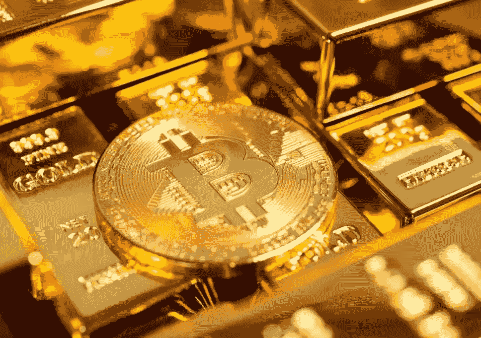
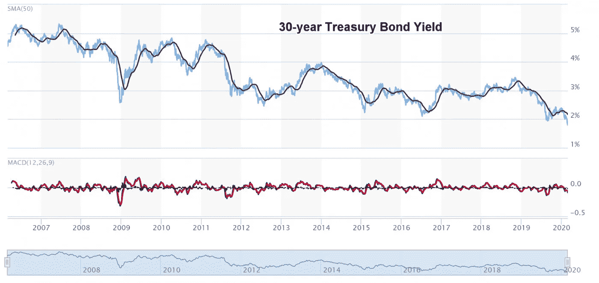
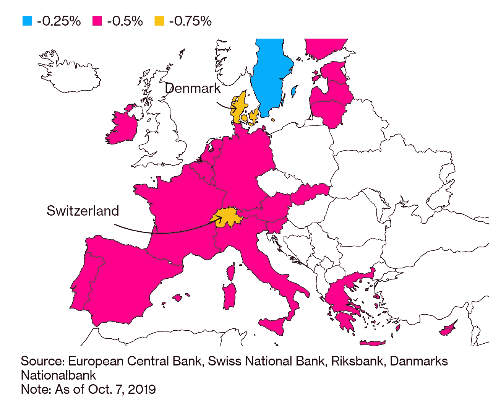
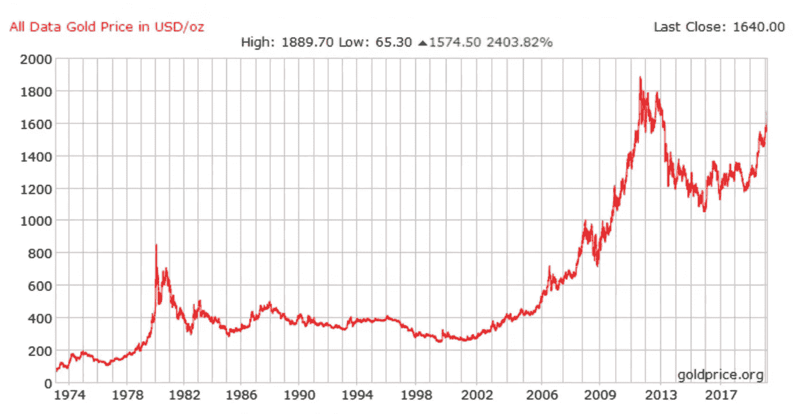
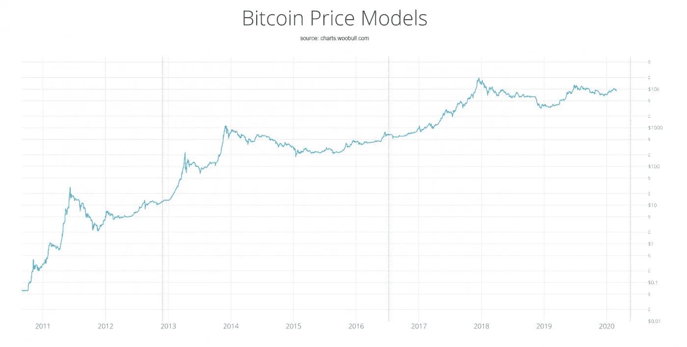
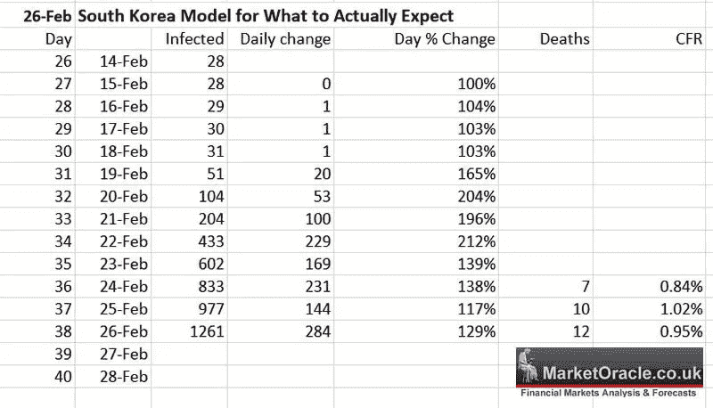

# 冠状动脉；所有闪光的东西

> 原文：<https://medium.com/coinmonks/corona-coronary-all-that-glitters-b932481a08a6?source=collection_archive---------1----------------------->

**冠状动脉“第 1 部分”**

上周五，由于对冠状病毒的担忧，30 年期美国国债收益率跌至历史低点，此后持续走低。量化宽松是收益率下行的主要驱动力。

冠状病毒将刺激央行进一步降低利率。欧洲大部分地区的收益率为负。如果银行不能为存款人的钱找到归宿，这些钱就会被欧洲央行持有，并导致银行被收费。一些客户甚至被要求将钱存入银行。但是利率还能低到什么程度呢？不管是负面的还是负面的，债券仍然具有吸引力。投资者继续购买债券，不是因为收益率为负，而是因为投机性地希望利率会进一步下降，从而推高债券价格。

## **不要这么消极好吗？**

负收益率让企业和消费者更容易借贷，从而刺激经济活动。欧洲央行表示，自 2013 年以来，其政策创造了 1100 万个新工作岗位。在美国，随着抵押贷款利率降至 3.7%，房屋销售有所回升。

丹麦的 Jyske 银行提供负 0.5%的利率抵押贷款，同时仍然盈利。客户必须每月支付本金，但在抵押贷款期限内，他们所欠的金额会因负利率而逐月减少。银行可以通过出售-0.5%的债券，将利率传递给客户，并通过适度的抵押贷款费用赚钱，从而为抵押贷款提供资金。

具有历史意义的是，目前官方和市场利率低于通货膨胀率的情况以前也发生过。20 世纪 70 年代就是这样一个时期，当时发达国家的通胀率达到两位数，远低于利率。

然而，越来越多的国家从未出现过这么长时间的负利率。负利率可能最终导致竞争性贬值的货币战争，最终利好贵金属和比特币以及数字资产的未来，数字资产将硬资产标记化，从而使散户投资者能够将宝贵的资本从低收益或贬值的储蓄账户转移到此类工具中。

## **现金是垃圾**

布里奇沃特的传奇人物雷伊·达里奥准确地评估了在这个 QE 推动的货币贬值时代“现金是垃圾”。他表示，世界正在经历一场重大的范式转变，因此他问道，下一项防止菲亚特下跌的重大投资会是什么？

Dalio 在以下及时的声明中被引用:
“我认为，当 a)实际利率回报被推低到持有债务的投资者不想持有它，并将开始转向他们认为更好的东西时，我们所处的范式很可能会结束。”
“在这样一个世界里，把钱存进现金和债券将不再安全。”
“当大多数储备货币央行行长希望在法定货币体系中让本币贬值时，这也是一个询问下一个最佳货币或财富储备的好时机。”

## **达利奥询问的答案？**

以硬资产形式出现的数字化证券，随着法定货币贬值而升值。

数字化硬资产的浪潮即将到来。纳斯达克前首席执行官表示，所有股票将在 5 年内数字化。鉴于股票价值约为 70 万亿美元，这是一个重大转变。我们还有 228 万亿美元的房地产，其中大部分将被数字化。

1.  目前运营的极少数受监管公司专注于房地产等硬资产的数字化。
2.  数字化的硬资产将作为数字化证券在主要交易所上市，如 Boerse Stuttgart。
3.  这些公司将在一个主要交易所上市他们的数字化证券。
4.  鉴于它们的存在和地位，这类交易所将不会有任何问题给这类数字化证券带来流动性，使它们完全可以交易。
5.  这些公司拥有先发优势，就像 20 世纪 90 年代的 Ebay 和亚马逊一样。
6.  数字化资产为市场带来了一个关键的替代选择，它允许散户资金以流动性、可交易资产(如房地产)的形式投资于以前缺乏流动性的领域。
7.  数字化资产减少或消除了许多前端和后端成本。
8.  数字化资产提高了交易效率。
9.  数字化将资产的权利转换为数字令牌，在[区块链](https://blog.coincodecap.com/tag/blockchain/)上存储和管理。

监管必须加快步伐，以便交易所能够将这些数字化证券上市，这将为散户投资者打开大门**，他们的储蓄不再安全，尤其是在账户收益率接近零或为负的国家**，因为 QE 水平的不断提高降低了所有法定货币相对于硬资产的价值。由于目前有数万亿美元的负收益债务，将你的储蓄存在银行或债券中往往需要成本。借钱的概念已经被彻底颠覆了。

**人不可貌相**

与此同时，黄金在最近达到 7 年高点后继续上涨。黄金的历史最高价为 1889.70 美元/盎司。[比特币](https://blog.coincodecap.com/tag/bitcoin/)与此同时，自 2018 年 12 月触底以来，比特币继续其粗略的上涨趋势。比特币的历史最高价是 19666 美元。两者都逼近历史高点。[比特币](https://blog.coincodecap.com/tag/bitcoin/)图是一个对数图，以提供更大的清晰度，否则 2017 年之前的价格看起来被压缩了。

这应该不会令人惊讶，因为我在 2019 年 3 月的许多先前的报告中提到过，当时我的指标在比特币还不到 4000 美元时，在这里和比特币的 ETN·GBTC[这里](https://www.virtueofselfishinvesting.com/reports/view/vosi-voodoo-tm-report-the-demise-of-bitcoin-and-crypto-mania)称为比特币的主要买点，然后在 2019 年 5 月 14 日，当黄金还不到 1300 美元时，我在这里[称为黄金的主要买入信号](https://www.virtueofselfishinvesting.com/reports/view/pocket-pivot-review-gld-5-14-19)。

**冠状动脉冠状动脉“第二部分”**

回到病毒式传播的故事，很明显，根据更可靠的韩国的报告，中国少报了至少 50:1 的病例和死亡人数，韩国显示了病毒在其国内传播的速度。

现在有很多恶毒的噪音，所以让我们把看涨点和看跌点分开。有利的报道显示了:1)一些患者完全康复，2)几个月内就能找到疫苗，3)中国的病例数量已经达到顶峰，现在正在下降。

但令人震惊的准确报告显示:1)中国至少有 50:1 的病例漏报，2)韩国显示了病毒传播的速度，3)仅中国就有数亿人口的主要部分被隔离，4)这种人口控制的经济后果，因为这对贸易、供应链和消费者信心有重大影响。

然而，市场是向前看的。通过大幅抛售，他们试图低估冠状病毒对未来经济的损害，但这种下跌本身就可能引发衰退，因为市场方向通常会对经济产生重大影响。也就是说，自 2008 年末 QE 启动以来，美国市场出现了几次约-20%的回调，但没有引发衰退，因为各国央行总是干预以进一步放松货币政策。在撰写本文时(美国东部时间上午 5:22)，主要股指目前大致下跌了-14%至-16%，主要股指在盘前交易中又下跌了近-2%左右。

问题是，在全球股市找到一个大低点之前，还需要走多远？

正如看涨和看跌问题所表明的那样，激流比比皆是，冠状病毒处于中心位置。根据一个世纪以来的市场数据，如果市场持续从历史高点下跌而没有反弹，这将是**历史上第一个**。鉴于横流的数量，预计将持续高水平的波动。展望未来，如果报告的案例数量激增，对全球经济造成更大损害，整体下行趋势可能会加大。相当可靠的韩国的实际案例数量是一个不好的预兆。美国和非洲是两个截然相反的两极，它们还没有经历一波全面爆发的日冕。非洲在病毒控制和病例报告方面不太有效，而美国的病例才刚刚开始。

另一方面，随着包括美国美联储在内的各国央行宣布进一步降息，市场可能迟早会找到一个主要底部。CME Fed 期货现在预计，在 3 月份的下一次会议上，降息至少 25 个基点的可能性为 100%，高于周四早些时候的 41%。美联储 3 月份降息 50 个基点的几率为 27.3%。对于 4 月份的会议，它预计降息 25 个基点的可能性为 62.3%，降息 50 个基点的可能性为 21.1%，这将使利率从当前的 150-175 个基点降至 75-100 个基点。

此外，从日本到澳大利亚，全面降息的可能性大幅上升。欧洲央行 6 月会议的 Eonia 货币市场期货显示，降息 10 个基点的价格已经完全消化。这比 6 月份降息 4 个基点或大约 40%的可能性要高。由于冠状病毒对经济的影响，国际货币基金组织最近下调了全球增长率。

**接种隧道尽头的光？**

尽管最糟糕的预测认为接种疫苗需要一年时间，但人工智能正被用来加速这一过程。因此，疫苗应该越早越好。一旦疫苗接种隧道的尽头出现曙光，市场将会筑底反弹，即使是几个月后。事实上，股票市场将寻找不看好冠状病毒危机结束的迹象，因此可能会因对早期疫苗的希望而反弹。此外，随着 QE 受到各国央行的更大礼遇，资金将会回流美国股市。

然而，从短期来看，局势仍然非常不稳定。但与此同时，**贵金属和比特币因此加密货币总体上仍然是长期受益者，原因有很多，我已经在** [**之前的报告**](https://www.virtueofselfishinvesting.com/reports/filtered?p=1&categories=cr) 中提到。全球经济仍然高度负债，因此更容易受到宏观经济冲击的影响，这些冲击正在被 QE 病毒、病毒控制以及人工智能激发的对疫苗的希望所抵消。

也就是说，或许值得注意的是，NBC 新闻的首席记者理查德·恩格尔在推特上写道，“不要惊慌。我所说的医生/病毒学家说，98%的人都会没事，即使他们感染了新冠肺炎病毒。他们希望它能传遍世界，但大多数感染的人会有点不舒服，然后康复。危险在于脆弱的人们。医院/养老院。”

因此，正如几十年来人们反复说的那样，除了恐惧本身，没有什么可恐惧的。如果在最后的分析中，有人说世界反应过度，最终过度破坏了全球经济，由于严重的检疫，导致严重的衰退，失去了工作，生计，并因此刺激了与病毒无关的二级健康后果，这样的声明可能不是反应过度。

**由克利斯·凯驰博士的** [**汉斯数字接入**](https://hansedigitalaccess.com) **，KJA 数字资产投资***[**美德自私投资**](http://www.selfishinvesting.com/)*

***(͡:B ͜ʖ ͡:B)***

> *[直接在您的收件箱中获得最佳软件交易](https://coincodecap.com/?utm_source=coinmonks)*

****