# 纠正达利欧

> 原文：<https://medium.com/coinmonks/correcting-dalio-92bfc1969276?source=collection_archive---------0----------------------->

## 不只是因为我傲慢，而是因为他错了

*深挖* [最新章节](https://medium.com/u/a29615f64d53?source=post_page-----92bfc1969276--------------------------------)**的《改变世界秩序》，下面可以找到链接。**

*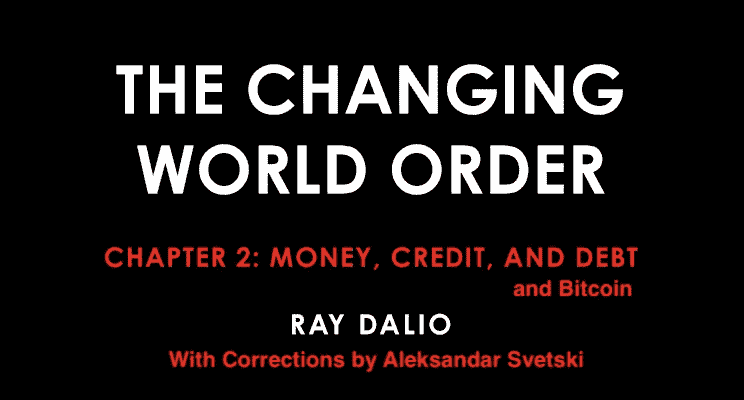*

*I’d like to thank Ray, the idiots at the Fed, and all IYI central planners alike, for the opportunity to point out holes, fallacies and stupidities in your policies and associated arguments. And most of all, thank you for being Bitcoin Accelerationists :)*

**耶耶耶。*
我已经能听到你们所有人说“好吧，达利奥值几十亿，你他妈是谁？一些经营初创公司的朋克级比特币狂热分子”。*

*良好的..是的——这正是我——但我也想认为我已经很好地掌握了经济第一原则，更重要的是基于合理逻辑的一般第一原则。*

*如果你不相信，我邀请你通读我以前写的一些东西。我已经在 medium 上做了足够多的工作，可以让你下定决心，如果你需要从哪里开始的建议，也许可以从“[为什么比特币很重要](/hackernoon/why-bitcoin-matters-c8bf733b9fad)”或“[减半](/hackernoon/the-halving-or-halvening-6725a4ec1e35)”开始。或者，如果你在寻找一些火，你可以看看这个，我相信这是我迄今为止写的最重要的东西:*

* [## 个人的崛起。

### 国家的衰落

medium.com](/the-bitcoin-times/the-rise-of-the-individual-ba286eb6951f) 

不管怎样……不要再说我了。
到达利奥&他的最新作品(嗯，在我把这个从草稿中删除时可能不是最新的，但无论如何)第二章:金钱、信用&债务:

 [## 第二章:货币、信用和债务

### 注意:为了使这篇文章更容易阅读，我试图用简单的语言来表达最重要的观点

www.linkedin.com](https://www.linkedin.com/pulse/money-credit-debt-ray-dalio/?published=t) 

当我读它的时候，我对他的一些主张和陈述感到困惑，尽管他被认为对经济学和货币有所了解，尽管他声称与许多历史学家等密切合作，以便把这些放在一起。

我不知道他是如何犯下如此惊人的错误的。但是…

***别害怕，阿列克斯在这里。***

以我有限的智慧和无限的傲慢，我来帮助你，读者(如果你决定阅读这篇文章，也许还有雷伊·达里奥)更好地掌握一些概念，确保你不会误解那篇文章中讨论的任何核心原语。

所以现在开始…

# 金钱

首先，[雷伊·达里奥](https://medium.com/u/a29615f64d53?source=post_page-----92bfc1969276--------------------------------)，这是一个很轻的金钱定义。

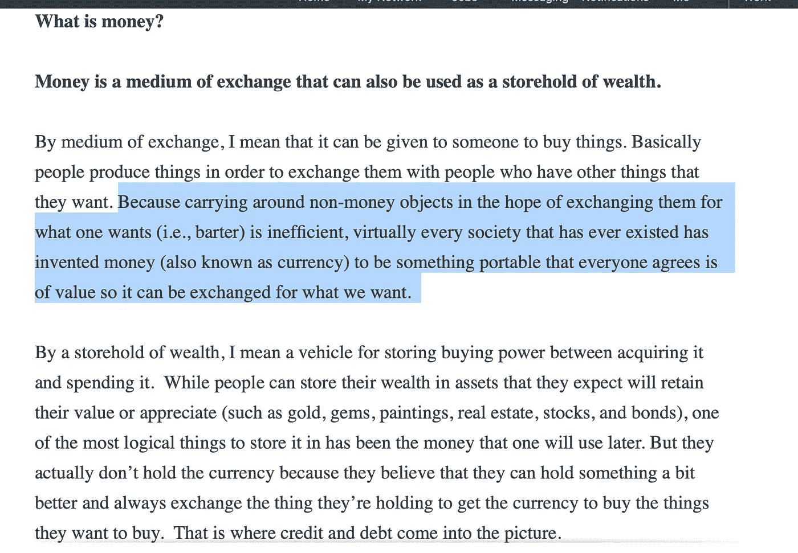

The highlight is 100% right, but the definition of money doesn’t do it justice.

货币不仅仅是交换的媒介。远不止这些。

金钱是社会参与者有效合作的机制。这种机制被用来表示一个人的时间和劳动的产物(即；他们的工作)并且因此允许他们保存它用于将来的交换。然后，它还作为一种手段，通过这种手段，这些成员可以对其经济/市场/社会中的所有其他产品进行相对估价(或定价)。

SoV，MoE，UoA(在文章中讨论了为什么比特币很重要，链接如下)

因此，虽然你的思路肯定是正确的，但如果没有真正将货币定义为“社会结构”，你就有可能让读者认为它只是我们用来交换的随机物品，或者只是另一种“幻觉”，有些人称之为“幻觉”。

远不止如此，如果我们不尊重和认识到这种深度，我们将继续重复这种模式。

我在这篇文章中详细描述了金钱:

 [## 为什么比特币很重要

### 这比你想象的更重要

medium.com](/hackernoon/why-bitcoin-matters-c8bf733b9fad) 

现代最伟大的思想家之一尼克·萨伯在一篇精彩的历史揭露中讨论了货币问题(写于 2002 年):

 [## 给钱:钱的起源

### 金钱的前身，连同语言，使早期现代人能够解决其他人无法解决的合作问题

nakamotoinstitute.org](https://nakamotoinstitute.org/shelling-out/) 

然后...

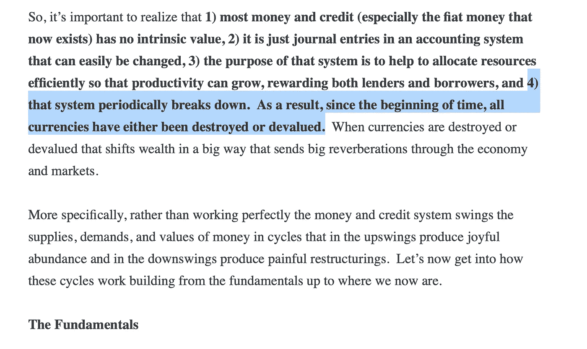

This one certainly fired me up

当我读到这样的东西时，我挠头..

> “这个系统会周期性地崩溃。结果，自开天辟地以来，所有货币不是被摧毁就是贬值”

这里有一个危险的初始假设，就是在这个确切的框架内思考为什么大多数人没有得到[比特币](https://blog.coincodecap.com/a-candid-explanation-of-bitcoin/)。

令我困惑的是，有人会将系统的“故障”视为既定事实，而不是询问 ***为什么*** 会发生故障。

现在..如果你做过一些调查，你就会知道确切的原因，但让我试着尽可能雄辩地说出来:

当你把钱集中到一个非有机发行者手中时，钱不再映射到精力/时间/工作，因为发行者将不可避免地“brrr”(这是科学术语)他们的方式来丰富自己。

再说一遍:金钱是社会的结构。

这是衡量财富的标准，自古以来，任何货币的发行者/控制者都有利于自己。无论是账本持有者在他的余额上增加了几笔额外的支出，还是罗马皇帝降低了他们的硬币的价值，或者是西班牙人用他们从拉丁美洲偷来的所有廉价黄金淹没了他们的经济(并随后摧毁了他们的经济),直到现代政府和中央银行家手中发生的盗窃行为。

这是不“正常”的——这只是发行人集中度的一个函数。落入预设的陷阱正是我们重复同样的老过程的方式。

令人欣慰的是，这种愚蠢现在可以从经济和社会中消除，使用一种有机形式的货币，它不受任何形式的发行者集中的影响。

这就是你一直在谈论的范式转变[雷伊·达里奥](https://medium.com/u/a29615f64d53?source=post_page-----92bfc1969276--------------------------------)，是的，它被称为比特币。

继续…
(现在我要在这里挑选东西&在那里)..

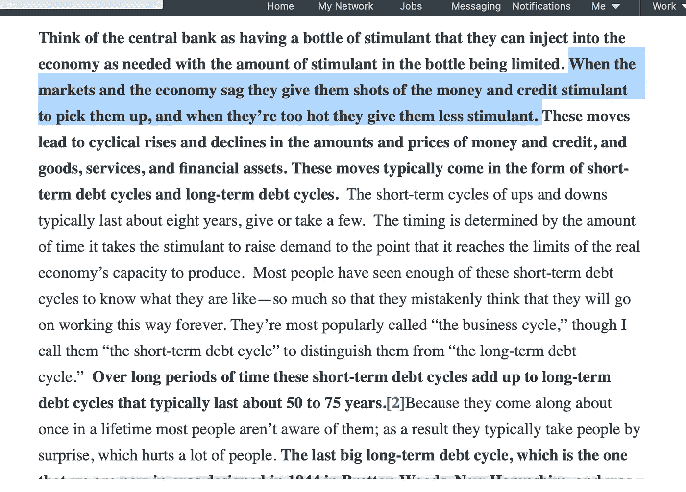

Stimulants are bad. And they always have a cost, ie; burnout.

这个总是让我感到沮丧，因为它也是基于一个很差的前提，即；兴奋剂是应该使用的正常东西。

我过去在健身房进行过预锻炼，事实上，当我年轻的时候，可能太多了。我再也不用那些东西了，因为在这个过程中我损坏了我的肾上腺。从长远来看，这不是我愿意付出的代价，尤其是为了短期的“收益”。我为什么不喝咖啡也是一样——我不需要拄拐杖。

使用这些总是有成本的，这个成本一般是 ***依赖*** 。

依赖，直到它变成真正杀死你的东西...

声明中央银行的行动是一种“兴奋剂”，应该帮助“病人”(即；经济)是一个荒谬的假设，因为你不能通过给瘾君子注射掺有更多药物的肾上腺素来帮助他们。

这仅仅是一些人傲慢地认为你可以集中管理一个复杂的系统&“平滑循环”的一个功能。

不你不能。

你用的兴奋剂越多，病人就越依赖它。解药？ ***泡兴奋剂。***

继续，到真正触发我的那个...

# “内在价值”

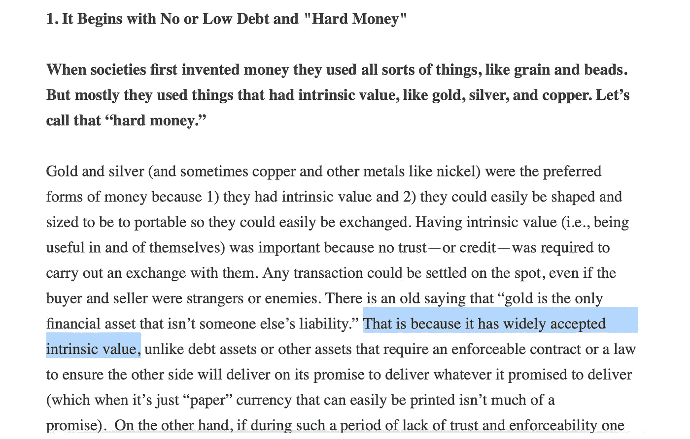

I couldn’t believe what I was reading. Intrinsic Value? Seriously? I feel like I’m reading Peter Schiff.

首先，我们要保持一致。

一些感知的“有用”概念是你如何定义内在价值，并在你刚刚定义金钱没有内在价值后，用它来支持为什么黄金更喜欢“金钱”！？！？

此外内在价值的概念。真的吗？？？

跟我重复:

> 没有内在价值这种东西

稳健经济学 101。 ***一切价值都是主观的。***
不相信我？

EMP 爆炸后，暴徒来抢你的食物，黄金有多值钱？我确信铅会是更有价值的东西。厕所也一样。

或者空气…那是普遍的“有价值的权利”？当你的孩子溺水时，为了救他们，你不得不在你的空气供应和他们的生命之间做出选择。？
(想象一下 iRobot 在威尔·史密斯的场景)。

所有的价值都是主观的，相对的。它没有内在价值，至少可以说，我需要向一个管理着 1600 亿美元基金的人指出这一点是非同寻常的。

有一些物品的属性是我们集体(和主观)一致认同的好“东西”，我们可以用它们来代表价值，但黄金因为有一些内在价值而成为“硬通货”的想法是荒谬的。

> 第一个发现黄金的人，当其他人都处于“盐本位”或“壳本位”时，不可能用一整车的黄金去换一只鸡！

几个世纪以来，黄金之所以胜出，是因为它有一些独特的属性(我们称之为货币的属性)，使它可以作为货币使用(即:时间/能量/工作的表示)。

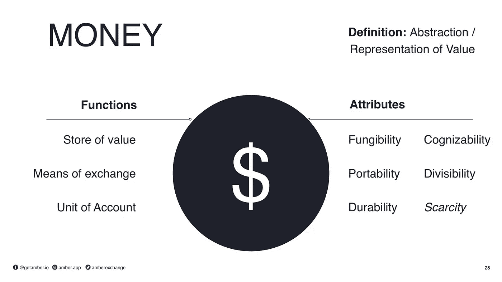

From “[Why Bitcoin Matters](https://hackernoon.com/why-bitcoin-matters-c8bf733b9fad?gi=a51f2ca0d869)”

随着共识的达成，社会能够更广泛地储存他们的劳动产品，在未来的某个日期进行交换，并对这些劳动的“价值”有所了解。

你能看见它吗？？
是的——货币作为一种客观有用物体的涌现现象，我们在主观上认同的三种功能最能代表+衡量“价值”。

不客气

事实上，当我在这里的时候，一位才华横溢的年轻律师兼比特币创造者康纳·布朗写了一篇很棒的文章，它将帮助你驱散“muh 内在价值”的神话:

 [## 比特币没有内在价值——这很好。

### 怀疑论者说比特币没有内在价值是对的。这就是为什么这对比特币和其他…

medium.com](/coinmonks/bitcoin-has-no-intrinsic-value-and-thats-great-e6994adbfe0f) 

接下来...

# 央行可以“操纵游戏”

这部分不是修正。先生，你完全正确。但是你是对的这个事实让我很生气，因为这实际上是问题的核心。

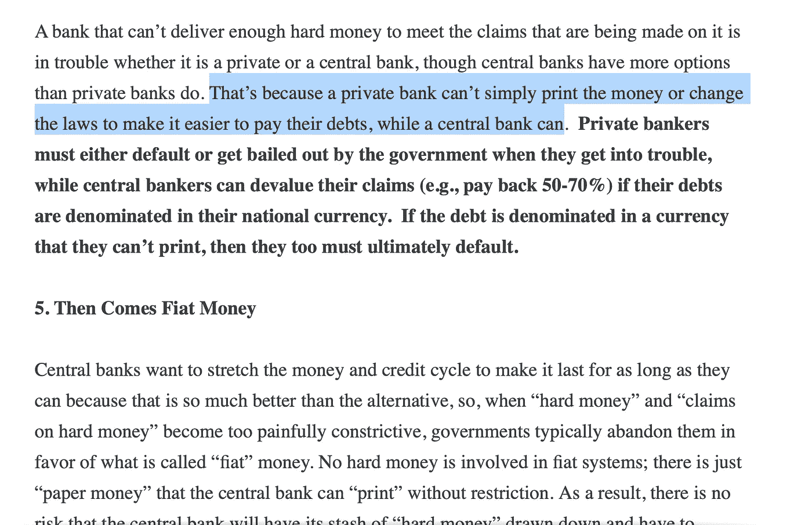

这看起来像是一个非常“公平”和“明智”的制度吗？
绝对不行。

而我们其余的白痴花我们两个有限的资源(即；时间和精力)收到回报“钱”，即；作为这种劳动的产物，这些少数组织(它们只是特权个人的集合)可以改变规则来适应自己，而代价是我们其他人的*。*

*注意:当一个群体可以改变规则来适应他们时，社会的结构总是会撕裂——就像以前一样，就像现在一样。*

*这不是资本主义，这不符合逻辑、自然或功能。这简直是个骗局。*

*仅供参考。这正是为什么比特币被创造出来，并作为一种不可阻挡的选择从当前的疯狂中脱颖而出。*

# *货币供应量的增长*

*“前提是它被用于生产用途”是一个非常天真的假设。*

*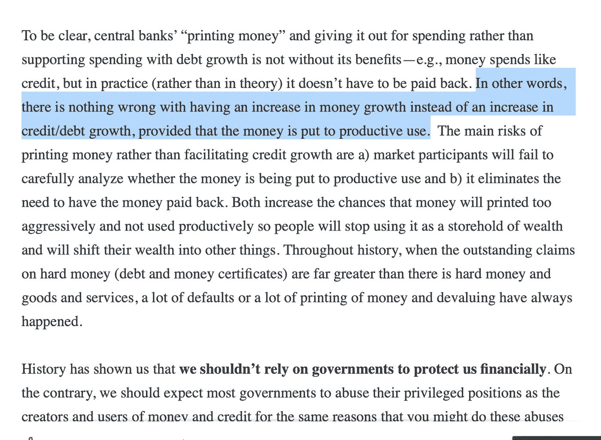*

*社会/经济中的参与者和成员都在寻求以最低的风险获得最高的收益，这都是由基本激励和抑制因素驱动的。通过让钱变得“容易”,你鼓励人们不去“生产”,而是把钱换成更硬、更有限的资产，或者今天就花掉，因为明天很容易得到。*

*这两者都驱动了经济中的负反馈循环，即:更高的资产价格不成比例地有利于那些先拿到钱的人([坎蒂伦效应](https://www.google.com/url?sa=t&rct=j&q=&esrc=s&source=web&cd=3&cad=rja&uact=8&ved=2ahUKEwiPmIPzqJPpAhXEC-wKHRZzAS8QFjACegQIDRAG&url=https%3A%2F%2Fwww.aier.org%2Farticle%2Fcantillon-effects-and-money-neutrality%2F&usg=AOvVaw3LWanQSoPMCpYxdtnWmmTP))，以及今天消费而不是为明天储蓄的激励，从而实际上侵蚀了**资本**。*

*根据定义，任何注入一个系统的新资金，如果不是来自自然生产率的提高或创新，都是一件 ***坏*** 的事情，因为它不会映射到社会的任何实际收益。*

*它所做的只是扭曲市场信号、价格，并进一步传播任何坎蒂隆式的不平等。*

*事实上，我甚至可以说，在一个系统中引入任何新的资金都会抑制真正的生产，因为创新创造财富的需求减少了，取而代之的是通过更奇特、更脆弱、更复杂的金融化来追逐收益，以便将新的“资金”用于某种杠杆用途。*

*太疯狂了。第二、第三和随后的顺序效应是整个系统不稳定的原因。*

*又来了。比特币。 ***廉洁固定供应*** 。问题解决了。*

# *终于有些真相了*

*是的…我开玩笑的说，我们同意的比我们不同意的多，但是特别是这一点，我们 100%同意。太棒了。*

*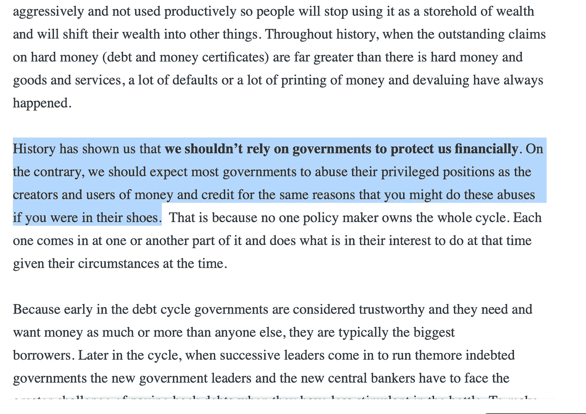*

*See…I’m not all that bad..I give credit where credit is due.*

*女士们先生们，这就是我们所说的“国营庞氏骗局”。伯尼·麦道夫是个业余爱好者...*

*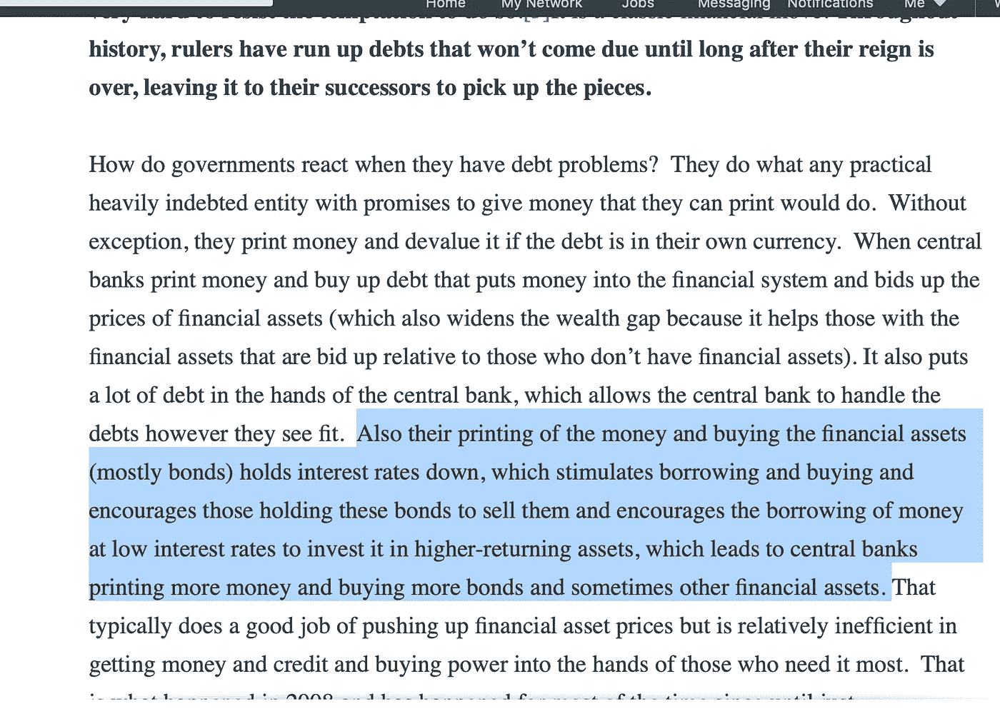*

# *黄金是古老的*

*布默·布里克斯已经风光不再了。我们不会在明天就解除 100 亿美元的资产类别，以美元/菲亚特衡量，我们可能还没有“见顶”，但 hedy 日已经到来&过去了。*

*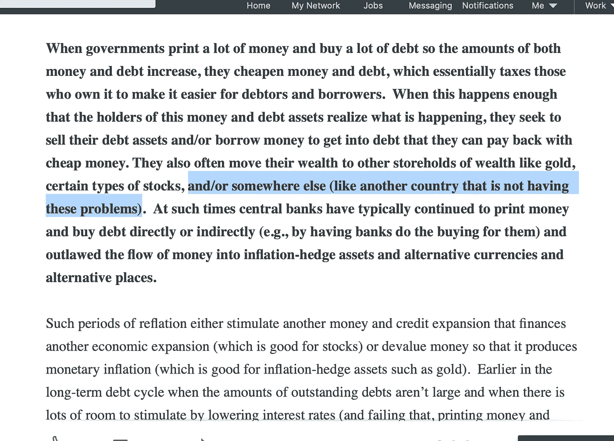*

*That “somewhere else” is called Bitcoin.*

*这是一个新世界，人们终于能够转移他们的资金，而不必冒险相信下一个傲慢的中央计划者会做正确的事情。*

*这就像发现了一个新的土地，但它是在虚拟领域。一个没有物理边界的领域。*

*那个现在资本流动的世界，叫做比特币。
黄金可能是过去人们避险的地方，但因为它没有内在价值，而且它的感知货币溢价将继续减少(特别是随着世界经济总量转移到未来两代人手中)，黄金将在市场上被视为常规商品，因其物理属性而有用，并以 Satoshis 定价。*

# *把更烂的菲亚特和更烂的菲亚特联系起来。*

*雷继续讨论了很多在法定货币标准即将结束时发生的失控现象。他基本上是对的。*

*政府收紧了控制，加大了购买硬资产的难度，试图取缔对持有人的硬资产投资，甚至没收持有人的硬资产，与此同时，财富差距扩大到了极点，人们相互指责(但令人惊讶的是，通常是那些掌控大局的亲信逃脱了斯科特，因为你们这些白痴在相互争斗)，每个人都开始逃到一个新的地方，在那里他们可以挽回一些财富或进行重建(如果他们甚至可以做到的话)*

*雷在这里提出的一件有趣的事情是我想强调的，那就是像津巴布韦这样的香蕉共和国的徒劳尝试，他们试图通过将他们的假币与更少假币“挂钩”来恢复人们对他们垃圾秀的信心。*

*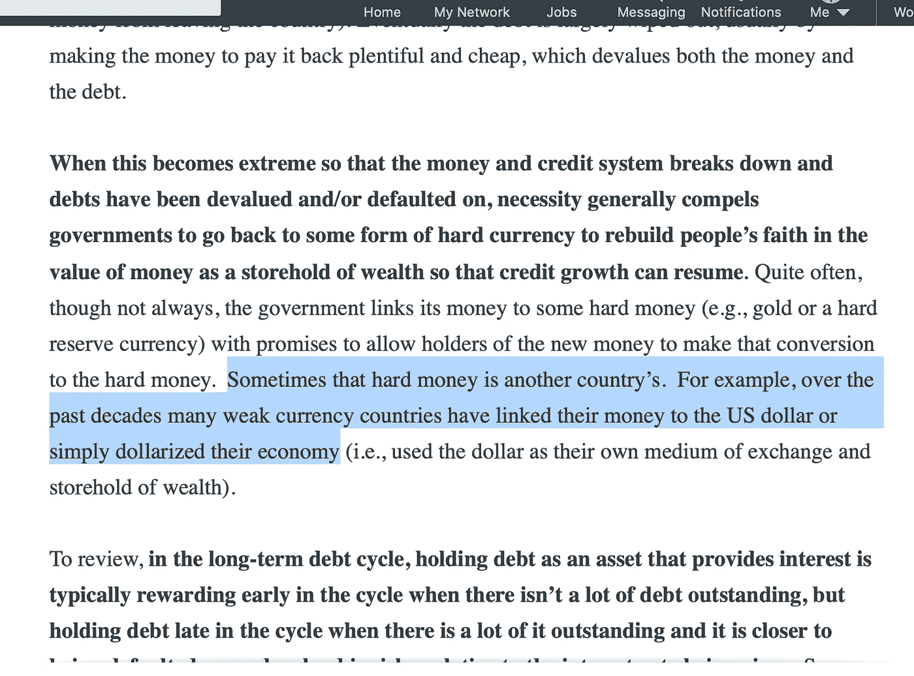*

*Unfortunately this is a 20c bandaid on an amputated thigh. Ain’t gonna do shit.*

*你觉得怎么样？是啊…*

*这就是为什么唯一的解决方案是彻底废除中央银行和中央计划者。*

*中央银行，因为按照比特币的标准，我们不需要它们。*

*中央计划者，因为一个本地化的、分布式的/去中心化的自由市场比傲慢的傀儡统治者所希望的任何市场都更强健、更实用、更道德、更不脆弱(借用一个 Talebism 的说法)。*

# *我们没有扭转颓势*

*只是从下面的截图中指出这一部分:*

*“… ***因为只有 MP3 才能扭转颓势*** ”*

*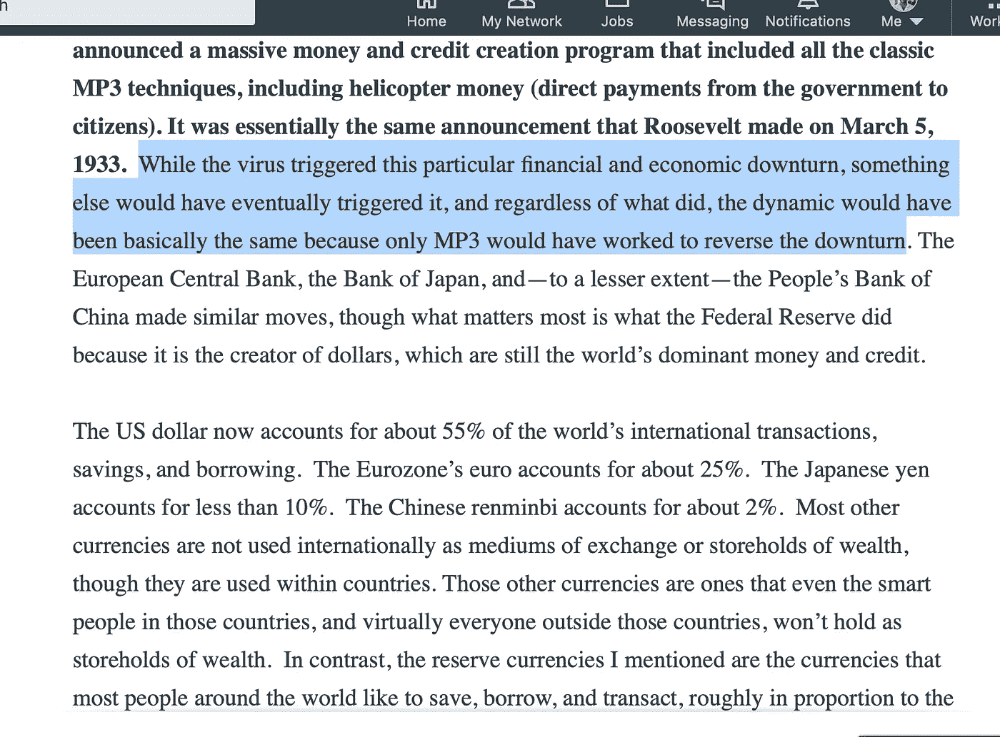*

*The downturn was not reversed. It was just transformed*

*经济下滑趋势没有逆转。只是被改造了一下。我的一个朋友，同样也是比特币创造者的哈斯·麦库克不久前在推特上发布了他对明年的预测:*

*   *道指:40000 点*
*   *失业率 40%*

*老实说，这可能不会太远。*

*MP3 没有扭转任何低迷，如果有什么需要的话，是一个极其必要的自然纠正机制(即；一个被高估的资产泡沫正在破裂)并阻止了它的发展。*

*你在开玩笑吗？*

*这就像一个最终决定放弃的瘾君子，尽管他行动坚决&显然很痛苦，你还是给他注射了大剂量的海洛因。*

*不不不...*

*这不是一个解决方案&它没有逆转任何事情。事实上，它只是导致了另一场史诗般的经济扭曲，这场扭曲将使华尔街和主街比以往任何时候都更加分离。*

*再说一次，你和我会买单，或者更可能是我们的孩子和他们的孩子。他们会试图通过邮寄区区 1200 美元的支票来安抚我们，而其余的刺激措施则被发放给赌徒。*

*   *对冲基金，*
*   *愚蠢的公司没有存款，把钱都花在股票回购上了，*
*   *其他资不抵债或杠杆过高的机构也没有储蓄*

*痛苦是生活中很自然的一部分，假设你想要成长。*

*无论是健身房，学习一项新技能，精神，情感，心智的成长。*

*这一切都需要痛苦和牺牲，但我们已经变成了一个处处逃避痛苦的弱者社会。*

*所有这一切都是把罐子踢到路上&掩盖损害，直到当然对此做任何事情都为时已晚&整个系统(人体、市场、经济)都被摧毁了。*

*市场崩溃(即；纠正)是市场在试图自我修复！！！通过干预，我们不是在帮忙，而是在制造更多的破坏。*

*我们不允许这个东西找到它的自然平衡。*

# *结论*

*好了，是时候结束我的咆哮了。有段时间没写文章了，可能是因为我禅了吧..或者也许我在 Twitter 上有一个合适的出口。无论如何，这触发了我，因此，我很感激...*

*让我们在这张纸条上结束，这又一次，功劳归功劳，[雷伊·达里奥](https://medium.com/u/a29615f64d53?source=post_page-----92bfc1969276--------------------------------)说得非常准确:*

*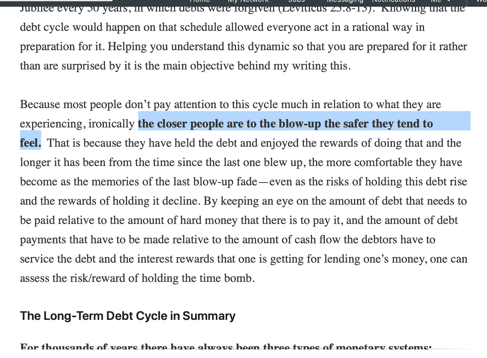*

*This is also known as “Recency Bias”. We all have it. And it’s one of the more dangerous survival mechanisms we’ve evolved to have over the millennia.*

*最近偏差是认知一般化的一种有用形式，但进入阶段转变可能非常危险——特别是当阶段(或范式)转变有相关成本时。*

*在最近的时代，尽管有明显的迹象，集体近期偏见一直很强，就在所谓的“电晕崩溃”之前，每个人都像在 1999 年一样狂欢。*

*作为一种生存策略，这种方法并不奏效(当然，也不应该奏效)，但不幸的是，现代世界以神秘的方式运行，那些明智、有准备、谨慎、风险管理良好的人，现在将不得不为那些不明智、没有这样做的人付出代价。*

*这些扭曲只能持续这么长时间，直到织物撕裂或相移发生(缓慢，然后突然)。*

*我喜欢这种相移的想法，可能会在另一篇文章中对此进行深入研究。简而言之，想想 H2O(水)。*

> *冰→水→蒸汽
> 固体→液体→气体*

*这是同一个分子，但是当温度发生变化时，它的结构会发生突变。*

*我认为社会模式的转变是相似的。它们在地表下堆积，随着温度的上升，相移接近，直到它触发并级联成我们运作方式的根本变化。*

> *穴居人→狩猎采集者→农业/古代帝国→封建时代→教会→民族国家→数字时代(比特币)。*

*我们生活的社会框架在继续进化，我们仍然是参与者(至少现在是)。*

*雷一直在谈论的即将到来的范式转变，不仅仅是 70 年的“长期债务周期”转变，而是一个更大的、跨越多个世纪的“社会转变”。*

*它始于数字时代的到来，而**的核心成分**在大约 12 年前就开始种植了，现在它即将进入第四个时代。*

*这不像我们过去所拥有的(零对一)，因此“很少有人理解这一点”(感谢[皮埃尔·罗查德](https://medium.com/u/1206face71fc?source=post_page-----92bfc1969276--------------------------------))，但对于处于社会转变中心的创新来说，这是绝对必要的，这种创新是独特的，与之前的创新有着根本的不同。*

*这是进步的本质。*

*就像我们对物理学的理解从牛顿物理学转变为量子物理学一样，[#比特币](https://twitter.com/hashtag/Bitcoin?src=hashtag_click)是社会结构(货币)的转变，它将对世界产生巨大影响。*

**

*这篇文章当然是受[雷伊·达里奥](https://medium.com/u/a29615f64d53?source=post_page-----92bfc1969276--------------------------------)的启发(或者说触发可能更准确)，以及他新书的最新章节:*

* [## 第二章:货币、信用和债务

### 注意:为了使这篇文章更容易阅读，我试图用简单的语言来表达最重要的观点

www.linkedin.com](https://www.linkedin.com/pulse/money-credit-debt-ray-dalio/?published=t) 

Robert Breedlove 写了一封更深入的“致 Ray 的公开信”,这是一篇精彩的文章，我强烈推荐你阅读:

 [## 致雷伊·达里奥的公开信:比特币

### 写给对冲基金巨头雷伊·达里奥的一封信，内容涉及他的世界观、金融自然的力量以及比特币是如何…

medium.com](/@breedlove22/an-open-letter-to-ray-dalio-re-bitcoin-4b07c52a1a98) 

虽然我的文章可能更像是[艾伦·法林顿](https://medium.com/u/a08e388f1686?source=post_page-----92bfc1969276--------------------------------)最新的对[纳西姆·尼古拉斯·塔勒布](https://medium.com/u/f138bf5466fe?source=post_page-----92bfc1969276--------------------------------)的抨击，但我不像艾伦，我没有写 3 万字的毅力(伙计——我开始写了，但肯定还没写完)。

当然，如果你喜欢这篇文章，确保你“给它鼓掌”，那么也许会有更多的人看到它。

同样，在 twitter 和你所在的其他社交网站上分享它(包括，上帝禁止，你仍然通过那个叫电子邮件的东西分享)，谁知道呢，也许 Ray 会更积极地忽略它...

最后，如果你想阅读或了解更多，请看下面的链接。

再次感谢！

# 作者:

 [## 阿列克斯·斯维茨基

### Aleks Svetski 的最新推文(@AleksSvetski)。无国籍的黑猩猩，抵制芯片，豆荚，虫子，大豆…

twitter.com](https://twitter.com/alekssvetski)  [## 亚历山大·斯维茨基—中等

### 阅读亚历山大·斯韦茨基在媒介上的作品。CEO @ www . amber . app . Editor @ https://bitcointimes . news .比特币…

medium.com](/@AleksSvetski) 

# 向@ Amber Labs 喊出来吧

 [## 琥珀|随处投资

### 美元有分，比特币有聪。100 美分等于 1 美元，一个比特币(1₿)由 100，000，000 个 sat 组成…

getamber.io](https://getamber.io)  [## 琥珀#stackingsats ⚡️

### amber # stackingats⚡️的最新推文(@theamberapp)。通过在自动驾驶仪上叠加 sat 让比特币变得简单。美元…

twitter.com](https://twitter.com/theamberapp) 

> [在您的收件箱中直接获得最佳软件交易](https://coincodecap.com/?utm_source=coinmonks)

**