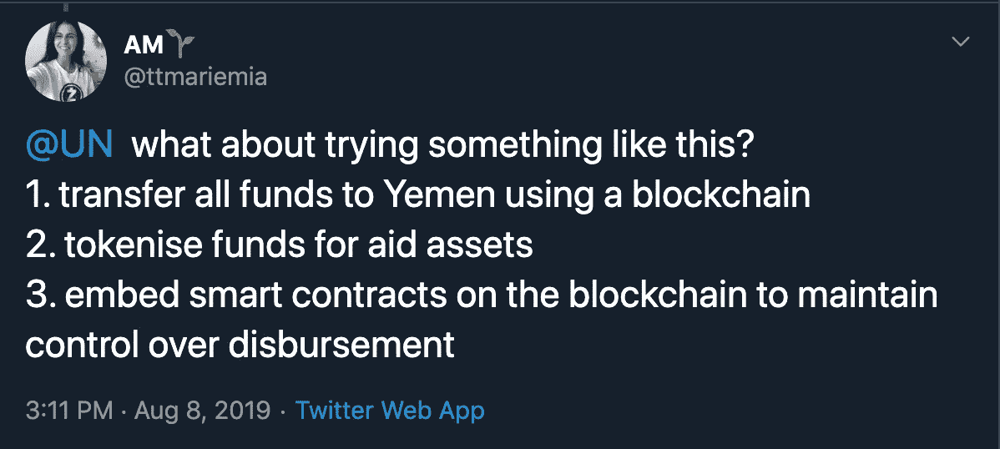

# 腐败和欺诈、INGO 困境和区块链解决方案

> 原文：<https://medium.com/coinmonks/corruption-fraud-an-ingos-dilemma-209106364a2e?source=collection_archive---------2----------------------->

Photo by [Random Institute](https://unsplash.com/@randominstitute?utm_source=unsplash&utm_medium=referral&utm_content=creditCopyText) on [Unsplash](https://unsplash.com/search/photos/cellphone-africa?utm_source=unsplash&utm_medium=referral&utm_content=creditCopyText)

两周前，美联社宣布，世卫组织已经对联合国儿童基金会和其他国际机构在 T2 的金融欺诈展开调查。据称，自 2015 年以来，INGO 已经收到了数十亿 ***无法追踪的*** 美元援助。活动家们正在推动援助透明化，要求 INGO 提供关于援助资金和支付的财务报告。

*“据了解联合国内部调查的人士和美联社(Associated Press)查阅的机密文件称，十多名被部署来处理战时人道主义危机的联合国援助人员被指控与各方战斗人员联手，从流入该国的数十亿美元捐赠援助中饱私囊。”* [*【来源】*](https://www.apnews.com/dcf8914d99af49ef902c56c84823e30c?mkt_tok=eyJpIjoiT0RVM04yRmtOVFZrWm1GaCIsInQiOiJzR2RcL0cyUXhTdGNwbFliXC9sTGIyZ281RVgzZ1kwOGdQYjJGaDNWcnJXVUlqZ3NKVUg0Mm1VTlBXQldOOFJsSXVIOTFBUU5NTGdBdmZmV2ZLdU52YjQybDhvZGtNbHJaQk9VWFVjSEthcmlPQTJYZUZuUUlKQ2NlTmZPY1Nnd0VVIn0%3D)

**但这并不是一个特例……**

**2019(850 万)美国顶级援助欺诈调查员捍卫强硬的反恐立场……**OIG 调查主任披露 850 万美元的粮食援助在叙利亚被挪用。 [*【来源】*](http://www.thenewhumanitarian.org/interview/2019/02/04/qa-top-us-aid-fraud-investigator-defends-tough-counter-terror-stance)

**2018 年牛津饥荒救济委员会的丑闻不仅仅是性…** 牛津饥荒救济委员会误导英国政府官员，以保持其在外国援助基金中的份额，仅去年一年就达到了 3170 万英镑(约 4380 万美元)。 [*(来源)*](https://blog.acton.org/archives/100327-the-oxfam-scandal-is-about-more-than-sex.html)

**2017 年(320 万)披露:对外援助欺诈大幅上升但官员仍仅发现 320 万失踪资金……**涉及英国对外援助的欺诈指控在短短五年内上升了四倍多……[*【来源】*](https://www.telegraph.co.uk/news/2017/02/09/revealed-huge-rise-foreign-aid-fraud-officials-still-detect/)

随着区块链技术、zk-SNARKs 和加密货币的日益成熟，我相信有更好的方式让国际援助组织负起责任，在国内部署资源，并更好地支持老年人。

所以我在 [Twitter](https://twitter.com/ttmariemia/status/1159542598723395595) 上提出了一个五步解决方案——这也是这篇文章的灵感来源。

非常感谢 [@ZcashFoundation](https://twitter.com/ZcashFoundation) 团队，以及其他贡献者如 [@zooko](https://twitter.com/zooko) 和 [@gladstein](https://twitter.com/gladstein) 的对话。

这就是一切开始的地方。

[https://twitter.com/ttmariemia/status/1159542598723395595](https://twitter.com/ttmariemia/status/1159542598723395595)

我有点像是在咆哮……六条推特之后，我终于有了我的提议:

**1。**使用区块链将所有资金转移到也门

**2。**将资金用于援助资产

**3。**在区块链上嵌入智能合同，以保持对支出的控制

**4。**确保交易隐私协议保护弱势人群

**5。**使用资产转移计划向偏远地区/无银行账户的人分发代币

我想我应该给大家一个视觉上的背景。请考虑这是一个非常简化的援助工作方式。这也不是最漂亮的图表。我在飞机上，所以我在 Word 上用股票形状凑合。

我想从驳斥端到端直接支付的想法**开始。**

如果你想要一个**完全分散的**、**端到端可追溯解决方案**用于区块链的援助资金和支出、**、**你可以将国际资金(任何货币)直接转移给冲突中国家的人民。

然而，这一主张存在明显的问题。行不通，原因如下:

援助组织是有目的的。他们在哪里最需要资金、实施哪些项目以及如何最好地为弱势群体服务等方面提供强大的、基于经验的专业知识。

-有时直接转移货币不能解决最紧迫的需求；人们可能需要水、食物、毯子、药品等。在需要交易能力之前。

-它假设在冲突中存在一个市场，在那里货币可以用来交换商品和服务。

-并非所有冲突中的个人都能使用智能手机。

-即使他们有，他们也可能没有互联网连接来接收资金。

-没有办法保证资金会被适当地使用/接受-即使交易是可追踪的，也不意味着它们被很好地使用。

——一个人可以领 100 万美元，另一个人可以领 1 美元。

我可以继续下去，但为了简洁的目的；这个选项根本没有意义。

**我认为区块链技术解决了援助行业的三大难题:**

1.)可追溯性和审计资金支出的能力。

2.)资金的许可线端使用。

3.)捐赠者、援助人员和高危人群的隐私受到控制。

**基础设施|如果您需要******终端、国内可追溯性和资金使用的保证:****

**区块链上的可追溯性很好，但单靠区块链并不能解决所有问题。除非存在一个完整的生态系统，供应商在国内设立并接受区块链上的交易，否则以加密货币**支付的资金可能需要转换成法定货币**，这可能导致**流动性不足的问题**。**

****

**[https://twitter.com/gladstein/status/1161030973355696128](https://twitter.com/gladstein/status/1161030973355696128)**

**除此之外，各国可能已经禁止使用密码，互联网基础设施可能不足以支持区块链交易，仍然存在可扩展性问题，用户可能没有智能手机或不知道如何操作区块链交易。**

**尽管如此，我认为有一种方法可以做到这一点。这需要一点创造力和一些基础设施，但最终结果会比目前的现状更好。**

**让我们重新审视一下使用区块链辅助的目标:**

**- **可追溯性**和审计资金支出的能力。**

**- **许可**资金的线下使用。**

**- **捐赠者、援助人员和高危人群的隐私受到控制**。**

**在区块链，国际捐赠者向 INGO 捐赠资金。(可选)**

****1)**INGO 将接收资金并将其支付给其国内办事处，同时维护分类账。**

****2)** 援助人员将根据需要接收和部署资金(通过购买商品&服务，或通过支付员工工资)，所有资金都记录在区块链上。**

***叉子来了* …一旦 crypto 转化为 fiat，资金如何使用就不确定了*随后，我会提供两种选择；***

****3.a)** 当地援助机构可以直接向最终用户发送加密货币**

**当地援助机构可以(本地或远程)将货币进行代币化，并向最终用户发送一次性代币。然后，用户将在经批准的供应商处进行商品和服务交易。**

**选项 **3.b** 看起来像这样:**

****

***Source:* [*Sikka.me*](https://sikka.me/) *Concept Paper***

****本系统的好处:****

**-它绕过任何禁止加密货币的当地法律。**

**-它不需要(不太可靠的)互联网连接，令牌可以通过 SMS 进行传输、接受和交换(更可靠，通常是自然灾害发生后第一个启用的电信服务)。**

**-通过部署令牌并能够批准适当的交易，它允许控制援助资金的使用。**

**-可以远程铸造代币。**

**区块链可以作为终端用户的一种数字身份。**

****可能的采用障碍:****

**-它需要准备和基础设施。**

**-供应商需要有采用该技术的意愿和能力。**

**-必须能够使用基本的手机和短信功能。**

**-它需要代表最终用户和供应商的学习曲线。**

**隐私|这是一项人权——尤其是涉及弱势群体的时候**

**如果您正在寻找一个**端到端的可追溯性解决方案来帮助** *(或任何区块链的解决方案)*隐私应该始终是一个考虑因素。对于这个用例，隐私考虑如下:**

**1.**国际捐助者**可能希望支持某项事业，但这样做可能会让他们(或他们在国内的家人)面临被反对派武装组织或政府剥削的风险。**

****比如**，就拿香港抗议事件来说。**

**想象一下作为一个中国公民在加拿大工作。让我们叫她珍妮吧。**

**- Jenny 希望支持香港的抗议者，并决定向接受加密交易的香港当地倡导团体提供资金。**

**-如果 Jenny 不能“屏蔽”她的交易，像中国政府这样的恶意实体可能会通过一些互联网研究和阻止浏览器来确定她的身份。**

**-中国政府可以采取行动，如冻结珍妮的国内账户，在她进入中国领土时逮捕她，甚至冻结她仍然居住在中国的家人的账户。**

**2.**难民和人道主义援助工作者也享有交易隐私的人权**,出于许多相同的原因——如果他们在冲突环境中工作或逃离压迫性政权，公开交易信息将使这些本已脆弱的个人面临更大的风险。**

**这是我们的困境。完全隐私(如 Monero)不起作用，因为没有审计能力，但完全公开访问(如比特币)也不理想，因为它可能会使个人处于更大的风险中。**这个** **需要有发送私人事务的能力。**幸运的是，有一些非常聪明的人正在从事这项工作，其中一人恰好加入了 Twitter 上的讨论，Z.cash 的首席执行官 Zooko Wilcox 说得很好:**

****

**[https://twitter.com/zooko/status/1161017826506940419](https://twitter.com/zooko/status/1161017826506940419)**

****概括一下:这是我们开始的五步解决方案:****

****1。**使用区块链将所有资金转移到也门**

****2。**将资金用于援助资产**

****3。**在区块链上嵌入智能合同，以保持对支出的控制**

****4。**确保交易隐私协议保护弱势群体**

****5。**使用资产转移计划向偏远地区/无银行账户的人分发代币**

**这是一个终极解决方案吗？大概不会。**

**关于这个话题，我可以写一整篇硕士论文。不用说，只有 1000 多字，我几乎没有触及表面。也就是说，我认为这是一个很好的起点。我的目标是为区块链技术和加密货币的发展提供一个坚实的用例。**

**如果这篇文章对你有影响，请在下面评论。**

**如果您有任何想法或异议(甚至更好),请评论或直接与我联系。总有改进的空间。**

> **[直接在您的收件箱中获得最佳软件交易](https://coincodecap.com/?utm_source=coinmonks)**

****