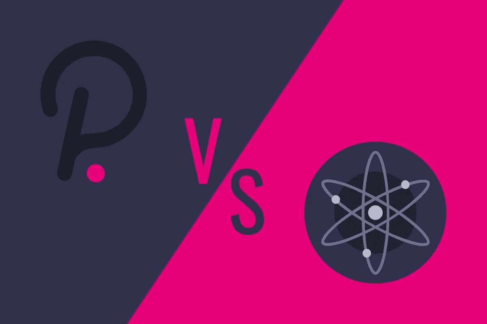

# 宇宙和波尔卡多特，天壤之别，现在从哪里开始？

> 原文：<https://medium.com/coinmonks/cosmos-and-polkadot-worlds-apart-now-where-to-start-47c88eccead1?source=collection_archive---------1----------------------->

## ~dwulf

我是一个致力于宇宙研究的波尔卡多特迷。我认为宇宙和波尔卡多特的主要区别是宇宙上的区块链负责他们自己的安全，相比之下波尔卡多特的中继链为其副链提供安全。

这可能是为什么需要更多的规则和法规以及大量资本来竞争成为一个 parachain，一种“游戏中的皮肤”方法，但数据可以在 Polkadot 生态系统中更自由地移动。

每个区块链都可以选择 Cosmos SDK & Tendermint 的方法来建造，尽管它会表现得更像一个单独的区块链，例如 Terra，BSC，Cronos 和这些区块链可以很容易地相互交谈。Cosmos 和 Polkadot 都将自己定位为第 0 层，即区块链的互联网，他们正致力于实现可伸缩性、互操作性和安全性，解决其他原始第 1 层区块链所面临的问题。

> 加入 Coinmonks [电报频道](https://t.me/coincodecap)和 [Youtube 频道](https://www.youtube.com/c/coinmonks/videos)了解加密交易和投资

## **分解**

一个民族国家的人 A 开了一家银行。另一个民族国家的 B 人也拥有一家银行。

A 银行有自己的安全规章制度。B 银行也有自己不同的规定。

如果没有达成一致的安全协议，A 如何能够信任 B 银行，反之亦然？嗯，A 银行和 B 银行都可以建立“变通办法”——一个“贸易协议”…。一个过渡性的解决方案…但那只是纸面上的妥协。

从根本上说，他们的 DNA 中没有固有的统一安全，这是宇宙的问题。这就像在泰国使用美国插头适配器..将 220AC 转换为 240 AC 的“修正”。临时补丁。它可能会工作，但同样一个小故障或尖峰可能会烧毁你昂贵的电气设备。或者运行 XBOX 的 PC 游戏模拟器——运行起来可能会很慢，可能会出现故障。或者将一份重要的中文文件翻译成斯瓦希里语——在翻译过程中，短语、习语和单词的细微含义可能会丢失。当你期望企业级的 VISA、Mastercard 和 PayPals 处理数十亿美元的交易时，相信我，你不会希望出现任何小故障。

PolkaDOT 提供了这一解决方案，因为从一开始，A 银行和 B 银行就可以相互对话——绝对和明确地 100%在基础层使用相同的企业级网络安全层——所有这些都在同一个安全保护伞下。所以银行 A，银行 B，..即使是 C 银行，在各自的区块链上，也可能有完全不同的操作系统和用例——但最终，它们唱的是完全相同的赞美诗。

## **原子上的点**

当我比较原子和点的时候。我曾经拥有大量的 ATOM，但是经过考虑，我决定将我的重点从 Cosmos 转移到 DOT 项目，原因如下:

宇宙/原子的祝福/诅咒在于它有多开放。由于资源的原因，在 Cosmos 之上进行构建对于单个项目来说是非常好的，但是对于 Cosmos / ATOM 的效用来说却是微不足道的。

一个例子是由宇宙号建造的 BNB/月球。虽然它是建立在它之上的，但据我的理解，它的行为完全独立于宇宙网络。

我知道 cosmos hub 将为 ATOM 引入更多的功能，但最终，似乎 SDK 和在 cosmos 上构建的能力是它的功能，而不是 ATOM

因此，对我来说，ATOM 作为一种货币似乎是一种副作用。我只是不认为它是像 ETH，SOL，DOT 等项目的投资工具。都是为了各自的项目

相比之下，当 DOT 引入新链时，DOT 追溯性地获得以下效用:

每个链条都与继电器紧密相连

*   DOT 需要用作 gas 来与其他链/线程“对话”
*   DOT 需要用来支付连锁店的租金
*   DOT 可用于终端用户的群体贷款

因此，点随着每个副链变得更加有用，它是一个轮子的中心轮毂，每个副链是它的辐条。有了 100 条链，DOT 的效用将是惊人的。随着它的效用而来的是持续的投机和价格行为/持续的讨论。当你把它和 DOT 的开发活动结合起来，我很难完全支持 Cosmos。

这并不是说我认为这是一个糟糕的项目。我认为 Cosmos/ATOM 有它的位置，因为总需要有一个 Android/Google (ATOM)到一个 iOS/Apple (DOT)。但是，作为一个希望支持能够产生回报的项目的人，DOT 比 ATOM 更好，原因如下:

*   ATOM 筹集了 1700 万英镑的投资者资金，DOT 筹集了 2.93 亿英镑
*   开发人员在 DOT 上的活动比 ATOM 多得多
*   DOT 对其网络的效用
*   DOT 与 Moonbeam/BTC 和 ETH 的互操作性

## **结论:**

我两样都喜欢！！DOT 相当多，虽然技术仍然非常早期，没有项目在 polkadot 上运行(还没有),但在众筹贷款推出后，Acala 将首先破解，我相信最终将允许互换，随后是智能合同的 Astar。我爱宇宙和它友好的渗透平台，便宜和快速的交易！！！伟大的项目有巨大的潜力！

对我来说，宇宙似乎在它自己的星球上，独自在宇宙中。而波尔卡多特有助于统一宇宙。

## **参考文献:**

[加文·伍德:DeFi 监管是‘一件好事’](https://www.youtube.com/watch?v=gwOyasrdbQs&t=453s)

宇宙大战波尔卡多特的惊人真相

波尔卡多特和宇宙

> 加入 Coinmonks [电报频道](https://t.me/coincodecap)和 [Youtube 频道](https://www.youtube.com/c/coinmonks/videos)了解加密交易和投资

## 也阅读

 [## 杠杆代币[多头代币]终极指南

### 杠杆化令牌是具有杠杆化风险敞口的 ERC20 令牌，不考虑保证金、要求、管理…

medium.com](/coinmonks/leveraged-token-3f5257808b22)  [## 最佳加密交易所| 2021 年十大加密货币交易所

### 编辑描述

blog.coincodecap.com](https://blog.coincodecap.com/crypto-exchange)  [## 2021 年最佳加密交换平台| CoinCodeCap

### 如果我们看看今天的场景，许多加密货币交换平台提供了广泛的功能和深度…

blog.coincodecap.com](https://blog.coincodecap.com/best-swap-platforms)  [## 2021 年最佳加密借贷平台| 6 大比特币借贷平台

### 获得比特币和其他加密货币的最佳贷款利率

medium.com](/coinmonks/top-5-crypto-lending-platforms-in-2020-that-you-need-to-know-a1b675cec3fa)  [## 2021 年 6 大最佳硬件钱包|顶级加密硬件钱包[更新]

### 最好的加密货币硬件钱包是绝对必要的。我们将在 NGRAVE、Ledger Nano X 和…

medium.com](/coinmonks/the-best-cryptocurrency-hardware-wallets-of-2020-e28b1c124069)  [## 2021 年最佳免费加密交易机器人

### 2021 年币安、比特币基地、库币和其他密码交易所的最佳密码交易机器人。四进制，位间隙…

medium.com](/coinmonks/crypto-trading-bot-c2ffce8acb2a)  [## 最佳 4 个加密交易信号电报通道

### 这是乏味的找到正确的加密交易信号提供商。因此，在本文中，我们将讨论最好的…

medium.com](/coinmonks/best-crypto-signals-telegram-5785cdbc4b2b)