# 宇宙/原子代表团指南

> 原文：<https://medium.com/coinmonks/cosmos-atom-staking-guide-4a4e703c998a?source=collection_archive---------0----------------------->

## 宇宙中心 MainNet 正式上线了！

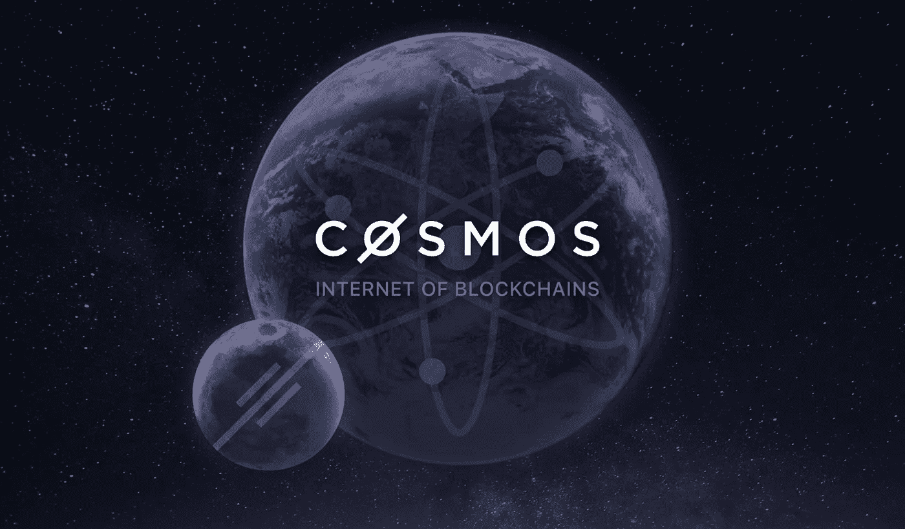

宇宙中枢 mainnet 于美国东部时间 2019 年 3 月 13 日周三晚 7 点(世界协调时 23 点)正式上线。

要将您的原子委托给 Staked，请使用以下验证器地址:

```
**cosmosvaloper1we6knm8qartmmh2r0qfpsz6pq0s7emv3e0meuw**
```

有一个 21 天的取消绑定过程，在此期间，委托人的原子不能获得奖励，也不能被转移、交换或花费。然而，在解键期间，原子会被削减。

委托是非托管的，委托人不能花费你的原子。Staked 向代表支付 90%的块奖励，并提供行业内唯一的 100%块生产 SLA。

在过去的 9 个月里，Staked 一直在 Cosmos testnets 上运行验证节点，最近参加了赌注比赛游戏，**获得了 27 个“从未入狱”称号中的一个，因为它在整个游戏中一直留在大约 185 个验证器中，并适应了敌对的网络条件**。这是成功的 mainnet 操作的一个关键标准，特别是当它涉及到削减风险预防时。

# **关键风险**

Cosmos 的赌注模型使用“硬削减”，这意味着在 a)双签名块和 b)验证器停机时间延长的情况下，客户资金有被削减的风险。削减风险在第 8 页有更详细的描述。你可能会因为参与赌注而损失一部分甚至全部投资。考虑风险，谨慎选择验证器。

# **总结**

Cosmos 是由 Cosmos Hub 连接的独立区块链的网络，Cosmos Hub 是基于 Tendermint 的利害关系证明(PoS)区块链，tender mint 是拜占庭容错(BFT)共识协议。**截至 2019 年 5 月 5 日，staked ATOMs(Cosmos Hub 的本地加密货币)的年收益率目前为 12.7%** ，总计为 131，700，319，占总原子供应量的 55.3%。mainnet 于美国东部时间 3 月 13 日星期三晚上 7 点(UTC 23:00)成功启动。

# **代币经济学(07** /23/19)

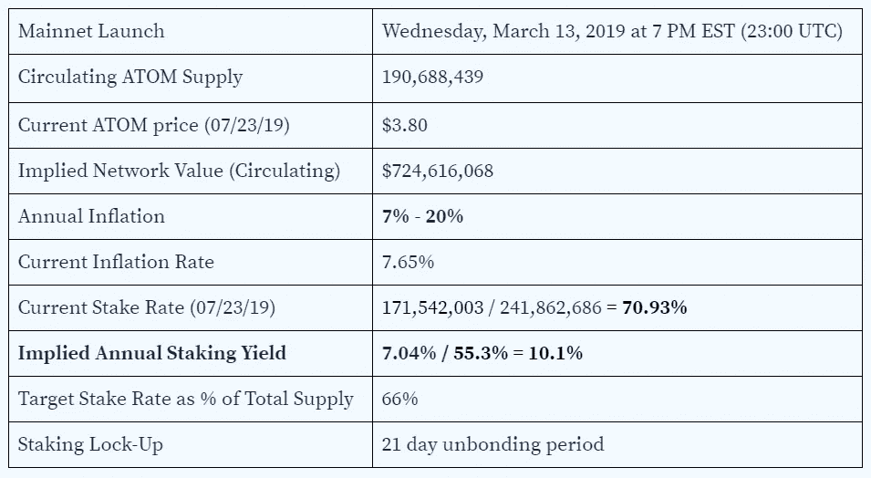

# **宇宙代表团指示**

打开账本直播 app。通过 USB 连接您的账本并更新至最新固件。在 Ledger Live 的设置中启用开发模式。

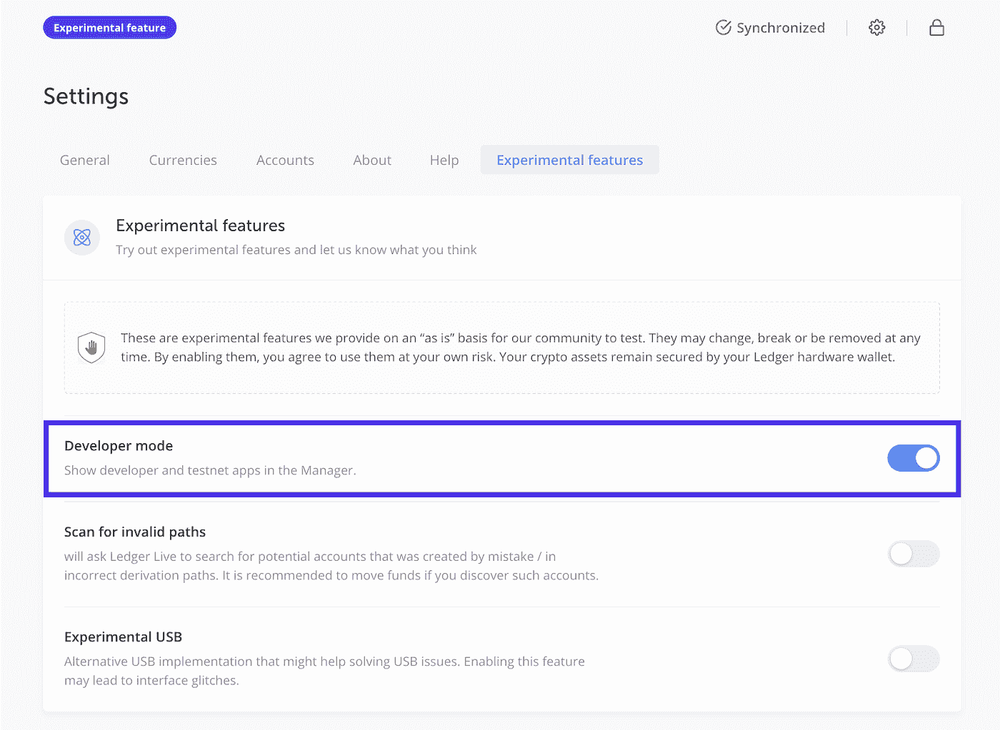

前往 ledger live 应用商店，下载“Cosmos”应用程序。

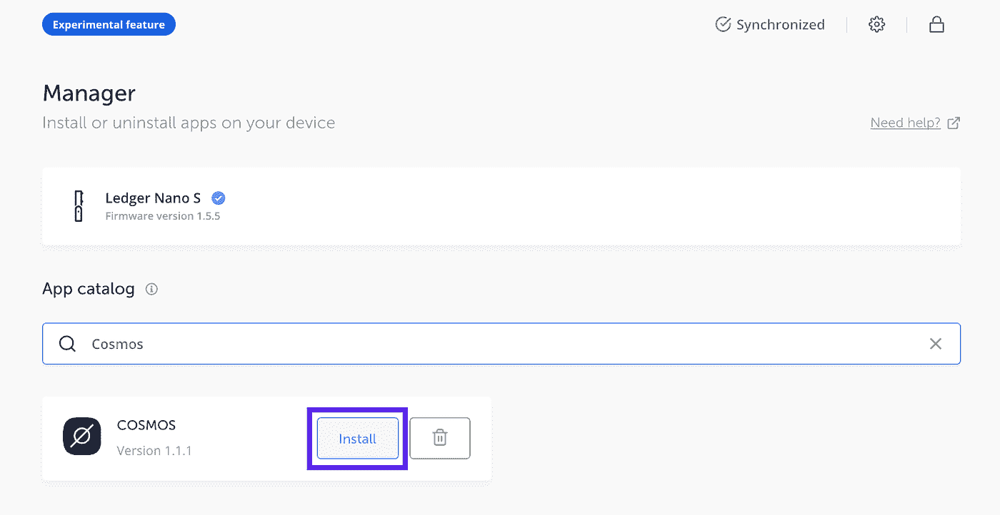

你的账户现在已经准备好与[Lunie](https://lunie.io) 、带有授权(赌注)、奖励申领和投票的宇宙钱包 UI 连接。

在你的账本设备上打开 Cosmos 应用程序(Tendermint Cosmos 应该显示在屏幕上)，访问[**https://lunie . io**](https://lunie.io/)。点击屏幕右上角的蓝色登录按钮。

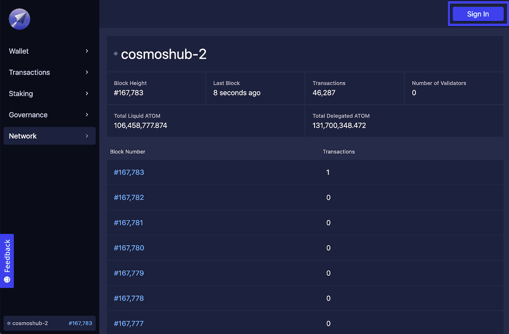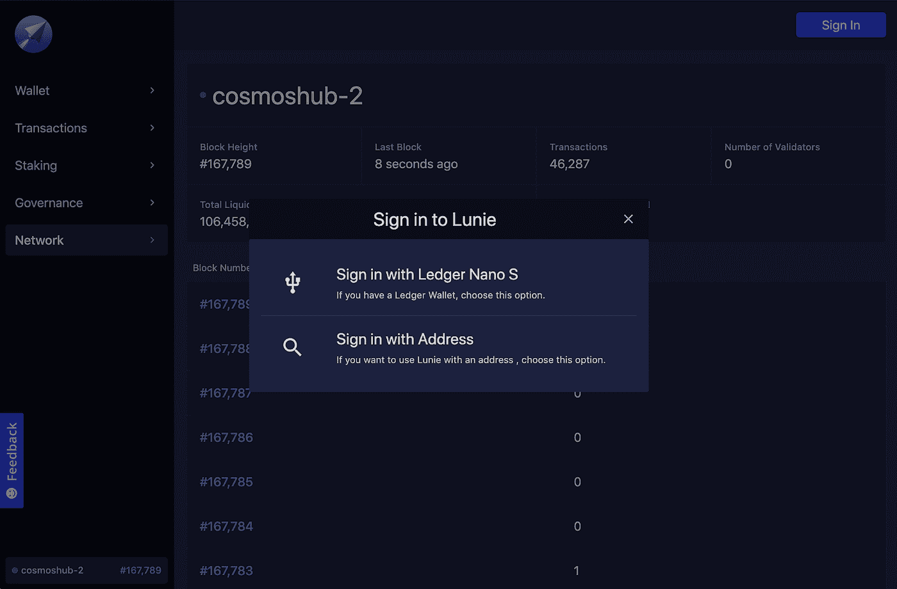

点击屏幕左侧全局菜单中的“锁定”选项卡。

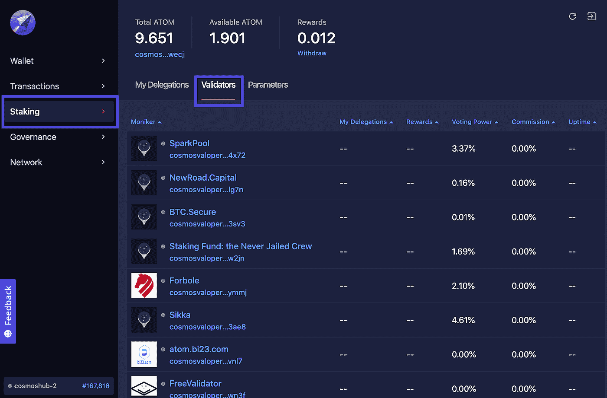

在 Staking 选项卡中，单击 validators 部分，然后从 Validators 列表中单击 Staked，或者直接在浏览器地址栏中复制并粘贴以下链接:

[**https://lunie . io/#/staking/validators/cosmosvaloper 1 we 6 knm 8 qartmmh 2 r 0 qfpsz 6 pq 0s 7 em v3 E0 meuw**](https://app.lunie.io/cosmos-hub/validators/cosmosvaloper1we6knm8qartmmh2r0qfpsz6pq0s7emv3e0meuw)

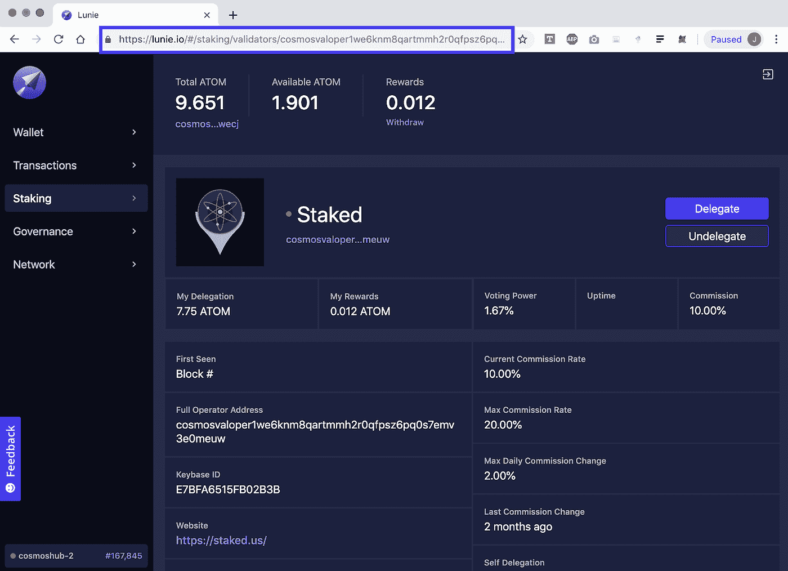

单击蓝色委托按钮打开委托模式。输入要委托的金额，然后单击提交。

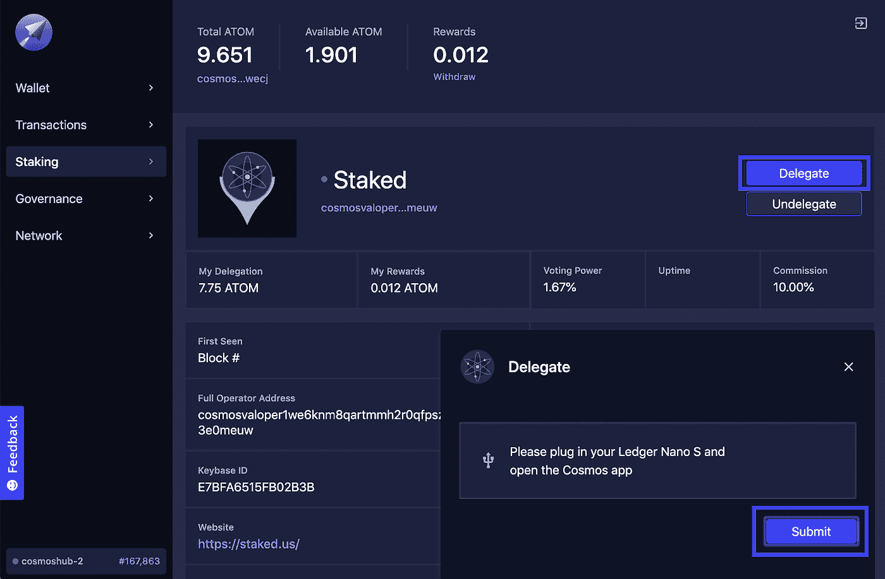

要申领从下注中获得的奖励，请单击 Lunie 顶部奖励下的提取链接，继续完成提取模式，然后单击提交。申请奖励后，他们需要在单独的交易中获得授权，以获得赌注奖励。

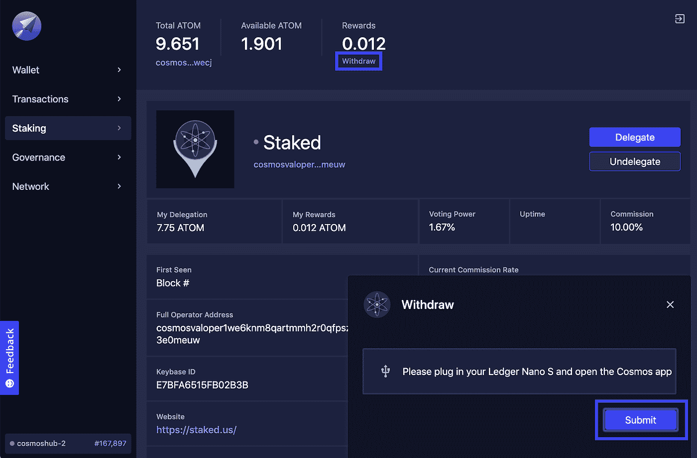

# **创世纪(2019 年 7 月 23 日)的令牌分配**

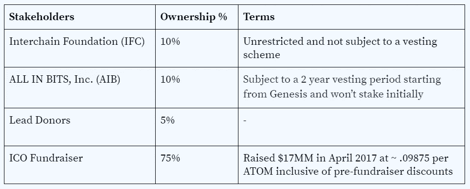

# **验证器**

Cosmos Hub 验证器通过广播加密签名或投票来提交块，从而参与共识。Tendermint 需要一组固定的已知验证器，其中每个验证器都由它们的公钥来标识。验证器试图一次一个块地达成共识，其中块是事务的列表。对一个集团的共识投票是循环进行的。每轮都有一个轮领导提出一个块。然后验证者分阶段投票接受提议的区块或进入下一轮。一轮投票的提议者是从验证者的有序列表中按照他们的投票权比例确定地选择的，投票权由委托给验证者的原子百分比决定。

由于通信复杂性的增加，基于 Tendermint 的区块链会因为更多的验证器而变慢。在创立日，最大数量的验证人将被设定为 100 人，由授权股份最多的验证人决定，并在 10 年内以 13%的速度增加，最多 300 名验证人。 **Staked 拥有足够的委托原子，以确保初始验证器集 100 中的一个槽。**

# **奖励**

原子是宇宙中枢的固有和唯一的标记。ATOMs 代表了参与 Hub 共识(投票、验证或委托)的权利，并作为交换获得膨胀的 ATOM 块奖励和交易费。

在新发行的(膨胀的)原子中，块奖励被支付给验证者和删除者，作为赌注的激励。Cosmos 的目标份额是总原子供应量的 66%。在创世纪，最初的通货膨胀率将是 7%。然而，该比率将围绕 66%的目标股份比率波动，因此，如果总债券股份少于总原子供应量的 66%，通货膨胀率将增加，直到达到最大值 20%，如果总债券股份超过原子供应量的 66%，通货膨胀率将降低，直到达到 7%的最低值。每个区块都要重新计算目标年通货膨胀率。

块奖励和交易费在协议层分配。但是，委托人需要提交一个提款交易来申请奖励，然后提交另一个交易来重新委托奖励，以便获得复合收益。

虽然授权者可以自动更改验证者，但有一个 30 天的解除绑定过程，以防止远程攻击，在此期间，授权者原子不能获得奖励，也不能被转移、交换或花费。然而，在解键期间，原子会被削减。

# **砍杀**

打桩原子不是没有风险的。对于恶意行为和正常运行时间，在协议级别存在对验证者和委托者资金都被销毁的严厉惩罚，使得 Cosmos 验证节点的操作最适合全职的、有经验的操作员。

Cosmos 中的两个主要切割条件如下:

*   **双重签名:**如果有人在链 A 上报告说，一个验证者在链 A 和链 B 上的相同高度签署了两个块，这个验证者将在链 A 上被削减。**在启动时，将对双重签名的验证者和委托者处以 5%的罚款。**
*   **不可用性:**如果验证者的签名没有被包括在最后 X 个块中，验证者将被削减与 X 成比例的边际量，如果 X 高于某个限制 Y，则验证者将被解除绑定。**在发布时，如果验证程序在滚动的 10，000 个块窗口中错过了 95%的块，将被处以 0.01%的罚款。平均阻塞时间为 5 秒，验证程序需要在 13 小时 54 分钟内错过 95%的阻塞。**

预计在区块链间通信(IBC)规范实施之前，频繁的硬分叉(通常需要完全重启网络)将进一步增加成功 mainnet 运营的管理和参与要求。

《宇宙打桩指南》大量摘录自以下来源:

1.  [https://cosmos . network/resources/白皮书](https://cosmos.network/resources/whitepaper)
2.  [https://github.com/cosmos/cosmos/blob/master/PLAN.md](https://github.com/cosmos/cosmos/blob/master/PLAN.md)
3.  [https://cosmos . network/docs/cosmos-hub/delegator-guide-CLI . html](https://cosmos.network/docs/cosmos-hub/delegator-guide-cli.html)


# 关于标桩

Staked 帮助机构投资者通过投资和借贷，每年以 5%-100%的速度安全可靠地复合他们的密码。Staked 运行验证节点，用于验证货币，并提供链上和链下贷款选项，这些选项提供实物货币的年化收益率。

如果你是我们正在建设的 Staked 的粉丝，请在 [**Twitter**](http://bit.ly/StakedTwitter) 、 [**LinkedIn**](http://bit.ly/StakedLinkedIn) 上给我们喊一声，或者告诉你的朋友和同事。 [**Staked blog**](/@staked) 和[**weekly newsletter**](https://staked.substack.com/)**也是跟上 Staked 的重要资源。**

> **加入 Coinmonks [电报频道](https://t.me/coincodecap)和 [Youtube 频道](https://www.youtube.com/c/coinmonks/videos)获取每日[加密新闻](http://coincodecap.com/)**

## **另外，阅读**

*   **[复制交易](/coinmonks/top-10-crypto-copy-trading-platforms-for-beginners-d0c37c7d698c) | [加密税务软件](/coinmonks/crypto-tax-software-ed4b4810e338)**
*   **[网格交易](https://coincodecap.com/grid-trading) | [加密硬件钱包](/coinmonks/the-best-cryptocurrency-hardware-wallets-of-2020-e28b1c124069)**
*   **[密码电报信号](http://Top 4 Telegram Channels for Crypto Traders) | [密码交易机器人](/coinmonks/crypto-trading-bot-c2ffce8acb2a)**
*   **[最佳加密交易所](/coinmonks/crypto-exchange-dd2f9d6f3769) | [最佳加密交易所](/coinmonks/bitcoin-exchange-in-india-7f1fe79715c9)**
*   **[面向开发人员的最佳加密 API](/coinmonks/best-crypto-apis-for-developers-5efe3a597a9f)**
*   **最佳[密码借贷平台](/coinmonks/top-5-crypto-lending-platforms-in-2020-that-you-need-to-know-a1b675cec3fa)**
*   **[杠杆代币终极指南](/coinmonks/leveraged-token-3f5257808b22)**
*   **[AscendEx Staking](https://coincodecap.com/ascendex-staking)|[Bot Ocean Review](https://coincodecap.com/bot-ocean-review)|[最佳比特币钱包](https://coincodecap.com/bitcoin-wallets-india)**
*   **[Bitget 回顾](https://coincodecap.com/bitget-review)|[Gemini vs block fi](https://coincodecap.com/gemini-vs-blockfi)|[OKEx 期货交易](https://coincodecap.com/okex-futures-trading)**
*   **[美国最佳加密交易机器人](https://coincodecap.com/crypto-trading-bots-in-the-us) | [经常性回顾](https://coincodecap.com/changelly-review)**
*   **[在印度利用加密套利赚取被动收入](https://coincodecap.com/crypto-arbitrage-in-india)**
*   **[霍比评论](https://coincodecap.com/huobi-review) | [OKEx 保证金交易](https://coincodecap.com/okex-margin-trading) | [期货交易](https://coincodecap.com/futures-trading)**
*   **[麻雀交换评论](https://coincodecap.com/sparrow-exchange-review) | [纳什交换评论](https://coincodecap.com/nash-exchange-review)**