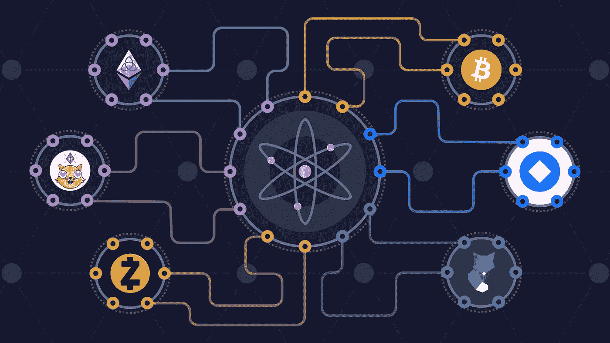

# 宇宙网络解释-宇宙中心，原子令牌，重力指数

> 原文：<https://medium.com/coinmonks/cosmos-network-explained-cosmos-hub-atom-tokens-gravity-dex-9737df8ff002?source=collection_archive---------2----------------------->



Cosmos Hub and Zones

Cosmos 是一个可互操作的区块链网络。Cosmos 使用基于 PoS 的一致性算法的 [Tendermint](https://docs.tendermint.com/master/) BFT。Tendermint BFT 是一个开源平台，可以用于任何项目。

为了创建区块链的网络，Cosmos 提供了 [CosmosSDK](https://docs.cosmos.network/) (应用层)和 Tendermint SDK(网络和共识层)来提供完整的工具来启动公共或私有区块链。所有的区块链都将实现 [IBCI](https://ibcprotocol.org/) (区块链间通信接口)，这样它们就可以在彼此之间无缝地传输令牌和数据。

# 水平可扩展性

Cosmos network 背后的想法是拥有横向可伸缩性。区块链是分布式数据库，需要全球分布的节点来存储和维护数据库的状态。每个人都被允许以安全的方式写入数据库，只要他们遵守协议的规则。共识规则确保并维护了全球公认的区块链状态，但代价是可伸缩性。

比特币通过使用工作证明(PoW)共识解决了共识和安全问题，该共识对每块设置了 10 分钟的硬上限。考虑到 6 个区块的确认，这一限制以及概率终结性使得比特币交易确认时间约为 60 分钟。终结是概率性的，因为 PoW 遵循最长的链。为了确定最长的链条，你必须等待你跟随的链条比其他竞争链条更长。

[利益证明](https://ethereum.org/en/developers/docs/consensus-mechanisms/#proof-of-stake) (PoS)是另一种比 PoW 更节能的共识算法。以太坊现在正在从 PoW 向 PoS 迁移。包括 CosmosHub 在内的许多 PoS 连锁店已经上线。PoS 没有解决区块链的可扩展性问题。PoS 需要验证器来验证块，并向网络广播他们对新块有效性的投票。节点之间的通信受到物理规律(传输速度、数据包大小)的限制，这带来了延迟。为了验证每个块，每个验证器与整个网络通信，因此延迟与 nC2 成比例，其中 N 是验证器的数量。

除了网络延迟之外，还有验证每个事务的时间和成本。验证智能合约事务可能会很昂贵，因为每个节点都必须运行整个代码执行来确定事务的最终状态。当目标是高 TPS 时，这可能是一个瓶颈，因为它要求节点具有非常好的 CPU 配置和低网络延迟。

为了在 PoS 网络中支持高 TPS，您必须在分散化上做出妥协，以减少网络延迟。Tendermint 将验证器节点的数量限制在一个特定的数量，该数量可以由网络用户设置。通过限制验证器的数量，验证器之间的网络通信总数得到固定。

以太坊 2.0(基于 PoS)通过使用 64 个碎片链来解决可扩展性问题。分片是一种已知的水平缩放数据库的方法。迁移到 PoS 后，以太坊中的阻塞时间将为 12 秒，比当前的 12.5 秒快了 0.5 秒。使用 64 个碎片，以太坊的交易速度将达到 1000 TPS 左右。凭借各种第 2 层解决方案，以太坊的目标是将交易速度提高到 100K TPS。

要支持全球金融体系，需要的远不止 10 万 TPS。宇宙网络不想被单一区块链的 TPS 所限制。宇宙网络将会有许多可以互相交流的区块链。每个区块链都可以使用第 2 层解决方案来扩展自身。由于对连接到网络的区块链数量没有限制，当现有区块链达到最大 TPS 时，可以通过添加更多的来解决可扩展性问题。

Cosmos network 将为[特定用例](https://blog.cosmos.network/why-application-specific-blockchains-make-sense-32f2073bfb37)提供区块链，这使得网络更加高效，因为区块链可以选择不在节点中添加虚拟机。特定于应用的区块链可以在事务本身中编码逻辑，而不是在节点内加载的虚拟机中执行代码。像[以太坊虚拟机](https://ethereum.org/en/developers/docs/evm/)这样的虚拟机是图灵完全的，可以逐行执行代码。

Cosmos network 使用轴辐式架构。辐条是区域区块链，将连接到枢纽。枢纽将用于区块链之间的通信、共享安全和宇宙生态系统之外的网络桥梁。

# 主权生态系统

只有当区块链其他地区也实施了 IBCI 时，Cosmos network 才有价值。宇宙与区域的耦合非常松散。每个区域都是一个独立的区块链，有自己的验证器和治理。

使用 [CosmosSDK](https://docs.cosmos.network/) 和 Tendermint，任何人都可以用自己的验证器从头开始创建一个区块链。Cosmos network 团队已经创建了一个名为 [Starport](https://cosmos.network/starport/) 的工具包来创建一个新的区块链，其中已经为您创建了许多样板文件。

Cosmos 有多令牌收费机制，这使得用户体验更好，并开放了生态系统。验证者可以选择哪些代币有资格被用作交易费。在游戏中拥有最多皮肤的验证者会选择对用户最好的。

更多的主权是向权力下放迈出的一大步。任何地区都可以随时选择不参加 IBC 国际大都会博物馆。

使用 Cosmos SDK 构建的热门[项目](https://cosmos.network/ecosystem/tokens)

*   [Terra.money](https://www.terra.money/)
*   [ThorChain](https://thorchain.org/)
*   [波段协议](https://bandprotocol.com/)
*   [秘密网络](https://scrt.network/)
*   [绿洲网络](https://oasisprotocol.org/)
*   币安链

# 宇宙中心

Cosmos network 中的一个集线器用于使用 [IBCI](https://ibcprotocol.org/) 连接区块链区域。每个中心都是一个区块链，独立于其他中心。集线器可以添加任何功能，只要它看起来适合用户的利益和集线器的本机令牌的价值。

Gia 是第一个宇宙中心。ATOM 是 Gia hub 的本机令牌。Interchain Cosmos 团队发布了 Gia 2.0 版的路线图，其中引入了许多令人惊叹的功能。

Gia Cosmos Hub 的主要[特征](https://cosmos.network/features/)

1.  [链间令牌传输](/chainapsis/why-interchain-accounts-change-everything-for-cosmos-interoperability-59c19032bf11)(使用 IBCI 实现)
2.  [重力指数](https://gravitydex.io/about/)(计划中)
3.  [重力桥](https://blog.althea.net/gravity-bridge/) —一座通往区块链以太坊的桥(规划中)
4.  [链间打桩](https://github.com/informalsystems/cross-chain-validation/blob/2b7e5ddebd10c9eea743989ca3fbcba990db4987/spec/valset-update-protocol.md)(计划中)
5.  [代币发行](https://github.com/cosmos/gaia/blob/main/docs/roadmap/cosmos-hub-roadmap-2.0.md#lambda-upgrade)(计划中)

这个中枢是宇宙网络的中心。宇宙枢纽负责连接区块链的所有区域。一个中心被描述为一个港口城市，从这里用户可以发现其他的区域区块链并访问它们。

整个网络中可以有许多集线器。每个集线器都将与其他集线器相连。连接到 hub1 的区域 1 区块链可以将令牌传送到连接到 hub2 的区域 2 区块链。

```
zone1 --> hub1 --> hub2 --> zone2
```

使用 IBCI，用户可以只使用他们的 Cosmos Hub 地址和钱包来管理令牌和进行交易。运营整个区块链网络的单一链间账户将会改变游戏规则。

# 原子

Atom 是 Gia Cosmos Hub 的本地令牌。Atom 的用途在于，它是赌注的必要工具，因此您可以获得交易费和由 Cosmos Hub 验证器验证的链的批量奖励，包括 Cosmos Hub 本身以及任何托管链。

1.  赌注奖励
2.  管理
3.  链间赌注奖励
4.  交易费用:代币转账交易费用，重力指数交易费用，重力桥交易费用

# 赌注和治理

宇宙中心是一个邮政区块链。验证器必须使用 ATOM 令牌来验证块。目前有 125 名验证者获得赌注奖励。其他用户必须将他们的 ATOM 令牌委托给 125 个验证器中的任何一个才能获得奖励。

Cosmos SDK 有一个治理模块。使用治理模块，可以通过提交提案来更新区块链。验证者和授权者对提案进行投票，以批准或拒绝它。如果委托人不投票，他们的投票将被委托给验证人。

# 交易费用

Cosmos Hub 连接到支持 IBCI 的其他区块链区域。使用 IBCI 令牌可以从一个区域转移到另一个区域。此交易的费用可以用区域代币支付。这笔费用归验证者所有。

Cosmos 对每种交易类型都收取交易费。一些交易类型有:SendTx、BondTx、UnBondTx、IBCBlockCommitTx 等。随着更多功能的加入，交易类型的列表将不断增加。

链间令牌传输的交易费可以在任何白名单费用令牌中收取。Cosmos network validators 通过链上治理将费用令牌列入白名单。

Cosmos 允许每个验证者选择白名单令牌的相对价值来决定每笔交易的费用。费用较高的交易首先包含在块中。当前的机制将被全球费用排名所取代，其中每个验证者将对代币的相对价值进行投票。这份全球清单确保了付费时更舒适、更可预测的体验。

宇宙中心计划创造类似 ERC20 的代币。转让和创建此类代币将产生相关的汽油费。

CosmosHub 将会有各种各样的特性，比如 DEX，bridges，链间令牌转移，令牌发放等等。所有的操作都有一个相关的交易费用，由验证者来赚取。

# 重力指数

Cosmos Hub 将为区域代币交易实施 [Gravity DEX](https://github.com/tendermint/liquidity/blob/develop/doc/LiquidityModuleLightPaper_EN.pdf) 。建议使用混合订单执行模式，该模式同时使用 AMM 和订单簿。

提出批量执行订单以避免抢先运行攻击。订单将被汇集成一定长度的块，根据要价一起执行。

Gravity DEX 将使用等价互换价格模型(ESPM)。在这个模型中，掉期价格与公开市场价格相匹配。要做到这一点，不变的产品并不适用于池。

## 费用类型

1.  资金池创建费——创建流动性资金池收取 100 ATOM 的费用，以防止垃圾邮件。这笔费用支付给宇宙社区基金。
2.  池提取—以池中保存的代币支付费用。
3.  掉期费用——对池中的每笔掉期收取交易费用
4.  网络燃气费—交易有与之相关的燃气费，支付给验证者

Gravity DEX 将增加新区块链在宇宙网络中的应用。用户将能够在 DEX 上发现新的代币并立即购买。

# 重力桥

[重力桥](https://blog.althea.net/gravity-bridge/)将连接区块链以太坊和宇宙中心。用户将能够使用该桥在宇宙和以太坊之间转移代币。

以太坊区块链上的智能合约用于与以太坊区块链进行交互。以太网侧的交易将一起分批进行，以降低每笔交易的天然气费用。每笔交易的低汽油费是[用户通过重力桥使用 Defi 应用程序的一个巨大激励](https://blog.althea.net/the-gravity-well/)。为 ERC20 令牌在 Gravity DEX 上执行互换将比在 ETH native DEX(如 Uniswap)上执行互换便宜得多。

# 链间打桩

区块链区域可以使用 Cosmos Hub 的验证器网络来验证其交易。这就是共享安全。验证者将因保护区域令牌中的区域区块链而获得奖励。

Cosmos Hub 团队正在开发跨链验证协议,以允许验证者验证“小区块链”的交易。如果验证器在子链上批准了一个无效的事务，它们的 staked ATOM 就会在父链上被削减。

链间堆栈可以帮助引导新的区块链项目，而不需要设置新的验证器节点。链间赌注是宇宙枢纽验证者的额外好处，他们赢得婴儿区块链代币作为奖励。

> 加入 [Coinmonks 电报频道](https://t.me/coincodecap)，了解加密交易和投资

## 另外，阅读

*   [什么是保证金交易](https://blog.coincodecap.com/margin-trading) | [美元成本平均法](https://blog.coincodecap.com/dca)
*   [BigONE 交易所评论](/coinmonks/bigone-exchange-review-64705d85a1d4) | [电网交易机器人](https://blog.coincodecap.com/grid-trading)
*   [3 商业评论](/coinmonks/3commas-review-an-excellent-crypto-trading-bot-2020-1313a58bec92) | [Pionex 评论](/coinmonks/pionex-review-exchange-with-crypto-trading-bot-1e459d0191ea) | [Coinrule 评论](/coinmonks/coinrule-review-2021-a-beginner-friendly-crypto-trading-bot-daf0504848ba)
*   [莱杰 vs Ngrave](/coinmonks/ledger-vs-ngrave-zero-7e40f0c1d694) | [莱杰 nano s vs x](/coinmonks/ledger-nano-s-vs-x-battery-hardware-price-storage-59a6663fe3b0) | [币安评论](/coinmonks/binance-review-ee10d3bf3b6e)
*   [Bybit Exchange 审查](/coinmonks/bybit-exchange-review-dbd570019b71) | [Bityard 审查](/coinmonks/bityard-review-7d104239be35) | [CoinSpot 审查](https://blog.coincodecap.com/coinspot-review)