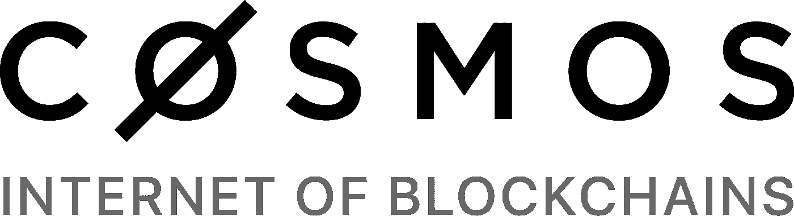
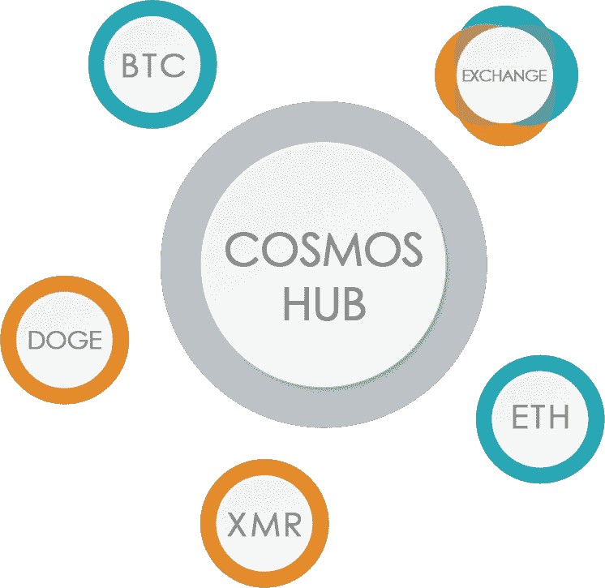
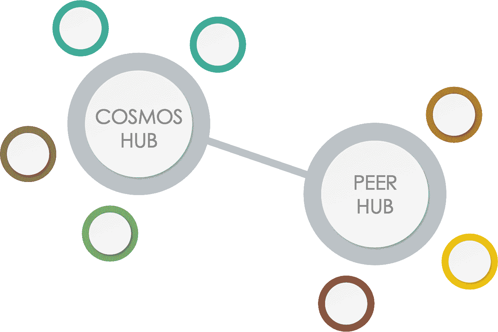

# Cosmos / Tendermint 为真正的白痴解释

> 原文：<https://medium.com/coinmonks/cosmos-tendermint-explained-for-real-idiots-ab4305cbb41?source=collection_archive---------0----------------------->

我是宇宙迷。到目前为止很容易。许多人问我“这个宇宙是什么，为什么你一说起它就犯傻？”我经常解释或者试图解释它。在这里，我将在另一个时间尝试解释它，希望有一个文件，我可以在未来发送给朋友。我不是开发者、团队或基金会的成员，我不会用精确的技术术语来解释它，因为有很多文档是这样做的。阅读[白皮书](https://cosmos.network/about/whitepaper)，阅读宇宙的[博客，观看桑尼·阿格沃尔](https://blog.cosmos.network/)制作的[视频，所有这些都很好，而且在技术上是正确的。不幸的是，我看到这一切对许多人来说太复杂了。所以我试着为真正的白痴解释。不要把这当成一种侮辱，我也是一个真正的白痴，但我这辈子曾经坐下来试图理解这种东西，但作为一个白痴，我可以用白痴的话来解释。](https://www.youtube.com/watch?v=LApEkXJR_0M)

让事情变得如此复杂的是宇宙做了太多的事情。原因之一是嫩薄荷。Tendermint 是软件，Cosmos 是区块链。或者更准确地说，是区块链互联网的主要枢纽，由 Tendermint 的创造者创建。所以让我们开始了解什么是 Tendermint。它将自己描述为“任何编程语言中的拜占庭容错复制状态机”，所以让我们来解密这个东西。拜占庭容错意味着我们不需要一个单一的、可信的实体。就像中央银行，它发行硬币，我们相信它会以合理的方式发行这些硬币。它被称为拜占庭错误，因为有一些人带着一些骆驼，他们想征服拜占庭帝国。因此他们不得不同时进攻君士坦丁堡。到目前为止很容易。他们所要做的就是同时从四面八方发起攻击，因为他们带来了马刀和已经提到的骆驼，这听起来像是一个可行的计划。但是他们没有手机，所以他们不能给其他人打电话或者发照片。更糟糕的是，一些将军可能是叛徒，骆驼的屎也很臭。于是汉奸们想通过给假情报，把其他一些忠诚的将军送上死路。相比之下，所有部队的领导人不想失败，因此希望防止叛徒传播误导信息。不幸的是，没有人知道谁是叛徒，在某种程度上，也不可能知道信息是否可信。这整个困境被称为拜占庭将军问题，是区块链正在解决的原型/范例问题。

> 想用你的原子做赌注吗？检查这些打桩服务提供商。

The siege of Constantinople. Attributed to Philippe de Mazerolles [Public domain], via Wikimedia Commons

这个问题的解决方案允许分散的有组织的系统。将军是分权体制的一个很好的例子，因为从技术上来说，不可能将所有的将军都与一个中央权力机构联系起来。因此，只有通过网状网络才有可能实现足够快的通信，但这也导致了拜占庭错误。一种解决方案是让领导者在他们的消息中添加签名，但是如果您收到 6 条消息，其中有 2 种不同类型的签名，3 个是假的，3 个是真的，会发生什么呢？在这种情况下，即使拜占庭容错协议也不起作用。但是如果只有少数叛徒，就有办法确定谁是忠诚的，谁是叛徒。

下一件事是“复制的国家”，这是区块链的网络实际上做的。它们在所有节点上复制状态。不管你在澳大利亚、中国还是北极运行你的节点，你最终得到的都是同一个区块链。我们不想在这里争论你复制了什么比如比特币，有人会说这不是一种状态，而是未使用的交易。这对开发者来说很重要，但我们是白痴，不想陷入太深的细枝末节。既然提到了比特币，我们也可以注意到，比特币有一个特殊的解决方案来实现拜占庭容错。这个解决方案叫做工作证明。我们稍后将回到这一点。

The fall of Constantinople indicating the byzantine generals problem was solved back then. Attribution: Jean-Joseph Benjamin-Constant [Public domain], via Wikimedia Commons

现在我们知道什么是嫩薄荷了。一个在没有任何中央权威的情况下，在全球范围内发布某个状态的软件。这个东西可以是任何东西。它可以是一个分类账，可以是一个图片数据库，可以是一个未解决的交易订单列表。没关系。这太棒了。这意味着用 Tendermint 你可以创建任何你需要的区块链系统，一切都已经完成了，除了你的应用程序逻辑。所有节点如何连接，它们如何达成共识，区块链如何编写，所有这些东西都已经解决了，如果你想制作一个令牌，你只需要对你的令牌的期望经济性进行编程。您还可以创建一个没有令牌的分散式应用程序(dapp)。有一些限制，最重要的一个意味着你的应用程序必须是确定性的。这意味着无论您给出什么输入，都可以准确预测输出，或者换句话说，所有节点都可以根据一组给定的事务和一个初始状态计算出完全相同的下一个状态。显然这是必要的，否则会一直有分叉。所有这些意味着 Tendermint 将共识层和网络层与区块链解决方案的应用层分离开来。这意味着任何人都可以编写一个区块链，而不需要编写所有的密码和网络相关的代码。这使得开发人员构建解决方案变得非常容易。大公司呢，也许他们想要他们的私人区块链？没问题，Tendermint 由你决定，谁成为节点，如何激励贡献。

现在，我们意识到 Tendermint 使得每天比以前更快地创造新的狗屎硬币成为可能，我们意识到所有这些硬币都是建立在相同的基础上的。也许把这些联系起来也是有意义的。这就是宇宙发挥作用的地方。Cosmos 是用 Tendermint 构建的，它是一个赌注硬币的证明，使用委托允许任何人，甚至非验证者参与赌注。我们称这个宇宙为利害关系的证明。这又是一个我们这些真正的白痴无法理解的疯狂词汇。我们先试着了解一下工作证明(PoW)。这是保护比特币的方法。我们从文章一开始就记得，我们需要一种方法来确定谁是叛徒，谁是忠臣。在加密货币的世界里，这意味着谁在创造有效交易的新区块，谁可能为了个人利益伪造虚假交易。PoW 的理念是，有艰苦的工作要做，谁解决了这项工作，谁就是值得信赖的。因此，这是一个网络同意解决的困难任务，但它很容易检查，并且随着每个解决方案的发现，可能会产生新的任务。此外，可以调整任务的难度。谁先解决了这个难题，谁就先找到一个新的区块，并开始搜索下一个区块。尽管如此，这种东西是分散的。那么我们如何知道该相信谁呢？在这种情况下，你可以相信最长的链条。既然最长的链条解决了最辛苦的工作，那它就是最值得信赖的。啊哈，但是这不是创造了一个更快的块和块时间减少的向上螺旋吗？是的，它会，但正如我们已经提到的工作有多难，是可调的。因此，网络增加了问题的难度，使得平均总是需要 10 分钟来找到新的块。现在，我们可能会问自己，这些废话是如何保护网络的？只是有一些随机的工作要做？嗯，问题是你必须获得硬件来做到这一点。你必须用电来做那件事。如果你决定变得恶意，购买大量的 hashpower，做所有的 PoW 和 troll 网络，那么你可能能够窃取所有的比特币。一种反应可能是比特币失去其估值，这对你来说并不太坏，因为你反正是偷了比特币，但你的采矿硬件现在也一文不值了。为了这些硬件，你花了很多钱。因此，拥有大量权力的人投入了大量资金，希望比特币繁荣发展。此外，希望采矿硬件的价值与比特币的市值成比例。这是通过费用和大宗奖励实现的，这意味着当比特币估值更高时，矿商赚得更多。因此，这刺激了建立更多的矿工，从而增加了硬件资本。有了这种巧妙的机制，通过这种方式摧毁比特币总会花费数十亿美元。不幸是，PoW 有两个非常严重的缺点。一个严重的缺点是浪费了电力。比特币浪费了大量的电力。这些计算是任意的，只是为了保护网络安全，但是它们并不满足所计算的数字的目的。浪费总是不好的，但在全球变暖的背景下，浪费能源更糟糕。战俘的第二个关键问题是矿工的权力。矿工们不需要持有比特币。对他们来说，比特币有多有用并不重要，对他们来说，只有采矿的利润才算数。如果矿商想让比特币变得有用，这很好，我不想在这里讨论这对比特币有多好。我想说的是，矿商可能遵循一项政策，该政策推高了费用，使一种货币无法作为货币使用，降低了其作为价值储存手段的效用，甚至更糟，只是一种收藏家的物品。例如，对于日常支付，你不想使用交易成本超过 10 美元的货币。如果你在一个售货亭买了一个口香糖，而交易的价格比它本身高得多，那么我们不仅仅是真正的白痴，而是绝对的笨蛋。做一个白痴是可以的，但是我们不想成为笨蛋。

Typical reaction to bitcoin’s fees

然而，人们早在几年前就已经对战俘问题下了决心。最流行的解决方案是股权证明(PoS)。这个网络不再靠努力工作来保护，而是靠高风险来保护。因此，要达成共识并找到新的区块，你不再需要硬件，而是需要各自货币中的大量货币。在 PoW 中，每个人都有机会找到与提交的工作量成比例的新块。在 PoS 中，每个人都有机会找到与投入的赌注成比例的新区块。这意味着你可以把你的硬币放在赌注上，这使它们不可移动，并让你参加共识轮。还记得昂贵的硬件使网络变得安全吗？在这里，同样的事情也发生在岌岌可危的硬币上。如果你伪造虚假交易，那么你投入的加密货币将变得一文不值，因此你不会想这么做。乍一看，PoS 听起来很容易，而且比 power 明智得多，但是它也有一些缺点。一个突出的例子是无利害关系问题。它适用于分叉，所以当网络分裂成两个独立的部分时，简单的 PoS 激励赌注者只跟随所有分叉的链。在 PoW 中你不能这样做，因为你的采矿硬件在它能解决的工作量上是有限的。但是如果你的硬币以同样的方式存在于所有的叉子上，你在叉子上没有什么可失去的，只是为了赢，从而激励叉子。不幸的是，分叉对于一个网络来说并不是非常健康的，它们停止了增长，它们迷惑了用户并减缓了开发过程。另一个问题是，所有这些利益相关者都必须就供应链的发展进行沟通并协调他们的观点。对于权力来说，这并不重要。有人会找到下一块，所有其他人可以验证这个解决方案是否正确。对于 PoS，必须确定谁将提议下一个区块，然后所有人必须同意该区块有效。如果我们像比特币一样坚持 10 分钟的阻塞时间，这不是一个真正的问题，但我们知道一方面可扩展性是一个问题，另一方面我们不想等待交易确认。事实上，不需要像比特币那样等待 6 次确认(= 1 小时)才能确定交易有效。这只是权力后果。

A completely unrelated funny image to allow for a refreshing interruption

我很抱歉这篇文章已经很长了。也许这也是喝杯咖啡的好机会。我会尽量让它简短，但我不知道如何做到这一点，因为许多人不知道所有这些内在的问题。但这里有一个好消息:现在我可以谈论宇宙:D

So Cosmos solves this nothing-at-stake problem by introducing the concept of slashing. As far as I know this idea is from Jae Kwon, the head of Tendermint. The idea is that misbehaving stakers get their coins slashed. When you misbehave you lose your coins. When you forge fake transactions you lose a lot of coins. Therefore if you follow fork #2, you will get your coins slashed at fork #1\. Also stakers can be forced to partake in governance processes. This also solves some problems that occurred with the DAO disaster. The next thing is if you are lazy and don’t participate in the process of forging new blocks, then you get slashed as well. It is important for network security that the stakers do participate in the creation of new blocks. Furthermore it is desired to have people stake their coins rather than having them do nothing or being traded daily. Therefore there is a dynamic inflation happening in Cosmos. Staking your coins gives you a proportional share of the inflation, causing you to not lose anything due to inflation. This is necessary to be able to keep fees low and still have an incentive for staking. The next thing is (delegated) Cosmos-Proof of Stake (CPoS), which solves the other mentioned issue. When there are 10k stakers for example, then everyone has to inspect each new block and communicate to everyone if it is ok. There are two limitations, one is latency and the other is bandwidth. For latency the physical limit for a signal to travel is the speed of light, giving roughly 66 ms time to travel to the other side of the globe. In media the speed of light is reduced, in fibre not as much as in copper, but let’s just say 100 ms. Now it depends on the network topology, for a simple example, let’s assume one participant in the consensus sends its knowledge to two others. Then it takes 14 iterations (stages) to inform all participants (since 2¹⁴ > 10k), these 14 stages take 1.4 seconds and after all are informed, they have to report back, in total 2.8 seconds. The problem with this calculation is, that it is wrong. Because in this scenario there must not be a single traitor. If there is just a single traitor for example at the first stage, then half of the network gets false information. Furthermore we have not taken into account that computers also have to do calculations. So let’s assume a calculation takes 50 ms, this is for example the actual check if a block is valid. But there is also room left for optimization, there is no need to send the new block to just 2 other network members. We can just send to all 10k. So the one who forged the new block, sends it to all 10k, they calculate if it is correct, 150 ms have passed. Then all 10k send to all other 10k and they calculate who might be traitors, another 150 ms have passed. Then all 10k agree on the new block and raise their concerns about the traitors and propose the forger of the next block. Another 150 ms, totalling at 450 ms. Great, we can get block times of less than 1s. Pretty decent compared to bitcoin’s 10 minutes. Furthermore blocks are final. With this approach there is no need to wait for 6 or 32 blocks to have passed to be sure that everything is valid. That is because we no longer trust the longest chain but rather agree all according to our stakes. Ok, so let’s just check the other caveat and that is bandwidth. For a first calculation let’s assume a block size of the original bitcoin, 1 MB. Assuming we have to send out the whole block every 150 ms to all 10k participants, we need an internet connection with 67 GB/s bandwith. Normally this is denoted in bit/s and not byte/s, so this would be 532 Gbit/s. Quite a decent connection. Some people have 100 Mbit/s or some lucky guys in student dorms have 1 Gbit/s, but nobody has 532 Gbit/s especially not to any location in the world. Our initial example with 2 recipients at each stage is possible though, there we only need roughly 100 Mbit/s, if we calculate with 150 ms intervals. In reality we need less, because we do not need to transfer the whole block in all rounds. In the last rounds, we only need to send confirmation. However, the first round cannot be delayed too much for latency reasons. But here comes another problem, we have reverted back to the 2 recipients per round. With that value we ended up at 2.8s. Unfortunately we have made the mistake there that there is no byzantine fault tolerance. To get that there have to be many more stages and there is no way to have block time in the range of 1s. So here we have a real dilemma. With 10k network participants, we either have not enough bandwidth to broadcast to all participants at the same time or the latency is too high to have many stages of information distribution and block times in the range of a few seconds are not possible. Keep in mind that talking of network participants we mean the people who participate in the consensus. The users of the blockchain who just read and send transactions do not need to partake in this process. The finalized blocks can be broadcasted to millions because there is no necessity of two way synchronization.

Me reading the whitepaper of Cosmos for the first time

解决这个问题的方法是授权。因此命名为委托宇宙-股份证明。stakers 分成两组，委托者和验证者。验证者是共识机制的参与者，而委托者不是直接网络通信的一部分。在这种情况下，我们可以将验证器的数量限制为一个固定的数字，例如 100。现在就算 10k 想入股，甚至 100k 想这么做，同步所有这些节点的问题都没有了。同步 100 个参与者不是一个大问题，对于我们最初的 2 的幂的例子，我们需要 7 个阶段，如果 10 个接收者得到新的块，那么 2 个阶段对于简单的信息传递就足够了。对于拜占庭容错，我们需要一些额外的循环，但是通过正常的互联网连接，在几秒钟内伪造新的块是可能的。那么授权者做什么呢？他们对验证者进行投票。他们仍然用他们的股份来保护网络。选择也有很多硬币的验证器是有意义的，这样它们就不会变得恶意，但是委托器也决定支持哪些验证器。因此，您可以参与获得股份奖励，但不需要设置一个强大的节点。这是验证者的工作，他们的工作会得到更多的回报。但是就像宇宙中每年的膨胀是动态的一样，验证委员会也是动态的。前者被调整，使得超过 66%的硬币被下注(在工作证明中，50%的散列能力必须是非恶意的，在实际的拜占庭容错中为 66%)，而后者被调整，使得佣金可以保持合理的低水平，但是验证者仍然有运行节点的动机。这是通过验证器之间对委托的竞争来实现的。还有一点很重要，如果你的验证机被砍了，你也会失去你的硬币。这就是为什么分割你的授权硬币以及监视验证者是很重要的，这是监控正在发生的事情的动机，从而保持网络安全。1 MB 的块大小在这里只是一个例子，当然这也是动态的。但在这里选择它是为了表明 Cosmos 能够在不浪费电力的情况下处理比比特币多 600 倍的信息。

Cosmos serves as a hub to many zones, which represent specific blockchains

好了，Cosmos 在技术上是经过深思熟虑的，并且在某种程度上提高了垂直方向的可伸缩性。很好，但是很多硬币都是这样的，对吗？完全正确。有很多很多硬币在做这个。老实说，这并不是宇宙最棒的地方。所以系好你的安全带，我们现在正在接近美味的事实。手指舔得不错。Cosmos 也是一个多令牌平台。宇宙中不仅有原子，它们是宇宙的象征，也有光子，它们是宇宙的象征。因此，一枚硬币用于这整个共识的东西，另一枚硬币用于支付交易。这些光子没有被堆叠，因此在交换时非常容易流动。此外，光子也是以太网的本地令牌。以太薄荷是托管在 Tendermint 上的以太坊。与以太坊功能相同，但共识如上所述。这解决了可伸缩性问题的垂直部分。由于 Cosmos 不打算成为其他生态系统的竞争对手，以太薄荷的创造被称为硬勺子([阅读更多关于它的信息](https://blog.cosmos.network/introducing-the-hard-spoon-4a9288d3f0df))。这意味着所有 ETH 持有者都可以获得光子，并可以像以太坊一样使用以太坊，但费用要低得多，而且它与宇宙网络相连。宇宙网络？事实上，宇宙自称是区块链的互联网。这是因为在这个宇宙中，有通过枢纽连接的区域。这些区域可以是用 Tendermint 创建的任何东西。一个区域显然是以太薄荷。例如，另一个区域可以是比特币钉住区域。这意味着你可以在那里存放真正的比特币，购买“宇宙币内的比特币”。一旦你有了这些代币，你就可以把它们转移到宇宙中心，并把它们换成其他代币，例如光子或其他可用的代币。另一个区域可能是欧元钉住区，在那里你将欧元存入银行账户，并获得一些欧元内宇宙币。现在你可以交易这些欧元代币和一些比特币代币，交易结束后，在比特币挂钩区兑换真正的比特币。然后，你的贸易伙伴在欧元钉住区兑换欧元。你们两个所做的是分散交易。这在宇宙中是直接可能的吗？不，但是很容易创建一个与 Cosmos 相关的区域，允许分散交易。事实上，创造区域并通过枢纽将它们连接起来是 Cosmos 的突出特点。想象一下，以太坊上有一个应用程序，它通过创造超过 10%的流量来堵塞网络，而且它都是关于可爱的小猫的。在 Cosmos 中，开发者可以决定为这些可爱的小猫创建一个特定的区域。如果“小猫狂潮”完全爆发，即使那个区域处理事务的速度不够快，开发人员也可以产生另一个小猫区域，它与第一个区域并行运行。通过宇宙中心，不同区域之间的小猫可以以分散的方式进行交换。在本文中，我们有时会听到垂直缩放；这是另一种方法，称为水平缩放。水平扩展是异步的，会使事情变得更复杂，但它不像垂直扩展那样受限(带宽和延迟……)。所有这一切都意味着有可能建立树状结构的枢纽和区域，为区块链技术的充分扩展开辟了道路。许多人可能听说过以太坊开发者正在开发的分片技术。这是不同的，分片是自动工作的。对于 Cosmos 中心和区域，开发人员必须坐下来手动构建。但是区域的一大优势是每个区域都可以独立构建。一个区域可以有自己的经济，私人区块链也可以连接。这已经表明了宇宙工程的精神。它并不像许多其他项目所宣称的那样，要接管整个加密空间。它只是把所有的东西连接在一起。一个区块链以最好的方式解决所有问题是没有前途的。未来将会有许多专门针对用户和开发者需求的应用程序区块链。Cosmos 希望将这些区块链与现有的区块链连接起来。Tendermint 希望给这些应用特定的区块链一个衬底。这就是为什么 Tendermint 和 Cosmos 不能分开看。两者都让另一件事更有价值。

There can be many hubs — all interconnected

希望这个文字墙能帮到一些真正的傻逼。以下是最常见问题的答案:

**当 ICO？**
2017 年 4 月

**何时在交易所上市？在 mainnet 发布之前,**
Cosmos 将不可用。到那时，原子仍不可交易。他们首先必须是无界的。所以光子会在原子出现之前上市。发射后几周，原子将不再结合。所以它们可能会在发布几周后上市。

**什么时候的月亮？**
月亮不要紧。必须离开太阳系才能到达宇宙。

这是 ERC20 吗？
再读课文。这怎么可能是以太坊令牌？唯一可能的是，当 mainnet 启动时，ERC20 代币可以作为 atom 硬币的借据。这还没有做到，因为宇宙队对疯狂的投机没有兴趣，也许还因为美国的法规:>

**有多少原子复活了？**
ICO 1.68 亿，团队、基金会和战略合作伙伴 5000 多万。

我需要赌多少个原子？
任意。

**ether mint 的快照是什么时候？**
不知道。订阅 C [osmos 博客](https://blog.cosmos.network/)。我相信你会被注意到的。

我什么时候可以开始用 Tendermint 开发东西？今日
。您可以现在构建，以后集成到 Cosmos 中。见[这篇文章。](https://blog.cosmos.network/a-tour-of-cosmos-for-developers-7517ba1b4045)

**以上我都没看，什么时候是 ICO？**

宇宙将如何改变世界？
请看下图:

编辑:更多常见问题
**ICO 价格是多少？** 其实它叫募捐，它是每个原子 0.1 美元，或者 450 个原子换 1 个 ETH。因此，如果你想考虑到整个密码空间的爆炸，你可以用 ETH 的增长来衡量这 0.1 美元，并说一个原子今天将是 2 美元。这是对 ETH 的另类投资的比较。

**原子的量最终是固定的吗？不，通货膨胀一直在持续。默认值为 7%，但可以调整，以便多数股权。请记住，如果你把原子押上，你会从膨胀中得到原子。因此，只要你坚持，膨胀就不会稀释所有原子中你的那部分原子。**

mainnet 什么时候推出？
从二月底推迟到“完事的时候”。查看路线图了解进展[https://cosmos . network/roadmap](https://cosmos.network/roadmap)

在哪个交易所可以买到原子？
将有分散的以及集中的交易所上市原子。Ethfinex 好像列出了 atoms h[ttps://www . ethfinex . com/token _ listings/37/social _ sub category/223/white paper？parentCid=220](https://www.ethfinex.com/token_listings/37/social_subcategory/223/whitepaper?parentCid=220)

> 加入 Coinmonks [电报频道](https://t.me/coincodecap)和 [Youtube 频道](https://www.youtube.com/c/coinmonks/videos)获取每日[加密新闻](http://coincodecap.com/)

## 另外，阅读

*   [复制交易](/coinmonks/top-10-crypto-copy-trading-platforms-for-beginners-d0c37c7d698c) | [加密税务软件](/coinmonks/crypto-tax-software-ed4b4810e338)
*   [网格交易](https://coincodecap.com/grid-trading) | [加密硬件钱包](/coinmonks/the-best-cryptocurrency-hardware-wallets-of-2020-e28b1c124069)
*   [密码电报信号](http://Top 4 Telegram Channels for Crypto Traders) | [密码交易机器人](/coinmonks/crypto-trading-bot-c2ffce8acb2a)
*   [最佳加密交易所](/coinmonks/crypto-exchange-dd2f9d6f3769) | [印度最佳加密交易所](/coinmonks/bitcoin-exchange-in-india-7f1fe79715c9)
*   [新加坡十大最佳加密交易所](https://coincodecap.com/crypto-exchange-in-singapore) | [购买 AXS](https://coincodecap.com/buy-axs-token)
*   [投资印度的最佳加密软件](https://coincodecap.com/best-crypto-to-invest-in-india-in-2021) | [WazirX P2P](https://coincodecap.com/wazirx-p2p)
*   [西班牙 5 大最佳文案交易平台](https://coincodecap.com/copy-trading-spain)
*   [Pionex 双重投资](https://coincodecap.com/pionex-dual-investment) | [AdvCash 审查](https://coincodecap.com/advcash-review) | [坚持审查](https://coincodecap.com/uphold-review)
*   [面向开发者的 8 个最佳加密货币 APIs】](https://coincodecap.com/best-cryptocurrency-apis)
*   [开发人员的最佳加密 API](/coinmonks/best-crypto-apis-for-developers-5efe3a597a9f)
*   最佳[密码借贷平台](/coinmonks/top-5-crypto-lending-platforms-in-2020-that-you-need-to-know-a1b675cec3fa)
*   杠杆代币的终极指南