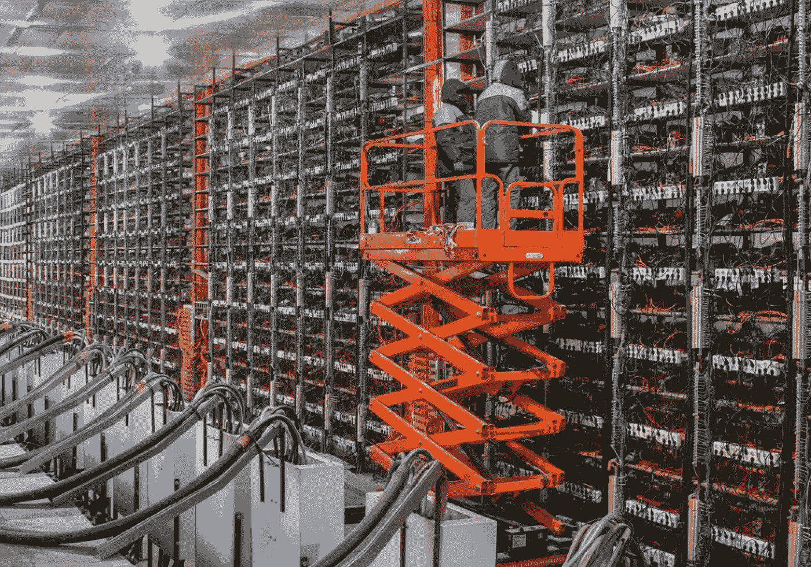
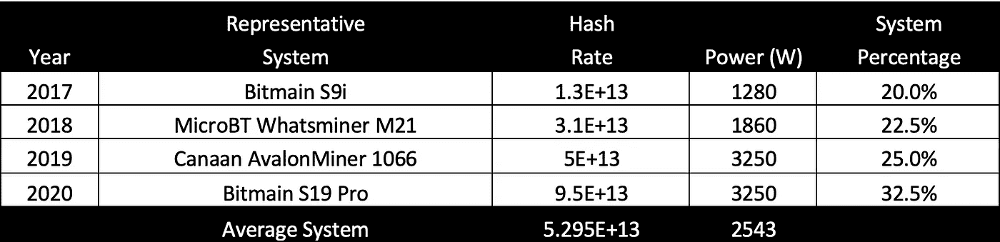
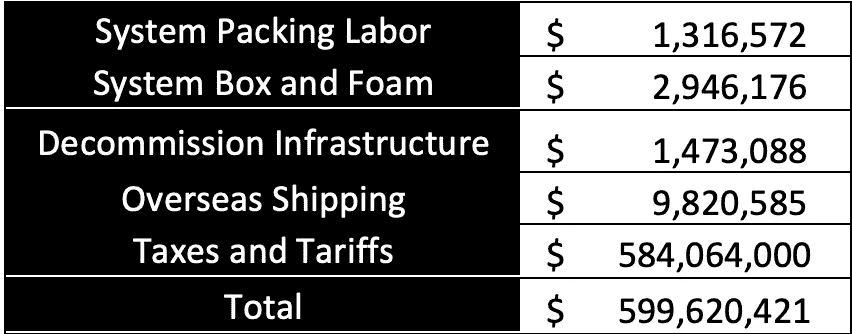
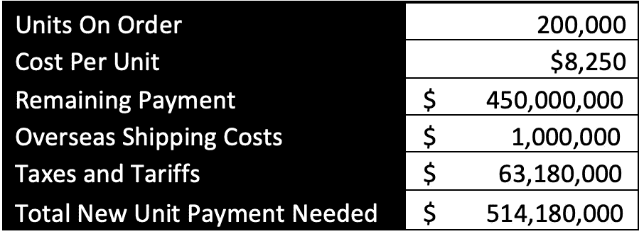
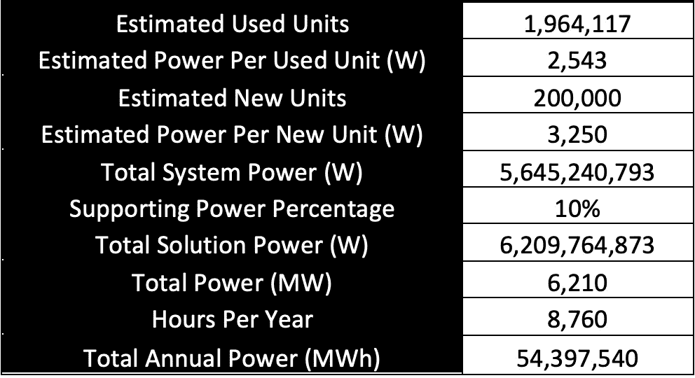

# 重新部署中国比特币矿业的成本和动力

> 原文：<https://medium.com/coinmonks/cost-and-power-to-redeploy-chinas-bitcoin-mining-industry-19261f263419?source=collection_archive---------2----------------------->

过去几周，中国禁止比特币采矿业的现实受到了全面冲击。这不是演习，我重复，这不是演习！自美国禁酒令以来，整个行业第一次被迫离开一个国家。更糟糕的是，它是在没有警告甚至没有过渡期的情况下实施的。作为一个拥有并经营采矿业务的人，我非常同情我的中国同胞，我祈祷他们尽快恢复，并尽可能减少经济损失。这对他们来说肯定是一个令人心痛的情感打击，但虽然我无法提供任何治疗帮助，但我想我可以揭示他们面临的物流和财务障碍的严重性。

作为起点，我们需要估计需要停用多少比特币挖矿系统。我们知道，2021 年 5 月 9 日，比特币的哈希能力达到了历史最高水平 191 EH/Sec，截至 2021 年 6 月 30 日，它已经下降到 87 EH/Sec，净下降 104 EH/Sec(来源: [www.coinwarz.com)。](http://www.coinwarz.com).)为了确定参与空投的单位数量，让我们从检查正在使用的采矿单位类型开始。从逻辑上讲，这些产品主要由过去四年生产的产品组成。因此，我为过去四年中的每一年选择了一个代表该技术的单元，并估计了这些单元与总单元的组合。然后，我将这些混合在一起，得出整个网络中使用的平均系统。下图说明了这一点:

有些人可能会认为不同的单位会更好地代表每一年，任何人都可以用不同的单位重新创建这个图表，但我自己也玩了很久，我认为任何人都会发现结果没有实质性的变化。

将比特币网络中总的丢失哈希率除以平均系统产生的哈希率，我们可以估计出离线系统的总数。这个数字是惊人的；1,964,117.

与过去的禁令不同，这不是简单的关闭机组几天，然后等待检查员离开。中国政府希望这些系统被关闭，设施完全退役，所有的设备被销毁或从这个国家移走。这意味着前面有巨大的任务和费用。我做了一个快速的时间研究，准备将每个单元运往海外，我计算出平均需要 4 分 57 秒。这项工作包括关闭设备、断开所有电缆、缠绕所有电缆、将设备从机架上拉下、在设备周围放置泡沫、将设备和泡沫放入盒子中、用胶带封住盒子、给盒子贴标签、将盒子放在货盘上、包裹货盘、给货盘贴标签，以及将货盘运送到装运码头。假设每个工时的劳动力效率为 80%，这意味着每个工时可以装箱 9.7 个单位，仅包装系统就需要大约 202，000 个工时。根据 Statistica 的数据，中国制造业劳动力的平均负担成本为 6.5 美元/小时，因此这项工作的总劳动力成本为 132 万美元。而且，假设只有 25%的系统保留了包装箱和泡沫套件(谁真正保留了这些东西？)，那么他们将需要为其中 75%的单元购买包装盒和泡沫套装。在中国采购的盒子和泡沫套装的成本约为 2 美元/套(在美国约为 4 美元/套)，因此包装材料成本将增加 295 万美元。

估计机架、网络和电气基础设施的拆除成本要困难得多，但这必须由更熟练的劳动力来完成，保守估计将花费 150 万美元。(这可能会相差几百万美元，因为在没有设施的详细知识的情况下，在这里进行时间研究几乎是不可能的。)由于法规遵从性问题以及将该设备运送到海外的高成本，很可能只有很少一部分设备会离开中国，而很可能只是作为二手设备在当地出售。不幸的是，这将意味着只能收回原始资本成本的一小部分。

不过，这些系统本身要么会销往海外，要么如果可能的话，会被放回另一个国家的新工厂。不管怎样，要做到这一点，将这些运到海外将会有很大的成本。考虑到涉及的单位数量巨大，海运将是最常见的运输方式。很可能系统的每个托盘将包含大约 80 个单元，并且每个 40 英尺的集装箱可以容纳 20 个托盘。这意味着将所有系统运出中国需要 1228 个集装箱。几乎所有这些单位将前往北美，南美或欧洲，运输一个集装箱的平均成本约为 8000 美元。这意味着将这些设备运出美国将需要 980 万美元的运费。(我认为，中国矿商最好尽快这么做，因为他们害怕政府会宣布拥有单位都是非法的。)

然而，一旦这些设备到达目的港，真正的成本就开始产生了；进口税和关税。在大多数国家，来自中国的商品的进口税约为 5%。由于特朗普政府实施的关税，美国的总进口税和关税为 27.6%。以二手比特币挖矿设备 40 美元/台的非常保守的市场价值估计，所有离开中国的比特币挖矿系统的总价值为 4.16 亿美元。假设这些设备的 40%最终在美国，60%最终在中国以外的其他国家，税收和关税总额将为 5.84 亿美元。

下表总结了系统退役和海外运输的最低直接成本。

请注意，关闭这些设施还会产生其他一些成本，其中一些成本可能会很高。这些成本包括违反租约或支付抵押贷款的成本、裁员的成本以及贷款利息。这将不得不由不再产生任何收入的企业来完成。难怪中国矿商现在正在出售比特币——他们别无选择。(关于这一点的更多信息，请参阅本文后面的内容。)

同样值得注意的是，矿业公司可能订购了许多设备，计划在未来六个月内交付。鉴于在停产前，中国大约有 20 万台 2M 机组在使用，保守估计是已经订购了 20 万台，但尚未从供应基地发货。对于买方来说，通常的商业惯例是在下订单时先付 50%的定金，在交货前再付 50%的定金。我们可以用下面的方式来估计这将给买方带来的现金需求。订购的新系统可能会有约 90TH/sec 的输出，每个系统的成本约为 50 美元或 4500 美元。将所有这些因素相乘，这意味着矿工们可能会为没有住房的单元增加 4.5 亿美元的支出。然后，他们将不得不出口这些产品，并支付运费、税款和关税。总的来说，这意味着他们将有另外 5 . 14 亿美元的不可避免的成本。

所有这些成本和支付要求总计超过 111 亿美元(不包括业务关闭成本，如违反租约和员工解雇成本)。如果矿商的国库主要持有比特币，他们将不得不清算远超过 32750 BTC(BTC 价格为 3.4 万美元)的比特币来偿还债务。其中一些显然已经发生，但我怀疑大量抛售仍将继续。

5 月 9 日达到了 191 EH/sec 的历史最高比特币散列率，并在 5 月 17 日急剧下降到 138 EH/sec，然后在 6 月 30 日进一步下降到 87 EH/sec。这一下跌的大部分责任都归咎于埃隆·马斯克关于特斯拉不再接受比特币支付的推文；然而，事后来看，不难想象这次价格下跌的一部分(大部分)可能是由一群精选的人造成的，甚至可能是一些矿业公司自己，他们得到了禁令即将实施的早期警告，并提前开始了他们在 BTC 的清算。

当然，上面提到的 111 亿美元以上的估计只是让中国矿工的设备退役，然后运到中国以外的港口。在那里，这些装置要么必须出售，要么在新的地点重新投入使用。后一条道路显然需要另一笔巨额资本成本，和/或建立新的联盟，让中国矿商与托管设施和能源合作伙伴分享产量。但寻找这些设施和能源合作伙伴将非常困难，不幸的是，他们的商业运作的经济效益再也不会像在中国那样有利可图。

如上图所示，中国使用的设备组合、最初为中国订购的设备以及开关、风扇、灯等所需的电力。这意味着每年将需要约 54，398 GWh 的电力来为这些机组供电。这与希腊、罗马尼亚和瑞士等整个国家的电力需求水平相当。我很可能会在另一篇文章中探讨在这个层次上寻找和/或创造权力的困难。我只想说，这将是一项耗资巨大的艰巨任务，需要很长的时间。

虽然本文中提出的一些估计可能在某种程度上有偏差，但它们在显示任务的数量级和中国矿业社区所承受的财政负担方面是准确的。比特币将会生存下来，甚至繁荣发展，因为它导致比特币采矿网络的足迹更加全球化、更加分散，但中国采矿社区的企业主、员工和合作伙伴将会遭受巨大损失。到目前为止，他们在帮助比特币获得稳定性和力量方面发挥了重要作用，我们应该感谢他们到目前为止所做的一切，他们应该得到我们的支持。

**鲍勃·伯内特
赤脚矿业公司首席执行官
2021 年 7 月 1 日**

> 加入 [Coinmonks 电报频道](https://t.me/coincodecap)，了解加密交易和投资

 [## 最佳免费加密交易机器人——前 16 名比特币交易机器人[2021]

### 2021 年币安、比特币基地、库币和其他密码交易所的最佳密码交易机器人。四进制，位间隙…

medium.com](/coinmonks/crypto-trading-bot-c2ffce8acb2a)  [## 最佳 6 个加密交易信号电报通道

### 这是乏味的找到正确的加密交易信号提供商。因此，在本文中，我们将讨论最好的…

medium.com](/coinmonks/best-crypto-signals-telegram-5785cdbc4b2b)  [## BlockFi 评论 2021 —通过您的加密获得 8.6%的利率

### 让你的密码发挥作用，获得比特币和其他加密货币的最佳利率

medium.com](/coinmonks/blockfi-review-53096053c097) 

## 另外，阅读

*   [尤霍德勒 vs 科恩洛 vs 霍德诺特](/coinmonks/youhodler-vs-coinloan-vs-hodlnaut-b1050acde55a) | [Cryptohopper vs 哈斯博特](https://blog.coincodecap.com/cryptohopper-vs-haasbot)
*   [币安 vs 北海巨妖](https://blog.coincodecap.com/binance-vs-kraken) | [美元成本平均交易机器人](https://blog.coincodecap.com/pionex-dca-bot)
*   [如何在印度购买比特币？](/coinmonks/buy-bitcoin-in-india-feb50ddfef94) | [WazirX 审核](/coinmonks/wazirx-review-5c811b074f5b) | [BitMEX 审核](https://blog.coincodecap.com/bitmex-review)
*   [比特币主根](https://blog.coincodecap.com/bitcoin-taproot) | [Bitso 回顾](https://blog.coincodecap.com/bitso-review) | [排名前 6 的比特币信用卡](/coinmonks/bitcoin-credit-card-bc8ab6f377c6)
*   [双子座 vs 比特币基地](https://blog.coincodecap.com/gemini-vs-coinbase) | [比特币基地 vs 北海巨妖](https://blog.coincodecap.com/kraken-vs-coinbase) | [CoinJar vs CoinSpot](https://blog.coincodecap.com/coinspot-vs-coinjar)
*   [印度加密交易所](/coinmonks/bitcoin-exchange-in-india-7f1fe79715c9) | [比特币储蓄账户](/coinmonks/bitcoin-savings-account-e65b13f92451) | [Paxful 审核](/coinmonks/paxful-review-4daf2354ab70)
*   [杠杆代币](/coinmonks/leveraged-token-3f5257808b22) | [最佳密码交易所](/coinmonks/crypto-exchange-dd2f9d6f3769)
*   [Godex.io 审核](/coinmonks/godex-io-review-7366086519fb) | [邀请审核](/coinmonks/invity-review-70f3030c0502) | [BitForex 审核](/coinmonks/bitforex-review-c4bb28d9e271) | [HitBTC 审核](/coinmonks/hitbtc-review-c5143c5d53c2)
*   [Crypto.com 费用](/coinmonks/binance-fees-8588ec17965) | [僵尸加密审查](/coinmonks/botcrypto-review-2021-build-your-own-trading-bot-coincodecap-6b8332d736c7) | [替代品](https://blog.coincodecap.com/crypto-com-alternatives)
*   [MXC 交易所评论](/coinmonks/mxc-exchange-review-3af0ec1cba8c) | [Pionex vs 币安](https://blog.coincodecap.com/pionex-vs-binance) | [Pionex 套利机器人](https://blog.coincodecap.com/pionex-arbitrage-bot)
*   [我的密码交易经验](/coinmonks/my-experience-with-crypto-copy-trading-d6feb2ce3ac5) | [《比特币基地评论》](/coinmonks/coinbase-review-6ef4e0f56064)
*   [加密货币储蓄账户](/coinmonks/cryptocurrency-savings-accounts-be3bc0feffbf) | [赌注加密](https://blog.coincodecap.com/staking-crypto) | [StealthEX 评论](/coinmonks/stealthex-review-396c67309988)
*   [BigONE 交易所评论](/coinmonks/bigone-exchange-review-64705d85a1d4) | [CEX。IO 审查](https://blog.coincodecap.com/cex-io-review) | [交换区审查](/coinmonks/swapzone-review-crypto-exchange-data-aggregator-e0ad78e55ed7)
*   [最佳比特币保证金交易](/coinmonks/bitcoin-margin-trading-exchange-bcbfcbf7b8e3) | [Bityard 保证金交易](https://blog.coincodecap.com/bityard-margin-trading) | [Prokey 点评](/coinmonks/prokey-review-26611173c13c)
*   [加密保证金交易交易所](/coinmonks/crypto-margin-trading-exchanges-428b1f7ad108) | [赚取比特币](/coinmonks/earn-bitcoin-6e8bd3c592d9) | [Mudrex 投资](https://blog.coincodecap.com/mudrex-invest-review-the-best-way-to-invest-in-crypto)
*   [WazirX vs CoinDCX vs bit bns](/coinmonks/wazirx-vs-coindcx-vs-bitbns-149f4f19a2f1)|[block fi vs coin loan vs Nexo](/coinmonks/blockfi-vs-coinloan-vs-nexo-cb624635230d)
*   [BlockFi 信用卡](https://blog.coincodecap.com/blockfi-credit-card) | [如何在币安购买比特币](https://blog.coincodecap.com/buy-bitcoin-binance)
*   [加密副本交易平台](/coinmonks/top-10-crypto-copy-trading-platforms-for-beginners-d0c37c7d698c) | [五大 BlockFi 替代方案](https://blog.coincodecap.com/blockfi-alternatives)
*   [CoinLoan 审核](/coinmonks/coinloan-review-18128b9badc4)|[Crypto.com 审核](/coinmonks/crypto-com-review-f143dca1f74c) | [火币保证金交易](/coinmonks/huobi-margin-trading-b3b06cdc1519)
*   [顶级付费加密货币和区块链课程](https://blog.coincodecap.com/blockchain-courses) | [币安评论](/coinmonks/binance-review-ee10d3bf3b6e)
*   [在美国如何使用 BitMEX？](https://blog.coincodecap.com/use-bitmex-in-usa) | [BitMEX 点评](https://blog.coincodecap.com/bitmex-review) | [币安 vs Bittrex](https://blog.coincodecap.com/binance-vs-bittrex)
*   [最佳免费加密信号](https://blog.coincodecap.com/free-crypto-signals) | [YoBit 评论](/coinmonks/yobit-review-175464162c62) | [Bitbns 评论](/coinmonks/bitbns-review-38256a07e161)
*   [OKEx 回顾](/coinmonks/okex-review-6b369304110f) | [Kucoin 交易机器人](/coinmonks/kucoin-trading-bot-automate-your-trades-8cf0ca2138e0) | [期货交易机器人](/coinmonks/futures-trading-bots-5a282ccee3f5)
*   [比特币基地跑马圈地](https://blog.coincodecap.com/coinbase-staking) | [Hotbit 评论](/coinmonks/hotbit-review-cd5bec41dafb) | [KuCoin 评论](https://blog.coincodecap.com/kucoin-review)
*   [最佳加密交易信号电报](/coinmonks/best-crypto-signals-telegram-5785cdbc4b2b) | [MoonXBT 评论](/coinmonks/moonxbt-review-6e4ab26d037)
*   [Coinswitch 俱吠罗评论](/coinmonks/coinswitch-kuber-review-1a8dc5c7a739) | [电网交易机器人](https://blog.coincodecap.com/grid-trading) | [比特币基地收费](/coinmonks/coinbase-fees-831e77d4f2c5)