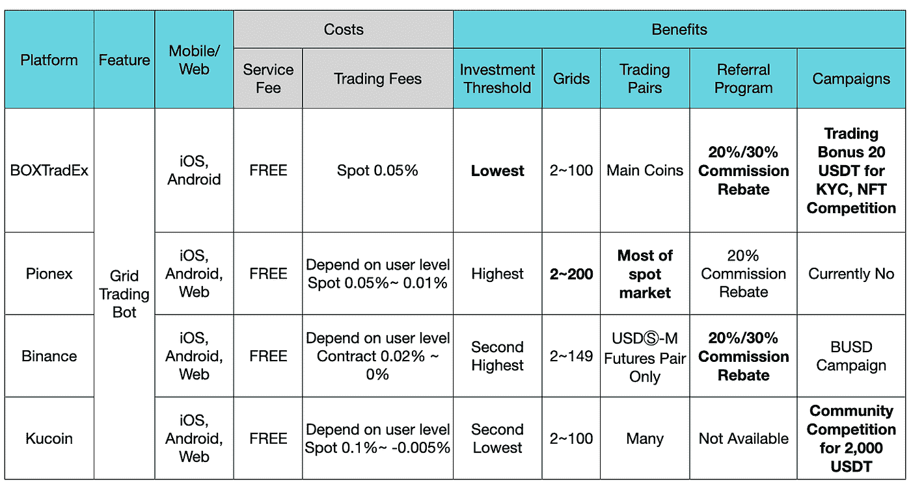
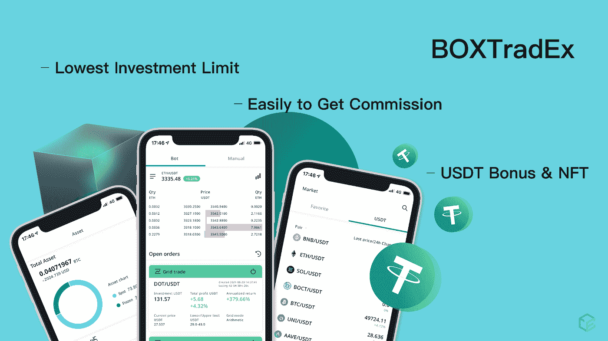
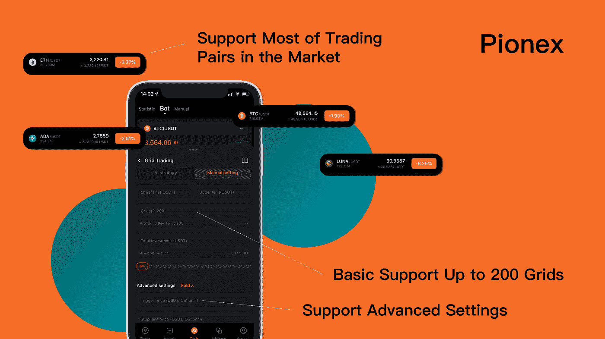
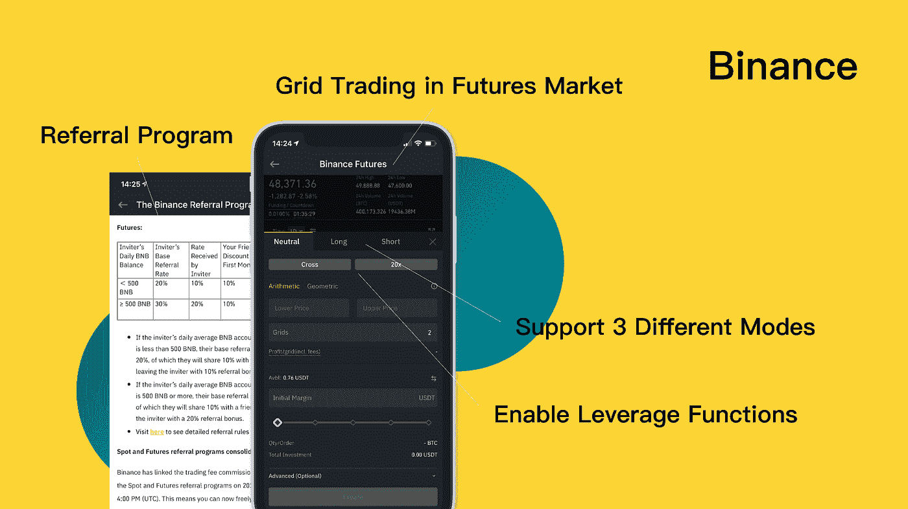
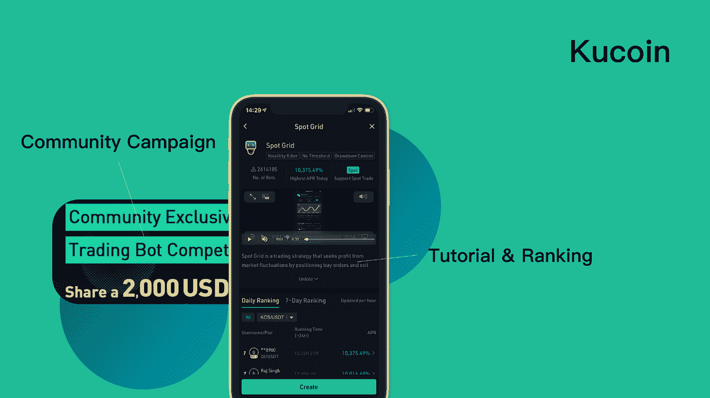
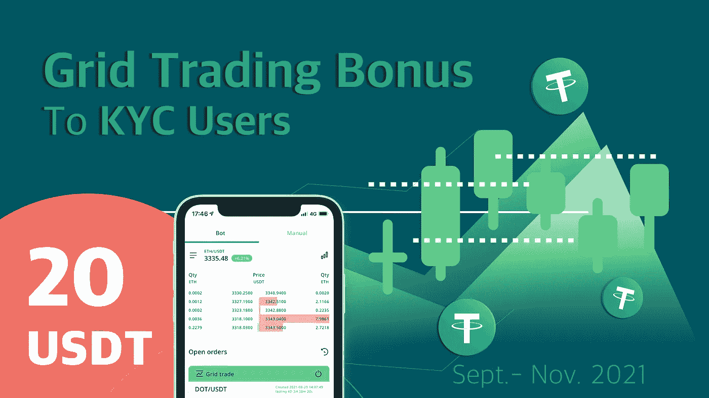

# 网格交易平台的成本与收益

> 原文：<https://medium.com/coinmonks/cost-benefit-of-grid-trading-platform-475b940c77a?source=collection_archive---------1----------------------->

> 密码世界是追求更高效、平等和智能的新形态。我们已经看到了比特币，一种没有中间方的点对点现金系统，为人类提供了一种即时、高效和无边界的支付解决方案。这就是为什么加密和区块链产业应该像加密交易机器人一样繁荣。
> 
> 网格交易机器人(Grid Trading bot)是帮助交易者日夜自动在波动性之间套利的著名工具之一，为投资者带来诸多收益。因此，许多密码交易所和公司为密码交易员运营和构建交易机器人系统，如 [BOXTradEx](https://blog.coincodecap.com/go/BOXTradEx) 、 [Pionex](https://blog.coincodecap.com/pionex-review-exchange-with-crypto-trading-bot) 、[币安](https://blog.coincodecap.com/binance-review)和 [Kucoin](https://blog.coincodecap.com/kucoin-review) 等。
> 
> 如果你是一个[网格交易](https://blog.coincodecap.com/grid-trading)用户，我们总结并比较了这些网格交易机器人平台之间的成本和收益，这可能是一个指示哪个平台适合你。

# 关键要点和简要比较

在下面的图表中，我们总结并系统地列出了为加密投资者提供[网格交易机器人](https://blog.coincodecap.com/grid-trading)的平台的各个维度。您可以将它作为选择哪个平台和服务可能符合您的需求或好处的参考。

*   [BOXTradEx](https://blog.coincodecap.com/go/BOXTradEx) 今年出现，致力于提供一种基于高安全性和合规性的新型加密交换，主要应用是网格交易 bot 和 DCA 策略。
*   Pionex 提供 5 种免费的不同类型的网格交易机器人，具有多级交易费用结构，还提供最大的网格支持和可用的交易对。
*   币安只在美元期货市场上提供交易机器人服务，它还允许用户以 3 种不同的模式打开网格交易策略，中性，多头和空头。
*   Kucoin 支持现货和期货市场的网格交易 bot，可以看作是 Pionex 的巨大挑战者。

# 为什么选择网格交易机器人？

网格交易机器人主要用于流动性支持和波动性套利，它已被证明是加密货币市场中最受欢迎的交易工具。由于高波动性和流动性需求的特点，网格交易机器人以机制帮助用户自动、更高效地获利，在理想价格范围内低买高卖。

# 4 你需要了解的电网交易平台

有几个内置免费网格交易机器人的交易所，这些都是加密投资者的伟大交易工具提供商，但有一些独特的特点，成本和收益。

*   box tradex——一个加密平台，旨在消除投资加密货币的障碍。[聊天群](https://t.me/boxtradex) [官方链接](https://linktr.ee/BoxTradEx)
*   Pionex 世界领先的加密货币交易所，拥有自由交易机器人。[聊天群](https://t.me/pionexen) [官方链接](https://www.pionex.com/)
*   币安—世界领先的区块链生态系统和数字资产。交换。[聊天群](https://t.me/binanceexchange) [官方链接](https://www.binance.com/)
*   库币——在库币上寻找下一个加密宝石，人民交易所。
    [聊天群](https://t.me/Kucoin_Exchange) [官方链接](https://www.kucoin.com/)

# 成本和收益

## BOXTradEx

BOXTradEx 为 Grid Trading bot 提供多连接流动性池，建立强大的独立自有流动性系统，并允许其与其他流动性提供商结合。此外，BOXTradEx 旨在开发一个首先基于安全性和法律合规性的加密平台，因此，BOXTradEx 与全球领先机构 Circle 和币安合作，在高级托管解决方案中保护用户的数字资产。此外，继续组建加密联盟，在东南亚提供加密支付和交换解决方案。

## 费用

1.  网格交易机器人免费使用。
2.  只有 0.05%交易费的网格交易机器人用户。

## 利益

1.  BOXTradEx 提供了一个相对较低的最低投资金额来打开一个网格交易 bot，它更加用户友好，并增强了用例的弹性。你可以简单的用不到 100 个 USDT 在 ETH/USDT 开 100 个网格的网格交易。
2.  BOXTradEx 的推荐计划提供了相对较低的门槛，可以获得 20%和 30%的佣金回扣，这取决于你邀请了多少合格的用户。
3.  BOXTradEx 推出了 20 USDT 交易红利给每个在平台上通过了 KYC 进程的用户，用户可以用交易红利来体验网格交易 bot 并获取利润。

## Pionex

Pionex 是首家将币安和霍比的流动性合二为一的交易所，它能够在平台本身上提供 12 个内置的交易机器人。网格交易 bot 是平台上最著名的交易型 bot。

## 费用

1.  网格交易 bot 可以自由使用。
2.  交易费基于用户水平，基本为 0.05%，最低为 0.01%。

## 利益

1.  Pionex 提供了 Spot 市场的大部分交易对，允许用户打开网格交易 bot，也有杠杆交易对和非美元报价对。
2.  对于 Pionex 中的网格交易 bot，用户可以选择定制他们的策略或使用 AI。除自定义功能外，用户还可以利用触发价、止损价等高级设置提升网格交易 bot 的业绩。
3.  Pionex 允许用户打开最多 200 个网格的网格交易机器人，此外，Pionex 有一个特殊的程序来解锁一个数量的网格到 1000 个。

## 币安

币安是全球领先的数字加密交易所，通过其区块链和平台构建加密生态系统，还提供多种加密交易服务，其中一种是网格交易 bot。币安只在期货市场提供网格交易 bot 服务。

## 费用

1.  网格交易 bot 是免费使用，但用户需要了解期货市场的规则。
2.  交易费基于用户水平，基本为 0.02%，期货交易最低为 0%。

## 利益

1.  币安在其永久期货市场提供网格交易 bot，并允许用户利用杠杆做套利。期货市场比现货市场具有更高的风险回报特征。
2.  币安网格交易 bot 有 3 种战略模式可供选择，即长模式、短模式和中性模式。对于多头和空头模式，用户将拥有初始头寸(多头或空头)，同时以预定间隔下达买入限额和卖出限额订单，以利用市场波动性和巩固阶段。在 Neutral 模式下，用户没有初始仓位，机器人会在价格范围内自动下达限价买入和卖出订单。
3.  币安有一个全面的推荐计划，以用户与 20%的佣金回扣入门级和高达 30%的指定 BNB 持有人。

## 库恩

库币在 2017 年是一家著名的交易所。它为用户提供了各种各样的替代币和独特的交易功能。ku 币提供了网格交易 bot 的权利在平台内，也支持人工智能和自定义功能一样，其他平台。库恩的优势之一是用户可以在现货和期货市场同时使用网格交易 bot 方式，此外，网格交易 bot 方式的灵活性和创新性很大。

## 费用

1.  [网格交易 bot](https://blog.coincodecap.com/grid-trading) 可在现货和期货市场自由使用。
2.  交易费用取决于用户级别，最高为 0.1%，最低为-0.005%(给用户的回扣)。

## 利益

1.  Kucoin 在现货和期货市场支持 100 多种硬币/代币。
2.  Kucoin 中的网格交易机器人拥有定制的策略功能和 AI 策略，此外，新用户可以在打开网格交易机器人时学习教程和排名信息。
3.  Kucoin 定期向网格交易用户推出几个交易活动，创建指定网格交易机器人的社区成员可以分享 2000 USDT 奖金。

# 如何选择哪个网格交易 Bot 最好？

总的来说，在这些平台之间，哪个网格交易机器人是最好的，并没有绝对正确的答案。这完全取决于用户的偏好和需求，这就是为什么我们选择这个主题，并与它进行成本和收益比较。您可以选择哪个平台适合您的情况，但是，您仍然可以尝试上面提到的平台，并体验网格交易机器人的魔力！

当然，也可以评估其他元素…

1.  安全性和流动性
2.  客户服务
3.  用户体验

总之，Grid Trading bot 是一款自动化交易工具，可以帮助您更轻松、更有效地执行投资计划，并节省您的时间。如果你是新的网格交易机器人， [**只要学习它，并获得您的免费机器人在地方！！**](https://linktr.ee/BoxTradEx)

