# [CouchDB]基于 Hyperledger 结构帐户的钱包 Java 链代码

> 原文：<https://medium.com/coinmonks/couchdb-hyperledger-fabric-account-based-wallet-java-chaincode-82166c165266?source=collection_archive---------0----------------------->

## CouchDB 版本—交易系统中基于账户的钱包模型


[Hyperledger Fabric Image](https://www.hyperledger.org/blog/2018/11/28/conducting-data-with-concerto-and-hyperledger-fabric)

这是 Hyperledger Fabric***Java******chain code with couch db***的教程。

基本上，本教程是我之前的故事[Hyperledger Fabric Account-based Wallet Java chain code](/coinmonks/hyperledger-fabric-account-based-wallet-java-chaincode-8cbf80a6fb82)的 ***CouchDB 版本*，但是添加了一些新的功能来演示 CouchDB 可以为我们提供什么— ***Rich Query*** ，这使我们能够以更灵活的方式 ***查询我们的区块链数据*** ，例如查询“所有余额大于$10 的钱包”。而在 LevelDB 中，数据被简单地存储为一个键值对。**

> 注意，一般来说，LevelDB 比 CouchDB 有更好的性能，而 CouchDB 可以为我们提供丰富的查询。选项取决于用例。

## 开始之前

我们将使用 Hyperledger Fabric“构建您的第一个网络(BYFN)”作为我们的测试环境(1.4 版网络)

> 如果你不知道如何开始一个“BYFN”网络，我也会提供步骤，不用担心。但是如果你想了解“BYFN”是如何工作的，你可以参考:
> 
> (1) [Hyperledger Fabric 官方“BYFN”教程](https://hyperledger-fabric.readthedocs.io/en/release-1.4/build_network.html)
> 
> (2) [我之前关于“BYFN”的故事](/@reasdom/hyperledger-fabric-building-your-first-network-tutorial-part-1-2d3b32213529)

## 基于账户的钱包模型基本上是什么

基于账户的钱包模型是 ***交易系统*** 的实现之一，一般来说 ***都有钱包，每个钱包都包含一些价值或代币，可以用来转移*** 。当然，在实现的细节上有很多变化，比如令牌交换和多令牌特性。

## 特征

在 Java 链代码中，我们将实现:

1.  用户钱包创建
2.  带有 walletId 的用户钱包查询
3.  钱包代币转账(即从一个钱包向另一个钱包汇款或代币)
4.  ***以令牌金额需要大于某个值为条件的用户钱包查询(本次 CouchDB 版本教程新增功能！)***

## Java 链代码开发工具 IDE

我们用 [***IntelliJ IDEA 社区***](https://www.jetbrains.com/idea/download/#section=mac) 。还有，你需要有[](https://www.oracle.com/technetwork/java/javase/downloads/jdk8-downloads-2133151.html)*。请安装它们。*

*当然，如果你有自己的 Java IDE，你也可以使用它。但是在本教程中，我使用 IntelliJ。*

## *步骤 1 —开发准备*

*让我们打开 IntelliJ。*

****在 IntelliJ 中创建新项目*** :*

*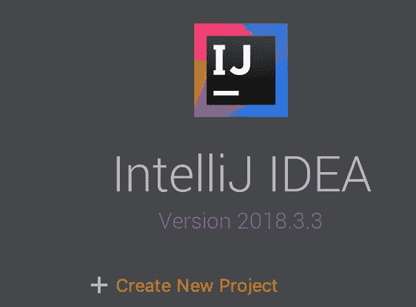*

*选择左边的*，然后下一步:**

**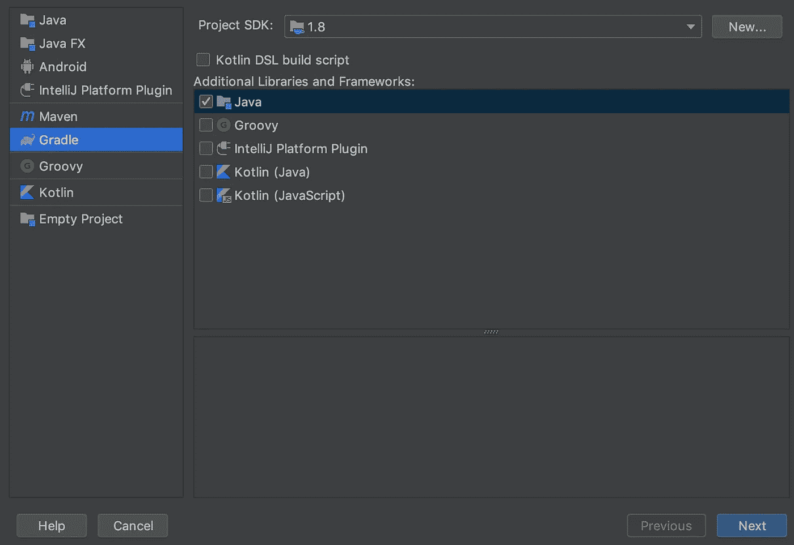**

**键入您的 ***GroupId*** 和 ***ArtifactId*** 。在我的例子中，我用***“Java _ account _ model _ cc”***来表示两者。接下来:**

**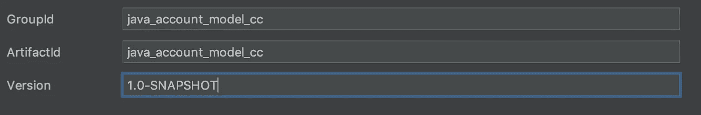**

**然后，就下一个。现在，你应该配置你自己的 ***项目位置*** 。我的情况是用***" ~/Desktop/Java _ account _ model _ cc "***。点击 ***完成*** 。**

## **1.1 设置**

**在左边的项目文件中，你应该有***【settings . gradle】***。让我们双击打开它:**

**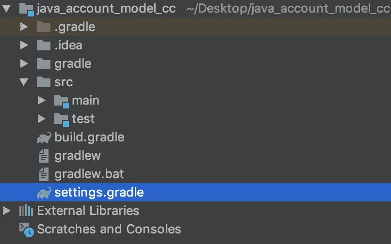**

**Project files on the left panel**

**键入以下内容:**

**settings.gradle**

## **1.2 build.gradle**

**在左边的项目文件面板中，你应该有***【build . gradle】***。让我们双击打开它。**

**然后，键入以下内容:**

**build.gradle**

***如果您的 IntelliJ 右下方有一个***【grad le 项目需要导入】*** 弹出，让我们选择 ***【导入修改】*** 。**

## **1.3 链码文件**

**在左边的项目文件面板中，在***src>main>Java***下，点击右键，选择***New>Java Class***:**

**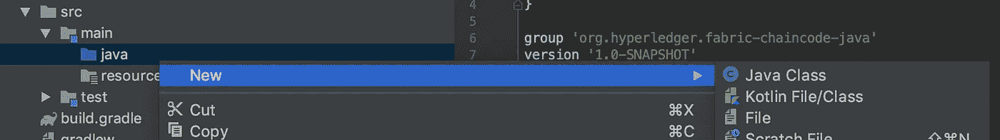**

**在*字段中输入***" org . hyperledger . fabric . chain code . accountbasedchaincode "***:***

**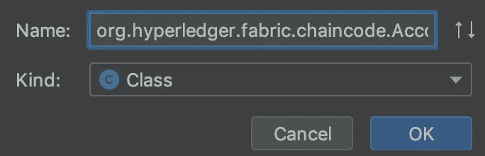**

**org.hyperledger.fabric.chaincode.AccountBasedChaincode**

**然后，您应该有以下内容:**

**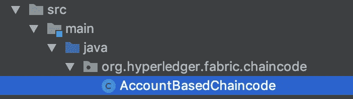**

*****AccountBasedChaincode***(。java)上面是我们用 Java 写 Chaincode 的地方。**

## **步骤 2 —需求分析**

**在开始编码之前，我们先整理一下需要编码的内容。**

**如“特性”一节所述，在 Java 链代码中，我们将实现:**

1.  **用户钱包创建**
2.  **带有 walletId 的用户钱包查询**
3.  **钱包令牌转移(即从一个钱包向另一个钱包汇款)**
4.  *****令牌金额需要大于某个值的用户钱包查询*****

**根据上面这个简单的要求，我们需要下面的类:**

1.  **钱包类**
2.  **链码类——保存链码**

**我们的链码应该提供这些功能:**

1.  **创建钱包**
2.  **将代币从一个钱包转移到另一个钱包**
3.  **获取(查询)带有 walletId 的钱包**
4.  *****获取(查询)一些钱包，条件是令牌金额需要大于某个值*****
5.  **Init 函数—当链码为 ***实例化*** 时调用**
6.  **调用函数—当用户想要调用函数(1)、(2)、(3)或**、*、*、**时调用**

> ****Init** 函数必须在 Chaincode 中实现，每当我们**实例化**或 **升级***chain code 时，该函数将被自动调用。通常用于初始化区块链中的一些数据。***
> 
> *****Invoke** 函数用于接收**所有**用户函数调用，然后根据调用调用(调用)相应的函数— (1)、(2)、(3)或 **(4)** 。它就像一个路由器——将传入的请求路由到不同的路径。***

## ***步骤 3 —钱包类***

***现在，我们创建并编码 Wallet 类。***

***在***“org . hyperledger . fabric . chain code”下新建一个包:******

***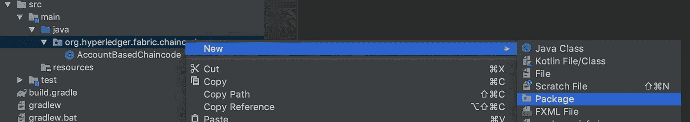***

***调用**包*型号*包**，然后 OK:***

***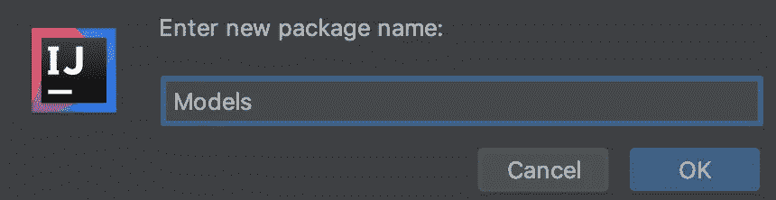***

***Package “Models”***

***现在您应该有以下内容:***

***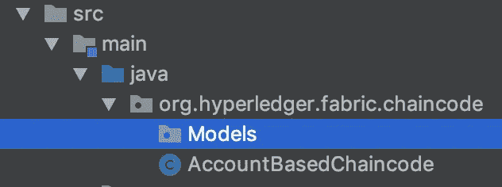***

***在 ***Models*** 包下，新建一个 Java 类，命名为 ***Wallet*** 。(这次不展示详细步骤，大家自己试试)***

***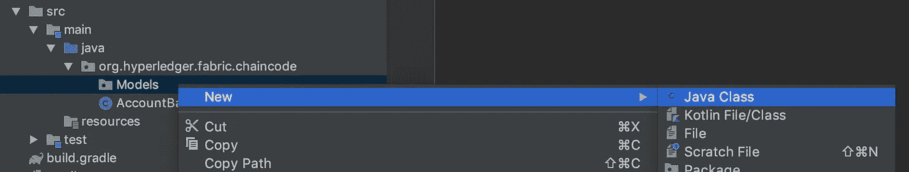***

***Creating ***Wallet*** *class under* **Models** package***

***现在我们代码为 ***钱包*** 类，让我们键入:***

***Wallet.java***

***钱包有一个 ***钱包 id*** 来标识某个钱包，还有一个 ***代币金额*** 来指定钱包拥有多少代币。***

> ***注意，在生产情况下，Wallet 类应该(远)更复杂。例如，对于 tokenAmount，您可能使用“BigDecimal”数据类型而不是“Double”。此外，在我们的案例中，我们在整个交易系统中仅支持一种令牌类型(即，仅一种货币)。***

## ***步骤 4 —链码类***

> *****请注意，与上一个教程相比，本教程中有两个新函数——query()和 getWalletsWithTokenAmountGreaterThan()。我在上面放了一些评论。*****
> 
> ***请注意，在生产情况下，代码应该与我的不同。这些代码主要用于演示或教程目的。***

## ***步骤 5 —在 BYFN 中运行链代码***

## ***5.1 安装先决条件***

***在本教程中，我们使用 Hyperledger Fabric v1.4 版。***

***首先，您可以按照官方说明安装先决条件:***

1.  ***[安装先决条件](https://hyperledger-fabric.readthedocs.io/en/release-1.4/prereqs.html#prerequisites)***
2.  ***[从 Hyperledger Fabric 安装示例、程序和 docker 映像](https://hyperledger-fabric.readthedocs.io/en/release-1.4/install.html)***

## ***5.2 链码准备***

***然后，让我们切换到这个目录(*假设您完成了先决条件部分，您应该有所有需要的文件和目录):***

```
***cd fabric-samples/chaincode/chaincode_example02/
mv java java_01
mkdir java***
```

***现在，将项目目录中下面的 ***高亮显示的*** 文件复制到***" fabric-samples/chain code/chain code _ example 02/Java/"***:***

***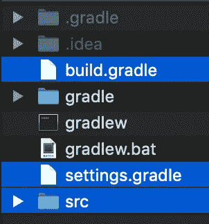***

***Copy the highlighted files to ***”fabric-samples/chaincode/chaincode_example02/java/”******

## ***5.3 调出网络***

```
***cd ../..**/**first**-**network
./byfn.sh up -l java **-s couchdb*****
```

> *****注意，这一次，有一个“-s couchdb”来启用 couchdb。*****
> 
> ***运行此脚本后，您可能需要等待一会儿…***
> 
> ********如果您看到以下错误(而不是其他错误)，没关系，只需继续下一步********

*****Allowable** error in our tutorial***

> ***另外，在运行上面的命令之前，记得启动 Docker。***
> 
> ****万一你做错了什么，你可以运行下面的命令来关闭网络，并重新启动:***
> 
> ***。/byfn.sh 向下
> 。/byfn.sh up -l java -s couchdb***

***现在，我们测试我们的链码是否工作。***

## ***5.4 访问 Cli***

***有一个 cli Docker 容器是自动创建的，它是一个命令行界面 ***控制节点*** 。***

***让我们进入命令行界面:***

```
***docker exec -it cli bash***
```

***然后，设置一些程序使用的 ***环境变量*** :***

```
***export CHANNEL_NAME=mychannel
export CORE_PEER_MSPCONFIGPATH=/opt/gopath/src/github.com/hyperledger/fabric/peer/crypto/peerOrganizations/org1.example.com/users/Admin@org1.example.com/msp
export CORE_PEER_ADDRESS=peer0.org1.example.com:7051
export CORE_PEER_LOCALMSPID="Org1MSP"
export CORE_PEER_TLS_ROOTCERT_FILE=/opt/gopath/src/github.com/hyperledger/fabric/peer/crypto/peerOrganizations/org1.example.com/peers/peer0.org1.example.com/tls/ca.crt***
```

> ***你可以把它们都复制下来，然后粘贴到你的终端上，按下“回车”键。***
> 
> ***这些环境变量用于让一些 Hyperledger 结构程序知道我们需要使用**peer0.org1.example.com:7051**来调用链码函数。***

***现在，我们用钱包 id***【Tom】***和***【Sam】***创建两个钱包 :***

```
***peer chaincode invoke -o orderer.example.com:7050 --tls true --cafile /opt/gopath/src/github.com/hyperledger/fabric/peer/crypto/ordererOrganizations/example.com/orderers/orderer.example.com/msp/tlscacerts/tlsca.example.com-cert.pem -C $CHANNEL_NAME -n mycc --peerAddresses peer0.org1.example.com:7051 --tlsRootCertFiles /opt/gopath/src/github.com/hyperledger/fabric/peer/crypto/peerOrganizations/org1.example.com/peers/peer0.org1.example.com/tls/ca.crt --peerAddresses peer0.org2.example.com:7051 --tlsRootCertFiles /opt/gopath/src/github.com/hyperledger/fabric/peer/crypto/peerOrganizations/org2.example.com/peers/peer0.org2.example.com/tls/ca.crt -c '{"Args":["createWallet","tom","**100**"]}'peer chaincode invoke -o orderer.example.com:7050 --tls true --cafile /opt/gopath/src/github.com/hyperledger/fabric/peer/crypto/ordererOrganizations/example.com/orderers/orderer.example.com/msp/tlscacerts/tlsca.example.com-cert.pem -C $CHANNEL_NAME -n mycc --peerAddresses peer0.org1.example.com:7051 --tlsRootCertFiles /opt/gopath/src/github.com/hyperledger/fabric/peer/crypto/peerOrganizations/org1.example.com/peers/peer0.org1.example.com/tls/ca.crt --peerAddresses peer0.org2.example.com:7051 --tlsRootCertFiles /opt/gopath/src/github.com/hyperledger/fabric/peer/crypto/peerOrganizations/org2.example.com/peers/peer0.org2.example.com/tls/ca.crt -c '{"Args":["createWallet","sam","**200**"]}'***
```

> ***注意，汤姆有 100 美元，萨姆有 200 美元。***
> 
> ***更新:请注意，我们有两个`*--peerAddresses*`来发送给两个对等方以签署交易，因为构建您的第一个网络(BYFN)中的默认签署策略是一个**和**策略，它要求组织 Org1 和 Org2 签署每个交易。更多解释，请参考[这里的](/@reasdom/hello-tommaso-7d10c5f48c9f)。***

***运行上面的每个命令后，您应该会在终端中看到类似这样的内容:***

***Success message from Chaincode***

***现在，我们 ***得到上面创建的两个钱包*** 来验证它们是否存在于区块链中:***

```
***peer chaincode query -C $CHANNEL_NAME -n mycc -c '{"Args":["getWallet","tom"]}'peer chaincode query -C $CHANNEL_NAME -n mycc -c '{"Args":["getWallet","sam"]}'***
```

***运行上面的每个命令后，您应该会在终端中看到类似这样的内容:***

***上面我们可以看到，之前创建的两个钱包都是可以查询的。还有，汤姆有 ***100 代币*** ，山姆有 ***200 代币*** 。***

***接下来，我们进行一个 ***转账*** 交易——让我们从“汤姆”的钱包 ***转账 50 个代币到“山姆”的钱包*** :***

```
***peer chaincode invoke -o orderer.example.com:7050 --tls true --cafile /opt/gopath/src/github.com/hyperledger/fabric/peer/crypto/ordererOrganizations/example.com/orderers/orderer.example.com/msp/tlscacerts/tlsca.example.com-cert.pem -C $CHANNEL_NAME -n mycc --peerAddresses peer0.org1.example.com:7051 --tlsRootCertFiles /opt/gopath/src/github.com/hyperledger/fabric/peer/crypto/peerOrganizations/org1.example.com/peers/peer0.org1.example.com/tls/ca.crt --peerAddresses peer0.org2.example.com:7051 --tlsRootCertFiles /opt/gopath/src/github.com/hyperledger/fabric/peer/crypto/peerOrganizations/org2.example.com/peers/peer0.org2.example.com/tls/ca.crt -c '{"Args":["transfer","tom","sam","**50**"]}'***
```

***最后，我们再来验证两个钱包:***

```
***peer chaincode query -C $CHANNEL_NAME -n mycc -c '{"Args":["getWallet","tom"]}'peer chaincode query -C $CHANNEL_NAME -n mycc -c '{"Args":["getWallet","sam"]}'***
```

***会有以下结果吗？***

***注意，现在 ***汤姆的钱包还剩 50 个代币，山姆的钱包有 250 个代币*** ， ***交易完成*** 并写入区块链账本。***

## ***测试 CouchDB 的新函数***

***现在，我们为这个 CouchDB 版本教程尝试我们的新函数。***

***请记住:***

*   ***汤姆现在有 50 美元***
*   ***萨姆现在有 250 美元***

***我们将尝试使用代币金额查询所有钱包:***

1.  ***> $40***
2.  ***> 200***

***在(1)中，我们应该能够得到汤姆和山姆的钱包。***

***在(2)中，我们应该只能获得 Sam 的钱包。***

***现在，让我们查询:***

```
***peer chaincode query -C $CHANNEL_NAME -n mycc -c '{"Args":["getWalletsWithTokenAmountGreaterThan","40"]}'peer chaincode query -C $CHANNEL_NAME -n mycc -c '{"Args":["getWalletsWithTokenAmountGreaterThan","200"]}'***
```

***会有以下结果吗？***

## ***第六步——清理***

```
***exit
./byfn.sh down***
```

***然后，删除目录***“fabric-samples/chain code/chain code _ example 02/Java”***并将目录***【Java _ 01】***重命名回***【Java】***。***

***谢谢！如果你喜欢我的故事， [**请关注我**](/@reasdom) **的新更新！*****

## ***参考***

***[](https://hyperledger-fabric.readthedocs.io/en/release-1.4/build_network.html) [## 构建您的第一个网络— hyperledger-fabricdocs 主文档

### 编辑描述

hyperledger-fabric . readthedocs . io](https://hyperledger-fabric.readthedocs.io/en/release-1.4/build_network.html) 

> [直接在您的收件箱中获得最佳软件交易](https://coincodecap.com/?utm_source=coinmonks)

[](https://coincodecap.com/?utm_source=coinmonks)***