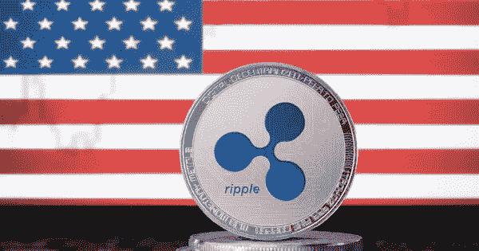

# SEC 对 Ripple 的诉讼会影响美国的霸权吗？

> 原文：<https://medium.com/coinmonks/could-the-secs-lawsuit-against-ripple-affect-u-s-hegemony-825c906ecdea?source=collection_archive---------3----------------------->

**Copyright:** [ivaleksey](https://www.bigstockphoto.com/search/?contributor=ivaleksey)

我知道这是不可避免的，尽管如此，我还是太迟钝了。

一个多月前，阿姆斯特丹市议会联合投票决定驱逐红灯区臭名昭著的妓院。游客们的行为让当地人集体想砍掉他们的非官方商标。这是一项已经进行了…