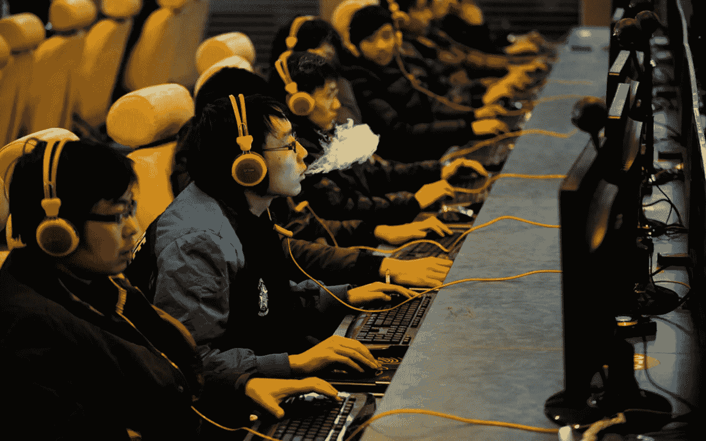
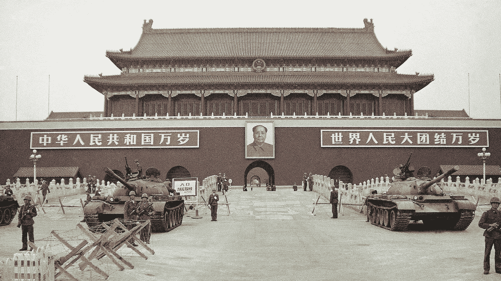

# 各国打击电子游戏&这对加密货币意味着什么

> 原文：<https://medium.com/coinmonks/countries-cracking-down-on-video-games-what-that-could-mean-for-cryptocurrencies-78e98b68b61f?source=collection_archive---------8----------------------->

What you do when C-Span is unavailable in your market.

下次有人漫不经心地说加密货币不是“真钱”,因为没人会用真钱购买数字商品时，问问他们是否玩过极易上瘾的手机游戏《部落冲突》( Clash of Clans)或其他任何一款非常受欢迎的手机游戏。在《部落冲突》中，500 颗宝石的起价低至[2.60 美元，但从那以后可能会变得更加疯狂。然而，玩家不仅乐于为虚拟物品支付现金，至少在《部落冲突》中，他们每天支付的金额高达 150 万美元，这让这家总部位于赫尔辛基的公司变得异常富有。开发商到底打算把这些真金白银花在什么地方呢？更好的冰库？中国是世界上最大的视频游戏市场，游戏上瘾的本质在这里表现得最为明显。但是，就像中国人花血汗钱买虚拟盔甲一样，中国政府一直在努力限制它认为对中国社会的高度恶意影响。](http://uk.businessinsider.com/saudi-player-spends-1-million-in-clash-of-clans-2015-10/?IR=T)

今年早些时候，中国当局限制了新游戏的审批(没错，游戏实际上需要在中国得到“批准”)，10 月份，新游戏被完全叫停。自然，腾讯的股票，其收入严重依赖游戏，自年初以来下跌了 28%。但是，不仅仅是中国在游戏方面有所收敛，就连日本和韩国等自由民主国家也通过了法律，旨在监管当局眼中的电子游戏行业，该行业的产品令人上瘾且有害。也许这是东亚的事情，但这些国家也是人均吸烟人数最多的国家。虽然这些国家的政府非常满足于允许吸烟继续存在，但他们似乎有意限制视频游戏对其人口的影响。

一个原因无疑是经济上的。玩家愿意为虚拟商品支付真金白银，这一点现在几乎没有争议。从开发者的角度来看，没有什么比生产额外的虚拟商品或人为限制其供应的边际成本为零更好的了。但中国、日本和韩国监管机构的取缔只会将游戏开发商和游戏玩家推向一种价值转移的形式，这种形式无论如何都会绕过政府批准的支付网关——加密货币。中国、日本和韩国恰巧也是世界上最大的三个加密货币市场。

已经有很多论坛可以将数字商品兑换成数字货币，不管游戏开发商是否批准。政府出于上瘾的性质而限制或约束游戏标题的监管推动与使大麻非法的推动是相同的——这一举措后来被美国的几个州收回。玩游戏并不能解决问题，教育才是。因为将游戏世界转入地下只会让监管变得更加困难——类似于加密货币。正如中国的例子所见证的那样，中国对加密货币交易所和 ico(首次发行硬币)的禁令只不过是将它们推向了离岸和地下，这一针对游戏(比加密货币更容易上瘾)的举措也将起到同样的作用。

All your bases are belong to us.

因此，许多早期采用加密货币的人也是游戏玩家也就不足为奇了。因为为虚拟商品支付法定货币的概念并不是凭空想象，许多人已经这样做了一段时间。但对于加密货币，使用数字货币在现实世界中购买商品的前景——许多人失去了理智，这是导致去年下半年和今年年初加密货币效用和预期之间不匹配的原因。至少对我来说，在视频游戏中使用加密货币的理由很明显。至少目前，加密货币仍然可以兑换为法定货币(如果需要的话)，至少这将使游戏公司可以选择位于更有利的管辖区，同时保持稳定的收入流，加密或其他方式。从玩家的角度来看，在休闲活动中，它也提供了一定程度的匿名性，因为如果有人想花钱玩视频游戏，这又是谁的事呢？它还为虚拟商品提供了一个更加活跃的二级市场，无论这些虚拟商品是由有进取心的游戏玩家或服务提供商赚取或创造的，以及在这些市场中为自己的利润进行交易的机会——这样一来，娱乐和商业之间的界限就变得不那么清晰了——为什么游戏玩家不应该为他们花在游戏上的时间获得经济报酬呢？虽然至少在目前，游戏开发商可能满足于在现状下工作，但监管机构的强硬路线只会将开发商推向阴影，并带来加密货币——使他们比以往任何时候都更难监管。

> [在您的收件箱中直接获得最佳软件交易](https://coincodecap.com/?utm_source=coinmonks)

