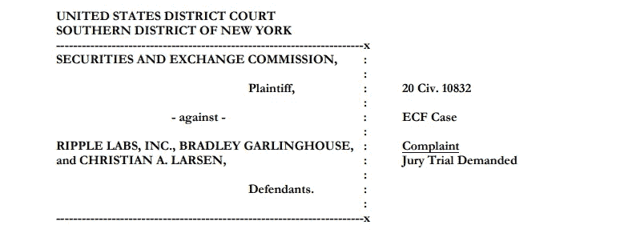

# 法院驳回证券交易委员会要求 Ripple 首席执行官个人银行记录

> 原文：<https://medium.com/coinmonks/court-rejects-sec-request-for-ripple-ceo-personal-bank-records-eed5077d66d6?source=collection_archive---------7----------------------->

## SEC 诉 Ripple Labs，Inc .案的律师解释，2021 U.S. Dist。词汇 69563

在我做研究之前，我从来不是最受欢迎的人。我通常会关注那些真正意义上具有分散成分的硬币。XRP 的价格在疫情期间波动很大，但在 2020 年 12 月 22 日由美国证券交易委员会提起的诉讼中被压低。我承认，说到 XRP，我的手不是钻石。然而，我惊喜地看到，随着 XRP 价格在过去几周重新回到高点，它也重新回到了对话中。我对 Ripple 看法最大的变化？对我来说，这是他们对抗美国证券交易委员会的方式，而不是躺着接受指控。我总是支持弱者。我认为现在任何参与加密货币的人都有点像失败者。当 Ripple 在美国证券交易委员会宣布对他们提起诉讼，并表示他们将对指控进行抗辩后，我知道这场斗争会很激烈。这将很快成为一场世纪之战。让我们开始吧。

对于那些不了解 Ripple 的人来说:像比特币一样，XRP 是一种在自己的 XRP 账本上运行的本土资产。早在 2012 年，克里斯蒂安·拉森(Christian Larsen)和其他开发者就首次设计了这款账本。在创建分类账后，Larsen 和其他开发者创建了 Ripple Labs 公司，并创造了 1000 亿 XRP 硬币的固定供应。在建立分类账后，800 亿 XRP 硬币被送到 Ripple，90 亿硬币送到 Larsen。布拉德·加林豪斯于 2015 年正式加入该公司，担任 Ripple 的首席执行官，他也获得了 3.5 亿 XRP 币。

**对于那些不了解 SEC 指控的人:**根据 SEC 提起的诉讼，加林豪斯和拉森一直非法向公众出售他们的大部分 XRP 硬币，以换取数百万美元。根据法院的裁决，拉森从出售 XRP 硬币中净赚了大约 4.5 亿美元，而加林豪斯则净赚了 1.59 亿美元。SEC 指控加林豪斯和拉森违反的法律是《证券法》第 5(a)和 5(c)条。该法律要求，每当证券发行人、其控制人或关联公司向公众提供或出售证券时，证券必须首先通过 SEC 登记，除非满足豁免条件。尽管 Ripple 认为 XRP 不是一种证券，但 SEC 声称，因为 XRP 是一种投资合约，所以它是一种证券。因此，美国证券交易委员会声称，Ripple 向公众提供并出售他们的 XRP，而没有首先在美国证券交易委员会注册硬币，违反了法律。这场官司最终归结到 XRP 是否是一个投资合同。如果是，那么 XRP 被认为是一个安全和涟漪违反了法律。如果不是，那就不是证券，也没有违反法律。就这么简单。进入*证券交易委员会诉 W.J .豪伊公司案* (1946) 328 U.S. 293，298-99，认为这是一个“投资合同”。。。指一份合同、一项交易或一项计划，通过该合同、交易或计划，一个人将其资金投资于一个共同的企业，并被引导从发起人或第三方的努力中期望利润**。。."这在法律上通常被称为*豪威*测试。我加粗了 soley 这个词，因为即使这样，在随后的案件中，法院也会提起诉讼。在 SEC 诉 Agua-Sonic 产品公司案(1982 年《联邦判例汇编》第 2 集第 687 卷第 577 页，第 582 页)中，最高法院认为，不能仅仅从字面上解释，而应根据被指控的计划的全部情况和经济现实来解释。在 G . len-Arden 商品有限公司诉康斯坦丁诺一案中,( 1974) 493，F.2d 1027，1034，很好地总结了这一检验标准，即“问题因此变成了是否”。。。根据经济现实和总体情况。。。顾客们正在进行投资。。。.").**

我将分析我预计这场诉讼最终将如何解决，并进一步深入分析，但本文的范围是解决这一过程中的各种发展，特别是 2021 年 4 月 9 日的发现证据裁决:

提起民事诉讼时，当事人索赔诉讼的关键阶段是发现新信息。这被称为“发现阶段”,双方可以互相提供信息，获取文件，并把他们所有的争论都摆到桌面上。从本质上说，这是一个双方在准备庭审时交换和讨论相关证据的阶段。它还允许当事人获得文件和信息，以便当律师命令一个人宣誓作证时，他们会得到面前的文件，让证人浏览信息。

作为诉讼的一部分，证交会向加林豪斯和拉森提出了提供八年个人财务记录的要求。通常情况下，当一方向诉讼的另一方提出发现请求时，该方有义务做出回应并提供相关记录。然而，加林豪斯和拉森认为这是一个不恰当的请求，并请求法院发布保护令，允许他们规避向证交会提供这些记录的义务。

作为一名诉讼律师，我可以告诉你，关于什么证据应该移交给对方的争议是法律战壕中的日常斗争。双方都强烈认为该信息受到保护或与即将到来的诉讼相关。因此，他们不得不不断地将争议提交法院，以就是否应该强迫他们提供这一点做出裁决。联邦法院有管辖这些争议的联邦民事诉讼规则(“FRCP”)。FRCP 第 26(b)条将信息限制为“与任何一方的索赔或辩护相关且与案件需要成比例的任何非特权事项。”当有争议时，寻求信息的一方有责任证明信息是相关的。

一方为防止信息披露而提出的一个常见反对意见是，该请求给他们*带来了*不必要的负担*。*在确定请求是否过于繁琐时，法院将考察其是否具有不合理的累积性/重复性；是否可以从其他更方便、负担更轻或更便宜的来源获得；如果它不在程序规则的范围之内。

在这个案例中，证交会要求加林豪斯和拉森提供过去 8 年的所有个人财务记录。想想你的个人交易记录。如果证券交易委员会调查的话会发现什么？杂货店收据，亚马逊购物，深夜塔可钟订单？证交会要求被告提供所有的财务记录，并辩称他们需要这些记录来确定报表上 XRP 的每一笔销售是否在出售前进行了登记。美国证券交易委员会声称，个人财务报表将显示加林豪斯和拉森是否向一个加密交易所存款，这将是“消除个别被告 XRP 交易匿名化的最简单和最可靠的方式”显然，加林豪斯和拉森辩称，他们已经提供了所有与 XPR 硬币销售和转让相关的交易记录，以及所有与他们从 Ripple 获得的报酬相关的记录。他们认为，证交会的信息要求寻求与诉讼完全无关的信息。我是辩护律师，所以我能理解他们的观点。布拉德·加林豪斯凌晨 1 点的塔可钟订单与指控有关吗？大概不会。

法院当然同意瑞波的观点。他们认定，加林豪斯和拉森提供的记录是完整的，而且证交会没有提供任何证据表明他们虚报记录或记录不充分。最高法院甚至斥责证券交易委员会说，“事实上，这一案件正处于开始阶段，证券交易委员会急于送达请求和传票，寻求已经承诺的记录的复制信息，充其量是不成熟的。”

证券交易委员会向法院提出了最后一个令人信服的论点，要求获得全部银行记录。他们认为可能是加林豪斯和拉森把他们的 XRP 从与银行账户关联的加密钱包转移到了幽灵加密钱包。然后，他们可以使用这些虚拟钱包来完成 XRP 的销售而不被发现，然后将收益存入他们的银行账户。因此，证交会辩称，个人财务记录对于查看任何存款、金额和存款地点的名称是必要的。

法院不愿意考虑证券交易委员会的阴谋论。

首先，法院认定，包括所有银行记录的一个问题是，即使它确实显示了某一天某一特定加密交易所的存款，比如说比特币基地，这也是 SEC 将获得的所有信息。他们将无法确定该交易是 XRP 出售、比特币出售、另一种加密货币出售的结果，甚至是他们比特币基地账户中的美元被提取的结果。除非比特币基地的交易包括实际的 XRP 钱包地址，否则 SEC 无法区分它是来自已知的 XRP 钱包还是幻影钱包。比特币基地交易也不允许 SEC 区分银行账户的存款是一笔还是多笔 XRP 交易的结果。

第二，法院发现，由于证交会没有出示证据证明加林豪斯和拉森参与了一项秘密交易计划，证交会偏执地认为个人记录*可能*显示了*可能发生或可能不发生*的粗略交易的证据，这并不是允许证交会深入调查他们个人财务记录的理由。甚至在 SEC 辩称在 *SEC 诉 Telegram 案中，*(2020)℞。19-CV-09439，ECF 第 67 号(s . d . n . y . 2020 年 1 月 13 日),公司银行记录可能与显示被告个人资助促进合理利润预期的努力有关，Garlinghouse 和 Larsen 没有试图隐藏相关记录，SEC 寻求的记录在本质上完全是个人的。

最后，美国证券交易委员会向法院恳求说，为了让他们向陪审团证明加林豪斯和拉森有动机帮助和教唆瑞普出售未注册证券，他们需要证明他们收入的一部分来自出售未注册证券。然而，法院没有被说服。美国证券交易委员会声称，加林豪斯和拉森通过出售他们的 XRP 赚了 5 亿美元。不管这笔钱是否代表了他们 5%的财富中的 95%,它都是足够的动机。

最终，法院做出了有利于加林豪斯和拉森的裁决。它认定，证交会要求披露他们除 XRP 交易以外的个人财务记录，与诉讼无关或不成比例。法院命令证券交易委员会撤回这一请求，并警告 Ripple，如果发现他们没有提供完整的 XRP 交易，证券交易委员会可以向法院重新提出请求。

**结论:**这个案子正在发展成一场激烈的斗争，而且这场斗争还远没有结束。诉讼律师梦寐以求的对决。在一场 12 回合的比赛中，这相当于第二轮或第三轮右钩拳，击中 SEC 的下巴，导致其腿从下面抖动。这绝不是击倒，但值得注意。无论你在这场战斗中为谁欢呼，无论你是 Ripple 陆军将军还是 SEC 粉丝，赌注都很高，所有人都在关注 SEC 与 Ripple 的对决。当我写这篇文章时，事情仍在升温。截至 2021 年 4 月 26 日，美国证券交易委员会提出了一项新的动议，以驳回 Ripple 的辩护，即他们缺乏正当程序和美国证券交易委员会的公平通知，即 XRP 代币可以被视为一种证券。我会关注这场战斗的每一个阶段，并且会继续为大家更新我的进展。敬请期待！