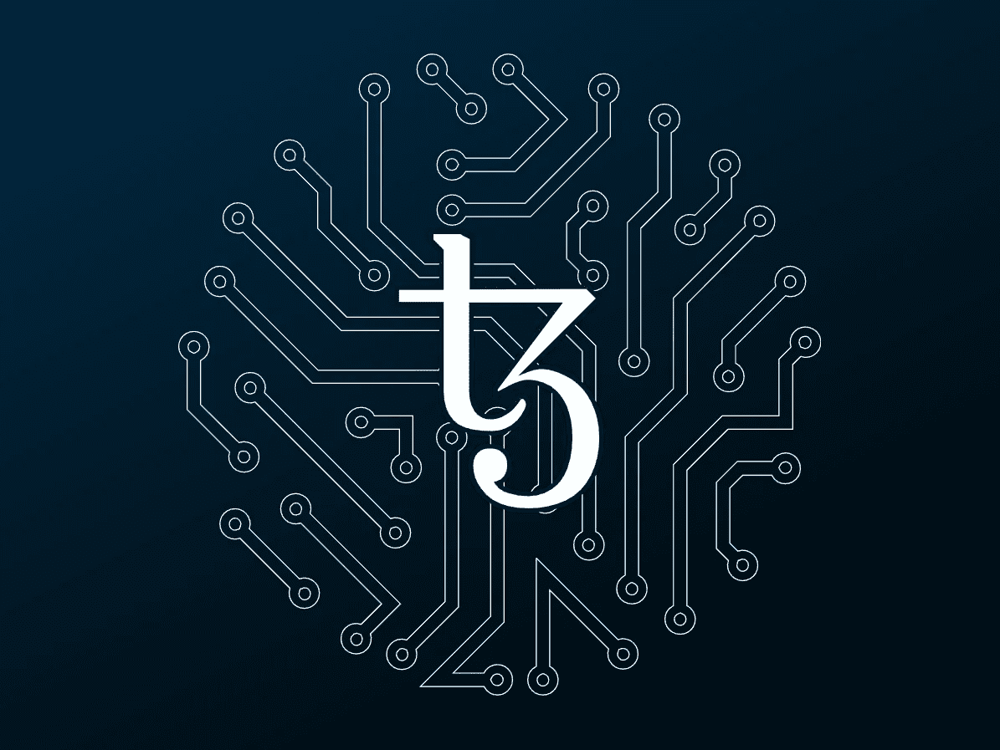
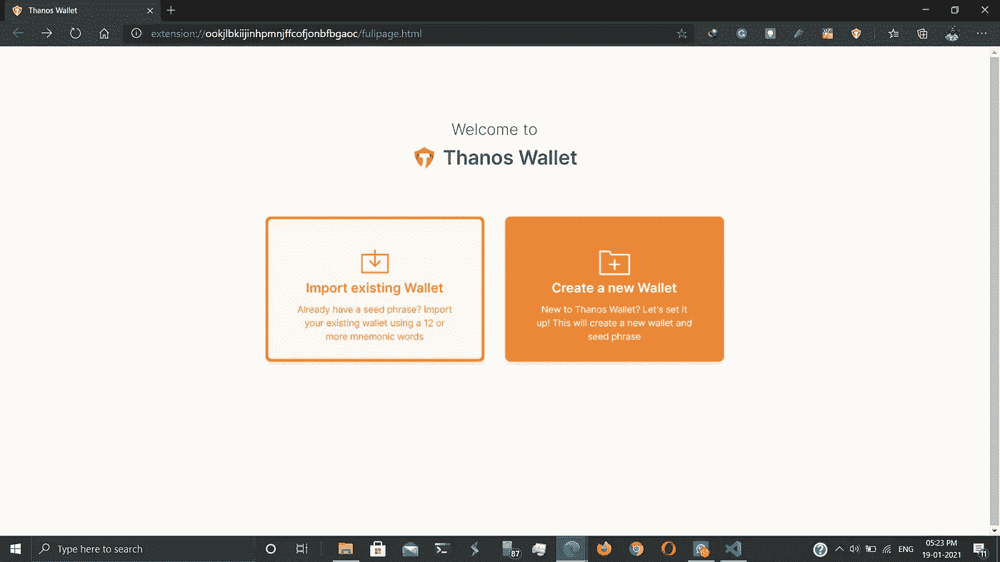
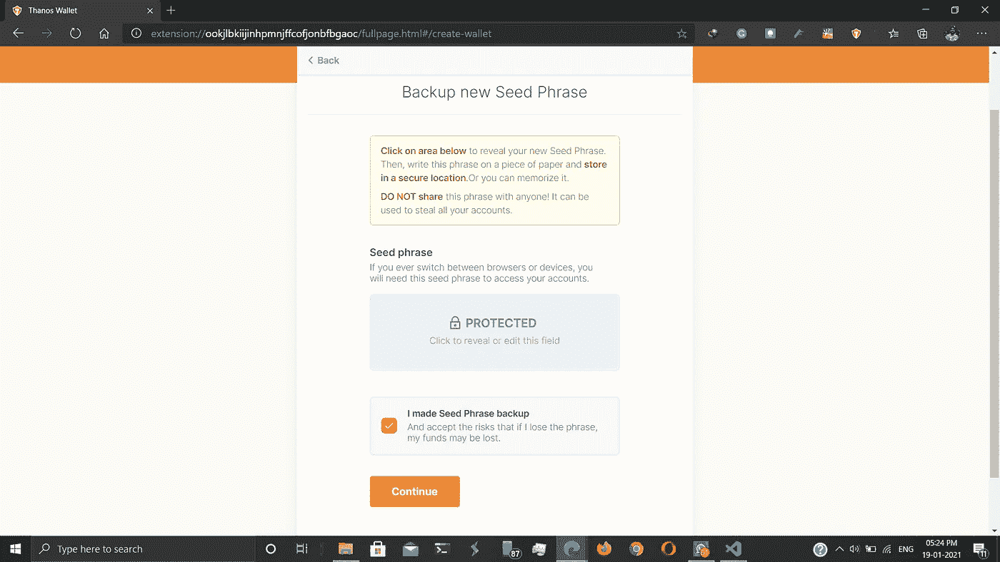
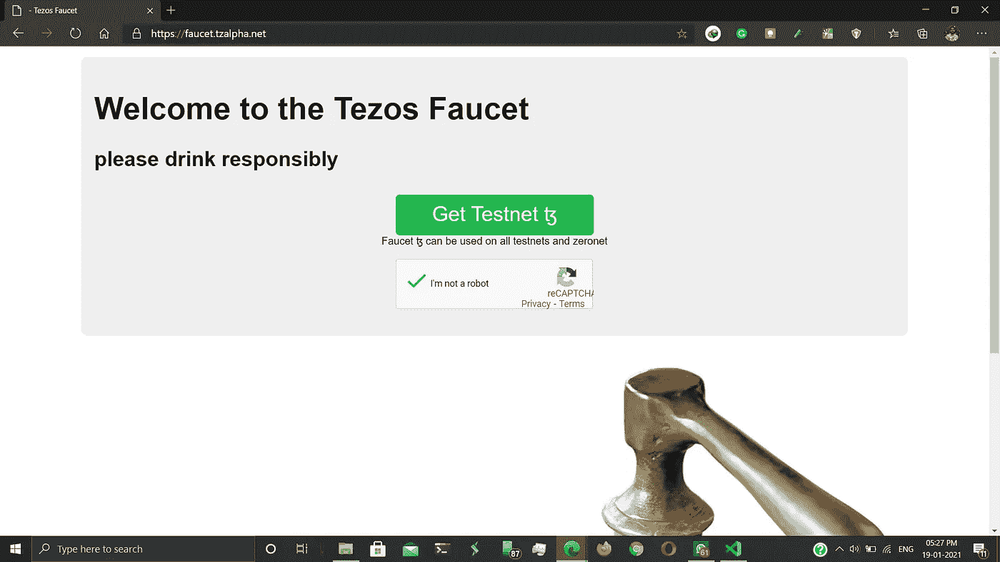
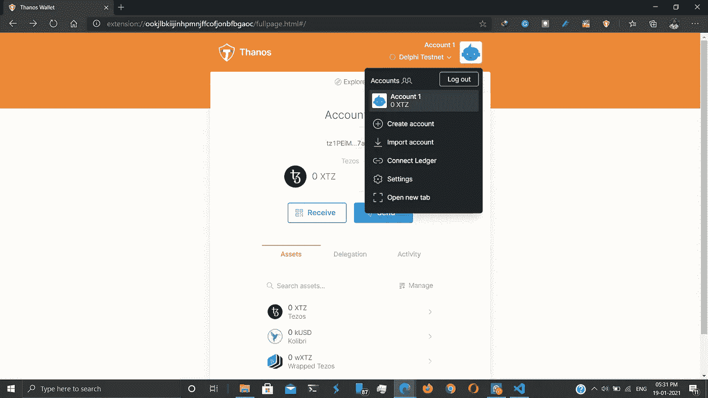
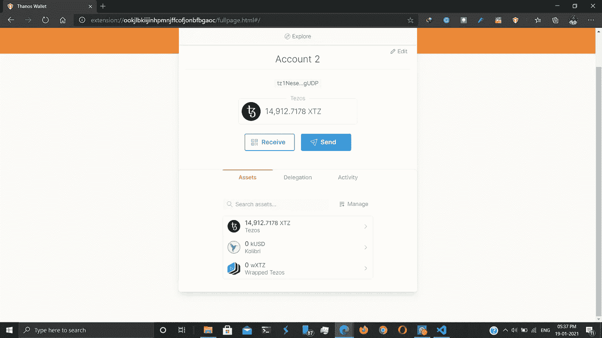

# 采用 Tezos 区块链的 CoviDapp

> 原文：<https://medium.com/coinmonks/covidapp-with-tezos-blockchain-80d89fba88db?source=collection_archive---------3----------------------->

Tezos 是一个去中心化的开源区块链网络，可以执行点对点交易，并作为部署智能合约的平台。

CoviDapp 是我们首次尝试在区块链开发新冠肺炎疫苗的无腐败分销系统。该 Dapp 的特点是:

*   疫苗的分发可以采用系统的自上而下的方法。
*   有紧急病例/病例激增的医院/州可以直接向上级机构提交更多疫苗的请求，他们的请求将得到高级官员的优先考虑，即医院的请求对州政府官员来说具有更高的优先级。
*   众所周知，在区块链中，每一笔交易都会被追踪，所以通过中央政府进入供应链的所有疫苗都会被追踪到接收疫苗的医院，因此当局之间没有腐败的机会。
*   特定哈希地址的所有交易都可以公开给所有人，让纳税人看到他们的税款被投资到了哪里。

让我们进入建筑部分！

## 安装灭霸钱包:

1.  我们的第一步将是安装灭霸钱包扩展。你可以从[这里](https://thanoswallet.com/download)得到。
2.  安装后，创建一个新的钱包。

3.出于将来使用的目的，请备份您的种子短语，然后继续。

4.现在去 [Tezos 水龙头](https://faucet.tzalpha.net/)获取一个 Testnet 账号，用灭霸钱包测试 Dapp，并下载 JSON 文件。

5.选择导入帐户并上传水龙头文件。

确认后，你将在德尔福测试网账户收到一定数量的 XTZ。

现在我们已经准备好构建 CoviDapp 了！

# 建立 Dapp

为了建立 Dapp，我们首先需要智能合约。智能合约有助于为交易设计定制协议。Tezos 智能合约是基于[迈克尔逊语言](https://www.michelson-lang.com/)的，对于初学者来说，入门真的很难。因此，为了解决这个问题，有一个基于 Python 的库专门用来设计迈克尔逊合同。它有好的[文档](https://smartpy.io/reference.html/)。此外，SmartPy 带有一个基于 web 的 IDE，所以你不需要在本地系统中安装任何东西。由于我们正在设计一个新冠肺炎分销系统，我们需要制定三份不同的合同，一份是中央政府的，一份是州政府的&一份是医院的。

所有代码都可以在我的 CoviDapp GitHub 库中找到。

 [## sukesh2000/coviDapp

### 在 GitHub 上创建一个帐户，为 sukesh2000/coviDapp 的开发做出贡献。

github.com](https://github.com/sukesh2000/coviDapp) 

## 为中央政府设计合同:

合同中有三个主要切入点，

1.  为了存储来自州政府的请求，这个入口点将由州政府触发。

2.改变疫苗数量。

3.为了转移疫苗，该进入点将触发州政府合同中的另一个进入点，该进入点将自动更新州政府可用的疫苗数量。

## 为州政府设计合同:

在州政府的合同中，有四个主要的切入点，

1.  用于更新疫苗数量。这将由中央政府引发。

2.为了从中央政府请求疫苗，这个切入点将触发中央政府合同中的另一个切入点。

3.为了存储医院的请求，这个入口点将由医院触发。

4.把疫苗转移到医院。

## 为医院设计合同:

在医院的合同中，会有两个主要的切入点。

1.  向州政府申请疫苗。

2.用于更新疫苗数量。

现在我们已经完成了疫苗分销合同的设计！

# 部署 Dapp

为了部署 Dapp，我们首先需要生成 Michelson 契约，这可以从 SmartPy IDE 本身完成，然后在 Delphi Testnet 中部署生成的契约。一旦部署了合同，我们的下一步是创建一个 React 应用程序，用于在 web 服务器上部署 Dapp。因为所有的 Javascript 文件都包含几乎相似的代码，所以我只对州政府的网站进行解释。要开发 React 应用程序，你需要主图书馆，塔基多和灭霸钱包。

1.  首先，我们需要创建一个 config.json 文件，其中包含合同的配置细节。用生成的协定的协定地址更新 config.json 文件。

2.现在，我们需要创建一个 JavaScript 文件，用于通过 Dapp 连接到本地的灭霸钱包。

3.一个 Javascript 文件，将用于与合同交互并触发入口点。

4.州政府医院将使用客户端应用程序与 Dapp 进行交互。相同的代码可以在这里找到。

 [## sukesh2000/coviDapp

### 在 GitHub 上创建一个帐户，为 sukesh2000/coviDapp 的开发做出贡献。

github.com](https://github.com/sukesh2000/coviDapp/blob/main/src/StateGov.js) 

可以重复类似的过程来为中央政府和医院开发 React 应用程序。

**万岁，我们已经完成了 Dapp 的开发，它可以用来记录正在分发的疫苗的详细信息！！！**

此外，如果您想显示中央政府、州政府和医院之间发生的交易的细节，您可以使用 TZKT API。

 [## TzKT API 文档

### TzKT API 是一个可靠的 Tezos API，用于访问详细的 Tezos 区块链数据:块，帐户，操作，烘焙…

api.tzkt.io](https://api.tzkt.io/) 

相同的代码可以在我的知识库中找到。

 [## sukesh2000/coviDapp

### 在 GitHub 上创建一个帐户，为 sukesh2000/coviDapp 的开发做出贡献。

github.com](https://github.com/sukesh2000/coviDapp/tree/gh-pages) 

这个项目是我在 [Python 周黑客马拉松](https://thepythonweek.tech/)期间创建的。

特别感谢 [Tezos India Foundation](https://tezosindia.foundation/) 和 [GD Soumya，Tezos India](https://www.linkedin.com/in/gdsoumya/) 的区块链开发实习生，帮助我们开发这个 Dapp。

项目贡献者:

 [## 印度贾坎德邦 arnab Deep-East Singhbhum |职业简介| LinkedIn

### 嘿，阿纳精通 HTML、CSS 和普通 JS。他用 Flask 构建了基于 web 的项目，并学习了…

www.linkedin.com](https://www.linkedin.com/in/arnabdeep/)  [## Sukesh Seth -飞行系统工程师-学生直升机研究组织| LinkedIn

### 嗨，我是一名快毕业的学生，是一名热情的学习者，对 Linux、深度学习、计算机…

www.linkedin.com](https://www.linkedin.com/in/sukeshseth) 

> 加入 Coinmonks [Telegram group](https://t.me/joinchat/EPmjKpNYwRMsBI4p) 学习加密交易和投资

## 另外，阅读

*   [什么是融资融券交易](https://blog.coincodecap.com/margin-trading)
*   最好的[密码交易机器人](/coinmonks/crypto-trading-bot-c2ffce8acb2a) | [网格交易](https://blog.coincodecap.com/grid-trading)
*   [3 商业评论](/coinmonks/3commas-review-an-excellent-crypto-trading-bot-2020-1313a58bec92) | [Pionex 评论](/coinmonks/pionex-review-exchange-with-crypto-trading-bot-1e459d0191ea) | [Coinrule 评论](/coinmonks/coinrule-review-2021-a-beginner-friendly-crypto-trading-bot-daf0504848ba)
*   [AAX 交易所评论](/coinmonks/aax-exchange-review-2021-67c5ea09330c) | [德里比特评论](/coinmonks/deribit-review-options-fees-apis-and-testnet-2ca16c4bbdb2) | [FTX 交易所评论](/coinmonks/ftx-crypto-exchange-review-53664ac1198f)
*   [n 零复习](/coinmonks/ngrave-zero-review-c465cf8307fc) | [Phemex 复习](/coinmonks/phemex-review-4cfba0b49e28) | [PrimeXBT 复习](/coinmonks/primexbt-review-88e0815be858)
*   [Bybit 交易所评论](/coinmonks/bybit-exchange-review-dbd570019b71) | [Bityard 评论](/coinmonks/bityard-review-7d104239be35) | [CoinSpot 评论](https://blog.coincodecap.com/coinspot-review)
*   [3 commas vs crypto hopper](/coinmonks/3commas-vs-pionex-vs-cryptohopper-best-crypto-bot-6a98d2baa203)|[赚取加密利息](/coinmonks/earn-crypto-interest-b10b810fdda3)
*   最好的比特币[硬件钱包](/coinmonks/the-best-cryptocurrency-hardware-wallets-of-2020-e28b1c124069?source=friends_link&sk=324dd9ff8556ab578d71e7ad7658ad7c) | [BitBox02 回顾](/coinmonks/bitbox02-review-your-swiss-bitcoin-hardware-wallet-c36c88fff29)
*   [总帐 vs n 平均](/coinmonks/ledger-vs-ngrave-zero-7e40f0c1d694) | [总帐 nano s vs x](/coinmonks/ledger-nano-s-vs-x-battery-hardware-price-storage-59a6663fe3b0)
*   [密码本交易平台](/coinmonks/top-10-crypto-copy-trading-platforms-for-beginners-d0c37c7d698c)
*   [优霍德勒评论](/coinmonks/youhodler-4-easy-ways-to-make-money-98969b9689f2) | [区块链评论](/coinmonks/blockfi-review-53096053c097)
*   最好的[加密税务软件](/coinmonks/best-crypto-tax-tool-for-my-money-72d4b430816b) | [硬币追踪评论](/coinmonks/cointracking-review-a-reliable-cryptocurrency-tax-software-5114e3eb5737)
*   最佳[加密借贷平台](/coinmonks/top-5-crypto-lending-platforms-in-2020-that-you-need-to-know-a1b675cec3fa) | [杠杆令牌](/coinmonks/leveraged-token-3f5257808b22)
*   [block fi vs Celsius](/coinmonks/blockfi-vs-celsius-vs-hodlnaut-8a1cc8c26630)|[Hodlnaut Review](/coinmonks/hodlnaut-review-best-way-to-hodl-is-to-earn-interest-on-your-bitcoin-6658a8c19edf)
*   [Bitsgap 审查](/coinmonks/bitsgap-review-a-crypto-trading-bot-that-makes-easy-money-a5d88a336df2) | [Quadency 审查](/coinmonks/quadency-review-a-crypto-trading-automation-platform-3068eaa374e1) | [Bitbns 审查](/coinmonks/bitbns-review-38256a07e161)
*   [埃利帕尔泰坦评论](/coinmonks/ellipal-titan-review-85e9071dd029) | [塞克斯斯通评论](/coinmonks/secux-stone-hardware-wallet-review-15-discount-coupon-2020-7577032faa6e)
*   [本地比特币审核](/coinmonks/localbitcoins-review-6cc001c6ed56) | [加密货币储蓄账户](https://blog.coincodecap.com/cryptocurrency-savings-accounts)
*   最佳[区块链分析](https://bitquery.io/blog/best-blockchain-analysis-tools-and-software)工具| [赚比特币](/coinmonks/earn-bitcoin-6e8bd3c592d9)
*   [加密套利](/coinmonks/crypto-arbitrage-guide-how-to-make-money-as-a-beginner-62bfe5c868f6)指南| [如何做空比特币](/coinmonks/how-to-short-bitcoin-568a2d0b4ae5)
*   最佳[加密制图工具](/coinmonks/what-are-the-best-charting-platforms-for-cryptocurrency-trading-85aade584d80) | [最佳加密交易所](/coinmonks/crypto-exchange-dd2f9d6f3769)
*   [如何在印度购买比特币？](/coinmonks/buy-bitcoin-in-india-feb50ddfef94) | [瓦济克斯审查](/coinmonks/wazirx-review-5c811b074f5b)
*   [印度比特币交易所](/coinmonks/bitcoin-exchange-in-india-7f1fe79715c9) | [比特币储蓄账户](/coinmonks/bitcoin-savings-account-e65b13f92451)
*   [CoinDCX 评论](/coinmonks/coindcx-review-8444db3621a2) | [加密保证金交易交易所](https://blog.coincodecap.com/crypto-margin-trading-exchanges)

> [直接在您的收件箱中获得最佳软件交易](/coinmonks/newsletters/coinmonks)

