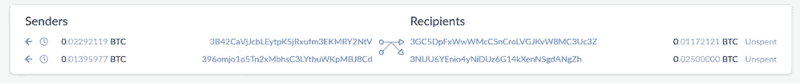

# 破解工资连接

> 原文：<https://medium.com/coinmonks/cracking-the-payjoin-1cbfb375cbee?source=collection_archive---------5----------------------->

如果你对比特币隐私空间感兴趣有一段时间了，你可能听说过 PayJoin，这是 BTC 最新、最热门的隐私技术。它有时被誉为比特币隐私的救世主，但很快就会成为各地区块链取证公司的祸根。在这篇博文中，我希望成为黛比·唐纳(Debbie Downer ),并展示我认为通过一些基本的分析和逻辑，PayJoin 提供的隐私可以被减轻

如果你不知道什么是工资联接，许多聪明人已经写了许多关于工资联接的外观和工作方式的文章。看看其中的一个:

*   大多数 PayJoin 实现都是根据 BIP78 规范构建的:
    [https://github . com/bit coin/bips/blob/master/bip-0078 . mediawiki](https://github.com/bitcoin/bips/blob/master/bip-0078.mediawiki)
*   深入探讨 Wasabi wallet nopara73 的联合创始人之一和创始人 https://nopara73.medium.com/pay-to-endpoint-56eb05d3cac6
    [的支付和一般交易混淆](https://nopara73.medium.com/pay-to-endpoint-56eb05d3cac6)
*   PayJoin 和 JoinMarket 的联合创始人 Adam Gibson 对 PayJoin 的出色探索:
    [https://joinmarket.me/blog/blog/payjoin/](https://joinmarket.me/blog/blog/payjoin/)

作为一个基本的提醒，PayJoin 与 CoinJoin 建立在相同的原则上，多方在一个交易中拥有输入和输出，只是这次加入的最大参与者数量是 2，其中一方必须向另一方付款。与 CoinJoin 相比，PayJoin 有一个巨大的优势，与 coin join 不同，pay join 在区块链上不容易被检测到。事实上，它们看起来就像常规的多输入多输出事务。

这种方案最有可能的实现是客户向商家付款。在这种情况下，商家向交易提交一个或多个 UTXO 作为输入，并拥有其中一个输出。重要的是，这模糊了客户已经支付给商家的支付金额。

以这个随机交易为例:

[https://blockchair.com/bitcoin/transaction/57f2fbb45b7d1fced586a3c1e55dac1069d3fca79a84f0cc1caf1abfd4f05e51](https://blockchair.com/bitcoin/transaction/57f2fbb45b7d1fced586a3c1e55dac1069d3fca79a84f0cc1caf1abfd4f05e51)

如果我们假设该交易是定期付款，则该交易通常可能的解释是:

1)发送者拥有两个输入和第一个输出(它的变化),接收者拥有第二个输出。这是基于“不必要的输入启发式规则”的最可能的解释，或者用更简单的英语说，“如果只支付 0.011 BTC 启发式规则，该交易将不需要两个输入”(同样，舍入输出显然是一个致命的泄露)。在这种解释中，支付金额为 0.025 BTC。

Where addresses marked in blue belong to the Sender and in green to the Receiver

2)发送者拥有输入和第二个输出(当它改变时),接收者拥有第一个输出。这种解释不太可能，因为它不遵循“不必要的输入启发式”，但它仍然是可能的，因为一些钱包优化得很差，会无缘无故地在交易中插入不必要的输入。本解释中的支付金额为 0.011722121 BTC。

Where addresses marked in blue belong to the Sender and in green to the Receiver

但是，如果我们将此交易解释为工资合并，则可能有另外两种同样可能的付款解释:

3)发送者拥有第一个输入，而接收者拥有第二个输入。在这种情况下，第一个输出必须由发送方拥有(就像他拥有第二个输出一样，他实际上已经获得了 BTC，这是不可能的，因为他是付款方)，而接收方拥有第二个输出。假设交易费用完全由发送方支付，支付金额为 0.01104023 BTC(接收方输出和输入之间的差额)。如果交易费由收款人部分或全部支付，支付金额可以低至 0.01088048 BTC。

Where addresses marked in blue belong to the Sender and in green to the Receiver

4)发送者拥有第二个输入，而接收者拥有第一个输入。在这种情况下，第二个输出必须由接收者拥有(因为如果发送者拥有它，他将再次赚钱)，这意味着第一个输出由发送者拥有。支付金额最高可达 0.00207881 BTC，最低可达 0.00191906，这取决于收款人支付了多少费用。

Where addresses marked in blue belong to the Sender and in green to the Receiver

因此，我们可以清楚地看到，这种交易成为 PayJoin 的可能性立即给交易增加了至少 2 个额外的解释，并模糊了支付金额。

目前，只有少数钱包和支付服务提供商实现了 Payjoins，最著名的是 BTCPay。可以在这里跟踪薪资加入的采用情况:
[https://en.bitcoin.it/wiki/PayJoin_adoption](https://en.bitcoin.it/wiki/PayJoin_adoption)

现在我们知道了 PayJoin 的基本情况，让我们讨论一下 PayJoin 上潜在的隐私攻击。我在网上找不到任何关于链上 PayJoin 去匿名化的技术，所以我不得不做一些我通常不做的事情…为自己考虑。这样做是非常危险的，因为你可能会犯错误，所以如果我的进一步思考包含任何错误，我道歉。

经过一番思考，我认为，如果我们定义一些 PayJoin 交易的基本规则，我们就可以得出减少 PayJoin 交易所提供的隐私的结论。

PayJoin 交易的基本规则如下:

*   规则 1 —在 PayJoin 交易中，至少有一项输入由接收方所有。
*   规则 2 —一个输出归发送方所有(发送方的变更)，另一个输出归接收方所有(接收方的变更+付款)。
*   规则 3——发送方必须向接收方付款。
*   规则 4——支付加入交易将只有 2 个输出

根据这些规则，我们可以对任何我们怀疑是 PayJoin 的交易得出一些明确的结论:

*   明确的假设 1-如果一个交易有多于或少于 2 个输出，则它不是一个支付联接，如果它正好有 2 个输出，则它可以是一个支付联接。
*   明确假设 2——发送方输出(变化)不能大于发送方输入之和。这是因为规则 3，发件人正在付款，他们不能获得 BTC。
*   明确假设 3 —支付金额可以通过以下公式之一计算:

    支付金额=接收方输出金额—接收方输入金额之和+接收方费用金额
    或
    支付金额=发送方输入金额之和—(发送方输出金额+发送方费用金额)

    假设基于所有 3 个规则
*   明确假设 4 —在具有 2 个以上输入的支付联结中，如果任何输入小于最小输出，您可以假设，如果它属于发送方，则它不是唯一的输入，或者它属于接收方。同样，规则 3 告诉我们，发送者正在付款，所以他们不能获得金钱，如果他们拥有的输入小于任一输出，并且只有该输入，他们将获得 BTC，无论他们拥有哪个输出
*   明确假设 5——如果一个 2 输入支付连接的一个输入小于两个输出，您可以自动知道该输入属于接收方。
*   明确假设 6——由于发送方输入的总和必须大于发送方输出(假设 2 ),如果所有输入金额减去最小输入的组合小于较大的输出，您可以立即假设在所有薪资联结解释中，该输出属于接收方(相反，较小的输出属于发送方)。

我认为这是最有害的假设。这就是为什么在我之前写的两个 PayJoin 事务解释中，输出所有权总是相同的原因:

这个假设也可以很好地扩展，以 PayJoin 交易为例:

[https://www.blockchain.com/btc/tx/7104bae698587b3e75563b7ea7a9aada41d9c787788bc2bf26dd201fd7eca8a2](https://www.blockchain.com/btc/tx/7104bae698587b3e75563b7ea7a9aada41d9c787788bc2bf26dd201fd7eca8a2)

由于该交易有 5 个输入，因此它可以有多达 20 个 PayJoin 解释，但在所有这些解释中，第一个输出属于发送方(变更)，第二个输出属于接收方(变更+付款)。

*   明确假设 7-如果输入的组合加起来比最大输出大，这意味着该组合将导致交易的 2 种解释(因为任一输出可能为发送方/接收方所有)。
*   明确的假设 8——根据这些公式可以很容易地计算出 PayJoin 交易的可行解释数:
    1。如果没有输入组合(不包括最小输入)加起来超过最大输出= x * x - x-y
    2。如果输入的一个或多个组合(不包括最小的输入)加起来大于最大输出= X * X-y+C
    T3 其中:
    X =输入的数量。
    Y =小于最小输出的输入数量。C =加起来超过最大输出的组合数量。

这些是我们可以从一些简单的关于工资支付交易的规则中得出的 8 个明确的假设。有了这些信息，我们在分析潜在的 PayJoin 交易时就可以更加成功。拥有足够编程技能的人可以创建一个程序，快速分析支付连接，帮助他们在区块链取证调查。类似于[KYCP.org 站点](https://kycp.org/#/3e00df65f1f95312aca24082a2ecbe32289d624f8536bd0acfb140d24388087d)的东西，告诉潜在的 PayJoin 将有多少种解释，谁可能或肯定拥有每个输出，以及任何输入是否肯定属于发送者/接收者。

通过允许不太安全的工资支付规则，并从这些额外的规则中建立新的假设，有可能进一步推动这些想法。这些启发式方法的几个例子是:

1.  接收者不可能提交一个以上的输入。
2.  接收者不太可能是交易费用的主要贡献者，如果他贡献了费用，也可能只贡献了覆盖其输入规模所需的量。

毫无疑问，有了这些额外的试探法，PayJoin 分析师可以进一步完善他们的分析，尽管这可能会有一点风险。

比特币维基百科的 PayJoin 页面自豪地宣称，pay join 有时被炒作为比特币隐私问题的解决方案:

> 如果支付加入交易得到适度使用，那么它将使共同投入所有权启发式在实践中完全有缺陷。

这个想法是，如果区块链上只有 10%或 20%的交易成为支付连接，这将使区块链取证最重要的启发式方法完全不可靠。

就我个人而言，我对此持怀疑态度，我认为更有可能的情况是，区块链取证公司将基于上述规则(或类似规则)创建简单的工具来分析潜在的 PayJoin 交易，并为他们提供交易的所有可能解释。

比特币维基还声称 PayJoin 交易“*无法检测，无法与任何常规比特币交易*区分开来”，尽管这在技术上是正确的，但我觉得这种说法应该带有几个星号，原因如下:

首先，薪资联接交易仅看起来与具有与薪资联接相同结构的 BTC 交易相同，也就是说，它们具有多个输入和两个输出，如果交易不遵循这种模式，则可以相当安全地假定它不是薪资联接。

此外，我认为，如果一项交易做了一些非常不符合薪资联接的事情，即使该交易的结构类似于薪资联接，也可能有相当多的迹象表明该交易不是薪资联接。例如，如果事务在输入和输出之间有地址重用。如果仔细研究 PayJoins BIP78 规范和 PayJoin 的可用实现，您可能会发现更多这样的迹象。

此外，BIP78 规范预测了一种可能的启发式方法，用于基于费用计算来检测支付连接:

> 大多数钱包都在创造一个圆形费率(比如 2 sat/b)。如果 payjoin 交易的费用没有因规模增加而增加，那么这些 payjoin 交易在区块链上很容易识别。这些交易不仅因为没有取整费用(如 1.87 sat/b)而引人注目，而且通过检查删除一个输入是否会产生取整费用率，可以确认对 payjoin 的任何怀疑。

作为一种解决方案规范，建议接收方增加交易费用，直到在添加输入后达到一个舍入费率。但是，如果不遵循这一建议，可能会导致明显的薪酬增加。

有了这些信息，区块链分析师可能会更成功地降低可能是工资连接的交易池。

看起来我对 PayJoin 的批评有些过了，也许我确实是，毕竟毫无疑问，PayJoin 是一个非常重要的隐私工具，许多对 PayJoin 的攻击都是基于这样的假设，即 pay join 现在和将来都是统一的，并且将遵循一些常见的启发式规则，但事实并非如此(例如，据我所知，没有什么可以阻止 pay join 拥有更多或更少的(在这种情况下， 发送方向接收方发送准确的金额)多于 2 个输出，只是据我所知，可用的 PayJoin 实现不这样做。

无论如何，我很高兴看到 PayJoins 的未来，我希望你喜欢这篇文章，并从中获得一些见解。如果你在这里有任何不同意的地方，或者你发现我的逻辑有任何错误，请留下评论！我很乐意继续讨论。

> 加入 [Coinmonks 电报频道](https://t.me/coincodecap)，了解加密交易和投资

## 另外，阅读

*   [Stackedinvest 审查](https://blog.coincodecap.com/stackedinvest-review) | [北海巨妖审查](/coinmonks/kraken-review-6165fc1056ac) | [期货交易机器人](/coinmonks/futures-trading-bots-5a282ccee3f5)
*   最佳[加密借贷平台](/coinmonks/top-5-crypto-lending-platforms-in-2020-that-you-need-to-know-a1b675cec3fa) | [杠杆令牌](/coinmonks/leveraged-token-3f5257808b22)
*   最佳[加密制图工具](/coinmonks/what-are-the-best-charting-platforms-for-cryptocurrency-trading-85aade584d80) | [最佳加密交易所](/coinmonks/crypto-exchange-dd2f9d6f3769)
*   [如何在印度购买比特币？](/coinmonks/buy-bitcoin-in-india-feb50ddfef94) | [WazirX 审核](/coinmonks/wazirx-review-5c811b074f5b) | [HitBTC 审核](/coinmonks/hitbtc-review-c5143c5d53c2)
*   [WazirX vs CoinDCX vs bit bns](/coinmonks/wazirx-vs-coindcx-vs-bitbns-149f4f19a2f1)|[block fi vs coin loan vs Nexo](/coinmonks/blockfi-vs-coinloan-vs-nexo-cb624635230d)
*   [本地比特币评论](/coinmonks/localbitcoins-review-6cc001c6ed56) | [加密货币储蓄账户](https://blog.coincodecap.com/cryptocurrency-savings-accounts)
*   [比特币基地评论](/coinmonks/coinbase-review-6ef4e0f56064) | [德里比特评论](/coinmonks/deribit-review-options-fees-apis-and-testnet-2ca16c4bbdb2) | [FTX 评论](/coinmonks/ftx-crypto-exchange-review-53664ac1198f)
*   [n 零复习](/coinmonks/ngrave-zero-review-c465cf8307fc) | [Phemex 复习](/coinmonks/phemex-review-4cfba0b49e28) | [PrimeXBT 复习](/coinmonks/primexbt-review-88e0815be858)
*   最佳[区块链分析](https://bitquery.io/blog/best-blockchain-analysis-tools-and-software)工具| [赚比特币](/coinmonks/earn-bitcoin-6e8bd3c592d9)
*   [加密套利](/coinmonks/crypto-arbitrage-guide-how-to-make-money-as-a-beginner-62bfe5c868f6)指南| [如何做空比特币](/coinmonks/how-to-short-bitcoin-568a2d0b4ae5) | [Prokey 点评](/coinmonks/prokey-review-26611173c13c)
*   [币安交易机器人](/coinmonks/binance-trading-bots-d0d57bb62c4c) | [OKEx 审查](/coinmonks/okex-review-6b369304110f) | [Atani 审查](https://blog.coincodecap.com/atani-review)
*   [最佳加密交易信号电报](/coinmonks/best-crypto-signals-telegram-5785cdbc4b2b) | [MoonXBT 评论](/coinmonks/moonxbt-review-6e4ab26d037)
*   [Godex.io 审核](/coinmonks/godex-io-review-7366086519fb) | [邀请审核](/coinmonks/invity-review-70f3030c0502) | [BitForex 审核](/coinmonks/bitforex-review-c4bb28d9e271)