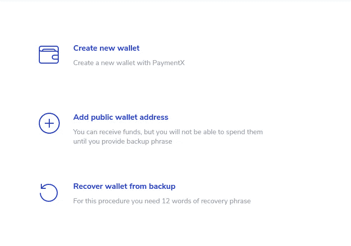
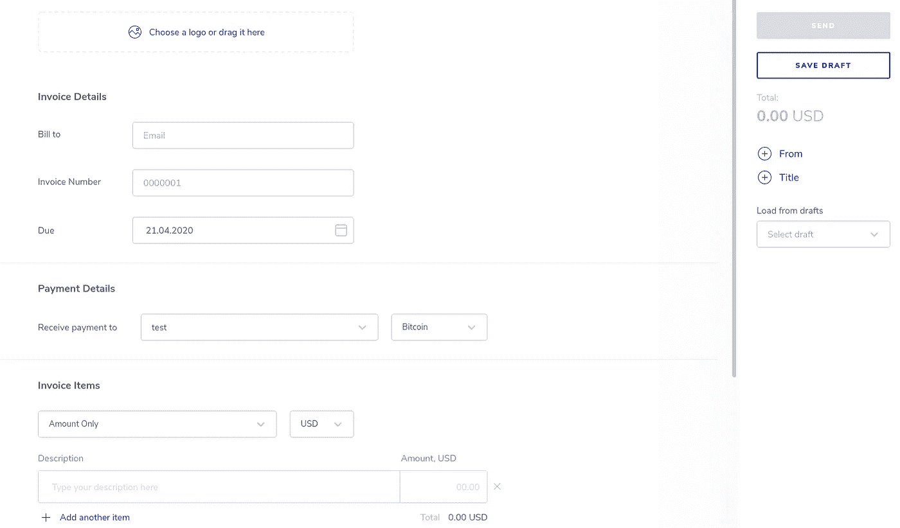
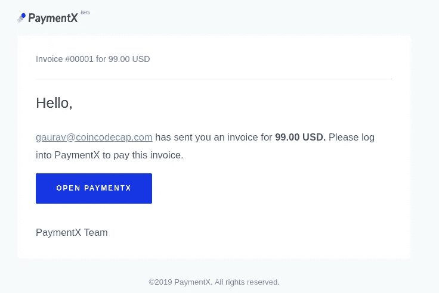
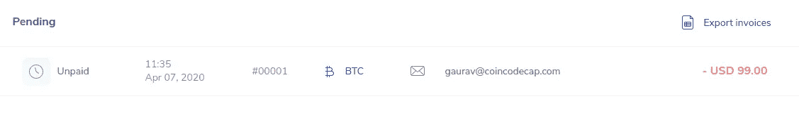
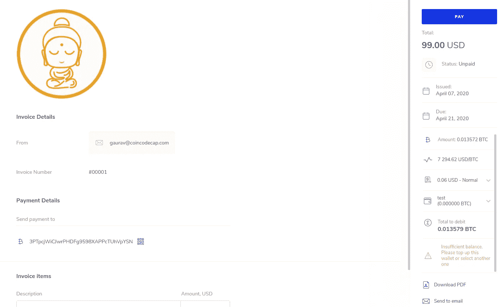
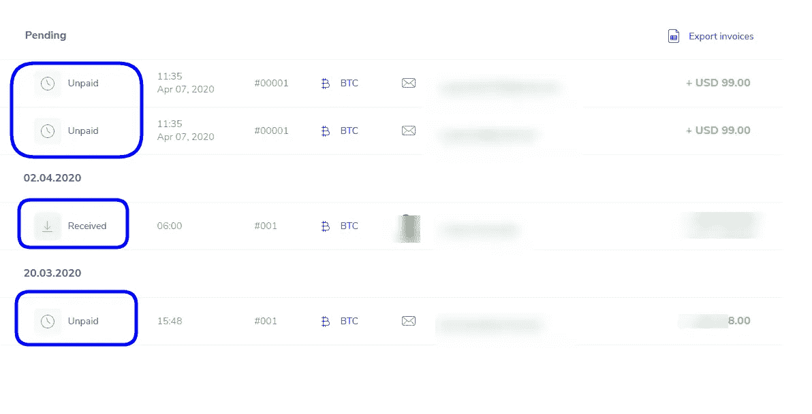

# 创建比特币发票只需 2 个简单步骤-PaymentX

> 原文：<https://medium.com/coinmonks/create-a-bitcoin-invoice-in-3-simple-steps-a0ec5091ce8c?source=collection_archive---------0----------------------->

[**PaymentX- Create bitcoin invoices**](http://paymentx.io?utm_source=coincodecap_blog)

## 开始比特币发票，并获得加密支付

# 通过两个简单的步骤创建比特币发票——PaymentX

今天，我将向你展示如何通过两个简单的步骤使用 [PaymentX](http://paymentx.io/?utm_source=medium) 创建比特币发票。PaymentX 帮助个人和企业创建发票，并在加密中获得支付。让我们开始吧。

首先，你需要在 [PaymentX](http://paymentx.io/?utm_source=medium) 上创建一个账户。登录后，我们就可以创建发票了。这里有两个简单的步骤，我们将逐一解释。

1.  添加钱包(或现有的钱包地址)
2.  创建发票

# 添加钱包(或现有的钱包地址)

PaymentX 支持保管和非保管钱包选项来接收您的资金。这种灵活性使 PaymentX 成为一种安全的发票解决方案。PaymentX 提供了四个接收资金的选项。

*   使用您现有的比特币钱包地址(非托管)
*   用 PaymentX 创建钱包(保管)
*   使用你现有的比特币钱包(保管)
*   连接您的 Trezor 钱包

对于本教程，我们将使用现有的比特币钱包地址。现在，我们都设置好了，让我们创建一个新的比特币发票。

Wallet options provided by PaymentX

# 创建比特币发票

现在我们准备创建发票。点击屏幕右侧的“创建发票”按钮，将打开如下所示的屏幕。

Create Invoice Screen

这里你需要填写发票的详细信息。

**标志** —贵公司的标志。

**收单人** —发票接收人的电子邮件。

**发票号** —唯一的发票号。

**到期日** —发票到期的日期。

**付款详情** —选择您希望接收付款的钱包。

**定价类型** — PaymentX 提供了三种向客户收费的方式。

*   仅限金额—添加金额
*   每小时——按小时收费
*   数量-根据项目数量收费

**定价货币** —您可以选择发票的货币，PaymentX 支持多种法定货币。所有发票将以加密货币支付，但以法定货币计价。

**发票项目明细** —您可以在 PaymentX 中添加多个发票项目。

附件 —你也可以在你的发票上附上一个文件。

此外，您还可以在屏幕右侧向您的发票添加两个字段。

**来自**的账单——公司详情、地址等。

**标题** —发票标题

您也可以将发票保存为草稿或复制现有的电子邮件。

# 发票看起来如何，我的联系人将如何付款？

PaymentX 将发送一封电子邮件通知您的客户有关发票的信息，如下所示。

Invoice email sent by PaymentX

您的客户需要有一个 PaymentX 帐户。一旦您的客户登录他/她的帐户，他们将看到一张未付款的发票，如下所示。

Payment Dashboard showing the pending invoice

The invoice received by your customer

# 您的客户将如何支付发票？

如前所述，您的客户需要有一个保管钱包的帐户来支付发票。这有助于跟踪客户支付的款项。

在付款时，PaymentX 将获取最新的比特币定价，以显示您的客户需要支付多少 BTC(比特币)。

此外，PaymentX 允许您一次点击支付多张发票。只需从您的仪表板中选择“未支付”发票，然后一次性支付即可。

# 我如何跟踪这些发票？

一旦您的客户支付了发票，您将收到一封发票付款电子邮件，您也可以在 PaymentX 仪表板中查看。此外，您还可以在仪表板中查看其他待处理和已收到的发票。

此外，您还可以下载 PDF 格式的发票副本。PaymentX 已经建立了一个很好的用户体验，如果你正在寻找一个安全简单的加密发票工具，你一定要看看 PaymentX。

目前，PaymentX 支持比特币、以太坊以及它们各自的测试网。想了解更多关于 PaymentX 的信息，你可以在这里加入他们的[电报群。此外，你可以在](https://t.me/paymentx)[推特](https://twitter.com/Payment_X)上关注 PaymentX。

## **同样，阅读**

*   [最佳加密交易机器人](/coinmonks/whats-the-best-crypto-trading-bot-in-2020-top-8-bitcoin-trading-bot-c16adeb13317)
*   [如何支付比特币发票](https://blog.blockonomics.co/how-to-pay-a-bitcoin-invoice-abf4a04d041c)
*   最好的比特币[硬件钱包](/coinmonks/the-best-cryptocurrency-hardware-wallets-of-2020-e28b1c124069?source=friends_link&sk=324dd9ff8556ab578d71e7ad7658ad7c)
*   最好的[加密税务软件](/coinmonks/best-crypto-tax-tool-for-my-money-72d4b430816b)
*   [最佳加密交易平台](/coinmonks/the-best-crypto-trading-platforms-in-2020-the-definitive-guide-updated-c72f8b874555)
*   [bits gap review](https://blog.coincodecap.com/bitsgap-review)——一个轻松赚钱的加密交易机器人
*   为专业人士设计的加密交易机器人
*   Bitmex 保证金交易的白痴指南
*   [加密摇摆交易的权威指南](/coinmonks/the-definitive-guide-to-crypto-swing-trading-7e4af6496d4d?source=friends_link&sk=70448050bd9323b42f63bfc0bb1e60d1)
*   [Bitmex 高级保证金交易指南](/coinmonks/bitmex-advanced-margin-trading-guide-2270c195ce25?source=friends_link&sk=1d986cca731f5084b9a2db4a4bc4a7ad)

> [直接在您的收件箱中获得最佳软件交易](https://coincodecap.com?utm_source=coinmonks)

