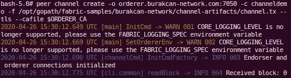
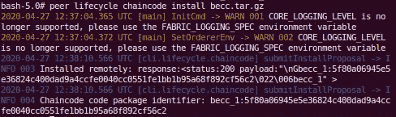
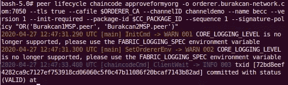

# 使用 Hyperledger Fabric v2.1 创建自定义网络并部署您自己的链码

> 原文：<https://medium.com/coinmonks/create-a-custom-network-and-deploy-your-own-chaincode-with-hyperledger-fabric-v2-1-6c689cf1b7cd?source=collection_archive---------0----------------------->


在这个故事中，我们将创建一个自定义网络，并使用 Hyperledger Fabric v2.1 部署一个示例链码。之后，我们将查询链码，并通过我们将创建的 2 个对等点与网络进行交互。

首先，我们需要安装这里列出的所有先决条件。如果你以前没有安装它，你可以使用下面的链接作为指南。不仅仅是安装必备软件，如果你能完成整个指南，那会很有帮助。然而，只有*安装先决条件*和*安装示例、二进制文件和 docker 映像*部分对于这个故事是必要的。

[](/@bcekici11/hyperledger-fabric-v2-1-installation-guide-prerequisites-bring-up-the-test-network-4ac658b0df64) [## Hyperledger Fabric v2.1 安装指南-先决条件和启动测试网络

### 在这个故事中，我们将在 Linux 机器上安装 Hyperledger Fabric v2.1，然后启动测试网络并…

medium.com](/@bcekici11/hyperledger-fabric-v2-1-installation-guide-prerequisites-bring-up-the-test-network-4ac658b0df64) 

如果我们成功安装了先决条件、示例、二进制文件和 docker 映像，我们必须有一个 *fabric-samples* 文件夹，并且我们可以从创建一个自定义网络开始。

# 创建一个自定义网络并启动它

我们在 *fabric-samples* 文件夹下创建一个名为`burakcan-network`的文件夹。在我们的网络中，有 3 个节点，包括两个组织，分别是`Burakcan1`和`Burakcan2`，还有一个订购者，所以我们需要生成所有的证书和密钥来证明这些节点是否真的是他们自己。我们将使用提供的`cryptogen`工具来为我们的网络实体生成加密材料，我们在安装特定于平台的二进制文件时已经安装了该工具。它放在*面料-样品/箱*文件夹下。它使用包含网络拓扑的`crypto-config.yaml`文件，并允许我们为组织和属于这些组织的组件生成一组证书和密钥。

> 除此之外我就不多说了，但是你可以从[这里](https://hyperledger-fabric.readthedocs.io/en/release-2.0/build_network.html?highlight=crypto-config.yaml#crypto-generator)了解更多关于这个工具的信息。

这就是为什么我们在`burakcan-network`目录下创建下面的文件。我们定义了一个订购组织(`OrdererOrg`)和两个对等组织(`Burakcan1`和`Burakcan2`)。组织中的每个计数值都指定了该组织中同级的数量。

在定义了`crypto-config.yaml`文件之后，我们在`burakcan-network`目录下执行下面的命令通道。

```
../bin/cryptogen generate --config crypto-config.yaml --output=crypto-config
```

我们应该会看到如下所示的消息。


cryptogen

然后我们将继续使用`configtxgen`工具，它是我们在安装特定于平台的二进制文件时已经安装的，它也放在 *fabric-samples/bin* 文件夹下。它提供了生成这些重要的配置工件；

*   1 `orderer genesis block`
*   1 `channel configuration transaction`
*   2 `anchor peer transactions`(必须针对每个组织，我们有`Burakcan1`和`Burakcan2`组织，因此我们将生成其中的 2 个)

> 你可以从[这里](https://hyperledger-fabric.readthedocs.io/en/release-2.0/build_network.html?highlight=crypto-config.yaml#configuration-transaction-generator)了解更多关于 configtxgen 工具的信息。

它使用包含网络定义的`configtx.yaml`文件，因此我们将在`burakcan-network`目录下创建以下文件。

定义完`configtx.yaml`文件后，我们依次执行以下命令，在`burakcan-network`目录下生成我们上面提到的配置工件；

*   生成排序生成块；

```
../bin/configtxgen -profile OrdererGenesis -outputBlock ./channel-artifacts/genesis.block -channelID channelorderergenesis
```


orderer genesis block

*   涉及生成信道配置事务；

```
../bin/configtxgen -profile ChannelDemo -outputCreateChannelTx ./channel-artifacts/channel.tx -channelID channeldemo
```


channel configuration transaction

*   为`Burakcan1`生成锚点对等交易；

```
../bin/configtxgen -profile ChannelDemo -outputAnchorPeersUpdate ./channel-artifacts/Burakcan1Anchor.tx -channelID channeldemo -asOrg Burakcan1MSP
```


anchor peer transaction for Burakcan1 Org

*   为`Burakcan2`生成锚点对等交易；

```
../bin/configtxgen -profile ChannelDemo -outputAnchorPeersUpdate ./channel-artifacts/Burakcan2Anchor.tx -channelID channeldemo -asOrg Burakcan2MSP
```


anchor peer transaction for Burakcan2 Org

然后，由于指定 docker 文件并定义它们的位置，我们需要在`burakcan-network`目录下创建一些文件。我们在`burakcan-network`目录下创建`base`文件夹，然后在其中创建`docker-compose-base.yaml`和`peer-base.yaml`文件，为我们的网络建立基础。

我们只需要创建一个文件。这是从`docker-compose-base.yaml`文件扩展而来的`docker-compose-cli.yaml`文件，它必须放在`burakcan-network`目录的根目录下。我们将为每个组织使用一个 cli 容器，方法是启动网络或部署、查询和交互链代码，因此我们创建了以下文件。

然后设置`COMPOSE_PROJECT_NAME`变量，因为它可能会在我们启动网络时引起问题。

```
echo COMPOSE_PROJECT_NAME=net > .env
```

现在，我们可以打开我们的网络，我们应该看到类似下图的东西；

```
docker-compose -f docker-compose-cli.yaml up -d
```


bring up the network

# 配置和创建通道

如果您已成功启动网络，我们可以继续配置和创建我们将使用的通道。我们再打开 2 个终端来配置到我们的对等点的通道。

我们将通过`docker exec`命令为每个对等体分别输入 CLI 容器。此外，我们可以在执行该命令时或之后定义环境变量。你选择哪条路都没关系。

*   从一个终端向另一个终端输入以下命令`Burakcan1`

```
docker exec -e "CORE_PEER_LOCALMSPID=Burakcan1MSP" -e "CORE_PEER_TLS_ROOTCERT_FILE=/opt/gopath/fabric-samples/burakcan-network/crypto-config/peerOrganizations/be1.burakcan-network.com/peers/peer0.be1.burakcan-network.com/tls/ca.crt" -e "[CORE_PEER_MSPCONFIGPATH=/opt/gopath/fabric-samples/burakcan-network/crypto-config/peerOrganizations/be1.burakcan-network.com/users/Admin@be1.burakcan-network.com](mailto:CORE_PEER_MSPCONFIGPATH=/opt/gopath/fabric-samples/burakcan-network/crypto-config/peerOrganizations/be1.burakcan-network.com/users/Admin@be1.burakcan-network.com)/msp" -e "CORE_PEER_ADDRESS=peer0.be1.burakcan-network.com:7051" -it cli bash
```


docker exec for Burakcan1

*   从对方终端输入以下命令`Burakcan2`

```
docker exec -e "CORE_PEER_LOCALMSPID=Burakcan2MSP" -e "CORE_PEER_TLS_ROOTCERT_FILE=/opt/gopath/fabric-samples/burakcan-network/crypto-config/peerOrganizations/be2.burakcan-network.com/peers/peer0.be2.burakcan-network.com/tls/ca.crt" -e "[CORE_PEER_MSPCONFIGPATH=/opt/gopath/fabric-samples/burakcan-network/crypto-config/peerOrganizations/be2.burakcan-network.com/users/Admin@be2.burakcan-network.com](mailto:CORE_PEER_MSPCONFIGPATH=/opt/gopath/fabric-samples/burakcan-network/crypto-config/peerOrganizations/be2.burakcan-network.com/users/Admin@be2.burakcan-network.com)/msp" -e "CORE_PEER_ADDRESS=peer0.be2.burakcan-network.com:7051" -it cli bash
```


docker exec for Burakcan2

从这里开始，一些操作将只在一个对等体中进行，一些操作将一起进行。我们从通过以下方式在所有终端中设置`ORDERER_CA`变量开始；

```
export ORDERER_CA=/opt/gopath/fabric-samples/burakcan-network/crypto-config/ordererOrganizations/burakcan-network.com/orderers/orderer.burakcan-network.com/msp/tlscacerts/tlsca.burakcan-network.com-cert.pem
```

然后，我们通过以下命令创建通道。不需要在两个终端都执行；一个就够了。我们将频道名称命名为`channeldemo`。

```
peer channel create -o orderer.burakcan-network.com:7050 -c channeldemo -f /opt/gopath/fabric-samples/burakcan-network/channel-artifacts/channel.tx — tls — cafile $ORDERER_CA
```



create the channel

然后，我们分别从每个对等体加入这个通道，因此我们将在两个终端中执行以下命令，我们应该会看到下图。

```
peer channel join -b channeldemo.block --tls --cafile $ORDERER_CA
```


join the channel

加入通道后，我们分别从每个对等点更新通道。

*   至同行`Burakcan1`

```
peer channel update -o orderer.burakcan-network.com:7050 -c channeldemo -f /opt/gopath/fabric-samples/burakcan-network/channel-artifacts/Burakcan1Anchor.tx --tls --cafile $ORDERER_CA
```


update the channel

*   对等式`Burakcan2`

```
peer channel update -o orderer.burakcan-network.com:7050 -c channeldemo -f /opt/gopath/fabric-samples/burakcan-network/channel-artifacts/Burakcan2Anchor.tx --tls --cafile $ORDERER_CA
```


update the channel

# 定义和部署链码

如果我们已经成功地完成了渠道内容，我们可以继续定义和部署链码作为新的链码生命周期，它已经随着 Hyperledger Fabric v2 而改变。我们不会深入了解这个新的生命周期，但是如果你愿意，你可以看看下面的故事了解更多细节。

[](/@bcekici11/the-chaincode-lifecycle-on-hyperledger-fabric-v2-72dffb7acf30) [## Hyperledger Fabric v2 上的链码生命周期

### 在本案例中，我们将研究如何在 Hyperledger Fabric v2 中运行链码生命周期流程

medium.com](/@bcekici11/the-chaincode-lifecycle-on-hyperledger-fabric-v2-72dffb7acf30) 

链码可以由 Go、Java 或 Javascript 编写。在这个例子中，我们将使用 Go 语言来创建我们的链码。首先我们创建一个名为`be_chaincode`的目录来保存我们的链码。

> 由于我们已经按行将`docker-compose-cli.yaml`文件中 CLI 的 volume 部分的`../chaincode`路径定义为`/opt/gopath/src/chain`路径
> 
> 。/../chain code/:/opt/gopath/src/chain
> 
> 我们可以访问 CLI 容器中仅由`/opt/gopath/src/chain`路径使用的目录。除了通过下面定义的方式创建链码，我们还可以直接在`../chaincode/be_chaincode`目录下创建`be.go`文件。

```
mkdir /opt/gopath/src/chain/be_chaincode
mkdir /opt/gopath/src/chain/be_chaincode/go
vi /opt/gopath/src/chain/be_chaincode/go/be.go
```

然后，我们将下面的链码复制到用上面的命令创建的名为`be.go`的文件中。" github . com/hyperledger/fabric-contract-API-go/contract API "

在这里，我们需要得到我们写在链码和其他 go 依赖项中的依赖项`github.com/hyperledger/fabric-contract-api-go/contractapi`。我们可以在任何我们想要的终端上执行它。没有必要执行两个终端。

```
go get github.com/hyperledger/fabric-chaincode-go/shim
go get github.com/hyperledger/fabric-contract-api-go/contractapi
```

> 我们可以修改您目录中的 go.mod 和 vendor 文件来避开上面的命令，执行 GO111MODULE 命令。但是从 Fabric samples 下载的 abstore 示例下的 chaincode 有正确的文件，所以我们通过以下命令使用它们的 go.mod 和 vendor 文件

```
cd /opt/gopath/src/chain/abstore/go
GO111MODULE=on go mod vendor
cd -
```


GO111MODULE

根据链码生命周期，我们通过在任何终端执行以下命令来打包链码。

```
peer lifecycle chaincode package becc.tar.gz --path chain/be_chaincode/go/ --lang golang --label becc_1
```


package the chaincode

现在，我们将从所有对等机安装这个包，因此我们从所有终端执行下面的命令。

```
peer lifecycle chaincode install becc.tar.gz
```



install the chaincode

我们将从所有对等点查询 install，因此我们从所有终端执行下面的命令，我们将获得将在接下来的步骤中使用的`Package ID`。

```
peer lifecycle chaincode queryinstalled
```


queryinstalled the chaincode

为了方便使用，我们将`Package ID`设置到`CC_PACKAGE_ID`变量中。

```
CC_PACKAGE_ID=becc_1:5f80a06945e5e36824c400dad9a4ccfe0040cc0551fe1bb1b95a68f892cf56c2
```

我们将在 chaincode 包安装到我们的对等机之后批准 chaincode 定义，因此我们从所有终端执行以下命令。

```
peer lifecycle chaincode approveformyorg -o orderer.burakcan-network.com:7050 --tls true --cafile $ORDERER_CA --channelID channeldemo --name becc --version 1 --init-required --package-id $CC_PACKAGE_ID --sequence 1 --signature-policy "OR('Burakcan1MSP.peer', 'Burakcan2MSP.peer')"
```



approve the chaincode from all peers

在提交链代码之前，我们可以检查`Burakcan1MSP`和`Burakcan2MSP`是否准备好提交。这不是必须的，但是有益的。因此，我们在一个对等体中执行以下命令。

```
peer lifecycle chaincode checkcommitreadiness --channelID channeldemo --name becc --version 1 --sequence 1 --output json --init-required --signature-policy "OR('Burakcan1MSP.peer', 'Burakcan2MSP.peer')"
```


check commit readiness

如果我们看到`Burakcan1MSP`和`Burakcan2MSP`已经准备好批准，我们可以提交链代码。在提交链码之前，我们将定义为`peer0.be1.burakcan-network.com:7051`和`peer0.be2.burakcan-network.com:7051`的每个对等体的证书路径设置到`PEER_BE1_TLSROOTCERTFILES`和`PEER_BE1_TLSROOTCERTFILES`变量中，以便于使用。

```
PEER_BE1_TLSROOTCERTFILES=/opt/gopath/fabric-samples/burakcan-network/crypto-config/peerOrganizations/be1.burakcan-network.com/peers/peer0.be1.burakcan-network.com/tls/ca.crt
PEER_BE2_TLSROOTCERTFILES=/opt/gopath/fabric-samples/burakcan-network/crypto-config/peerOrganizations/be2.burakcan-network.com/peers/peer0.be2.burakcan-network.com/tls/ca.crt
```

然后，我们在一个对等体中提交链码，我们看到它对`peer0.be1.burakcan-network.com:7051`和`peer0.be2.burakcan-network.com:7051`对等体有效。

```
peer lifecycle chaincode commit -o orderer.burakcan-network.com:7050 --tls true --cafile $ORDERER_CA --channelID channeldemo --name becc --peerAddresses peer0.be1.burakcan-network.com:7051 --tlsRootCertFiles $PEER_BE1_TLSROOTCERTFILES --peerAddresses peer0.be2.burakcan-network.com:7051 --tlsRootCertFiles $PEER_BE2_TLSROOTCERTFILES --version 1 --sequence 1 --init-required --signature-policy "OR('Burakcan1MSP.peer', 'Burakcan2MSP.peer')"
```


commit the chaincode

我们可以通过下面的命令检查已经提交的链码定义。

```
peer lifecycle chaincode querycommitted --channelID channeldemo --name becc
```


querycommit the chaincode

# 查询链码并与网络交互

提交链码后，如果一切正常，我们就可以查询链码并与网络交互。在使用 Hyperledger Fabric v2 进行查询时，我们可以使用旧的链码生命周期。

因为我们必须首先调用 chaincode，所以我们在任何终端中使用`peer chaincode invoke`命令并调用`InitLedger`方法，就像你在之前定义的 chaincode 中看到的那样。

```
peer chaincode invoke -o orderer.burakcan-network.com:7050 --tls true --cafile $ORDERER_CA -C channeldemo -n becc --peerAddresses peer0.be1.burakcan-network.com:7051 --tlsRootCertFiles $PEER_BE1_TLSROOTCERTFILES --peerAddresses peer0.be2.burakcan-network.com:7051 --tlsRootCertFiles $PEER_BE2_TLSROOTCERTFILES --isInit -c '{"function":"initLedger","Args":[]}'
```


invoke the chaincode

如果我们看到`status:200`消息，我们可以查询我们想要的任何对等体的链码。这就是为什么我们在`peer0.be1.burakcan-network.com:7051` peer 中调用`QueryAllProducts`方法，它将显示我们在`InitLedger`方法中放置分类帐的所有产品。

```
peer chaincode query -C channeldemo -n becc -c '{"Args":["queryAllProducts"]}'
```


query all products

现在，我们再次调用 invoke 命令，因为我们想要更改产品价格，这意味着我们想要对资产进行更改。当网络成员想要转移或改变分类帐上的资产时，链码被调用。因此，我们通过在`peer0.be1.burakcan-network.com:7051` peer 中执行下面的命令来调用`ChangeProductPrice`方法。

```
peer chaincode invoke -o orderer.burakcan-network.com:7050 --tls true --cafile $ORDERER_CA -C channeldemo -n becc --peerAddresses peer0.be1.burakcan-network.com:7051 --tlsRootCertFiles $PEER_BE1_TLSROOTCERTFILES --peerAddresses peer0.be2.burakcan-network.com:7051 --tlsRootCertFiles $PEER_BE2_TLSROOTCERTFILES -c '{"function":"changeProductPrice","Args":["PRODUCT0", 350]}'
```


change product price

如果上面的命令工作正常，我们应该看到价格为 350 而不是 250。这就是为什么我们把`peer0.be2.burakcan-network.com:7051`中的`QueryAllProducts`方法叫做 peer。

```
peer chaincode query -C channeldemo -n becc -c '{"Args":["queryAllProducts"]}'
```


query all products

是的，我们可以看到`PRODUCT0`价格是 350 而不是 250，所以这意味着一切正常。

# 沿着网络

当我们的工作完成后，我们可以关闭我们的网络，这样我们就可以使用终端来打开网络并执行下面的命令。

```
docker-compose -f docker-compose-cli.yaml down
```


断开网络后，使用以下命令有利于避免可能出现的问题。

```
docker rm $(docker ps -aq)
docker volume prune
```

> 有时我们想要升级或部署新的链码，我们可能会面临这样的错误，即“*'*becc '的链码定义存在，但链码未安装*”，尽管我们执行了对等链码生命周期安装命令。这时，我们需要删除我们为同行安装的 chaincode 的图像。我们可以通过执行以下命令来查看这些图像。前 2 个图像属于我们在`peer0.be1.burakcan-network.com:7051`和`peer0.be2.burakcan-network.com:7051`对等体中安装的链码。*

```
*docker images*
```

**

*docker images*

```
*docker rmi <IMAGE_ID>*
```

*我们可以通过他们的`IMAGE ID`属性删除。您可以从上面写图像 id，而不是为每个链码 docker 图像写`<IMAGE_ID>`变量。你可以重新开始。*

*就是这样，我们有；*

*   *安装的先决条件*
*   *安装的示例、二进制文件和 Docker 映像*
*   *提起风俗`burakcan-network`*
*   *创建了一个名为`channeldemo`的频道*
*   *部署`be.go`为链码`becc`*
*   *查询并调用了链码*
*   *与自定义交互`burakcan-network`*

*在这个故事里。*

> *[直接在您的收件箱中获得最佳软件交易](https://coincodecap.com/?utm_source=coinmonks)*

*[](https://coincodecap.com/?utm_source=coinmonks)*