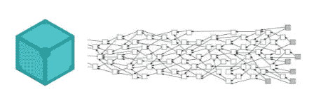

# 为初学者使用 Tangle 和 IPFS 创建一个分散的数据库

> 原文：<https://medium.com/coinmonks/create-a-database-using-tangle-and-ipfs-for-beginners-5cd5228ba830?source=collection_archive---------2----------------------->

在本教程中，我将为分散式应用程序创建一个数据库系统，为此我将使用 [MAM](https://docs.iota.org/docs/client-libraries/0.1/mam/introduction/overview) 通信协议，对于存储，我将使用 [IPFS](https://ipfs.io/) 。



如果你不熟悉 MAM，只需创建一个[默克尔树](https://ecosystem.iota.org/tutorials/iota-tutorial-18)来保存哈希值。在我们使用 [Restricted MAM](/coinmonks/iota-mam-eloquently-explained-d7505863b413) 的情况下，根的散列能够使用 side-key 访问所有其他散列。因此，IPFS 将上传文件，然后返回的散列将被保存在 MAM。

# **数据库将如何工作**

当然，我们的数据库将采用 JSON 格式。

1-将 JSON 数据上传到 IPFS，并获取返回的散列以供以后访问文件。

2-使用 MAM restricted 发送 IPFS。

获取数据:-

1-使用 mama restricted 获取数据，并获取上传的 IPFS 哈希。

2-获取 IPFS 的散列以获得上传的 JSON 数据。

# 让我们开始编码吧

上传数据的 IPFS 代码。在此检查文档[上的功能。](https://github.com/ipfs/interface-js-ipfs-core/blob/master/SPEC/FILES.md#add)

```
/*Don't forget to write npm install --save ipfs-http-client*/const ipfsLibrary = require(‘ipfs-http-client’)
const ipfs = new ipfsLibrary({ host: ‘ipfs.infura.io’, port: 5001, protocol: ‘https’ })const add = async (data) =>{const hash = await ipfs.add(JSON.stringify(data))return hash[0].path}module.exports = {
execute : add
}
```

IPFS 代码获取数据文件上的 cat.js 检查函数[此处](https://github.com/ipfs/interface-js-ipfs-core/blob/master/SPEC/FILES.md#cat)

```
const ipfsLibrary = require('ipfs-http-client')const ipfs = new ipfsLibrary({ host: 'ipfs.infura.io', port: 5001, protocol: 'https' })const cat = async (hash) =>{const content = await ipfs.cat(hash)console.log("read hash =",hash)return content.toString()}module.exports = {
execute : cat
}
```

妈妈密码

对于 MAM 代码，我们将创建 4 个文件:-

1-IotaGlobale.js:添加两个 push 和 fetch 函数中使用的所有全局变量

2-pushData.js:上传到 MAM

3-fetchRoot.js:从 MAM 获取数据

4-mangeMam.js:合并上面的 3 个文件

` IotaGlobale.js` **重要提示！**我花了三天时间解决了默克尔树的重复问题。默克尔树的状态必须保持全局，否则每次调用该函数时，您之前的所有数据都将丢失。

IotaGlobale.js:

```
/*On this file we will add all globale variables we will need to use*/
const iotaLibrary = require(‘@iota/core’)
const Converter = require(‘@iota/converter’)const Mam = require(‘@iota/mam’)const seed = ‘XGIVJKNUIDKDVAXGRK9SFXYFVOLEHSJOIZVROT9DUAMYUUXPPBZWYQWJNEYPVKOMKR9SNRYSZXUHDFKNB’// Define the depth that the node will use for tip selectionconst depth = 3;// Define the minimum weight magnitude for the Devnetconst minimumWeightMagnitude = 9;//MAMconst providerLink = ‘https://nodes.devnet.iota.org:443'const sideKey = ‘DONTSHARETHISPASSWORD’let mamState = Mam.init(providerLink)mamState = Mam.changeMode(mamState, ‘restricted’, sideKey)const iota =iotaLibrary.composeAPI({provider: providerLink})//Modified functionsconst lengthModifier = (str) =>{ return str.substring( str.lastIndexOf(“{“),str.lastIndexOf(“}”)+1) }module.exports = {iotaLibrary : iotaLibrary ,converter : Converter ,provider:providerLink,depth:depth,minimumWeightMagnitude:minimumWeightMagnitude,Mam : Mam ,mamState:mamState,seed : seed ,sideKey:sideKey,lengthModifier:lengthModifier,iota : iota}
```

将数据上传到 MAM 'pushData.js '

```
const Mam = require('@iota/mam')
const { asciiToTrytes, trytesToAscii } = require('@iota/converter')
const iotaGlobal = require('./IotaGlobal')
const pushData = async(_secretKey,_provider,packet) =>{
const trytes = asciiToTrytes(JSON.stringify(packet))
const message = Mam.create(iotaGlobal.mamState, trytes)//Important to update the state
// Save new mamState
iotaGlobal.mamState = message.state
// Attach the payload
await Mam.attach(message.payload, message.address, 3, 9)
return message.root
}
module.exports ={
execute:pushData}
```

从 MAM 'fetchRoot.js '获取数据

```
const iotaGlobal = require('./IotaGlobal')const { asciiToTrytes, trytesToAscii } = require('@iota/converter')const fetchRoot = async(_root)=>{const resp = await  iotaGlobal.Mam.fetch(_root, 'restricted', iotaGlobal.sideKey)const tryteMessages = resp.messagesconst asciiMessages = []for (let index = 0; index < tryteMessages.length; index++) {asciiMessages.push(iotaGlobal.converter.trytesToAscii(tryteMessages[index]))}return asciiMessages}module.exports = {execute:fetchRoot}
```

manageMam.js

```
//import fetch and push data to MAM functions
const fetchRoot = require('./fetchRoot')
const sendData = require('./pushData')
const send = async(data) =>{const root = await sendData.execute(data)return root}const fetch = async(root) =>{const data = await fetchRoot.execute(root)return data}
```

您可以在此查看受限 MAM [的文档示例。](https://github.com/iotaledger/mam.client.js/blob/master/example/publishAndFetchRestricted.js)

现在，我们已经完成了所有的基本模块。让我们创建我们的“index.js”。

前三行用于导入两个 IPFS 模块和 MAM 管理器。

```
const addToIPFS = require(‘./actions/Functions/IPFS/add’)
const manageMAM = require(‘./actions/Functions/MAM/manageMAM’)
const catFromIPFS = require(‘./actions/Functions/IPFS/cat’)
```

然后，为了创建一个数据库，我们将创建一个创建函数

```
const create = async(DBJSON)=>{const ipfsHash = await addToIPFS.execute(JSON.parse(JSON.stringify(DBJSON)))const root = await manageMAM.send(ipfsHash)return root}
```

然后读取数据

```
const read = async(root)=>{const fetchIPFShash = await manageMAM.fetch(root)const fetchedIPFS = catFromIPFS.execute(getLastHash(fetchIPFShash))return fetchedIPFS}
```

更新数据

```
const update = async(root,key,value)=>{const DB = await read(root)const DBjson = JSON.parse(DB)DBjson[key] = valueconst newRoot = await create(DBjson)return newRoot}
```

删除数据

```
const deleteRaw = async(root,key)=>{const DB = await read(root)const DBjson = JSON.parse(DB)const newRoot = await create(DBjson)return newRoot}
```

整个项目都包含在这个库里面[https://github . com/ye hia 67/IPFS-Tangle-Database-System/tree/master](https://github.com/yehia67/IPFS-Tangle-Database-System/tree/master)

> [在您的收件箱中直接获得最佳软件交易](https://coincodecap.com/?utm_source=coinmonks)

[](https://coincodecap.com/?utm_source=coinmonks)[](https://coincodecap.com)