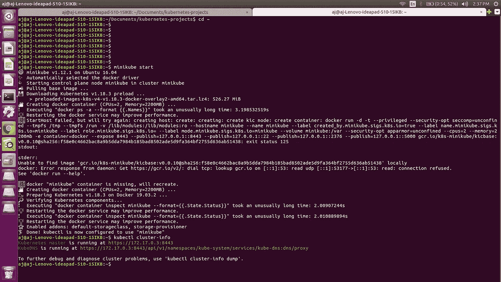
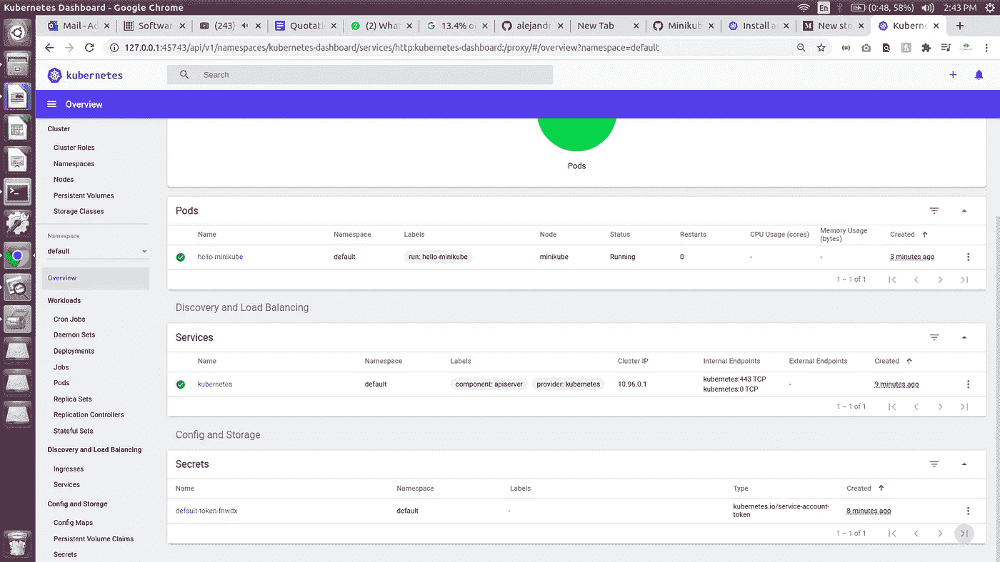

# 使用 ubuntu 上的 minikube 在 10 分钟内创建一个 Kubernetes 集群！！

> 原文：<https://medium.com/coinmonks/create-a-demo-kubernetes-cluster-using-minikube-on-ubuntu-b72e4a314f24?source=collection_archive---------1----------------------->

概述:

1.  安装管理程序(Virtualbox)
2.  获取并安装 Kubectl(存储库)
3.  获取并安装 Minikube 最新版本
4.  启动并测试 Minikube 本地集群，并公开演示服务

# 安装 VirtualBox 虚拟机管理程序

我们将安装 virtualbox 5。*通过官方仓库

```
$ sudo apt-get update
$ sudo apt remove virtualbox*
$ wget -q https://www.virtualbox.org/download/oracle_vbox_2016.asc -O- | sudo apt-key add -
$ wget -q https://www.virtualbox.org/download/oracle_vbox.asc -O- | sudo apt-key add -
$ sudo su
$ echo "deb https://download.virtualbox.org/virtualbox/debian xenial contrib" >> /etc/apt/sources.list
$ apt-get update
$ sudo apt-get install virtualbox virtualbox-ext-pack
```

# 在 Linux 上安装 kubectl

# 在 Linux 上安装带有 curl 的 kubectl 二进制文件

1.  使用以下命令下载最新版本:

```
curl -LO https://storage.googleapis.com/kubernetes-release/release/`curl -s https://storage.googleapis.com/kubernetes-release/release/stable.txt`/bin/linux/amd64/kubectl
```

要下载特定版本，请用特定版本替换命令的`$(curl -s https://storage.googleapis.com/kubernetes-release/release/stable.txt)`部分。

例如，要在 Linux 上下载 1.18.0 版，请键入:

`curl -LO [https://storage.googleapis.com/kubernetes-release/release/v1.18.0/bin/linux/amd64/kubectl](https://storage.googleapis.com/kubernetes-release/release/v1.18.0/bin/linux/amd64/kubectl)`

2.使 kubectl 二进制文件可执行。

```
chmod +x ./kubectl
```

3.将二进制文件移到您的路径中。

`sudo mv ./kubectl /usr/local/bin/kubectl`

4.检查 kubectl 版本，看它是否安装正确。

`kubectl version --client`

# 安装 Minikube

直接从 Google 仓库下载 minikube 二进制文件。

```
$ curl -Lo minikube https://storage.googleapis.com/minikube/releases/latest/minikube-linux-amd64 && chmod +x minikube
$ sudo mv -v minikube /usr/local/bin
$ minikube version
$ exit 
```

# 使用 Minikube 在本地启动 Kubernetes 集群

创建并运行 Kubernetes 集群。这将需要几分钟时间，具体取决于您的互联网连接。

```
$ minikube start
```

# 测试 Kubernetes 服务

我们运行一个演示服务来测试我们的集群

```
$ kubectl cluster-info
```



```
$ kubectl run hello-minikube --image=gcr.io/google_containers/echoserver:1.4 --port=8080
$ kubectl get services
$ minikube dashboard 
```

minikube dashboard 将在您的默认 web 浏览器中打开。



您已经使用 minikube 成功运行了您的第一个 kubernetes 集群。在我的下一篇文章中，我将展示如何设置一个生产级别的 kubernetes 集群来使用 NFS 服务器部署 Hyperledger fabric 网络。

如果你们喜欢我的文章，别忘了鼓掌。这将激励我做出更多的文章，为社区做出更多的贡献。您也可以关注我，了解我的最新文章。

> [在您的收件箱中直接获得最佳软件交易](https://coincodecap.com?utm_source=coinmonks)

[](https://coincodecap.com?utm_source=coinmonks)