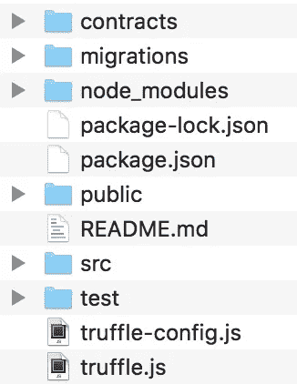

# 教程:如何在以太坊区块链创建体育博彩 dApp(第 1 部分)

> 原文：<https://medium.com/coinmonks/create-a-sports-betting-dapp-on-the-ethereum-blockchain-part-1-1f69f908b939?source=collection_archive---------0----------------------->


嗨，大家好，我最近学习了如何用以太坊技术制作一个分布式应用程序，但是作为一个 web 开发初学者，我很难找到一个易于理解并涵盖制作 dapp 所有方面的教程，从第一行代码到以太坊网络上的部署。
本教程的目的是制作一个体育博彩 Dapp，每个玩家可以在一个团队中下注一定数量的乙醚，智能合约将价格重新分配给下注正确团队的玩家！

*注意:这个教程现在还能用，但是随着区块链科技的快速发展，它可能会在某些时候贬值。*

*更新(2018 年 12 月 27 日) :我编辑了 solidity 代码，以便与 0.5.x* 一起工作

**本教程面向对 Javascript 和区块链**有一点经验，并且希望以非常简单的方式学习 dApp 制作的人。

我将使用 React 开发前端，并构建一个工作的 dApp，该教程也适合那些想使用另一个框架如 angular 甚至普通 javascript 的人。本教程将包含以下步骤:

*   准备项目环境(第 1 部分)
*   编写、测试和部署智能合同(第 1 部分)
*   创建前端(第 2 部分)

# 准备项目环境

## 先决条件

对于这个应用程序的开发，将需要 [node.js](https://nodejs.org/en/) 来安装各种包，所以第一步是确保它已经安装在您的设备上。

为了保持简单，我们将使用 **react-create-app** 在 [React](https://reactjs.org/) 中开发我们的应用程序，这将为我们的应用程序生成一个简单的框架。这不是开发 react 应用程序的最灵活和最可定制的方式，但将完美地完成本教程的工作。通过键入`npm install -g create-react-app`来安装它。`-g`标志意味着您正在为您的设备全局安装它。

开发应用程序的另一个框架将是 [Truffle](http://truffleframework.com/) ，它将有助于编译、测试&在以太坊区块链上部署我们的智能合约。通过在终端输入`npm install truffle -g`来安装它。

## 创建应用程序

一旦你在你的电脑上安装了这两个包，你就可以通过输入`create-react-app bet-eth` *(或者你想要的这个应用的任何名字)*来创建你的应用。它将在您的工作目录中创建一个名为 **bet-eth** 的文件夹，其中安装了一些 react 有用的依赖项。用你的终端`cd bet-eth`访问它。你可以键入`npm start`在localhost:3000 上启动你的网站，你将在你最喜欢的网络浏览器中的 create-react-app 的主默认页面上结束，但我们稍后会编辑前端。


create-react-app default homepage

现在，让我们安装 dapp 所需的依赖项:web3、truffle-contract、truffle-wallet-provider & ethereu mjs-wallet。用`npm install web3 truffle-contract truffle-wallet-provider ethereumjs-wallet --save`简单安装即可。`--save`标志对于将依赖关系保存到应用程序的配置中很有用。

最后一步有点棘手，但应该可行:我们需要在项目中通过键入`truffle init`来初始化 Truffle。**但是由于数据覆盖保护，不可能在已经包含一些数据的文件夹中进行**。有两种方法可以解决这个问题:


Content made by using truffle init

*   创建一个空文件夹，执行 truffle init 并复制粘贴我们的项目文件夹 ***(让我们这样做)***
*   在我们的项目文件夹中手动创建所有的文件和文件夹*(也可以，但是更长)*

最后，您的项目文件夹应该如下所示:



Bet-eth folder after configuration

检查所有的依赖项是否已经安装在你的 **package.json** 文件中:

```
{
  "name": "bet-eth",
  "version": "0.1.0",
  "private": true,
 **"dependencies": {
    "ethereumjs-wallet": "^0.6.0",
    "react": "^16.4.0",
    "react-dom": "^16.4.0",
    "react-scripts": "1.1.4",
    "truffle-contract": "^3.0.5",
    "truffle-wallet-provider": "0.0.5",
    "web3": "^1.0.0-beta.34"
  },**
  "scripts": {
    "start": "react-scripts start",
    "build": "react-scripts build",
    "test": "react-scripts test --env=jsdom",
    "eject": "react-scripts eject"
  }
}
```

# 构建和测试智能合约

现在我们已经准备好了项目，让我们开发应用程序的主要核心:智能合同。

我们可以从制作应用程序的前端开始，然后用这个前端直接编写和测试智能合同。但是由于调试智能合约是一件很困难的事情，并且不是很优化，我们将首先在 [Remix IDE](https://remix.ethereum.org/) 上编写和测试我们的智能合约，这是一个轻量级和 web Solidity IDE，允许我们在任何网络上编写、编译和部署智能合约。

在写任何一行代码之前，让我们写下所有不同的功能，我们需要清楚契约将如何工作，以及需要什么来使它工作。为了使问题简单，假设我们希望能够在两个选项上下注，赢或输。每个玩家都可以在一个团队或另一个团队中下注一定数量的以太币，并根据结果，可以从输掉的累积奖金中赢回最初的赌注和一定数量的以太币。

从数学的角度来看，中奖金额可以用这个简单的公式来表示:


**对您团队的赌注/总赌注**代表对您将赢得什么的考虑，这就是为什么我们将它乘以输掉的赌注来分享。

例如，让我们想象这样一种情况:

*   A 队已经有 **60 ETH 下注，B 队**已经有 **100 ETH 下注**
*   **玩家 1** 在 A 队下注 20 ETH 队的总赌注变成 80 ETH，因此**玩家 1** 的赌注占总赌注的 25%。
*   A 队赢得了比赛。
*   **玩家 1** 将赢得他的初始赌注，与另一队总赌注的 25%相加(在本例中为 100 ETH)，总共代表 45 ETH。


## 我们需要什么样的变量和函数？

对于我们需要的变量:

*   业主— *合同业主的地址*
*   minimumBet —到*定义最小赌注(uint)*
*   totalBetOne — *这是第一队(uint)* 的赌注
*   totalBetTwo — *这是另一个团队(uint)*
*   玩家— *玩家信息的对象，将包含下注金额和所选的球队(结构)*
*   玩家— *一个包含所有玩家地址的地址数组*
*   玩家信息地址之间的映射— *将玩家地址链接到一些玩家信息*

对于功能:

*   Kill()-如果需要，终止合同
*   CheckPlayerExist() —验证玩家是否已经玩过
*   Bet() —对游戏下注
*   distribute prices()—给获胜者分发乙醚
*   AmountOne() —查看第一队的赌注
*   AmountTwo() —查看第二组的赌注

现在我们已经有了建立合同所需的所有东西，让我们来发展它吧！

## 撰写智能合同

让我们打开 remix IDE，创建一个名为 Betting.sol 的契约


Creating a new file on the Remix IDE

让我们首先开始定义可靠性版本，作为合同的约定`**pragma solidity >0.4.99;**`

那么让我们用书面形式来定义这份合同

```
**contract Betting{** *//content of the contract here* **
}**
```

现在让我们定义合同中需要的变量

```
**contract Betting{
   uint256 public minimumBet;
   uint256 public totalBetOne;
   uint256 public totalBetTwo;
   uint256 public numberOfBets;
   uint256 public maxAmountOfBets = 1000;

   address payable[] public players;

   struct Player {
      uint256 amountBet;
      uint16 teamSelected;
   }

   *// Address of the player and => the user info* 
   mapping(address => Player) public playerInfo;****}**
```

让我们为这个契约添加一个构造函数，在这里我们将定义最小赌注。 *1000000000000 魏对应 0.0001 乙醚*

```
**constructor() public {
      minimumBet = 100000000000000;
   }**
```

现在让我们开发第一个函数，检查一个玩家是否存在。如果玩家出现在玩家数组中，那么返回 true。如果没有找到，则返回 false。
这个函数在参数中取播放器的地址，`view`的意思是因为它不改变状态，你的本地节点可以运行它并告诉你结果，而不需要一个事务。这并不耗费汽油，因为只有你的节点必须运行计算。`returns(bool)`意味着函数返回一个布尔值。

```
**function checkPlayerExists(address player) public view returns(bool){
      for(uint256 i = 0; i < players.length; i++){
         if(players[i] == player) return true;
      }
      return false;
   }**
```

我们要做的下一个函数是 bet()函数:首先我们检查玩家是否被允许玩游戏。他没有玩过，如果他的赌注高于最小赌注。然后，如果所有条件都正确，我们设置玩家信息(使用映射 playerInfo ),并将玩家地址添加到玩家数组中。

```
**function bet(uint8 _teamSelected) public payable {** *//The first require is used to check if the player already exist* **require(!checkPlayerExists(msg.sender));** *//The second one is used to see if the value sended by the player is 
      //Higher than the minum value* **require(msg.value >= minimumBet);***      //We set the player informations : amount of the bet and selected team* **playerInfo[msg.sender].amountBet = msg.value;
      playerInfo[msg.sender].teamSelected = _teamSelected;***      //then we add the address of the player to the players array* **players.push(msg.sender);***      //at the end, we increment the stakes of the team selected with the player bet* **if ( _teamSelected == 1){
          totalBetOne += msg.value;
      }
      else{
          totalBetTwo += msg.value;
      }
   }**
```

该合同的第二个核心功能是向玩家分发乙醚，根据初始赌注的重量分配适当的数量。

```
**function distributePrizes(uint16 teamWinner) public {
      address payable[1000] memory winners;
**      //We have to create a temporary in memory array with fixed size
      //Let's choose 1000 **uint256 count = 0;** // This is the count for the array of winners **uint256 LoserBet = 0;** //This will take the value of all losers bet **uint256 WinnerBet = 0;** //This will take the value of all winners bet **address add;
      uint256 bet;
      address payable playerAddress;** //We loop through the player array to check who selected the winner team **for(uint256 i = 0; i < players.length; i++){
         playerAddress = players[i];** //If the player selected the winner team
         //We add his address to the winners array **if(playerInfo[playerAddress].teamSelected == teamWinner){
            winners[count] = playerAddress;
            count++;
         }
      }** //We define which bet sum is the Loser one and which one is the winner **if ( teamWinner == 1){
         LoserBet = totalBetsTwo;
         WinnerBet = totalBetsOne;
      }
      else{
          LoserBet = totalBetsOne;
          WinnerBet = totalBetsTwo;
      }** //We loop through the array of winners, to give ethers to the winners **for(uint256 j = 0; j < count; j++){** // Check that the address in this fixed array is not empty **if(winners[j] != address(0))
            add = winners[j];
            bet = playerInfo[add].amountBet;** //Transfer the money to the user **winners[j].transfer((bet*(10000+(LoserBet*10000/WinnerBet)))/10000 );
      }

      delete playerInfo[playerAddress];** // Delete all the players **players.length = 0;** // Delete all the players array **LoserBet = 0;** //reinitialize the bets **WinnerBet = 0;
      totalBetsOne = 0;
      totalBetsTwo = 0;
    }**
```

然后，我们将第一组和第二组的两个 getters 相加，这将用于我们前端的前端

```
**function AmountOne() public view returns(uint256){
       return totalBetOne;
   }

   function AmountTwo() public view returns(uint256){
       return totalBetTwo;
   }**
```

我们的合同现在结束了！以下是最终代码:

```
pragma solidity >0.4.99;contract Betting {
   address payable public owner;
   uint256 public minimumBet;
   uint256 public totalBetsOne;
   uint256 public totalBetsTwo;
   address payable[] public players;
   struct Player {
      uint256 amountBet;
      uint16 teamSelected;
    }
// The address of the player and => the user info
   mapping(address => Player) public playerInfo;
   function() external payable {}

  constructor() public {
      owner = msg.sender;
      minimumBet = 100000000000000;
    }
function kill() public {
      if(msg.sender == owner) selfdestruct(owner);
    }

function checkPlayerExists(address payable player) public view returns(bool){
      for(uint256 i = 0; i < players.length; i++){
         if(players[i] == player) return true;
      }
      return false;
    }
function bet(uint8 _teamSelected) public payable {
      //The first require is used to check if the player already exist
      require(!checkPlayerExists(msg.sender));
      //The second one is used to see if the value sended by the player is
      //Higher than the minimum value
      require(msg.value >= minimumBet);
//We set the player informations : amount of the bet and selected team
      playerInfo[msg.sender].amountBet = msg.value;
      playerInfo[msg.sender].teamSelected = _teamSelected;
//then we add the address of the player to the players array
      players.push(msg.sender);
//at the end, we increment the stakes of the team selected with the player bet
      if ( _teamSelected == 1){
          totalBetsOne += msg.value;
      }
      else{
          totalBetsTwo += msg.value;
      }
    }
    // Generates a number between 1 and 10 that will be the winner
    function distributePrizes(uint16 teamWinner) public {
      address payable[1000] memory winners;
      //We have to create a temporary in memory array with fixed size
      //Let's choose 1000
      uint256 count = 0; // This is the count for the array of winners
      uint256 LoserBet = 0; //This will take the value of all losers bet
      uint256 WinnerBet = 0; //This will take the value of all winners bet
      address add;
      uint256 bet;
      address payable playerAddress;
//We loop through the player array to check who selected the winner team
      for(uint256 i = 0; i < players.length; i++){
         playerAddress = players[i];
//If the player selected the winner team
         //We add his address to the winners array
         if(playerInfo[playerAddress].teamSelected == teamWinner){
            winners[count] = playerAddress;
            count++;
         }
      }
//We define which bet sum is the Loser one and which one is the winner
      if ( teamWinner == 1){
         LoserBet = totalBetsTwo;
         WinnerBet = totalBetsOne;
      }
      else{
          LoserBet = totalBetsOne;
          WinnerBet = totalBetsTwo;
      }
//We loop through the array of winners, to give ethers to the winners
      for(uint256 j = 0; j < count; j++){
          // Check that the address in this fixed array is not empty
         if(winners[j] != address(0))
            add = winners[j];
            bet = playerInfo[add].amountBet;
            //Transfer the money to the user
            winners[j].transfer(    (bet*(10000+(LoserBet*10000/WinnerBet)))/10000 );
      }

      delete playerInfo[playerAddress]; // Delete all the players
      players.length = 0; // Delete all the players array
      LoserBet = 0; //reinitialize the bets
      WinnerBet = 0;
      totalBetsOne = 0;
      totalBetsTwo = 0;
    }
function AmountOne() public view returns(uint256){
       return totalBetsOne;
    }
function AmountTwo() public view returns(uint256){
       return totalBetsTwo;
    }
}
```

## **测试合同**


在 Remix IDE 上，进入右边的**运行**选项卡，选择 JavaScript VM 环境。不要碰气限，输入的数值会用来输入你要赌多少乙醚。不要忘记将其设置为 **ether** 以轻松查看平衡变化(值最初在 **wei** )。

然后选择下注合同并点击部署。你的编译器应该像屏幕上显示的那样。


先用**第一笔账**在**第一队**上下注 10 ETH:用 10 (ethers，不是 wei！)、**以及值为 1** 的下注输入(因为我们要赌第一队)。

然后点击输入旁边的**下注**按钮，账户余额通常会从 99.999 升至 89.999。

现在，让我们转到另一个帐户，通过在下注输入中键入 2，在团队 2 上下注 5 个乙醚。第二次下注后你的余额应该是 94.999 ETH。

现在每个团队都有两个更好的，让我们试试 distributePrizes 函数。至于下注功能，你只需写下你想赢的队的号码，然后点击**分配筹码。**

因为队伍 n 2 赢了，在队伍 2 上下注的玩家应该赢回 5 个乙醚加上来自其他玩家的 10 个乙醚。他应该有 110 个乙醚。我鼓励你也尝试一个有很多账户的测试，看看这个思考系统是否有效。

# 配置 Truffle &在测试网络上部署合同

## 在你的应用程序中写合同

首先，我们将编写我们刚刚在项目中创建的智能合同，所以回到您的应用程序目录，我们称之为 bet-eth。打开
`bet-eth/contracts`，创建一个名为`Betting.sol`的新文件

在保存之前，将合同从 Remix 复制粘贴到此文件。

然后转到`beth-eth/migrations`文件夹，创建一个名为`2_deploy_contracts.js`的文件。Truffle 将使用该文件在区块链网络上迁移智能合同。

让我们在文件中写一些代码:

在第一行导入智能合同

```
var Betting = artifacts.require("./Betting.sol");
```

然后部署合同:

```
module.exports = function(deployer) {
  deployer.deploy(Betting);
};
```

这是这个文件中唯一需要的东西，你现在可以保存并关闭它。

# 在测试网络上部署应用

在编写 App 前端之前，我们先在一个测试网络上部署一下合约。为什么之前要这么做？因此，我们可以直接将我们的前端部分与合同部署功能联系起来。

我们将在 Ropsten TestNet 上部署我们的合同。

## 创建一个 [Infura](https://infura.io/) 账户

[Infura](https://infura.io/) 允许我们使用 Truffle 在主网络和测试网络上部署智能合约，因此我们将在我们的应用程序中使用它。

创建一个账户，创建一个名为“赌博”的项目(或任何你想要的项目)。选择 Ropsten 端点，并将端点地址保存在某处。


## 安装和配置[元掩码](https://metamask.io/)

[Metamask](https://metamask.io/) 是 Chrome & Firefox 上的一个扩展，允许用户管理以太坊区块链上的不同账户。**安装并创建账户。**登录后，**选择 Ropsten 测试网络:**


Select the Ropsten Test Network on Metamask

你将需要一些乙醚，所以点击 Metamask 上的**购买**按钮，然后点击 **Ropsten 测试龙头**。您将进入一个页面，在这里您可以为您的测试帐户申请乙醚，只需点击**请求 1 乙醚**。找些乙醚，他们会对部署合同和玩我们的应用有用。


Ropsten Ether faucet — Click on the green button to request one ether

## 获取您的私钥

要在 Ropsten 网络上部署智能合同，您将使用刚刚用 Metamask 创建的帐户。Truffle 需要知道您将使用哪个帐户进行部署，这可以通过使用私钥来实现:

进入您的元掩码帐户，点击帐户名称旁边的“…”。会出现一个小菜单，点击“导出私钥”:**复制保存你的个人私钥。**


Exporting the private key on Metamask

## 块菌配置的最后一步

我们快完成了！在本教程的这一部分，您应该已经收集了:

*   Infura 端点 URL
*   Ropsten TestNet 上的元掩码帐户上的一些醚
*   该帐户的私钥

如果您缺少这些元素中的一个，您将无法部署合同。如果你什么都有了，那你就可以走下去了！

在 app 文件夹中，打开`truffle.js`文件，用您自己的私钥和 Infura 端点复制粘贴下面几行代码。

```
var WalletProvider = require("truffle-wallet-provider");
const Wallet = require('ethereumjs-wallet');
var ropstenPrivateKey = new Buffer("**COPY-PRIVATE-KEY-HERE**","hex");
var ropstenWallet = Wallet.fromPrivateKey(ropstenPrivateKey);
var ropstenProvider = new WalletProvider(ropstenWallet, "**COPY-INFURA-ENDPOINT-HERE**");module.exports = {
  // See <[http://truffleframework.com/docs/advanced/configuration](http://truffleframework.com/docs/advanced/configuration)>
  // to customize your Truffle configuration!
  networks: {
    development: {
      host: "127.0.0.1",
      port: 8545,
      network_id: "*", // Match any network id
    },
    ropsten: {
      provider: ropstenProvider,
      gas: 4600000,
      network_id: 3
    }
  }
};
```

# 部署合同

打开终端，进入 bet-eth 应用程序目录。

首先使用`truffle compile`来编译你的智能合约。您应该有以下输出，并带有一些小警告。

注意:如果你在 windows 上，你可能会遇到一些问题，尝试使用`truffle.cmd compile`而不是`truffle`


truffle compile — console output

然后使用`truffle migrate --network ropsten`命令在 Ropsten 测试网络上迁移合同

这可能需要一段时间，但应该会产生以下输出:


truffle migrate — console output

如果在这一点上一切顺利，您应该已经在您使用的帐户上失去了一些醚，**并且合同成功部署到 Ropsten 区块链！**

你实际上可以通过在搜索栏中输入地址来查看 etherscan 上的合同，这是我刚刚为教程部署的一个:

 [## Ropsten 事务 0x 60 af 2053596 C3 EAE 26 b 039d 95245 EC 302533d 78 AC 473 f 9 b5 BC 5 e 910 e 851253 b 2

### 0 x 60 af 2053596 C3 EAE 26 b 039d 95245 EC 302533d 78 AC 473 f 9 b5 BC 5e 910 e 851253 b 2 的 Ropsten (ETH)详细交易信息

ropsten.etherscan.io](https://ropsten.etherscan.io/tx/0x60af2053596c3eae26b039d95245ec302533d78ac473f9b5bc5e910e851253b2) 

此时，您的项目文件夹应该如下所示:


我们为我们的应用程序部署了 smart-contract，现在是时候开发前端:**部分了。本教程的 II 很快就要来了！**


*这是我的第一篇文章和教程，我很乐意接受任何关于它的评论或问题，谢谢你的阅读:)*

> 加入 Coinmonks [电报频道](https://t.me/coincodecap)和 [Youtube 频道](https://www.youtube.com/c/coinmonks/videos)获取每日[加密新闻](http://coincodecap.com/)

## 另外，阅读

*   [复制交易](/coinmonks/top-10-crypto-copy-trading-platforms-for-beginners-d0c37c7d698c) | [加密税务软件](/coinmonks/crypto-tax-software-ed4b4810e338)
*   [网格交易](https://coincodecap.com/grid-trading) | [加密硬件钱包](/coinmonks/the-best-cryptocurrency-hardware-wallets-of-2020-e28b1c124069)
*   [密码电报信号](http://Top 4 Telegram Channels for Crypto Traders) | [密码交易机器人](/coinmonks/crypto-trading-bot-c2ffce8acb2a)
*   [最佳加密交易所](/coinmonks/crypto-exchange-dd2f9d6f3769) | [印度最佳加密交易所](/coinmonks/bitcoin-exchange-in-india-7f1fe79715c9)
*   [开发者最佳加密 API](/coinmonks/best-crypto-apis-for-developers-5efe3a597a9f)
*   最佳[密码借贷平台](/coinmonks/top-5-crypto-lending-platforms-in-2020-that-you-need-to-know-a1b675cec3fa)
*   [免费加密信号](/coinmonks/free-crypto-signals-48b25e61a8da) | [加密交易机器人](/coinmonks/crypto-trading-bot-c2ffce8acb2a)
*   杠杆代币的终极指南