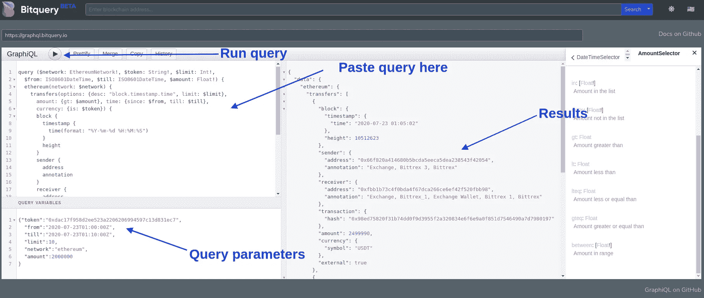
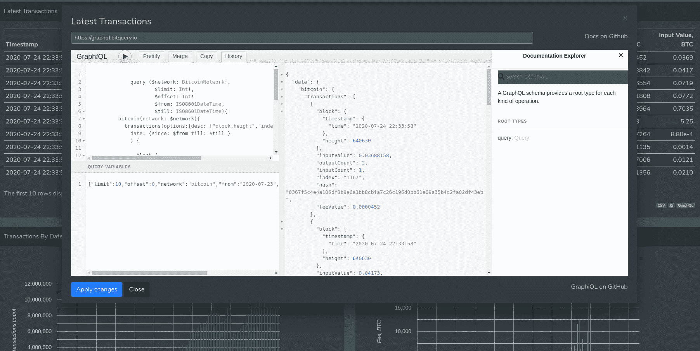
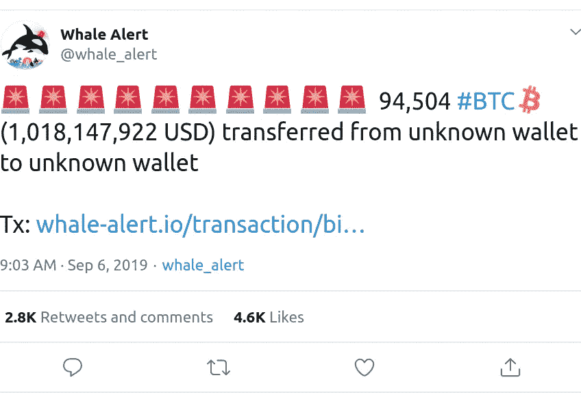

# 在 10 分钟内创建一个类似鲸鱼警报的服务(加密警报)

> 原文：<https://medium.com/coinmonks/create-a-whalealert-like-service-in-10-minutes-crypto-alert-401242399d36?source=collection_archive---------3----------------------->

WhaleAlert 是一项通知大型加密交易的服务。

在本文中，我们将了解如何在几分钟内使用 Bitquery APIs 构建一个类似 WhaleAlert 的加密警报服务。

每当有价值超过 200 万 USDT 的交易时，我们的加密警报服务将通知用户。

构建加密警报服务以获取相关区块链数据的最困难部分。比方说，我们希望我们的提醒服务应该“给予所有超过 1000 BTC 的比特币交易”

通常，要从头开始构建加密警报服务，您需要执行以下步骤:

2.持续获取交易数据并对其进行索引

3.然后查询该数据以获得期望的结果

但是，Bitquery 为您解决了第一步和第二步。因此，您只需要跨多个区块链调用我们的 API 来获得期望的结果。

是的，多重区块链。我们公开了 20 多个区块链的统一 API。因此，集成多个区块链变得非常容易。

# 先决条件

要构建加密警报服务，您需要具备编程知识和编写 GraphQL 查询的能力。如果您不知道 GraphQL check，请不要担心，我们提供了许多示例查询来帮助您入门。

Bitquery 暴露[单个 GraphQL 端点](https://explorer.bitquery.io/graphql)查询 20 多个区块链。我们的 GraphQL APIs 是详细的、可扩展的，并提供统一的接口。点击了解更多关于 bit query graph QL API[的信息。](https://bitquery.io/labs/graphql)

**也可以理解为:** [**你的网站的加密图表部件(包括 WordPress)**](https://blog.bitquery.io/crypto-chart-on-your-website-wordpress)

# USDT 警报服务

假设我们希望对每笔价值超过 200 万美元的 USDT(Tether)交易发出警报。由于我们想要非常具体的结果，我们需要为此编写一个 GraphQL 查询，并在 Bitquery GraphQL 接口上测试它。

[这里的](https://gist.github.com/buddies2705/7c3cbc14a368106e2c9855e2ac41be70)是查询，可以在 [Bitquery GraphQL 接口](https://explorer.bitquery.io/graphql)上测试。

只需复制粘贴如下所示的查询和参数，并运行查询来测试它。您将在页面的中间面板看到想要的结果。

上面提到的查询是一个标准的 GraphQL 查询。GraphQL 有一点点学习曲线，但是你可以在网上找到很多教程。

# 了解查询和结果

在继续之前，让我们理解我们的查询和参数。如您所见，我们在查询中传递一些参数，然后检索警报所需的详细信息。

因为我们需要持续的提醒；因此，我们将每隔 10 分钟运行一次查询，查看是否有任何价值超过 200 万美元的 USDT 交易。

*   token —这里，我们正在传递 [USDT token 合约地址](https://explorer.bitquery.io/ethereum/token/0xdac17f958d2ee523a2206206994597c13d831ec7)。要获得以太坊上任何其他令牌的类似结果，可以传递该令牌的契约地址。
*   出发地:开始时间
*   直到:结束时间
*   极限:我们想要多少结果
*   网络—以太坊
*   金额—2000000(200 万)

结果中重要的注意事项是注释。我们已经建立了内部地址分类技术来识别区块链地址，并向他们提供查询结果。

因此，上面的查询告诉我们，一个 Bittrex exchange 钱包向另一个 Bittrex exchange 钱包转移了 2499990 USDT。你也可以在 [Bitquery explorer](https://explorer.bitquery.io/) 上验证这个交易。

# 建筑警报服务

获取数据是最难的部分，我们让它变得简单了。现在你可以在推特上发布这些提醒，或者为交易者创建一个通知工具。

如果你计划建立一个 twitter 机器人，只需用你最喜欢的编程语言在谷歌上搜索一个 Twitter 库。为了简洁起见，我们不做 Twitter 机器人。

# 更多加密警报

我们已经展示了一个 USDT 系绳警报的例子。但是，您可以查看 Bitquery explorer 以查看更多查询示例。

比如建立比特币警报，可以在这里勾选查询[(点击右下角的“GraphQL”)。您只需要稍微操作一下查询就可以得到想要的结果。](https://explorer.bitquery.io/bitcoin/transactions)

# 包扎

我们的工具帮助您以最简单的方式查询区块链。在 Bitquery，我们对区块链数据充满热情，并让开发人员能够利用这些数据来构建有用的工具。如果你对区块链数据有什么特别的想法，或者在跟随教程的过程中遇到了困难，请通过我们的[电报频道](https://t.me/Bloxy_info)告诉我们。

**也可阅读:** [**为你的网站(包括 WordPress)制作的加密图表小工具**](https://blog.bitquery.io/crypto-chart-on-your-website-wordpress)

# 关于 Bitquery

[**Bitquery**](https://bitquery.io/?source=blog&utm_medium=about_coinpath) 是一套软件工具，以统一的方式解析、索引、访问、搜索和使用区块链网络上的信息。我们的产品是:

如果您对我们的产品有任何疑问，请通过我们的[电报频道](https://t.me/Bloxy_info)提问，或发邮件至 [hello@bitquery.io](mailto:hello@bitquery.io) 联系我们。此外，请订阅我们下面的时事通讯，我们将为您提供加密货币世界的最新动态。

*原载于 2020 年 7 月 25 日*[*https://blog . bit query . io*](https://blog.bitquery.io/crypto-alert-service-like-whale-alert)*。*

> [*在您的收件箱中直接获得最佳软件交易*](https://coincodecap.com/?utm_source=coinmonks)

