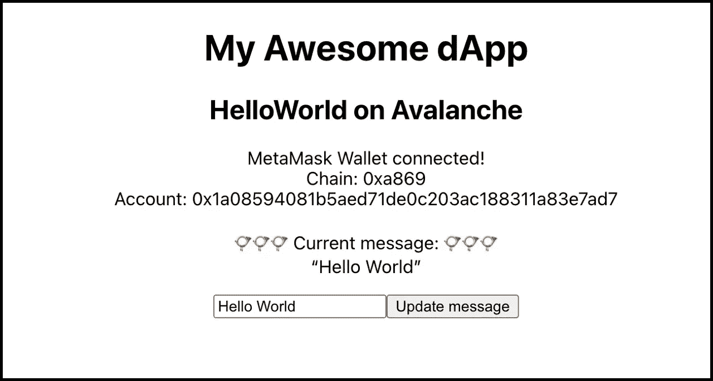
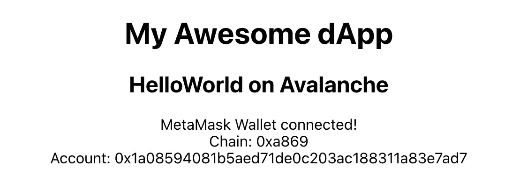
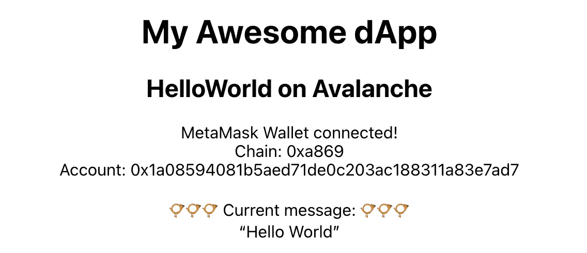
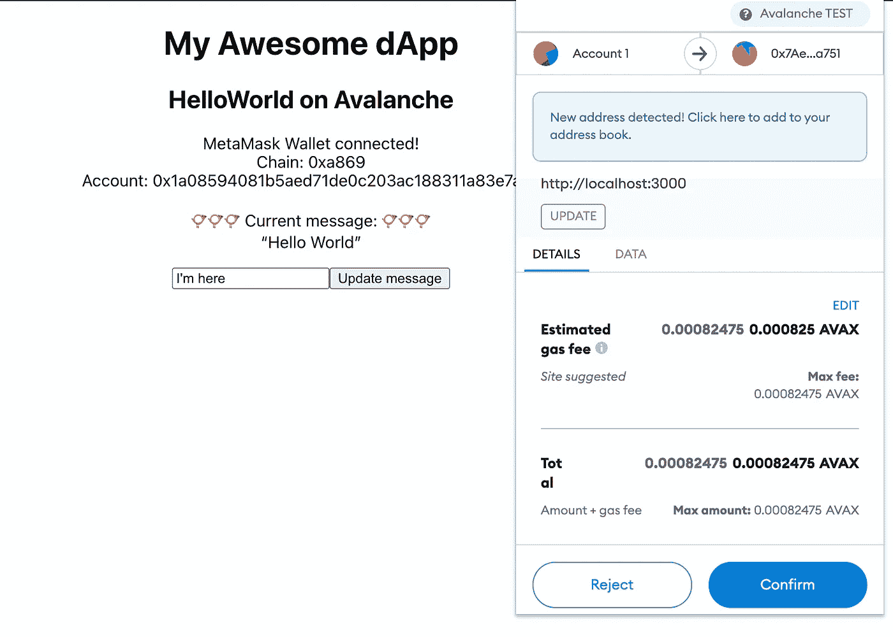

# 用乙醚制造雪崩 dApp，Metamask 和 React

> 原文：<https://medium.com/coinmonks/create-an-avalanche-dapp-with-ethers-metamask-and-react-342d8d22cb30?source=collection_archive---------1----------------------->

*如何在 React 中为雪崩合约创建 dApp 的快速分步指南。*



dApp with basic read and write functionality

本文是如何在 Avalanche 上构建 dApp 系列文章的第 2 部分。点击此处查看其他部分:

*   [第 1 部分:使用 Hardhat](/@a.a.lechner/create-and-deploy-a-solidity-contract-to-avalanche-with-hardhat-2c5cd5e4fa93) 创建并部署一个 Solidity 契约来雪崩
*   [第 3 部分:用 IPFS 和 AWS 托管一个去中心化的应用](/@a.a.lechner/host-a-decentralised-application-with-ipfs-and-aws-1c8e147284ce)
*   [第 4 部分:链接一个域名到 IPFS 托管的 dApp](/@a.a.lechner/link-a-domain-to-a-dapp-hosted-on-ipfs-6cf155ef689f)

## 使用的软件版本:

*   nodejs: v16.13.0
*   安全帽:2.7.0
*   以太坊-华夫饼:3.4.0
*   醚:5.5.1
*   元掩码/入门:1.0.1
*   反应:17.0.2

## 第一步

我们将继续使用第 1 部分中的代码。如果你还没有读过，就看看吧，或者从这个资源库中检查代码开始:[https://github.com/lechneal/solidity-hello-world-contract](https://github.com/lechneal/solidity-hello-world-contract)

```
$ git clone [https://github.com/lechneal/solidity-hello-world-contract](https://github.com/lechneal/solidity-hello-world-contract) my-awesome-contract
```

在上一个教程中，我们创建了一个可靠性契约。在本教程中，我们将建立一个 dApp。为了明确区分，我们将该文件夹重命名为`my-awesome-dapp`:

```
$ mv my-awesome-contract my-awesome-dapp
```

## 第二步

让我们使用 ReactJS 来构建 dApp 的前端。我们将在 hardhat 项目中创建前端，在一个名为`frontend`的新文件夹中:

```
$ cd my-awesome-dapp
$ npx create-react-app frontend
```

这将创建一个虚拟的 react 应用程序，我们将在接下来的步骤中对其进行修改。要运行虚拟应用程序，进入前端文件夹，用`npm start`运行它:

```
$ cd frontend
$ npm start
Compiled successfully!You can now view frontend in the browser.Local:            [http://localhost:3000](http://localhost:3000)
```

## 第三步

为了与 Avalanche 网络上的合同进行交互，我们的应用程序需要一些合同元数据。我们将自动生成此元数据作为合同部署流程的一部分，并将其存储在`frontend/src/contracts`中。因此，让我们创建所需的文件夹:

```
$ cd ..
$ mkdir -p frontend/src/contracts
```

现在让我们修改部署脚本，以便将契约元数据存储在新创建的文件夹中:

[https://github.com/lechneal/solidity-hello-world-dapp/blob/main/scripts/deploy.js](https://github.com/lechneal/solidity-hello-world-dapp/blob/main/scripts/deploy.js)

现在，让我们继续将合同部署到雪崩测试网络:

```
$ npx hardhat run scripts/deploy.js --network avalancheTest
Deploying contracts with account: 0x1a08594081B5AED71de0c203AC188311a83e7aD7
Account balance: 9644089875000000000
HelloWorld address: 0x64aD192f8371dCa9eD9C52d761bafD001829ce62
Stored address in  /Users/username/my-awesome-dapp/scripts/../frontend/src/contracts/helloworld-address.json
Stored artifact in  /Users/username/my-awesome-dapp/scripts/../frontend/src/contracts/HelloWorld.json
```

正如您看到的，部署脚本创建了 2 个新文件:

*   `frontend/src/contracts/helloworld-address.json`:包含雪崩网络上的[合同地址](https://testnet.snowtrace.io/address/0x1a08594081B5AED71de0c203AC188311a83e7aD7)
*   `frontend/src/contracts/HelloWorld.json`:契约神器，包括[契约的 ABI](https://docs.soliditylang.org/en/v0.5.3/abi-spec.html) 。

## 第四步

现在，每次部署合同时，我们都会更新合同元数据。但是为了让用户与合同进行交互，我们还需要连接到一个钱包。

对于我们的 dApp，我们将支持[元掩码](https://metamask.io/)钱包。这意味着，想要使用我们的 dApp 的用户需要安装 MetaMask wallet。

因为安装和连接到钱包可能会很麻烦，所以我们会让这个过程对用户来说尽可能简单。我们将使用 MetaMask Onboarding 库，如果 MetaMask 尚未安装，它会将用户重定向到正确的安装页面。此外，我们将提示用户自动设置雪崩的元掩码。

让我们安装 Metamask Onboarding 依赖项:

```
$ cd frontend
$ npm install [@metamask/onboarding](http://twitter.com/metamask/onboarding)
```

对于入职流程，我们将在`frontend/src/components/Onboarding.js`中创建一个专用组件:

[https://github.com/lechneal/solidity-hello-world-dapp/blob/main/frontend/src/components/Onboarding.js](https://github.com/lechneal/solidity-hello-world-dapp/blob/main/frontend/src/components/Onboarding.js)

该组件有 4 种不同的状态:

*   用户没有在浏览器中安装元掩码:然后显示一个链接到元掩码插件安装页面的按钮
*   用户已经安装了元掩码，但是还没有授予 dApp 访问帐户信息的权限:然后显示一个请求访问元掩码的按钮
*   用户安装了元掩码并获得了所有权限，但没有选择正确的链(雪崩):然后要求用户切换到雪崩链
*   用户已经给出了所有权限，并且在正确的链上(雪崩):然后显示帐户和链信息

现在让我们将入职培训组件添加到我们在`frontend/src/App.js`的应用程序中:

[https://github.com/lechneal/solidity-hello-world-dapp/blob/main/frontend/src/App.js](https://github.com/lechneal/solidity-hello-world-dapp/blob/main/frontend/src/App.js)

使用`npm start`运行应用程序，查看 onboarding 组件的运行情况。连接 MetaMask 钱包并切换到 Avalanche 链后，它应该是这样的:



Successfully connected to MetaMask and the Avalanche Test Network

## 第五步

一旦用户成功连接了 MetaMask 钱包并选择了 Avalanche 链，我们就可以连接 Avalanche 合同了。为此，我们将实现 OnboardingButton 的`onConnected`处理程序。

来更新一下`frontend/src/App.js`:

[https://github.com/lechneal/solidity-hello-world-dapp/blob/main/frontend/src/App.js](https://github.com/lechneal/solidity-hello-world-dapp/blob/main/frontend/src/App.js)

为了与我们的合同进行交互，我们使用了`ethers.js`包。用户连接后，我们做的第一件事是使用 MetaMask wallet 实现`window.ethereum`创建一个 ethers-provider。然后，我们基于步骤 3 中创建的地址和工件创建一个契约对象。我们可以像使用任何其他 JS 对象一样使用合同对象，但是在幕后`ether.js`正在与雪崩网络上的实际合同进行交互。

一旦创建了契约对象，我们就可以获取契约的最新消息了。这可以通过调用契约的公共方法`message`来完成:`await contract.message()`。
我们还设置了一个间隔，每 30 秒获取一次最新消息。

如果我们运行该应用程序，它将看起来像这样:



## 第六步

我们现在向用户显示最新的消息。下一步是允许用户通过在 Avalanche 网络上创建事务来修改消息。

为此，让我们在`frontend/src/components/UpdateForm.js`中添加一个新组件:

[https://github.com/lechneal/solidity-hello-world-dapp/blob/main/frontend/src/components/UpdateForm.js](https://github.com/lechneal/solidity-hello-world-dapp/blob/main/frontend/src/components/UpdateForm.js)

该组件要么显示正在进行的事务的散列，要么显示允许用户更新消息的简单输入表单。

接下来我们将在`App.js`中包含这个组件:

[https://github.com/lechneal/solidity-hello-world-dapp/blob/main/frontend/src/App.js](https://github.com/lechneal/solidity-hello-world-dapp/blob/main/frontend/src/App.js)

我们将更新表单添加到应用程序中，并在用户单击“提交”时调用`updateMessage`方法。在 update 方法中，我们首先调用契约的 update 方法:

```
const tx = await this.state.contract.update(newMessage)
```

这将创建一个新的交易，它会在元掩码中打开一个弹出窗口，需要用户确认(**并支付**):



一旦用户确认了交易，雪崩交易被提交，我们需要等待，直到包括该交易的块被挖掘。我们将使用下面的行来等待:

```
await tx.wait()
```

一旦完成，我们就得到一个`receipt`对象。该收据包含一个状态字段，指示是否发生了异常。

如果事务成功，我们将获取最新的消息(超时 1 秒)。如果交易不成功，我们将显示错误消息。

## 第七步

就这样，我们的 dApp 完成了。剩下要做的就是构建应用程序并部署它。

```
$ npm run build
> frontend@0.1.0 build
> react-scripts buildCreating an optimized production build...
Compiled successfully.File sizes after gzip:176.98 KB  build/static/js/2.3b7fde82.chunk.js
  3.4 KB     build/static/js/main.06f52d40.chunk.js
  769 B      build/static/js/runtime-main.ff5b8ea4.js
  292 B      build/static/css/main.106baaae.chunk.css...
```

这会在`my-awesome-dapp/frontend/build`中生成构建文件。

**查看本系列的下一部分:** [第 3 部分:用 IPFS 和 AWS 托管一个分散的应用程序](/@a.a.lechner/host-a-decentralised-application-with-ipfs-and-aws-1c8e147284ce)

## 资源和链接:

*   创建一个简单的 React app:[https://React js . org/docs/create-a-new-React-app . html # create-React-app](https://reactjs.org/docs/create-a-new-react-app.html#create-react-app)
*   使用 Metamaks 创建 dApp:[https://docs . meta mask . io/guide/create-dApp . html # project-setup](https://docs.metamask.io/guide/create-dapp.html#project-setup)
*   以编程方式将 Avalanche 添加到元掩码:[https://docs . avax . network/build/tutorials/smart-contracts/add-Avalanche-to-meta mask-programmable/](https://docs.avax.network/build/tutorials/smart-contracts/add-avalanche-to-metamask-programmatically/)
*   ethers . js[https://github.com/ethers-io/ethers.js](https://github.com/ethers-io/ethers.js)

> 加入 Coinmonks [电报频道](https://t.me/coincodecap)和 [Youtube 频道](https://www.youtube.com/c/coinmonks/videos)了解加密交易和投资

## 另外，阅读

*   [AscendEx Staking](https://blog.coincodecap.com/ascendex-staking)|[Bot Ocean Review](https://blog.coincodecap.com/bot-ocean-review)|[最佳比特币钱包](https://blog.coincodecap.com/bitcoin-wallets-india)
*   [霍比评论](https://blog.coincodecap.com/huobi-review) | [OKEx 保证金交易](https://blog.coincodecap.com/okex-margin-trading) | [期货交易](https://blog.coincodecap.com/futures-trading)
*   [麻雀交换评论](https://blog.coincodecap.com/sparrow-exchange-review) | [纳什交换评论](https://blog.coincodecap.com/nash-exchange-review)
*   [美国最佳加密交易机器人](https://blog.coincodecap.com/crypto-trading-bots-in-the-us) | [不断回顾](https://blog.coincodecap.com/changelly-review)
*   [在印度利用加密套利赚取被动收入](https://blog.coincodecap.com/crypto-arbitrage-in-india)
*   [Godex.io 审核](/coinmonks/godex-io-review-7366086519fb) | [邀请审核](/coinmonks/invity-review-70f3030c0502) | [BitForex 审核](https://blog.coincodecap.com/bitforex-review)
*   [最佳比特币保证金交易](/coinmonks/bitcoin-margin-trading-exchange-bcbfcbf7b8e3) | [萝莉点评](/coinmonks/lolli-review-e6ddc7895ad8) | [比特币保证金交易](https://blog.coincodecap.com/bityard-margin-trading)
*   [创造并出售你的第一个 NFT](https://blog.coincodecap.com/create-nft) | [密码交易机器人](https://blog.coincodecap.com/best-crypto-trading-bots)
*   [如何在 CoinDCX 上购买柴犬(SHIB)币？](https://blog.coincodecap.com/buy-shiba-coindcx)
*   [折叠 App 回顾](https://blog.coincodecap.com/fold-app-review) | [LocalBitcoins 回顾](/coinmonks/localbitcoins-review-6cc001c6ed56) | [Bybit vs 币安](https://blog.coincodecap.com/bybit-binance-moonxbt)
*   [加密保证金交易交易所](/coinmonks/crypto-margin-trading-exchanges-428b1f7ad108) | [赚取比特币](/coinmonks/earn-bitcoin-6e8bd3c592d9) | [Mudrex 投资](https://blog.coincodecap.com/mudrex-invest-review-the-best-way-to-invest-in-crypto)
*   [WazirX vs coin dcx vs bit bns](/coinmonks/wazirx-vs-coindcx-vs-bitbns-149f4f19a2f1)|[block fi vs coin loan vs Nexo](/coinmonks/blockfi-vs-coinloan-vs-nexo-cb624635230d)
*   [比斯勒评论](https://blog.coincodecap.com/bitsler-review)|[WazirX vs coin switch vs coin dcx](https://blog.coincodecap.com/wazirx-vs-coinswitch-vs-coindcx)
*   [7 大副本交易平台](https://blog.coincodecap.com/copy-trading-platforms) | [BuyCoins 点评](https://blog.coincodecap.com/buycoins-review)