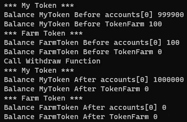

# 创建一个 DeFi 应用程序并将其部署到以太坊

> 原文：<https://medium.com/coinmonks/create-and-deploy-a-defi-app-to-ethereum-a02bb680aa78?source=collection_archive---------0----------------------->

## 分散金融

## 将 ERC20 代币存入智能合同并铸造农场代币

[Ethereum Cryptocurrency The Value — Free photo on Pixabay](https://pixabay.com/photos/ethereum-cryptocurrency-3818347/)

分散融资在 2020 年非常受欢迎，并将在未来几年保持增长。它包括分散的金融服务，如分散的交易所(如 Uniswap、Curve、Balancer)和分散的借贷(如 Aave)。它们是开源的，大部分都是在以太坊上构建的。

在本文中，我们将构建一个具有可靠性的 DeFi 应用程序，用户可以将一个 ERC20 令牌存入智能合约，智能合约将铸造并向用户转移农场令牌。用户稍后可以通过在智能合同上烧录他们的场令牌来撤回他们的 ERC20 令牌，ERC20 令牌将被转移回给他们。

# 安装松露和加纳切

如果这是您第一次编写智能合同，您将需要设置您的环境。我们要用两个工具:[松露](https://www.trufflesuite.com/)和 [Ganache](https://www.trufflesuite.com/ganache) 。

Truffle 是为以太坊开发智能合约的开发环境和测试框架。有了 Truffle，就可以很容易地在区块链建立和部署智能合约。Ganache 允许我们创建一个本地以太坊区块链来测试智能合约。它模拟真实网络的功能，前 10 个帐户由 100 个测试以太网资助，从而使智能合约部署和测试变得轻松自如。Ganache 可以作为桌面应用程序和命令行工具使用。对于本文，我们将使用 UI 桌面应用程序。

Ganache UI desktop application

要创建项目，请运行以下命令

`mkdir YourProjectName
cd YourProjectName
truffle init`

这将为我们的智能合约的开发和部署创建一个空白项目。创建的项目结构如下:

*   `contracts`:solidity 智能合约文件夹
*   `migrations`:部署脚本文件夹
*   `test`:测试我们智能合约的文件夹
*   `truffle-config.js`:松露配置文件

# 创建 ERC20 令牌

首先，我们需要创建我们的 ERC20 令牌，我们将使用它在智能合约上下注。为了创建我们的可替换令牌，我们首先需要安装 OpenZeppelin 库。该库包含 ERC20 和 ERC721 等标准的实现。要安装它，请运行以下命令:

`npm install @openzeppelin/contracts`

使用`openzeppelin`库，我们可以用下面的 solidity 代码创建名为`MyToken`的 ERC20 令牌:

Create our ERC20 token

在上面的代码中:

*   第 3 行:我们从包含这个令牌标准实现的`openzeppelin`导入契约`ERC20.sol`。
*   第 5 行:我们继承了`ERC20.sol`契约。
*   第 6 行:我们调用`ERC20.sol`构造函数，并将`name`和`symbol`参数分别作为`"MyToken"`和`"MTKN"`传递。
*   第 7 行:我们为正在部署智能合约的帐户铸造并转移 100 万个令牌(我们对 ERC20 令牌使用默认的 18 位小数，这意味着如果我们要铸造 1 个令牌，您将把它表示为 10000000000000000，1 带有 18 个零)。

我们可以在下面看到`ERC20.sol`构造函数的实现，其中`_decimals`字段被设置为 18:

ERC20.sol constructor

# 部署 ERC20 令牌

在`migrations`文件夹中，创建一个名为`2_deploy_Tokens.js`的文件。这个文件是我们部署 ERC20 令牌和 FarmToken 智能合约的地方。下面的代码用于部署我们的`MyToken.sol`合同:

Deploy ERC20 token

为了编译我们的智能契约，我们必须首先检查我们的 solidity 编译器版本。您可以通过运行以下命令进行检查:

`truffle version`

默认版本是`Solidity v0.5.16`。由于我们的令牌是使用 solidity 版本`0.6.2`编写的，如果我们运行命令来编译我们的契约，我们将会得到一个编译器错误。为了指定使用哪个 solidity 编译器版本，转到文件`truffle-config.js`并设置所需的编译器版本，如下所示:

truffle-config.js

现在，我们可以通过运行以下命令来编译我们的智能合约:

`truffle compile`

编译之后，我们现在可以部署令牌了。为此，打开 Ganache 并选择“快速启动”选项来启动本地以太坊区块链。要部署我们的合同，请运行:

`truffle migrate`

用于部署我们的合同的地址是 Ganache 向我们显示的地址列表中的第一个地址。为了验证这一点，我们可以打开 Ganache 桌面应用程序，我们可以验证第一个帐户的以太网余额已经减少，这是由于部署我们的智能合同的以太网成本:

Ganache desktop application

为了验证 100 万个`MyToken`令牌已经被发送到部署者地址，我们可以使用 Truffle 控制台与我们部署的智能契约进行交互。

> [Truffle 控制台是一个基本的交互式控制台，可以连接到任何以太坊客户端。](https://www.trufflesuite.com/docs/truffle/getting-started/using-truffle-develop-and-the-console)

为了与我们的智能合同进行交互，请运行以下命令:

`truffle console`

现在，我们可以在终端中编写以下命令:

*   获取智能合约:`myToken = await MyToken.deployed()`
*   从加纳切:`accounts = await web3.eth.getAccounts()`获取账户数组
*   获取第一个账户的余额:`balance = await myToken.balanceOf(accounts[0])`
*   从 18 位小数格式化余额:`web3.utils.fromWei(balance.toString())`

通过运行上面的命令，我们将看到第一个地址实际上有一百万个 MyTokens:

First address has 1000000 MyTokens

# 创建 FarmToken 智能合同

FarmToken 智能合约将有 3 个功能:

*   `balance()`:获取 FarmToken 智能合约上的 MyToken 余额。
*   `deposit(uint256 _amount)`:代表用户将 MyToken 转移到 FarmToken 智能合约，然后创建并转移 FarmToken 给用户。
*   `withdraw(uint256 _amount)`:刻录用户的 FarmTokens，将 MyTokens 转移到用户的地址。

让我们看看 FarmToken 构造函数:

FarmToken.sol

*   第 3–6 行:我们正在从 openzeppelin 导入以下合同:`IERC20.sol`、`Address.sol`、`SafeERC20.sol`和`ERC20.sol`。
*   第 8 行:FarmToken 将从 ERC20 契约继承。
*   第 14–19 行:FarmToken 构造函数将接收 MyToken 契约的地址作为参数，我们将把它的契约赋给我们的公共变量`token`。

让我们实现`balance()`函数。它将不会接收任何参数，并将返回这个智能合约上 MyToken 的余额。它的实现如下所示:

balance function

对于`deposit(uint256 _amount)`函数，它将接收用户想要存入的金额作为参数，并且它将铸造和转移 FarmTokens 给用户:

deposit function

对于`withdraw(uint256 _amount)`函数，我们将接收用户想要刻录的 FarmTokens 数量作为参数，然后将相同数量的 MyTokens 传输回用户:

withdraw function

现在，我们将部署我们的智能合约。为此，我们将返回到文件`2_deploy_Tokens.js`并添加要部署的新合同:

2_deploy_MyTokenAndFarmToken.js

注意，在部署 FarmToken 时，我们将已部署的 MyToken 契约的地址作为参数传递。

现在，运行`truffle compile`和`truffle migrate`来部署我们的合同。

让我们测试我们的智能合约。我们将创建一个脚本来自动化这个过程，而不是使用`truffle console`来与我们的智能合同进行交互。创建一个名为`scripts`的文件夹，并添加下面的文件`getMyTokenBalance.js`。它将检查 FarmToken 智能合约上 MyTokens 的余额:

`getMyTokenBalance.js`

要执行此脚本，请运行以下 cli 命令:

`truffle exec .\scripts\getMyTokenBalance.js`

我们将得到预期的结果，即 0。

现在，让我们将 MyToken 与智能合约关联起来。因为函数`deposit(uint256 _amount)`从 ERC20 调用函数`safeTransferFrom`，所以用户必须首先批准智能合约以代表用户传输 MyToken。因此，在下面的脚本中，我们将首先批准这一步骤，然后调用函数:

transferMyTokenToFarmToken.js

要运行这个脚本:`truffle exec .\scripts\transferMyTokenToFarmToken.js`。您应该在控制台上看到:

output of `transferMyTokenToFarmToken.js`

正如我们所看到的，我们已经成功地将 MyTokens 存放到智能合约中，因为第一个帐户现在有了 FarmTokens。

为了退出:

withdrawMyTokenFromTokenFarm.js

要运行这个脚本:`truffle exec .\scripts\withdrawMyTokenFromTokenFarm.js`。正如我们在下面的输出中看到的，我们成功地取回了 MyTokens，并烧毁了 FarmTokens:

output of withdrawMyTokenFromTokenFarm.js

# 结论

在本文中，我们用 Truffle 和 Ganache 设置了我们的开发环境，并创建了一个 DeFi 应用程序，用户可以在其中存放 my token 并获取 farm token，并且可以通过烧毁他们的 farm token 来收回 my token。

如果你有兴趣了解更多关于 DeFi 的知识，下面的参考资料部分有一些关于这个主题的有趣文章。

下面的 GitHub repo 提供了所有这些代码:

[strykerin/DeFi-Token-Farm(github.com)](https://github.com/strykerin/DeFi-Token-Farm)

# 参考

[合同— OpenZeppelin 文档](https://docs.openzeppelin.com/contracts/3.x/)

[智能合约的甜蜜工具| Truffle 套件](https://www.trufflesuite.com/)

[加纳切|松露组曲](https://www.trufflesuite.com/ganache)

[什么是 DeFi？初学者指南(2021 年更新)](https://99bitcoins.com/what-is-defi/)

[DeFi——DeFi Pulse 的分散财务排行榜](https://defipulse.com/)

## 另外，阅读

*   [学习以太坊和 Web3 开发](http://blog.coincodecap.com/go/learn)
*   最好的[密码交易机器人](/coinmonks/crypto-trading-bot-c2ffce8acb2a)
*   [3 商业评论](/coinmonks/3commas-review-an-excellent-crypto-trading-bot-2020-1313a58bec92)
*   [Pionex 回顾](/coinmonks/pionex-review-exchange-with-crypto-trading-bot-1e459d0191ea)
*   [AAX 交易所评论](/coinmonks/aax-exchange-review-2021-67c5ea09330c) |推荐代码、交易费用、利弊
*   [Deribit 审查](/coinmonks/deribit-review-options-fees-apis-and-testnet-2ca16c4bbdb2) |选项、费用、API 和 Testnet
*   [FTX 密码交易所评论](/coinmonks/ftx-crypto-exchange-review-53664ac1198f)
*   [n 零审核](/coinmonks/ngrave-zero-review-c465cf8307fc)
*   [Bybit 交换审查](/coinmonks/bybit-exchange-review-dbd570019b71)
*   [3Commas vs Cryptohopper](/coinmonks/3commas-vs-pionex-vs-cryptohopper-best-crypto-bot-6a98d2baa203)
*   最好的比特币[硬件钱包](/coinmonks/the-best-cryptocurrency-hardware-wallets-of-2020-e28b1c124069?source=friends_link&sk=324dd9ff8556ab578d71e7ad7658ad7c)
*   [密码本交易平台](/coinmonks/top-10-crypto-copy-trading-platforms-for-beginners-d0c37c7d698c)
*   最佳 [monero 钱包](https://blog.coincodecap.com/best-monero-wallets)
*   [莱杰纳米 s vs x](https://blog.coincodecap.com/ledger-nano-s-vs-x)
*   [bits gap vs 3 commas vs quad ency](https://blog.coincodecap.com/bitsgap-3commas-quadency)
*   最好的[加密税务软件](/coinmonks/best-crypto-tax-tool-for-my-money-72d4b430816b)
*   [最佳加密交易平台](/coinmonks/the-best-crypto-trading-platforms-in-2020-the-definitive-guide-updated-c72f8b874555)
*   最佳[加密贷款平台](/coinmonks/top-5-crypto-lending-platforms-in-2020-that-you-need-to-know-a1b675cec3fa)
*   [莱杰纳米 S vs 特雷佐 one vs 特雷佐 T vs 莱杰纳米 X](https://blog.coincodecap.com/ledger-nano-s-vs-trezor-one-ledger-nano-x-trezor-t)
*   [block fi vs Celsius](/coinmonks/blockfi-vs-celsius-vs-hodlnaut-8a1cc8c26630)vs Hodlnaut
*   Bitsgap 评论——一个轻松赚钱的加密交易机器人
*   [Quadency Review](/coinmonks/quadency-review-a-crypto-trading-automation-platform-3068eaa374e1) -为专业人士打造的加密交易机器人
*   [PrimeXBT 评论](/coinmonks/primexbt-review-88e0815be858) |杠杆交易、费用和交易
*   [alt ready 审查](https://blog.coincodecap.com/altrady-reivew)
*   [埃利帕尔泰坦评论](/coinmonks/ellipal-titan-review-85e9071dd029)
*   [SecuX Stone 评论](https://blog.coincodecap.com/secux-stone-hardware-wallet-review)
*   [BlockFi 评论](/coinmonks/blockfi-review-53096053c097) |赚取高达 8.6%的加密利息
*   [共同规则审查](https://blog.coincodecap.com/coinrule-review-a-perfect-trading-bot)
*   [最佳区块链分析工具](https://bitquery.io/blog/best-blockchain-analysis-tools-and-software)
*   [加密套利](/coinmonks/crypto-arbitrage-guide-how-to-make-money-as-a-beginner-62bfe5c868f6)指南:新手如何赚钱
*   最佳加密制图工具
*   了解比特币的[最佳书籍有哪些？](/coinmonks/what-are-the-best-books-to-learn-bitcoin-409aeb9aff4b)

> [直接在您的收件箱中获得最佳软件交易](/coinmonks/newsletters/coinmonks)

