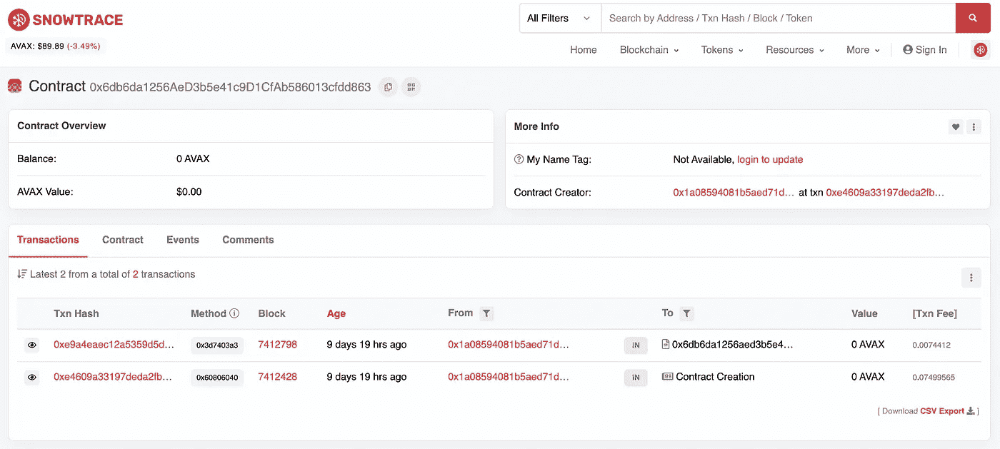

# 创建并部署一个可靠性合同，以便与 Hardhat 一起雪崩

> 原文：<https://medium.com/coinmonks/create-and-deploy-a-solidity-contract-to-avalanche-with-hardhat-2c5cd5e4fa93?source=collection_archive---------1----------------------->

## 关于如何使用 Hardhat 创建 Solidity 契约并将其部署到 Avalanche(测试和 Mainnet)的快速分步指南。



Deployed Contract on Avalanche

本文是如何在 Avalanche 上构建 dApp 系列文章的第 1 部分。点击此处查看其他部分:

*   [第二部分:用醚、金属屏蔽和反应制造雪崩 dApp](/@a.a.lechner/create-an-avalanche-dapp-with-ethers-metamask-and-react-342d8d22cb30)
*   [第 3 部分:用 IPFS 和 AWS 托管一个去中心化的应用](/@a.a.lechner/host-a-decentralised-application-with-ipfs-and-aws-1c8e147284ce)
*   [第 4 部分:链接一个域名到 IPFS 托管的 dApp](/@a.a.lechner/link-a-domain-to-a-dapp-hosted-on-ipfs-6cf155ef689f)

## 使用的软件版本:

*   nodejs: v16.13.0
*   安全帽:2.6.8
*   以太坊-华夫饼:3.4.0
*   醚:5.5.1

Github 上的代码:[https://github.com/lechneal/solidity-hello-world-contract](https://github.com/lechneal/solidity-hello-world-contract)

## 第一步

首先，我们将创建一个新文件夹并安装 hardhat:

```
$ mkdir my-awesome-contract
$ cd my-awesome-contract
$ npm install --save-dev hardhat
```

现在让我们启动一个安全帽项目:

`$ npx hardhat`(选择选项“创建一个空的 hardhat.config.js”)

这创建了一个基本的`hardhead.config.js`文件，我们稍后将更新它。

让我们也为我们的文件创建几个文件夹:

`$ mkdir scripts contracts test`

## 第二步

现在让我们在`contracts/HelloWorld.sol`创建第一个可靠性合同:

[https://github.com/lechneal/solidity-hello-world-contract/blob/master/contracts/HelloWorld.sol](https://github.com/lechneal/solidity-hello-world-contract/blob/master/contracts/HelloWorld.sol)

如你所见，这个契约包含一个变量`message`，可以在创建契约时通过调用`update`方法来设置。

尝试用以下内容编写合同:

```
$ npx hardhat compile
Compiling 1 file with 0.7.3
Compilation finished successfully
```

## 第三步

由于智能合同是不可变的，我们最好把合同做好。让我们设置我们的环境并添加一个测试。

首先让我们安装一些附加的依赖项:

```
$ npm install --save-dev @nomiclabs/hardhat-ethers ethers @nomiclabs/hardhat-waffle ethereum-waffle chai
```

我们使用 chai 作为测试库，Ethers.js 和 Waffle 与我们的合同进行交互。

在您的`hardhat.config.js`文件中导入 waffle，看起来像这样:

[https://github.com/lechneal/solidity-hello-world-contract/blob/master/hardhat.config.js](https://github.com/lechneal/solidity-hello-world-contract/blob/master/hardhat.config.js)

现在让我们在`test/HelloWorld.js`添加一个测试:

[https://github.com/lechneal/solidity-hello-world-contract/blob/master/test/HelloWorld.js](https://github.com/lechneal/solidity-hello-world-contract/blob/master/test/HelloWorld.js)

现在让我们运行我们的测试:

```
$ npx hardhat testHelloWorld contract
    ✓ Deployment should set the initial message (326ms)
Address 0x70997970c51812dc3a010c7d01b50e0d17dc79c8 updating message
Address 0x3c44cdddb6a900fa2b585dd299e03d12fa4293bc updating message
    ✓ Updating overwrites the message (64ms)2 passing (392ms)
```

🙌所有测试都通过了

## 第四步

现在我们有了合同，测试也成功了，让我们添加部署脚本。为了简单起见，我们将简单地重用来自 Hardhat 教程的部署脚本，所以让我们创建文件`scripts/deploy.js`:

[https://github.com/lechneal/solidity-hello-world-contract/blob/master/scripts/deploy.js](https://github.com/lechneal/solidity-hello-world-contract/blob/master/scripts/deploy.js)

让我们通过将合同部署到本地 Hardhat 测试网络来测试一切:

```
$ npx hardhat run scripts/deploy.js
Deploying contracts with the account: 0xf39Fd6e51aad88F6F4ce6aB8827279cffFb92266
Account balance: 10000000000000000000000
Token address: 0x5FbDB2315678afecb367f032d93F642f64180aa3
```

这是成功的，但是我们现在只将合同部署到本地测试网络。所以当 Hardhat 完成时，部署会丢失。

## 第五步

现在，让我们将合同部署到 Avalanche test network(斐济)和 Mainnet。为此，我们需要更新`hardhat.config.js`:

[https://github.com/lechneal/solidity-hello-world-contract/blob/master/hardhat.config.js](https://github.com/lechneal/solidity-hello-world-contract/blob/master/hardhat.config.js)

**注意**:请确保不要将你的私钥添加到 git 中。任何能接触到你的私钥的人都可以完全打开你的钱包。

用您实际的私钥替换占位符。如果你还没有雪崩钱包，你可以在这里创建一个:[https://wallet . avax . network/](https://wallet.avax.network/)

现在，让我们尝试将合同部署到测试网络:

```
$ npx hardhat run scripts/deploy.js --network avalancheTest
Deploying contracts with the account: 0x38113Db99275fFcE5bF5357F89127C15659a4651
Account balance: 0
Error: insufficient funds for intrinsic transaction cost (error={"name":"ProviderError","code":-32000,"_isProviderError":true}, method="sendTransaction", transaction=undefined, code=INSUFFICIENT_FUNDS, version=providers/5.5.0)
    at ...
    at processTicksAndRejections (node:internal/process/task_queues:96:5) {
  reason: 'insufficient funds for intrinsic transaction cost',
  code: 'INSUFFICIENT_FUNDS',
  error: ProviderError: insufficient funds for gas * price + value: address 0x38113Db99275fFcE5bF5357F89127C15659a4651 have (0) want (74995650000000000)
      at ...,
  method: 'sendTransaction',
  transaction: undefined
}
```

如您所见，由于资金不足，部署失败了。在部署之前，请确保您的钱包中有足够的 AVAX 令牌。对于斐济测试网络，您可以使用此水龙头获得 10 个 AVAX 令牌:[https://水龙头. avax-test.network/](https://faucet.avax-test.network/)

现在，您的钱包中有了一些 AVAX 令牌，让我们再试一次:

```
$ npx hardhat run scripts/deploy.js --network avalancheTest
Deploying contracts with the account: 0x1a08594081B5AED71de0c203AC188311a83e7aD7
Account balance: 9869076825000000000
HelloWorld address: 0x903AfD29b65367201CC3425F5e942AF86F1205be
```

该合同已成功部署到地址为`0x903AfD29b65367201CC3425F5e942AF86F1205be`的 Avalanche Fiji 测试网络。我们现在可以在这里看到包含所有相关交易的合同:[https://testnet . snowtrace . io/address/0x 903 AFD 29 b 65367201 cc 3425 f 5 e 942 af 86 f 1205 be](https://testnet.snowtrace.io/address/0x903AfD29b65367201CC3425F5e942AF86F1205be)

现在让我们做同样的事情，但是在雪崩主网上。
**注意**:部署到 Mainnet 会花掉你真金白银。在创建本教程时(2021 年 11 月)，部署 HelloWorld 契约的成本是$8.94，调用消息更新方法的成本是$0.89。

```
$ npx hardhat run scripts/deploy.js --network avalancheMain
Deploying contracts with the account: 0x1a08594081B5AED71de0c203AC188311a83e7aD7
Account balance: 100000000000000000
HelloWorld address: 0x6db6da1256AeD3b5e41c9D1CfAb586013cfdd863
```

🍾🍾🍾该合同是为了解决`0x6db6da1256AeD3b5e41c9D1CfAb586013cfdd863`问题而部署的。

这里是在 Snowtrace 上:[https://Snowtrace . io/address/0x 6 db 6 da 1256 aed 3 b5 e 41 c 9 D1 cfab 586013 cfdd 863](https://snowtrace.io/address/0x6db6da1256AeD3b5e41c9D1CfAb586013cfdd863)

## 第六步

既然已经部署了契约，让我们检查一下当前设置的消息。为此，我们需要一个新的脚本`scripts/getMessage.js`

[https://github.com/lechneal/solidity-hello-world-contract/blob/master/scripts/getMessage.js](https://github.com/lechneal/solidity-hello-world-contract/blob/master/scripts/getMessage.js)

如果我们运行它，我们将看到最新部署的消息:

```
$ npx hardhat run scripts/getMessage.js --network avalancheMain
Current message: Hello World!
```

**看看这个系列的下一部分:** [第二部分:用醚、元掩模和反应创建雪崩 dApp](/@a.a.lechner/create-an-avalanche-dapp-with-ethers-metamask-and-react-342d8d22cb30)

## 资源和链接:

*   Github 上的代码:【https://github.com/lechneal/solidity-hello-world-contract 
*   安全帽教程:[https://hardhat.org/tutorial/](https://hardhat.org/tutorial/)
*   雪崩官方文档:[https://docs . avax . network/build/tutorials/smart-contracts/using-hard hat-with-the-Avalanche-c-chain](https://docs.avax.network/build/tutorials/smart-contracts/using-hardhat-with-the-avalanche-c-chain)

> 加入 Coinmonks [电报频道](https://t.me/coincodecap)和 [Youtube 频道](https://www.youtube.com/c/coinmonks/videos)了解加密交易和投资

## 也阅读

[](/coinmonks/leveraged-token-3f5257808b22) [## 杠杆代币[多头代币]终极指南

### 杠杆化令牌是具有杠杆化风险敞口的 ERC20 令牌，不考虑保证金、要求、管理…

medium.com](/coinmonks/leveraged-token-3f5257808b22) [](https://blog.coincodecap.com/crypto-exchange) [## 最佳加密交易所| 2021 年十大加密货币交易所

### 编辑描述

blog.coincodecap.com](https://blog.coincodecap.com/crypto-exchange) [](https://blog.coincodecap.com/best-swap-platforms) [## 2021 年最佳加密交换平台| CoinCodeCap

### 编辑描述

blog.coincodecap.com](https://blog.coincodecap.com/best-swap-platforms) [](/coinmonks/top-5-crypto-lending-platforms-in-2020-that-you-need-to-know-a1b675cec3fa) [## 2021 年最佳加密借贷平台| 6 大比特币借贷平台

### 获得比特币和其他加密货币的最佳贷款利率

medium.com](/coinmonks/top-5-crypto-lending-platforms-in-2020-that-you-need-to-know-a1b675cec3fa) [](/coinmonks/the-best-cryptocurrency-hardware-wallets-of-2020-e28b1c124069) [## 2021 年 6 大最佳硬件钱包|顶级加密硬件钱包[更新]

### 最好的加密货币硬件钱包是绝对必要的。我们将在 NGRAVE、Ledger Nano X 和…

medium.com](/coinmonks/the-best-cryptocurrency-hardware-wallets-of-2020-e28b1c124069) [](/coinmonks/crypto-trading-bot-c2ffce8acb2a) [## 2021 年最佳免费加密交易机器人

### 2021 年币安、比特币基地、库币和其他密码交易所的最佳密码交易机器人。四进制，位间隙…

medium.com](/coinmonks/crypto-trading-bot-c2ffce8acb2a) [](/coinmonks/best-crypto-signals-telegram-5785cdbc4b2b) [## 最佳 4 个加密交易信号电报通道

### 这是乏味的找到正确的加密交易信号提供商。因此，在本文中，我们将讨论最好的…

medium.com](/coinmonks/best-crypto-signals-telegram-5785cdbc4b2b) [](https://blog.coincodecap.com/bitsgap-review) [## 获取信号、交易机器人和套利

### 在本文中，我们将讨论 bits gap——一个满足您所有交易需求的一站式加密交易平台…

blog.coincodecap.com](https://blog.coincodecap.com/bitsgap-review) [](https://blog.coincodecap.com/best-telegram-channels) [## 40 个最佳电报频道，用于加密、电影、表演和演讲| CoinCodeCap

### 编辑描述

blog.coincodecap.com](https://blog.coincodecap.com/best-telegram-channels)