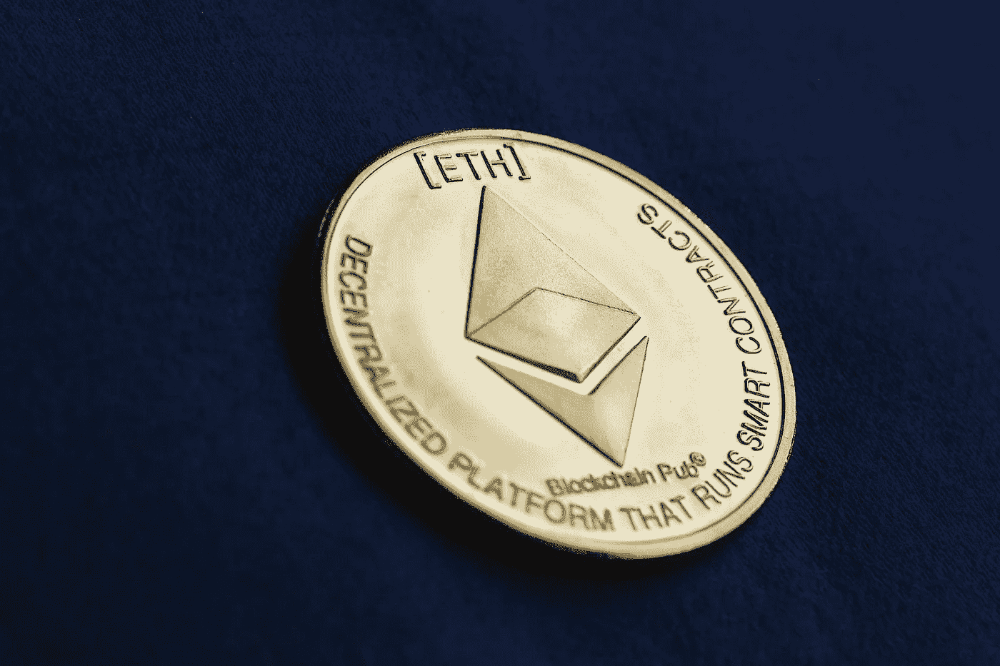

# 创建一个以太坊区块链浏览器并部署到 GitHub 页面

> 原文：<https://medium.com/coinmonks/create-and-deploy-an-ethereum-blockchain-explorer-to-github-pages-30800f5b167b?source=collection_archive---------0----------------------->

## 以太坊区块链浏览器

## 使用 WebAssembly 和 dotnet 创建以太坊区块链浏览器

[Money Coin Finance — Free photo on Pixabay](https://pixabay.com/photos/money-coin-finance-ether-ethereum-5511316/)

区块链探索者就像加密货币和区块链的搜索引擎。它允许用户访问有关交易、块和地址的信息。它们非常强大，用户每天都在使用。

以太坊最受欢迎的区块链浏览器是 [Etherscan](https://etherscan.io/) ，在这里我们可以获得以太坊的实时分析。

[以太坊(ETH)区块链浏览器(etherscan.io)](https://etherscan.io/)

在本文中，我们将构建和部署一个区块链浏览器，以获取有关以太坊区块链的信息。我们将通过 WebAssembly 构建一个直接在浏览器中运行的客户端应用程序。为了做到这一点，我们将使用 Blazor WebAssembly。然后，我们将使用 GitHub 动作将我们的应用程序自动部署到 GitHub 页面。

# 构建区块链浏览器

首先，我们需要创建我们的 Blazor WebAssembly 应用程序。为此，请运行以下 cli 命令:

`dotnet new blazorwasm -o Your-Project-Name`

现在，我们添加了允许我们从以太坊获取数据的库，即[以太坊](https://nethereum.com/)。它是一个开源软件。区块链. NET 集成库。要将资源库添加到项目中:

`dotnet add package Nethereum.Web3 --version 3.8.0`

我们将创建一个服务类来封装所有与以太坊交互的逻辑。这个类将被称为`EthereumService`，并将作为构造注入接收`IWeb3`接口:

EthereumService.cs

为了在运行时获得 IWeb3 接口的实现，我们需要将它添加到依赖注入容器中。我们还将把`EthereumService`类添加到 DI 容器中，这样我们创建的页面就可以使用这个类从区块链中获取数据。

在`Program.cs`类中:

Program.cs

注意，当我们实例化 Web3 类时，我们需要来自 Infura mainnet 的 URL 和您的 API 键。如果你没有，你可以去 [Infura](https://infura.io/) 网站创建一个账户。

> [Infura 与以太坊区块链交互，并代表其用户运行节点。](https://decrypt.co/resources/what-is-infura)

# 创建我们的第一页

现在我们将创建我们的第一个页面`index.razor`。我们将为这个页面注入两个服务，一个是从以太坊获取数据的`IEthereumService`,另一个是导航到其他页面的`NavigationManager`。

Index.razor

在此页面上，我们希望显示以下信息:

*   最新的块号
*   最新的街区
*   最新交易

为了在页面呈现时获得最新的块号，我们将覆盖方法`OnInitializedAsync()`:

Index.razor

当我们完成获取最新的块号时，我们现在可以在页面中显示它:

Index.razor

`EthereumService`类中获取最新块号的方法:

# 获取最新的块和事务

Blazor 应用程序是使用组件构建的。组件包括一个自包含的用户界面和获取数据或响应 UI 事件所需的逻辑。

我们将创建一个 razor 组件(`LatestBlocksAndTransactions.razor`)来封装负责获取最新的 5 个以太坊块和 5 个最新批准的交易的用户界面。

该组件将接收最新的块号作为参数。`Index.razor`将呈现这个组件，并通过使用 HTML 元素语法声明它们来传递这个参数:

Index.razor

这个创建的`LatestBlocksAndTransactions`组件现在将从最后 5 个块中获取数据:

`LatestBlocksAndTransactions.razor`

然后将它呈现在页面上:

`LatestBlocksAndTransactions.razor`

# 块页面

该页面将包含关于块的信息。我们将接收`BlockNumber`作为该页面的参数。有了这些信息，我们可以通过覆盖`OnInitializedAsync()`方法并从`IEthereumService`调用`GetBlockInfo`方法来搜索所需的块及其事务:

Block.razor

创建字段`_hasLoaded`是因为当页面呈现时，仍然没有关于块及其包含的事务的信息。当我们从以太坊获取数据时，我们将只显示该块的信息。因此，在我们成功获取数据后，我们将`_hasLoaded`设置为 true，我们可以显示如下所示的信息:

Block.razor

# 地址页

在此页面上，我们将显示地址的两个信息:

*   乙醚中的平衡
*   过去 10 个街区的往来交易

为了获得地址的平衡，我们从`Web3`类中调用`GetBalance`方法:

为了从/向该地址获取事务，我们将遍历每个块并验证事务。为了简单起见，我们将遍历最后 10 个块，并在事务中验证地址是源地址还是目的地址:

GetTransactionsByAccount

# 使用 GitHub 操作部署到 GitHub 页面

由于 Blazor WebAssembly 项目的发布输出是静态文件，我们可以将应用程序部署到静态站点主机，如 Azure 静态 Web 应用程序和 GitHub 页面。我们将通过 GitHub 操作将区块链浏览器自动部署到 GitHub 页面。

为了创建一个 GitHub 动作，进入你的库，导航到你的动作标签，然后点击链接“自己设置一个工作流”。GitHub 将显示一个 YAML 文件的模板，其中包含如何构建和部署应用程序的说明。

对于我们的 Blazor WebAssembly 应用程序，可以在下面找到为部署我们的区块链浏览器而创建的工作流 YAML 文件:

main.yml

尼尔斯·斯威伯格有一篇关于如何将 ASP.NET·布拉索的 WebAssembly 部署到 GitHub 页面的文章。它有一个视频和一步一步的指南，介绍如何将 Blazor WebAssembly 应用程序部署到 GitHub 页面，以及如何解决这样做时出现的问题。可以在下面的参考资料部分找到该链接。

# 结论

在本文中，我们使用新的 Blazor WebAssembly 框架创建了一个以太坊区块链浏览器。我们还使用 GitHub Actions 将该应用程序发布到 GitHub 页面。

此应用程序的源代码和已部署应用程序的 URL 可以在下面找到:

【github.com strykerin/以太坊-区块链-探索者

[EthereumBlockchainExplorer(strykerin . github . io)](https://strykerin.github.io/Ethereum-Blockchain-Explorer/)

# 参考

[strykerin/以太坊-区块链-探索者(github.com)](https://github.com/strykerin/Ethereum-Blockchain-Explorer)

[EthereumBlockchainExplorer(strykerin . github . io)](https://strykerin.github.io/Ethereum-Blockchain-Explorer/)

[区块链探索者教程——什么是区块链探索者？(softwaretestinghelp.com)](https://www.softwaretestinghelp.com/blockchain-explorer-tutorial/)

[什么是 Blazor WebAssembly？—了解|微软文档](https://docs.microsoft.com/en-us/learn/modules/build-blazor-webassembly-visual-studio-code/2-understand-blazor-webassembly)

什么是 Infura？|初学者指南—解密

[以太坊 API | IPFS API 网关|以太网节点即服务| Infura](https://infura.io/)

[创建和使用 ASP.NET 核心剃须刀组件|微软文档](https://docs.microsoft.com/en-us/aspnet/core/blazor/components/?view=aspnetcore-5.0)

[如何将 ASP.NET·布拉索 WebAssembly 部署到 GitHub Pages(swimburger.net)](https://swimburger.net/blog/dotnet/how-to-deploy-aspnet-blazor-webassembly-to-github-pages)

## 另外，阅读

*   [了解以太坊和网络 3](https://blog.coincodecap.com/go/learn)
*   [加密交易机器人](/coinmonks/crypto-trading-bot-c2ffce8acb2a)
*   [3 商业评论](/coinmonks/3commas-review-an-excellent-crypto-trading-bot-2020-1313a58bec92)
*   [AAX 交易所评论](/coinmonks/aax-exchange-review-2021-67c5ea09330c) |推荐代码、交易费用、利弊
*   [Deribit 审查](/coinmonks/deribit-review-options-fees-apis-and-testnet-2ca16c4bbdb2) |选项、费用、API 和 Testnet
*   [FTX 密码交易所评论](/coinmonks/ftx-crypto-exchange-review-53664ac1198f)
*   [零审核](/coinmonks/ngrave-zero-review-c465cf8307fc)
*   [Bybit 交换审查](/coinmonks/bybit-exchange-review-dbd570019b71)
*   [3Commas vs Cryptohopper](/coinmonks/cryptohopper-vs-3commas-vs-shrimpy-a2c16095b8fe)
*   最好的比特币[硬件钱包](/coinmonks/the-best-cryptocurrency-hardware-wallets-of-2020-e28b1c124069?source=friends_link&sk=324dd9ff8556ab578d71e7ad7658ad7c)
*   [密码本交易平台](/coinmonks/top-10-crypto-copy-trading-platforms-for-beginners-d0c37c7d698c)
*   最佳 [monero 钱包](https://blog.coincodecap.com/best-monero-wallets)
*   [莱杰 nano s vs x](https://blog.coincodecap.com/ledger-nano-s-vs-x)
*   [bits gap vs 3 commas vs quad ency](https://blog.coincodecap.com/bitsgap-3commas-quadency)
*   最好的[加密税务软件](/coinmonks/best-crypto-tax-tool-for-my-money-72d4b430816b)
*   [最佳加密交易平台](/coinmonks/the-best-crypto-trading-platforms-in-2020-the-definitive-guide-updated-c72f8b874555)
*   最佳[密码借贷平台](/coinmonks/top-5-crypto-lending-platforms-in-2020-that-you-need-to-know-a1b675cec3fa)
*   [莱杰纳米 S vs 特雷佐 one vs 特雷佐 T vs 莱杰纳米 X](https://blog.coincodecap.com/ledger-nano-s-vs-trezor-one-ledger-nano-x-trezor-t)
*   [block fi vs Celsius](/coinmonks/blockfi-vs-celsius-vs-hodlnaut-8a1cc8c26630)vs Hodlnaut
*   bits gap review——一个轻松赚钱的加密交易机器人
*   为专业人士设计的加密交易机器人
*   [PrimeXBT 审查](/coinmonks/primexbt-review-88e0815be858) |杠杆交易、费用和交易
*   [其他准备评审](https://blog.coincodecap.com/altrady-reivew)
*   [埃利帕尔泰坦评论](/coinmonks/ellipal-titan-review-85e9071dd029)
*   [SecuX Stone 评论](https://blog.coincodecap.com/secux-stone-hardware-wallet-review)
*   区块链评论 |从你的密码中赚取高达 8.6%的利息
*   [Coinrule 审查](https://blog.coincodecap.com/coinrule-review-a-perfect-trading-bot)
*   [最佳区块链分析工具](https://bitquery.io/blog/best-blockchain-analysis-tools-and-software)
*   [加密套利](/coinmonks/crypto-arbitrage-guide-how-to-make-money-as-a-beginner-62bfe5c868f6)指南:新手如何赚钱
*   最佳[加密制图工具](/coinmonks/what-are-the-best-charting-platforms-for-cryptocurrency-trading-85aade584d80)
*   了解比特币最好的[书籍有哪些？](/coinmonks/what-are-the-best-books-to-learn-bitcoin-409aeb9aff4b)

> [直接在您的收件箱中获得最佳软件交易](/coinmonks/newsletters/coinmonks)

