# 创建和部署以太坊排行榜

> 原文：<https://medium.com/coinmonks/create-and-deploy-an-ethereum-leaderboard-1ba60dba1495?source=collection_archive---------0----------------------->

## 构建智能合约高分板。

Photo by Sigmund on Unsplash

# **概述**

这篇文章将回顾:

*   排行榜合同:可靠性合同如何工作
*   混合:如何与合同互动
*   Metamask/web3 钱包:资助和部署。
*   在 testnet 上部署。

# **排行榜合同**

*   `leaderboardLength = 10`将保存前 10 名`User`的名字和分数
*   `leaderboard`是公开的，所以任何人都可以看到`user`和`score`
*   `user`是一个类似“爱丽丝”的用户名
*   类似于 777 的数字
*   部署合同的人是`owner`，并且是唯一被允许更新排行榜的人
*   `addScore`被称为更新排行榜

# 混合 IDE

Remix IDE 用于创建排行榜合同并与之交互。

打开:[https://remix.ethereum.org/](https://remix.ethereum.org/)

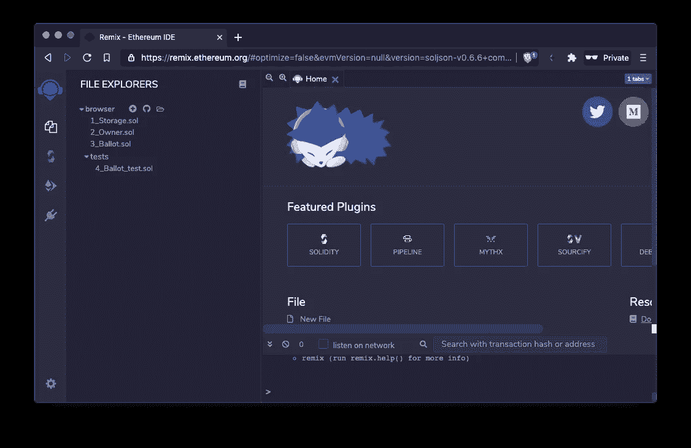

单击+创建新文件。

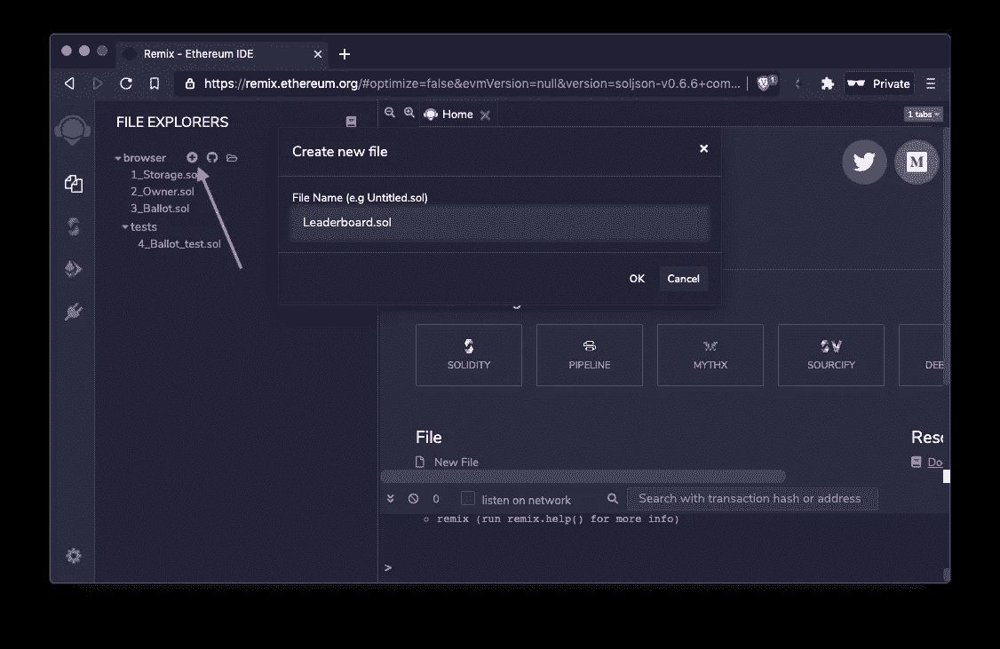

粘贴上面的代码

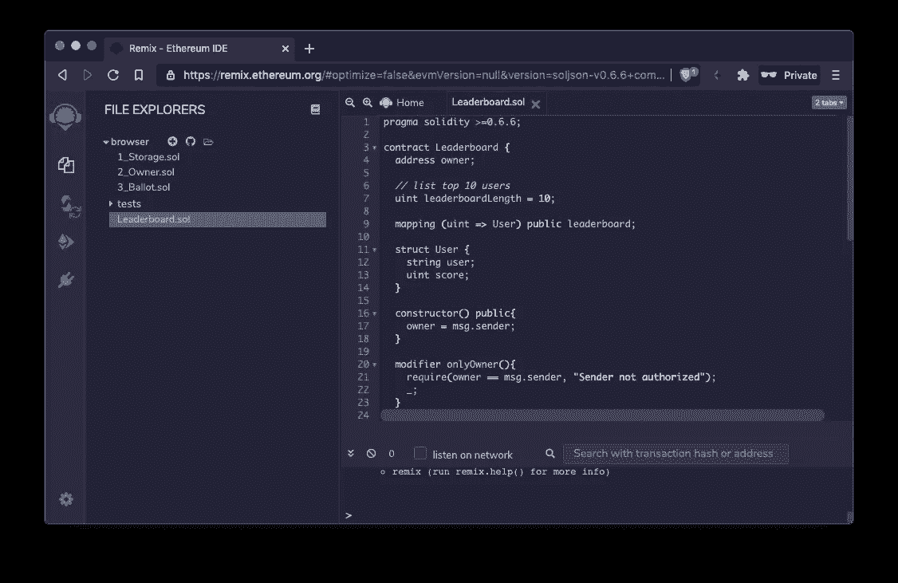

编译代码

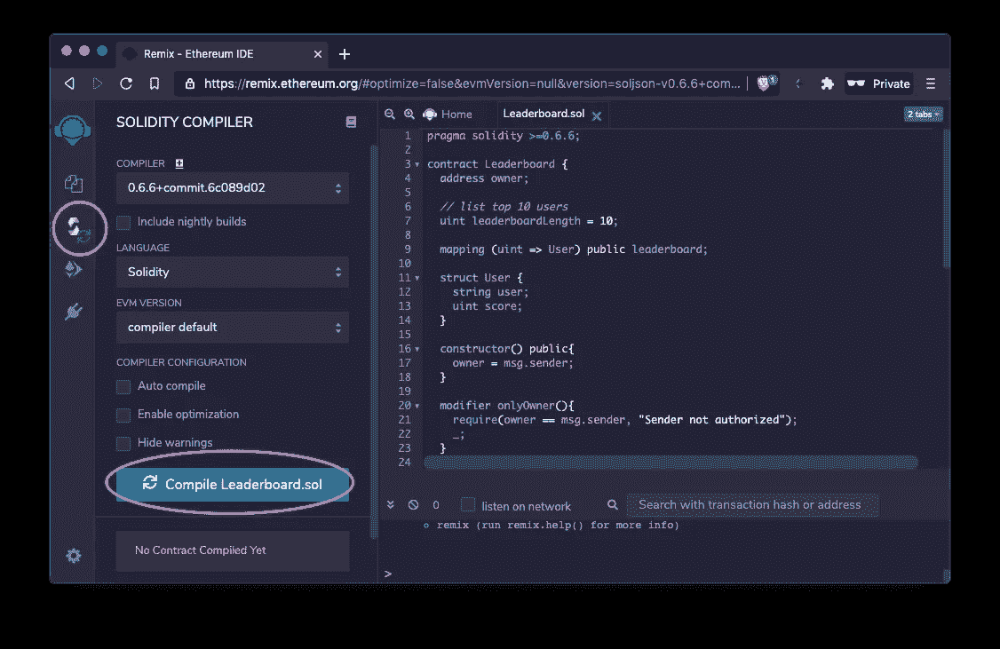

让我们部署一个本地版本(JavaScript VM)进行测试。

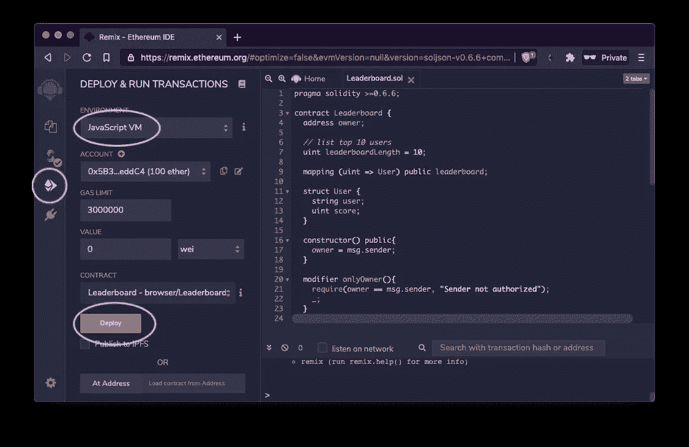

单击下拉列表，输入用户，评分，然后单击交易。右边的日志应该有一个 true 的解码输出。

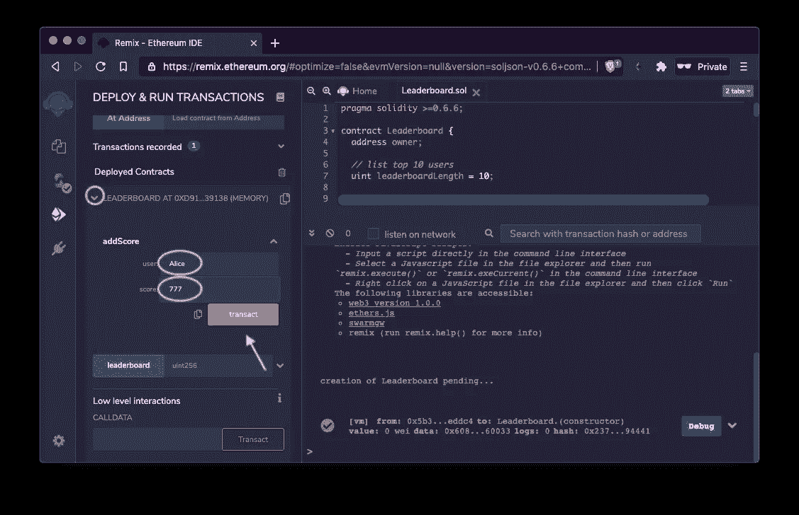

要获取数据，请在排行榜中输入 0(因为我们只有一个输入，代码从索引 0 开始)。应该会出现用户名和分数(Alice 777)。

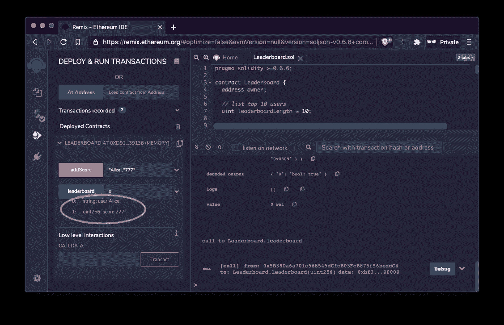

我们有一个工作排行榜。随意添加更多的用户，测试和实验。

# Metamask/Web3 钱包

要在 mainnet/testnet 上部署，我们需要一个钱包和一些 ETH。

下载: [https://metamask.io](https://metamask.io)

在本例中，我们将在 Rinkeby testnet 上部署。

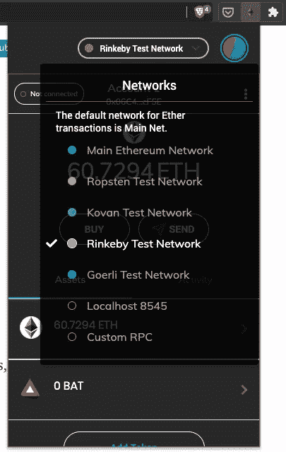

参观[https://faucet.rinkeby.io/](https://faucet.rinkeby.io/)

任何拥有推特或脸书账户的人都可以在允许的范围内申请资金。在社交媒体上发布/张贴您的以太坊地址，然后使用链接接收 testnet 资金。

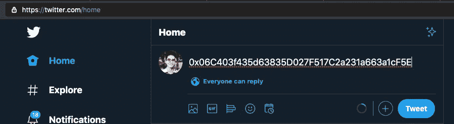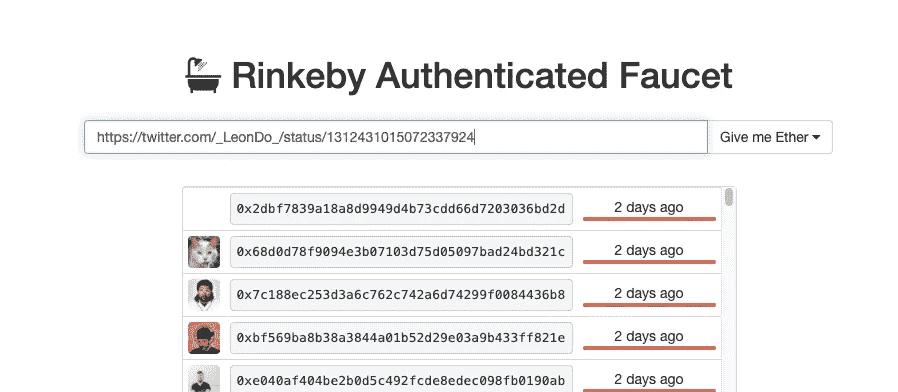

# 部署

把环境换成`Injected Web3`，保证有资金。点击`Deploy`和`Confirm`。

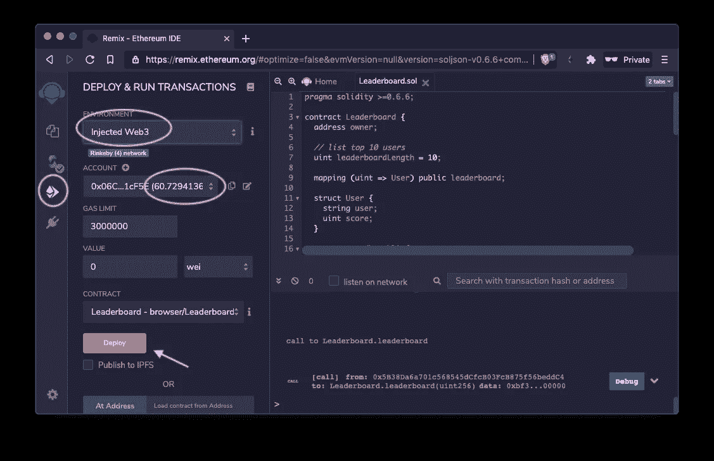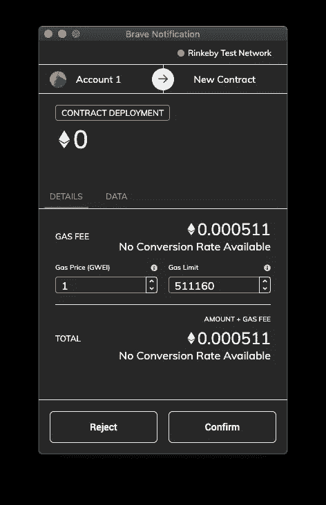

从排行榜添加和获取用户。

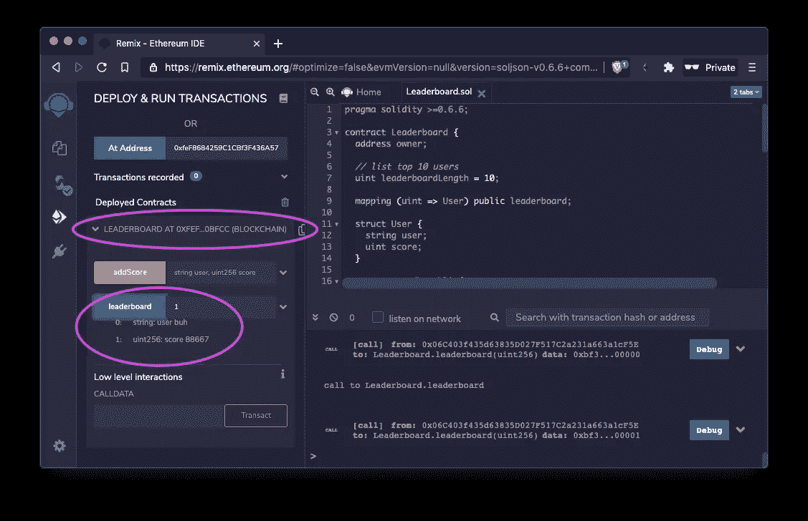

恭喜你！你创建了以太坊排行榜。这将为像分散式游戏这样更有趣的项目奠定基础。

## **同样，请阅读**

*   [顶级 DeFi 项目](/coinmonks/defi-future-10-promising-projects-in-the-defi-world-ff2b697ab006)
*   [unis WAP 最佳钱包](/coinmonks/best-wallets-to-use-uniswap-e91a6385d9e8)
*   面向开发者的最佳加密 API