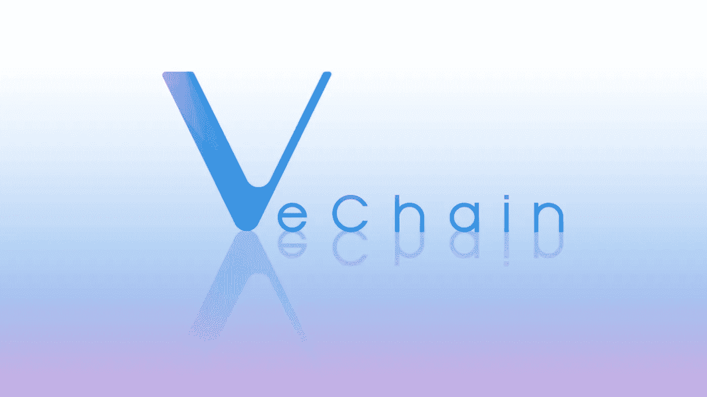

# 在 VeChain 上创建和部署智能合同

> 原文：<https://medium.com/coinmonks/create-and-deploy-smart-contracts-on-vechain-bf1c94cdb776?source=collection_archive---------2----------------------->



本文将向您介绍在 VeChain 上开发和部署包括 javascript 单元测试在内的智能契约的必要步骤。

# 设置项目

该项目由 nodejs-project 组成，使用 [truffle 套件](https://www.trufflesuite.com/)进行合同处理。

以下是设置项目的命令:

```
yarn init…
```