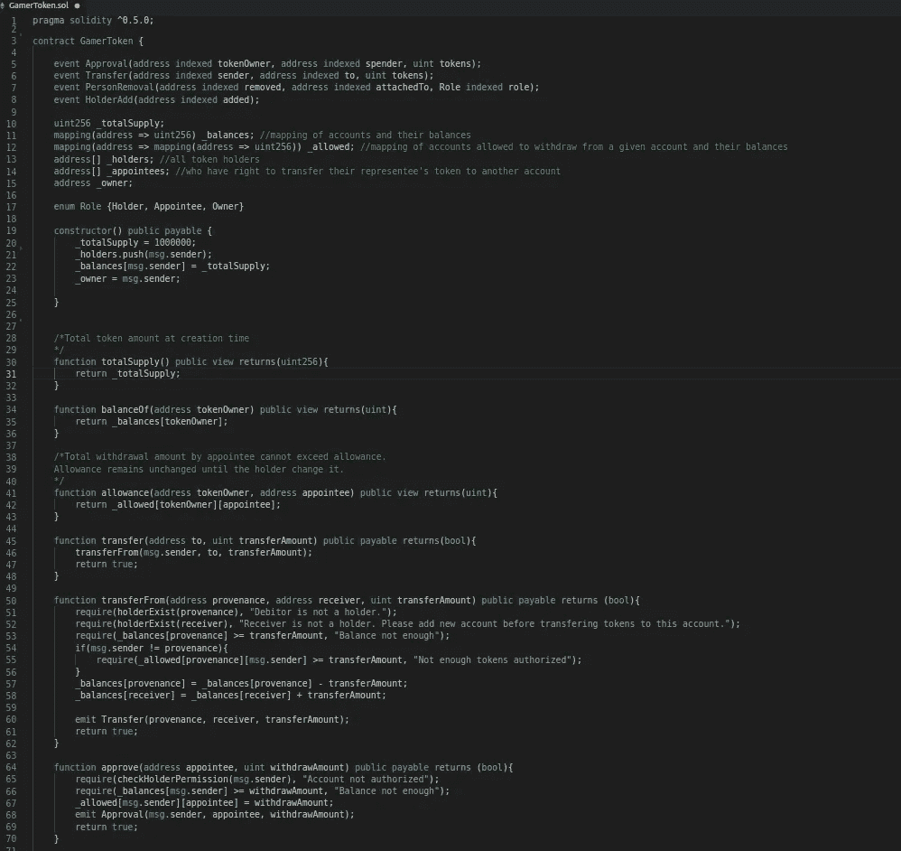
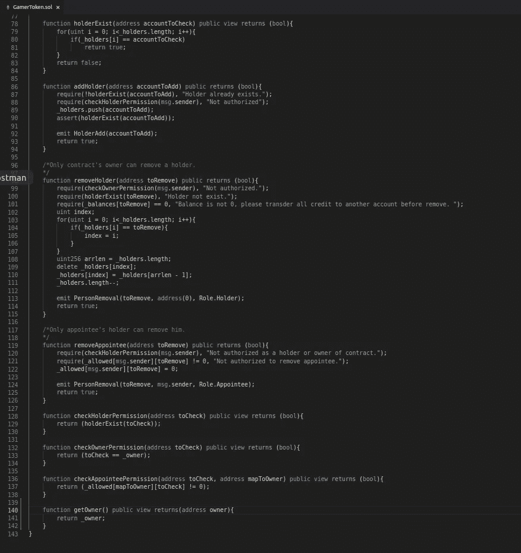
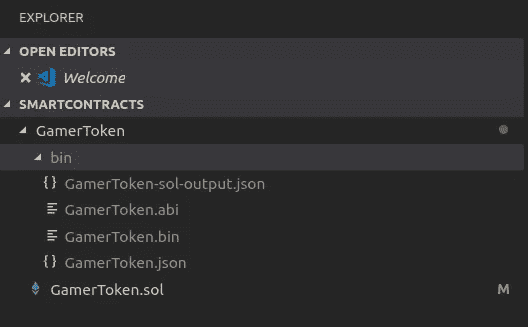
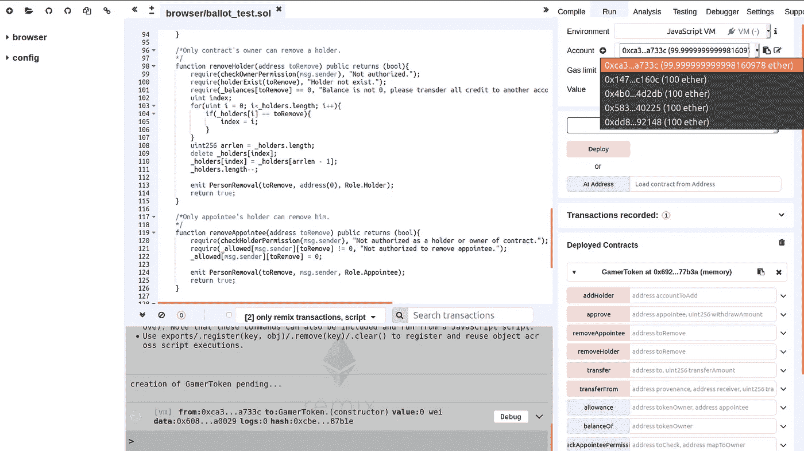
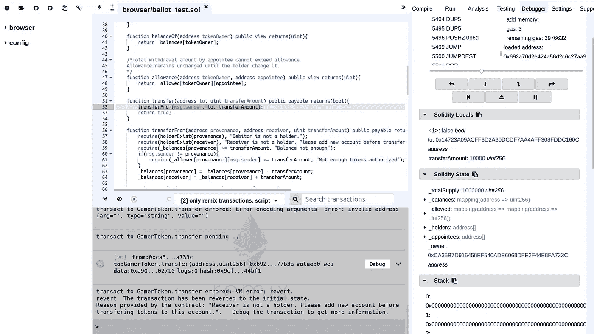
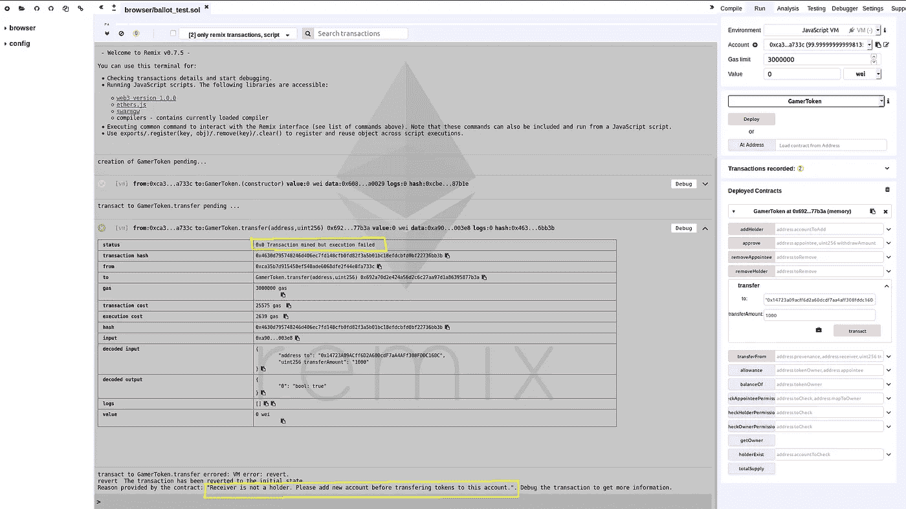

# 为以太坊 DApps 创建 ASP.NET 核心 Web API 第 2 部分:ERC20 合同

> 原文：<https://medium.com/coinmonks/create-asp-net-core-web-api-for-ethereum-dapps-erc20-contract-b1c8af2a97dc?source=collection_archive---------1----------------------->


You can improvise

关于为区块链的分散式应用程序创建 web api 的教程的第二部分简要介绍了 ERC-20 契约以及如何创建一个契约。

在教程的[第一部分](https://tech-mint.com/asp-net-core-web-api-middle-ware-for-ethereum-settings/)中，我们已经为 Visual Studio 代码安装了 Solidity 和 Solidity extension 的编译器。Juan Blanco 的 Solidity 扩展提供了语法高亮、自动完成、一些调试特性和使用本地机器上安装的编译器的顶级编译。这些是我们撰写合同所需的工具。

# **ERC20 合同接口**

对于这个特定的项目，我使用一个符合 ERC-20 的智能合约，因为这个标准被以太坊上的大多数令牌广泛采用，并且实现起来相当简单。

那么**ERC-20 合同**意味着什么呢？ERC-20 是以太坊网络上创建和交换令牌的标准提案。你可以把 ERC-20 想象成一个界面或者一个蓝图，它提供了一系列功能和事件。任何实现 ERC-20 标准的智能合约都是 ERC-20 合约，或者准确地说是 ERC-20 合规合约。ERC-20 不是唯一存在的标准，当然任何人都可以为他们正在处理的智能合同类型提出一套标准。

**符合 ERC-20 的优势是什么**？*它允许加密货币或数字资产在以太坊上更容易地交易*。看一看普通加密货币/代币交易商/投资者的钱包，在任何时候肯定会有两种以上的货币/代币/数字资产(*)。如果没有任何共同的标准，数字钱包必须实现不同的函数调用，以与每一个在相应的令牌/资产上操作交易的底层智能合约对话。诸如 ERC-20 的通用标准确保以太坊钱包或 DApps 只需要实现一次一组函数调用，以便与类似性质的智能合约进行交互。

该提议仅针对以太坊网络内的令牌。由于不同的区块链具有不同的性质，因此不存在这种机制。

**ERC-20 由什么组成？**符合 ERC-20 标准的必须实现以下接口:

```
// ----------------------------------------------------------------------------// ERC Token Standard #20 Interface// https://github.com/ethereum/EIPs/blob/master/EIPS/eip-20.md// ----------------------------------------------------------------------------**contract** ERC20Interface {**function** totalSupply() public view returns (uint);**function** balanceOf(address tokenOwner) public view returns (uint balance);**function** allowance(address tokenOwner, address spender) public view returns (uint remaining);**function** transfer(address to, uint tokens) public returns (bool success);**function** approve(address spender, uint tokens) public returns (bool success);**function** transferFrom(address from, address to, uint tokens) public returns (bool success);**event** Transfer(address indexed from, address indexed to, uint tokens);**event** Approval(address indexed tokenOwner, address indexed spender, uint tokens);}
```

*   *totalSupply()* 函数返回查询时合约上存在的代币总额。
*   *balanceOf()* 函数返回查询时账户拥有的代币数量。
*   *allowance()* 函数返回某个人代表持有人从其账户中提取的代币金额。
*   *approve()* 功能允许硬币持有人授予另一个账户在特定金额内从其口袋中提取硬币的权利。该函数在执行成功时发出*批准*事件。
*   *transfer()* 功能允许将代币从一个人的口袋转移到另一个人的口袋。当执行成功时，该函数发出 *s Transfer* 事件。
*   *transferFrom()* 功能允许代表将硬币(他并不拥有，但被授予了消费权)转移到另一个账户。

只要您尊重这些函数的签名，您就不必受限于这些函数的任何特定实现。这意味着你可以完全自由地设计你的 ERC-20 符合你的业务规则。例如，您可以在合同部署时固定令牌的总供应量，或随时间变化。或者你可以设置一个复杂的机制来批准一个花钱的人。

如果你想彻底了解 ERC 20，看看吉姆·麦克唐纳的帖子，里面有很好的解释。本文末尾的参考资料链接。

# **创建智能合同**



您可以看到，我的合同实现了 ERC-20 接口的所有规定功能和事件。这个智能合约做了几件事:

1/ **总供应量**:部署后，它会创建一种新类型的代币，总供应量为 1，000，000 个单位。一旦在区块链上创建了合同，该金额将不会更改。这是因为我将变量 *_totalSupply* 的赋值放在了构造函数内部，没有方法调用来改变它。

2/ **合同所有人:**合同所有人是将其部署到区块链的客户。一旦创造，所有者拥有所有的硬币存在，他们是第一个也是唯一的令牌持有者。

3/ **Approve:** 只有消息发送者(创建对契约实例的函数调用的地址)可以批准其令牌的支出者(被任命者)。函数的调用者必须是令牌持有者(或者他的地址必须存在于 *_holder* 的数组中)才能成功执行 *approve()* 函数。而且取款金额也不能超过他的余额。

4/ **转让**:只有代币持有者或其代表(指定人)可以将硬币转让给另一个持有者。并且转账金额不能超过持有人余额。

5/ **限额:**被指定人只能在其提款限额内进行转账，该限额不受代币数量的影响。这意味着他可以连续转账，每次转账不超过他的授权金额，并且他曾经交易的代币总额在其持有人的余额范围内。

除了 ERC 20 标准方法之外，我还实现了一些规则:



6/ **添加持有人:**只有持有人可以将其他持有人添加到合同中。

7/ **删除持有者**:只有合同所有者可以从合同中删除持有者。在删除时，要删除的持有者必须有零(0)余额，否则交易将失败，并提示您将该持有者拥有的所有令牌转移到另一个地址。

8/ **罢免被任命人:**只有持证人才能罢免其代表。删除时，被任命者的津贴设置为 0，而不是将其从*_ 津贴*映射中删除。这是因为用于映射持有者和他们的被任命者的数据结构是映射类型(键-值对)，并且在 Solidity 中，如果没有分配，任何元素都被假定存在于具有默认值的映射中。

这些额外的规则并没有降低我的合同对 ERC-20 协议的合规性，并且为合同增加了更具体的规则。

您可以看到 Solidity 使用了相当简单的语法。从 C#这样丰富的语言中，我发现 Solidity 缺少很多特性。然而，这种语言致力于智能合同的编写，因此，保持简单、正确和简洁比成熟更重要。我们还建议您将冗长而庞大的契约分解成较小的契约，并保持函数调用的简单性和粒度，以便轻松控制消耗的气体。

我鼓励你深入了解[可靠性和智能合同的规范](https://ethereum.stackexchange.com/questions/15435/how-to-compile-solidity-contracts-with-geth-v1-6)。

# **编译智能合约**

写完合同后，在 Visual Studio 代码上按 F5 编译它。这将在您的合同的根文件夹中创建一个名为 *bin* 的文件夹。 *bin* 文件夹包含将用于部署到 EVM 的智能契约的字节码，以及描述 JSON 中契约属性的 abi 文件。abi 文件是将部署的契约反序列化为 JavaScript 或 C#对象所必需的，JavaScript 或 C #对象随后用于通过远程过程调用与 EVM 进行交互。



# **测试智能合约**

Remix 是 Solidity smart contract 的在线编辑器，它也提供测试工具。只要去[https://remix.ethereum.org/](https://remix.ethereum.org/)，粘贴你的合同，编译并选择一个方法部署到预配置了几个虚拟以太账号的嵌入式 devchain 上。您可以使用这些帐户来测试代币交易。



测试函数调用是非常简单的，如果有两个以上的输入，点击函数右边的按钮就可以看到所有的输入字段。记住要为地址等字符串加上双引号；-).

要调试合同，请设置断点并单击出错事务右侧的调试按钮。这将直接引导您到调试器标签，在那里您可以一步一步地执行函数调用。或者，您可以将事务索引粘贴到调试器中，以便进入调试会话。



我经常用来检查函数执行约束的两个关键词是“ *require* 和“ *assert* ”。

“ *require* ”关键字设置函数继续执行所需的要求，如果不满足要求，EVM 将恢复执行，并将错误信息记录到控制台。

另一方面，“ *assert* ”关键字用于在括号内的条件评估为 false 时抛出异常，并恢复调用。您可能通常希望在函数的末尾使用“ *assert* ”，以确保它被正确执行。

查看失败交易的收据，您会看到在收据下面记录了未解决需求的错误消息。状态代码为 0x0(相当于十进制的 0)，这意味着事务被挖掘，但执行失败。发生这种情况是因为未解决的条件阻止函数继续执行。然而，对函数的调用是区块链上的合法事务，它消耗 gas 直到执行到故障点，并恢复调用对契约状态的任何改变。这就是为什么即使事务执行失败，它仍然被挖掘到区块链。这就像抓住了一个优步，并在中途被踢出去，因为你对驱动器的意外行为，当然你还是要支付费用。



# 部署到区块链

此时，我们的合同已准备好部署到区块链以太坊。使用 Mist 或任何以太坊客户端，您可以轻松地部署它，而无需接触一行代码。代币可以与任何支持 ERC20 合同的钱包进行交易，这意味着您已经可以使用我们创建的 ICO 众筹您的业务。然而，在教程的第 3 部分，我将向您展示如何使用 Nethereum 库以编程方式**部署智能合约。请参考[第 3 部分](/@huyenpk/https-medium-com-create-asp-net-core-web-api-for-ethereum-dapps-part-3-restful-api-152507b45ed6)。**

相关故事

[简介](https://tech-mint.com/create-ethereum-dapps-with-restful-api/)

[第 1 部分:建立基础设施](https://tech-mint.com/asp-net-core-web-api-middle-ware-for-ethereum-settings/)

[第 2 部分:编写符合 ERC 协议 20 的智能合同](https://tech-mint.com/write-a-token-based-ethereum-smart-contract/)

[第 3 部分:为分散式应用创建 Asp.net 核心 Web Api](https://tech-mint.com/create-asp-net-core-web-api-for-ethereum-dapps/)

[bit bucket 上的完整项目](https://bitbucket.org/HuyenPK/gamersmarttoken/)

*(*)我交替使用加密货币—硬币—代币—数字资产。实际上，根据业务环境的不同，它们可能具有不同的性质。*

外部链接:

[深入探究 ERC 20——Jim McDonald 的精彩解说](/@jgm.orinoco/understanding-erc-20-token-contracts-a809a7310aa5)

> [直接在您的收件箱中获得最佳软件交易](https://coincodecap.com/?utm_source=coinmonks)

[](https://coincodecap.com/?utm_source=coinmonks)[](http://bit.ly/2G71Sp7)

[**Click to read today’s top story**](http://bit.ly/2G71Sp7)