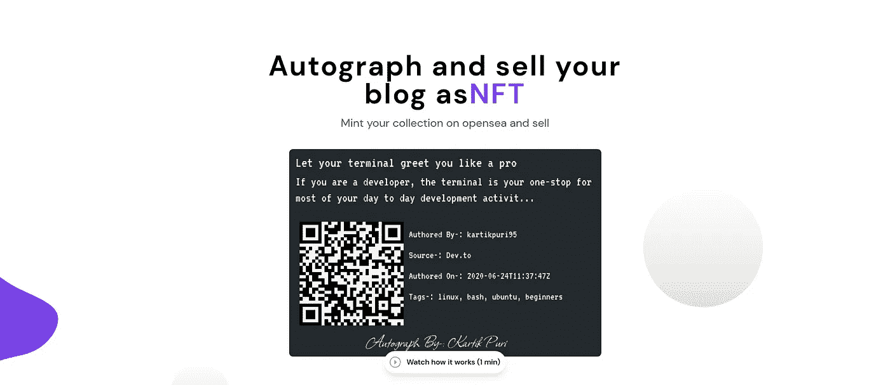
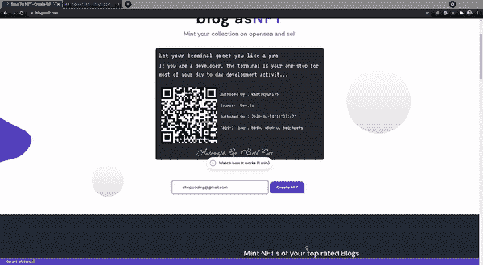
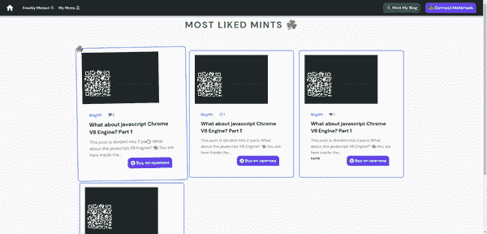
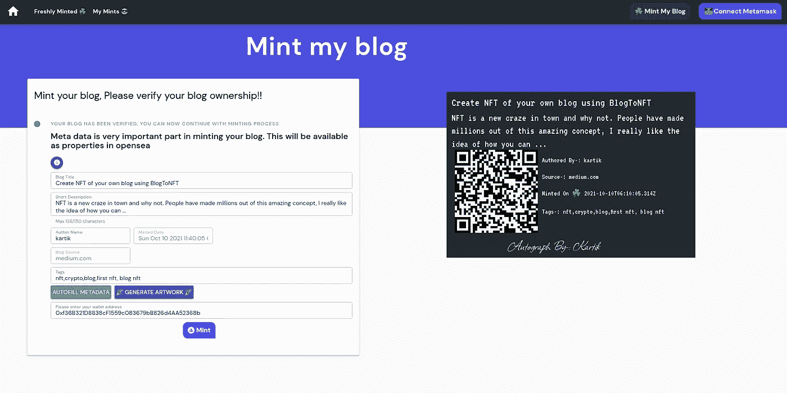
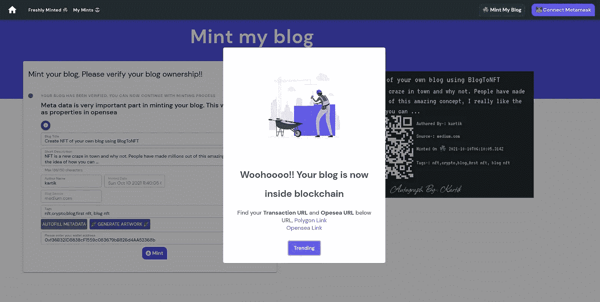

# 使用博客创建你自己的博客 NFT

> 原文：<https://medium.com/coinmonks/create-nft-of-your-own-blog-using-blogtonft-9f879f7c8515?source=collection_archive---------1----------------------->

NFT 是城里的一个新热点，为什么不呢？人们已经从这个惊人的概念中赚了数百万，我真的很喜欢这个想法，你可以拥有一个只属于你而不属于别人的数字信息。这个数字作品可以是你的艺术作品，你的代码，你潦草的想法，或者你的博客或文章。NFT 已经让位于以更好的方式将你的内容货币化，并拥有你所创造的东西。

我偶尔会写科技博客，但我从未想过从博客中赚钱，因为我发布文章的大多数地方都没有这样的赚钱概念。就在那时，我突然想到了为我的博客创建一个 NFT 的想法，我想创建一个应用程序怎么样，其他作家可以来创建他们自己的博客 NFT，就像 t 恤上或棒球棒上或板球球棒上的签名一样只是任何其他收藏品，但它的数字版本，最令人惊讶的是可以出售这个 NFT 或把它们放在 因为你永远不知道有一天你的博客会出名，你的博客 NFT 会被卖几百万。

# 布隆托夫特出生了

权力越大，责任越大

这个想法是惊人的，但当涉及到实施和为大众做点什么的时候，我知道这个过程会是崎岖不平的。作为一名经验丰富的开发人员，我知道如何布局，并使其对社区有用。经过近 3 个月的研发，我完成了我的项目【blogtonft.com 。

BlogToNFT 是一种去中心化的应用程序，它帮助在互联网上写文章的作者或博客作者创建他们博客的 NFT。这个 NFT 可以作为收藏品保存，也可以在 [OpenSea.io](http://OpenSea.io) 出售或者拍卖。所有在 blogtonft.com[制造的 NFT](http://blogtonft.com)都可以在一个名为 BLGNFT 的母合同中获得，可以在这里[看到](https://opensea.io/collection/blog-to-nft)。

**所以你可能会想，如果其他人在别人的博客上做 NFT 会怎么样？**

有一个所有权验证过程，我要求博客的所有者/作者在博客中添加一个特定的标记(我也会在这篇博客的后半部分解释)，我用它来验证实际的所有权。一旦所有权得到验证，用户就可以看到 NFT 的作品，这些作品可以修改，然后可以在区块链上铸造。甚至在契约层，我已经确保不会有两个博客有相同的 URL，所以在智能契约中永远不会有唯一的 URL。

# 我如何创建我的博客 NFT？

我已经尽量让事情变得简单，创建 NFT 的最低要求是钱包地址。如果你没有自己的钱包地址，我建议你在创建 NFT 之前先有一个。如果你想知道如何创建你的钱包，你可以访问这个[链接](https://myterablock.medium.com/how-to-create-or-import-a-metamask-wallet-a551fc2f5a6b)。但是一定要确保你的钱包安全，因为这是你访问你的 NFT 的唯一途径，也要确保你能在创建博客之前使用钱包地址登录 opensea

# 步骤 1 —使用神奇链接登录

我相信登录应该是最简单的过程，我不喜欢记住密码，然后点击忘记密码。因此，要登录或注册，你只需要把你的电子邮件放在盒子里，然后点击创建 NFT。同样的事情也可以使用右上角的登录按钮来完成。一旦你点击登录，我们将发送一个神奇的链接到你的邮箱，也检查你的垃圾邮件部分，一旦你点击这个链接，你将立即登录到 blogtonft.com[的](http://blogtonft.com)账户部分。点击右上角的 Mint my blog

How to log in and goto account

# 第二步——创建你的博客，请验证你的博客所有权！

这是最重要的一步，用户必须确保他/她是博客的所有者。在这里，你必须选择博客来源，如果它是媒体或任何其他来源。介质的验证过程有一点不同，因此我必须单独处理这个输入。一旦你的博客源被选定，继续粘贴你的博客网址，粘贴后，采取验证标签，并把它放在博客没有任何文字修改。对于中型博客，标签只是一组数字，因为中型博客不允许添加外部 HTML 标签，对于其他博客，你可以粘贴 HTML 标签，这基本上是一个徽章，如下图所示，表明你的博客是伪造的。

> 对于中等用户来说，一旦创建了博客，你就可以删除验证标签并下载上面的图片，方法是右键单击>另存为并将其添加到你的博客中。每个人都需要炫耀一下

# 步骤 3-添加元数据

一旦你的博客被验证，你需要一件艺术品来铸造，这样你就可以出售或者拍卖它。在创作之前，添加你的博客的元属性，如作者、标题、描述等，是非常重要的。这些元数据对于生成你的作品非常重要，当你把这个 NFT 放到 [opensea.io](http://opensea.io) 上时也非常重要。有一个自动填充按钮，试图获取大多数元数据，但如果用户想手动完成，他们可以自由地这样做。一旦元数据被添加到生成作品中，这个作品就是 NFT 的最后一件作品，将被铸造成区块链，所以只要确保所有的拼写和元标签都是正确的。

Add meta data and click generate artwork button

# 第四步——打造你的博客

这是最后一步，将你在第三步中生成的作品转换成 NFT，并在区块链内部铸造。还要注意，一旦 NFT 在区块链上铸造，它们就不能被删除或再次编辑。这一步只需要你的钱包地址，所以请确保粘贴正确的钱包地址，并确保使用相同的钱包地址登录 [opensea.io](http://opensea.io) 。一旦钱包地址被粘贴，点击造币按钮**和*，你就有了你自己的 NFT 在区块链*** 里面铸造

Artwork minted inside blockchain

# 使用 [opensea.io](http://opensea.io) 访问您的作品

OpenSea 是一个对等的加密收藏品和不可替代的令牌市场。要访问您刚刚创作的作品，您必须使用您的钱包地址登录 opensea，在个人资料部分，您将看到您的作品在等着您。你可以利用这个平台出售或拍卖你的 NFT，以换取一些 ETH。此外，请注意，opensea 需要时间来加载所有的细节和插图，所以如果你看不到图像已加载，你可以点击 NFT 页面内的刷新元按钮

BlogToNFT UI 仍处于测试阶段，但该应用足以打造你的 NFT。我希望你能使用这个应用程序创建自己的 NFT，因为你永远不知道 5 年前写的博客会卖到 100 万美元。我希望你喜欢我的应用程序，如果你有任何疑问，请随时在我的 Twitter 或下面的评论区联系我

PS:这个博客是在[BlogToNFT.com](http://BlogToNFT.com)创建的，下面是我的验证标签和手动添加的图片。

> **可以在** [**opensea**](https://opensea.io/assets/matic/0x9ac2837a68307d573e5000a26af7e32e978a3aaa/23611091838938412358035193397177457697865868189846902744888488445419248149482) 看到

Minted Badge

> dfC1Ji59YlekytqXDMqPrnMCRjh1

## 也阅读

 [## 最佳加密交易所| 2021 年十大加密货币交易所

### ICON _ PLACEHOLDEREstimated 预计阅读时间:28 分钟加密货币交易所的加密交易需要知识…

blog.coincodecap.com](https://blog.coincodecap.com/crypto-exchange)  [## 2021 年 10 大最佳加密贷款平台| CoinCodeCap

### 当谈到加密货币贷款时，大量因素等同于良好的收入状况。此外，借款的一部分…

blog.coincodecap.com](https://blog.coincodecap.com/crypto-lending)  [## 2021 年最佳免费加密交易机器人

### 2021 年币安、比特币基地、库币和其他密码交易所的最佳密码交易机器人。四进制，位间隙…

medium.com](/coinmonks/crypto-trading-bot-c2ffce8acb2a)  [## 最佳 4 个加密交易信号电报通道

### 这是乏味的找到正确的加密交易信号提供商。因此，在本文中，我们将讨论最好的…

medium.com](/coinmonks/best-crypto-signals-telegram-5785cdbc4b2b)  [## BlockFi 评论 2021:利弊和利率| CoinCodeCap

### 今天，我们提出了一个全面的 BlockFi 评论，这是一个成立于 2017 年的加密贷款平台，拥有其…

blog.coincodecap.com](https://blog.coincodecap.com/blockfi-review)  [## 如何在印度购买比特币？2021 年购买比特币的 7 款最佳应用[手机版]

### 如何使用移动应用程序购买比特币印度

medium.com](/coinmonks/buy-bitcoin-in-india-feb50ddfef94)  [## 加密税务软件——五大最佳比特币税务计算器[2021]

### 不管你是刚接触加密还是已经在这个领域呆了一段时间，你都需要交税。

medium.com](/coinmonks/best-crypto-tax-tool-for-my-money-72d4b430816b)  [## 存储比特币的最佳加密硬件钱包[2021] | CoinCodeCap

### 保管您的数字资产很容易，但找到正确的存储方式却是一项繁琐的任务。在线钱包有一个风险…

blog.coincodecap.com](https://blog.coincodecap.com/best-hardware-wallet-bitcoin)