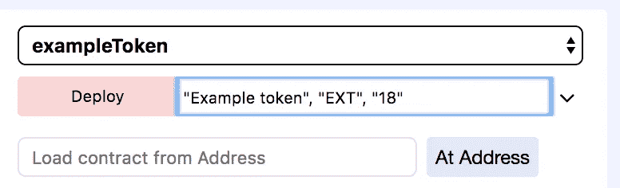
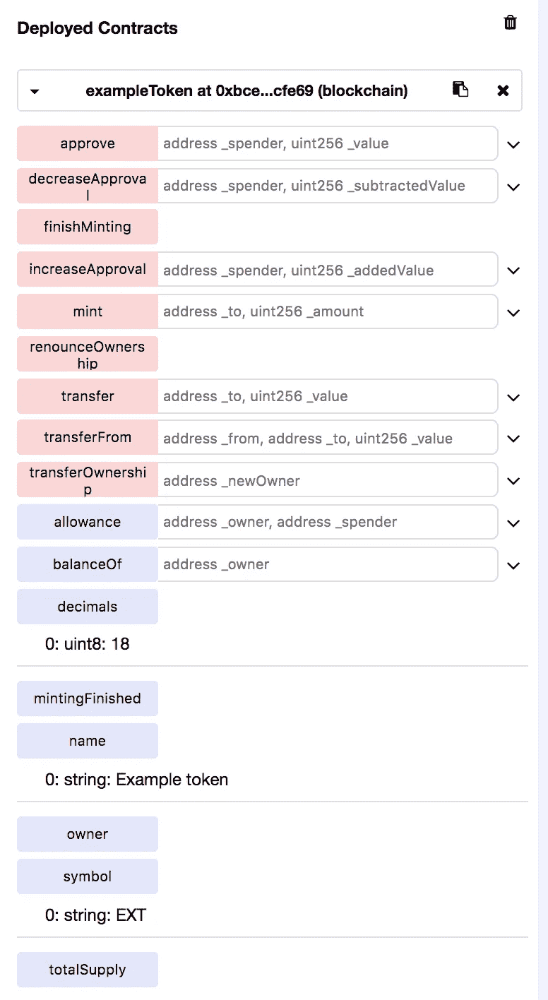
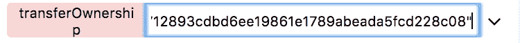
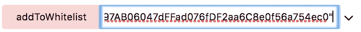

# 可靠地创建带有白名单的令牌合同和限时众筹合同

> 原文：<https://medium.com/coinmonks/create-token-contract-and-time-limited-crowdsale-contract-with-whitelisting-in-solidity-1eb979d206f6?source=collection_archive---------0----------------------->

如何使用 open zeppelin 创建不同费率的白名单众筹？我们将使用开放的 zeppelin 模板，并添加/修改一些功能和合同，以实现我们的目标。

在本文中，我们将使用以下依赖项和工具:

*   结节
*   松露
*   齐柏林飞艇-坚固性
*   元掩码
*   神谕-结合-坚固

要安装这些依赖项和工具，请点击以下链接

我们将从**开始，创建我们的合同目录**并初始化我们的依赖关系:

# 现在我们将开始创建我们的合同

## 创建令牌合同

首先，我们将创建一个令牌契约。在本例中，我们将使用 MintableToken，它允许我们在有人购买/我们需要时创建令牌。

打开编辑器(我使用 Atom)并创建一个名为 exampleToken.sol 的文件

```
pragma solidity 0.4.23;import 'zeppelin-solidity/contracts/token/ERC20/MintableToken.sol';contract exampleToken is MintableToken {
    string public name;
    string public symbol; 
    uint8 public decimals; 
  constructor(string _name, string _symbol, uint8 _decimals)
  MintableToken() public {
      name = _name; 
      symbol = _symbol; 
      decimals = _decimals; 
      owner = msg.sender; 
  }
}
```

## 创建众筹合同

对于这个例子，我们将使用来自 open-zeepelin 的 MintedCrowdsale 和 TimedCrowdsale 合同模板。

包含此模板并使用单词**“是”，**我们将基本上继承合同代码:

node _ modules/zeppelin-solidity/contracts/crowd sale/emission/**minted crowd sale . sol**和

node _ modules/zeppelin-solidity/contracts/crowdsale/validation/**timedcrowdsale . sol**和

node _ modules/zeppelin-solidity/contracts/crowd sale/validation/**whitelied crowd sale . sol**

如果我们看一下 mintedcrowdsale . sol([https://github . com/open zeppelin/zeppelin-solidity/blob/master/contracts/crowdsale/emission/mintedcrowdsale . sol](https://github.com/OpenZeppelin/zeppelin-solidity/blob/master/contracts/crowdsale/emission/MintedCrowdsale.sol))

```
pragma solidity ^0.4.24;

import "../Crowdsale.sol";
import "../../token/ERC20/MintableToken.sol";

/**
 * @title MintedCrowdsale
 * @dev Extension of Crowdsale contract whose tokens are minted in each purchase.
 * Token ownership should be transferred to MintedCrowdsale for minting.
 */
contract MintedCrowdsale is Crowdsale {

  /**
   * @dev Overrides delivery by minting tokens upon purchase.
   * @param _beneficiary Token purchaser
   * @param _tokenAmount Number of tokens to be minted
   */
  function _deliverTokens(
    address _beneficiary,
    uint256 _tokenAmount
  )
    internal
  {
    require(MintableToken(token).mint(_beneficiary, _tokenAmount));
  }
}
```

我们可以看到没有包含构造函数，因此我们必须查看**继承的契约 Crowdsale.sol** 以了解初始化契约需要哪些参数([https://github . com/open zeppelin/zeppelin-solidity/blob/master/contracts/crowd sale/crowd sale . sol](https://github.com/OpenZeppelin/zeppelin-solidity/blob/master/contracts/crowdsale/Crowdsale.sol))。

```
pragma solidity ^0.4.24;

import "../token/ERC20/ERC20.sol";
import "../math/SafeMath.sol";
import "../token/ERC20/SafeERC20.sol";

/**
 * @title Crowdsale
 * @dev Crowdsale is a base contract for managing a token crowdsale,
 * allowing investors to purchase tokens with ether. This contract implements
 * such functionality in its most fundamental form and can be extended to provide additional
 * functionality and/or custom behavior.
 * The external interface represents the basic interface for purchasing tokens, and conform
 * the base architecture for crowdsales. They are *not* intended to be modified / overriden.
 * The internal interface conforms the extensible and modifiable surface of crowdsales. Override
 * the methods to add functionality. Consider using 'super' where appropiate to concatenate
 * behavior.
 */
contract Crowdsale {
  using SafeMath for uint256;
  using SafeERC20 for ERC20;

  // The token being sold
  ERC20 public token;

  // Address where funds are collected
  address public wallet;

  // How many token units a buyer gets per wei.
  // The rate is the conversion between wei and the smallest and indivisible token unit.
  // So, if you are using a rate of 1 with a DetailedERC20 token with 3 decimals called TOK
  // 1 wei will give you 1 unit, or 0.001 TOK.
  uint256 public rate;

  // Amount of wei raised
  uint256 public weiRaised;

  /**
   * Event for token purchase logging
   * @param purchaser who paid for the tokens
   * @param beneficiary who got the tokens
   * @param value weis paid for purchase
   * @param amount amount of tokens purchased
   */
  event TokenPurchase(
    address indexed purchaser,
    address indexed beneficiary,
    uint256 value,
    uint256 amount
  );

  /**
   * @param _rate Number of token units a buyer gets per wei
   * @param _wallet Address where collected funds will be forwarded to
   * @param _token Address of the token being sold
   */
  **constructor(uint256 _rate, address _wallet, ERC20 _token) public** {
    require(_rate > 0);
    require(_wallet != address(0));
    require(_token != address(0));

    rate = _rate;
    wallet = _wallet;
    token = _token;
  }
...
```

我们可以看到，契约**众筹** **的**构造函数**需要**跟随**参数**:

*   uint256 _rate
*   地址 _ 钱包
*   ERC20 _ 令牌

由于我们也继承了 timedcrowdsale . sol，我们还必须查看一下该契约，看看需要哪些参数来初始化该契约([https://github . com/open zeppelin/zeppelin-solidity/blob/master/contracts/crowdsale/validation/timedcrowdsale . sol](https://github.com/OpenZeppelin/zeppelin-solidity/blob/master/contracts/crowdsale/validation/TimedCrowdsale.sol))。

```
pragma solidity ^0.4.24;

import "../../math/SafeMath.sol";
import "../Crowdsale.sol";

/**
 * @title TimedCrowdsale
 * @dev Crowdsale accepting contributions only within a time frame.
 */
contract TimedCrowdsale is Crowdsale {
  using SafeMath for uint256;

  uint256 public openingTime;
  uint256 public closingTime;

  /**
   * @dev Reverts if not in crowdsale time range.
   */
  modifier onlyWhileOpen {
    // solium-disable-next-line security/no-block-members
    require(block.timestamp >= openingTime && block.timestamp <= closingTime);
    _;
  }

  /**
   * @dev Constructor, takes crowdsale opening and closing times.
   * @param _openingTime Crowdsale opening time
   * @param _closingTime Crowdsale closing time
   */
  **constructor(uint256 _openingTime, uint256 _closingTime) public** {
    // solium-disable-next-line security/no-block-members
    require(_openingTime >= block.timestamp);
    require(_closingTime >= _openingTime);

    openingTime = _openingTime;
    closingTime = _closingTime;
  }
```

我们可以看到 TimedCrowdsale 接受以下输入参数:

*   uint256 打开时间
*   uint256 关闭时间

如果我们在([https://github . com/open zeppelin/open zeppelin-solidity/blob/master/contracts/crowd sale/validation/whitelisted crowd sale . sol](https://github.com/OpenZeppelin/openzeppelin-solidity/blob/master/contracts/crowdsale/validation/WhitelistedCrowdsale.sol))上查看一下**的 WhitelistedCrowdsale** 契约，我们可以看到它没有构造函数参数。

现在，我们已经获得了关于需要哪些参数来部署契约的所有信息。为了更容易理解，我将列出以下论点:

```
uint256 _openingTime
uint256 _closingTime
uint256 _rate
address _wallet
MintableToken _token
```

现在我们可以**创建我们的众筹合同**:

```
import './exampleToken.sol';
import 'zeppelin-solidity/contracts/crowdsale/emission/MintedCrowdsale.sol';
import 'zeppelin-solidity/contracts/crowdsale/validation/TimedCrowdsale.sol';
import 'zeppelin-solidity/contracts/crowdsale/validation/WhitelistedCrowdsale.sol';
import 'zeppelin-solidity/contracts/ownership/Ownable.sol';contract exampleCrowdsale is  TimedCrowdsale, MintedCrowdsale, WhitelistedCrowdsale  {function exampleCrowdsale
             (
                 uint256 _openingTime,
                 uint256 _closingTime,
                 uint256 _rate,
                 address _wallet,
                 MintableToken _token
             )
             public
             Crowdsale(_rate, _wallet, _token)
             TimedCrowdsale(_openingTime, _closingTime)
             WhitelistedCrowdsale() {
             }}
```

## 编译代码

我们现在可以编译代码，看看是否有错误。我们将使用 truffle 编译器(我们在项目目录的根目录下运行这个命令):

```
$truffle compile
```

目前一切正常。

如果我们想使用 remix IDE 部署我们的契约，我们需要组合所有的契约。为此，我们将运行“solidity-flattener ”,我们将把 exampleCrowdsale.sol 的路径作为参数传递给它。

```
$ npm start ../article/contracts/exampleCrowdsale.sol
```

平面文件将在**目录下**目录下生成。如果我们在 remix IDE 中复制并粘贴代码，我们将得到一个错误消息:

```
browser/ballot.sol:106:27: TypeError: Definition of base has to precede definition of derived contract
contract StandardToken is ERC20, BasicToken
```

这只是因为“solidity-flattener”在代码中把契约 ERC20 定位得太低，所以我们必须复制它，并把它放在 ERC 20 基本契约之下。错误将会消失。

好了，我们现在准备测试我们的合同。

在本教程中，我们将使用 Rinkeby testnet 和 remix IDE 来部署我们的合同并与之通信。

在 remix IDE 中，我们选择“运行”选项卡，然后选择“环境注入 Web3”。重要提示:你必须安装**元掩码**和**选择 Rinkeby testnet** 并且你必须有一些测试 ETH。

如果没有可用的帐户，只需刷新页面。

**第一件事是部署 exampleToken 合同**，因为**部署 exampleCrowdsale** 合同**需要**其地址。

对于**部署示例令牌契约**，我们必须**提供 3 个参数**:



在我们按下 deploy 后，MetaMask 将请求批准，在我们确认并挖掘事务后，我们将看到如下内容:



## 好吧！我们已经发布了我们的象征性合同，所以我们现在需要做的就是发布我们的众筹合同。

对于我们的示例 Crowdsale，我们必须提供以下参数:

```
uint256 _openingTime, Timestamp in epoch format (online calculator: [https://www.unixtimestamp.com/index.php](https://www.unixtimestamp.com/index.php)) 
uint256 _closingTime,
uint256 _rate,   //in this example is 1000 (1000 EXP for 1 ETH)
address _wallet, //address of the wallet that receives funds
MintableToken _token //address of token that we created earlier
```

例如，部署 exampleCrowdsale 的输入参数可能是这样的:

```
"1530915909", "1540915909", "1000", "0x350be6a66145036dce4367e99b1f9f893ad4aa1a", "0xc693703cc36602cd5fc4d2bacfc42eb8ec866b44"
```

部署 exampleCrowdsale 后，我们现在必须更改令牌的所有者，因此 exampleCrowdsale 契约将控制 EXT 令牌。

在 remix 中，我们在 exampleToken 契约中调用函数 transferOwnership:



# 就是这样！

请注意，您将想要投资的地址列入了白名单。你可以通过调用函数 **addToWhitelist(地址投资者)**来实现



如果你有任何问题，我很乐意帮忙。