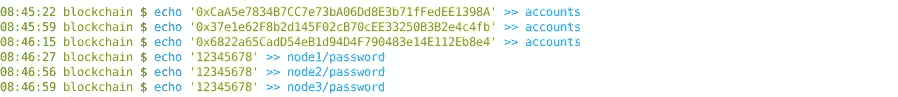
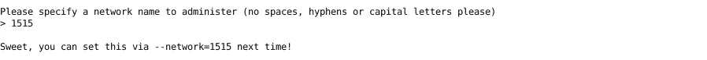
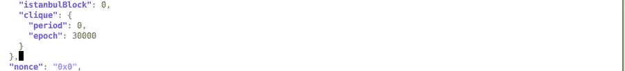
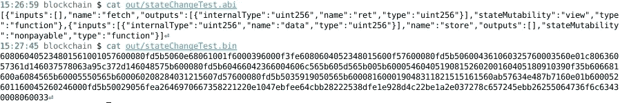

# 从头开始创建您的第一个以太坊 Dapp

> 原文：<https://medium.com/coinmonks/create-your-first-ethereum-dapp-from-scratch-63bc4f13be7?source=collection_archive---------3----------------------->

区块链是新的互联网炒作。像比特币和 Dogecoin 这样的加密货币最近都成为了新闻，因为它们的市场波动很快。

以太坊虽然也拥有一种称为以太的加密技术，但它并不是为了取代现有的金融系统而诞生的，而是通过其分布式应用程序(Dapp)部署方法带来了一场革命。以太坊上的应用运行在以太坊虚拟机或 EVM 上，这些虚拟机或托管在运行以太坊客户端的对等社区节点上。

在这篇博文中，我将向你展示如何创建你自己的私人以太坊网络，部署你自己的 Dapp 并开始挖掘(尽管你不会因此获得任何奖励！).在部署到实际的 mainnet 之前，在私有网络中测试我们的 Dapps 是很重要的。

很多作品都是从[这篇文章](https://www.c-sharpcorner.com/article/setup-your-private-ethereum-network-with-geth2/)中借来的，虽然很旧，但确实很有帮助。我使用的是 Arch Linux 主机，但是任何基于 Linux 的主机都可以正常工作。

# 第 1 部分:创建专用测试网络

**安装 Geth**

Geth 是用 Go 写的 eth 客户端。Arch Linux 在包名 go-ethereum 下提供了所有的 go-eth 工具。用 pacman 安装。

```
# pacman -Sy go-ethereum
```

**创建数据目录结构**

在本教程中，我们将使用三个以太坊节点的虚拟专用网络。

```
$ mkdir blockchain$ cd blockchainblockchain$ mkdir node1 node2 node3
```

**创建节点账户**

```
blockchain$ geth —datadir node1/ account new
```


选择任意随机密码。因为这是一个专用网络，所以安全性不是问题。(记住(—)是双连字符，medium.com 不会让我用它的！)

类似地创建 Node2 和 Node3 帐户。

**保存凭证**

我们需要存储公共地址和密码以备将来使用。



**创建创世纪块文件**

go-ethereum 包包含了设置和挖掘所需的所有工具。它附带了 puppeth，以太坊专用网络管理器，它将帮助我们交互式地创建 genesis 块文件。

```
blockchain$ puppeth
```

指定链 ID。



由于这是我们第一次使用 puppeth，它将显示选项来配置新的起源。选择第二个选项。


我们想创建新的创世纪块，所以选择第一个选项


我们将使用授权证明(PoA)来节省 CPU 的使用。这也是提供的默认选项。


选择挖掘时间。您可以选择任何内容，因为我们稍后会对其进行更改。


添加要在网络中密封的帐户。我们将添加所有三个帐户。


添加帐户获得免费乙醚。(但是你不能在交易所交易！)


Genesis 块配置已经创建，现在是导出的时候了。


它会显示一些错误，忽略它们。按 Ctrl+C 退出交互式 puppeth。

**配置起源文件**

现在，您将在数据目录中创建另外两个文件。为便于识别，将 1515.json 重命名为 genesis.json。


并在同一文件中将团周期编辑为“0”。



**初始化节点**

我们需要用相同的 genesis 块初始化每个节点。

> 区块链＄geth—数据目录节点 1/ init genesis.json


同样初始化其他两个节点。

**启动节点**

现在是时候开始运行我们的虚拟专用节点了。在启动这些节点时，您必须传递一些参数，如下所述。

```
blockchain/node1$ geth —nousb —datadir=$PWD —syncmode ‘full’ —port 3030 —miner.gasprice 0 —miner.gastarget 470000000000 —http —http.addr ‘localhost’ —http.port 8545 —http.api admin,eth,miner,net,txpool,personal,web3 —mine —allow-insecure-unlock —unlock “0xCaA5e7834B7CC7e73bA06Dd8E3b71fFedEE1398A” —password password
```

让我解释一下这个命令的实际含义，

*   —nousb 禁用对 usb 硬件钱包的监控和管理。
*   —datadir = $数据库和密钥库的 PWD 数据目录。
*   —sync mode“full”启用全链同步(默认:“fast”)。
*   —端口 3030 分配端口获取过程。
*   —miner.gasprice 0 在专网上我们什么都不想出，就让它为零吧。
*   —miner.gastarget 47000000000 使用与 genesis 文件相同的内容。然而，实际气体极限对于新的块是动态的，并且取决于前一个块。
*   —http 启用 HTTP-RPC 服务器。
*   —http.addr 'localhost' HTTP-RPC 服务器侦听接口(默认为:“localhost”)。
*   —http.port 8545 HTTP-RPC 服务器侦听端口(默认值:8545)。
*   —用于 RPC 调用的一组 api。
*   —矿山启用采矿。
*   —Allow-unsecure-unlock 当与帐户相关的 RPC 被 http 公开时，允许不安全的帐户解锁。
*   —解锁“0x CAA 5a e 7834 b 7 cc 7 e 73 ba 06 DD 8e 3 b 71 ffedee 1398 a”账号解锁，我们将使用 node1 的地址。
*   —密码密码用于非交互式密码输入的密码文件


只需在节点说寻找对等点时停止它，我们需要配置 rest 2，它才能找到它。

此外，记下“Started P2P networking”行的 enode 输出。

对其余两个节点重复相同的操作。记住在命令中更改这两个节点的端口，例如分别从 3010 和 8545 更改为 3011 和 8546，以及公共地址。

**创建节点配置**

我们将为 geth 提供静态配置，以连接到我们的专用网络中的其他节点，尽管 Geth 能够以更多方式连接到对等节点。

创建一个 static-nodes.json 文件，并在其中添加 enode 行，如下所示。


将这个配置文件也复制到另外两个节点文件夹中。


现在，只需使用上面的命令启动节点，然后用' & '将其作为后台进程。您还可以在三个不同的终端中运行所有三个对等体来查看调试输出。

现在，如果您不在后台分叉进程，您将会看到如下输出。


如果您在后台分叉该进程，您需要将 IPC 输出附加到 geth，以查看它是否连接到其他节点。

> 区块链/node 3＄geth attach geth . IPC
> 
> > net.peerCount


我们的测试网络已经准备好了。现在，我们将在其中一个节点中部署代码，该节点将自动与其他节点同步。保持这些节点在其终端会话中运行。

# 第 2 部分:创建 Dapp

**安装牢固度**

在 Arch Linux 上，Solidity 包可以在官方存储库中获得，所以只需解雇 pacman。

```
# pacman -Sy solidity
```

**编写代码**

这一部分实际上更简单，因为我们已经设置并运行了我们的环境。让我们看看我们的第一个坚固性代码。

```
pragma solidity >=0.8.0;
contract stateChangeTest {
 uint storedData;

 function store(uint data) public { 
 storedData = data * 10; 
 }

 function fetch() public view returns (uint ret) { 
 return storedData; 
 }
}
```

让我们理解每一行。

1.  以 pragma 开头的第一行定义了要使用的 solidity 编译器版本。我目前使用的是最新的版本 0.8.6。操作符> =实际上意味着使用 v0.8.0 以后的任何编译器。
2.  第二部分是合同声明。只要把它理解为 C++或 Java 中类的同义词就行了。
3.  然后我们有状态变量或简单的类变量，它们的有效性在整个契约内。[阅读更多相关内容。](https://docs.soliditylang.org/en/v0.8.6/types.html)
4.  solidity 中的函数声明就像 JavaScript 一样，增加了一个特性，那就是你必须定义函数的作用域。
5.  Solidity 中的函数要求你使用“returns (type)”语法来声明返回类型，因为它是像 C++一样的静态类型语言。此外，您还需要定义函数的类型，如果它只是读取一个状态变量，那么将其声明为“view”。[阅读更多相关内容。](https://docs.soliditylang.org/en/v0.8.6/contracts.html#functions)

您可以使用任何您喜欢的 IDE 来编写代码。我用的是 *nano* Btw。将其另存为 *stateChangeTest.sol.*

**编译代码**

使用 solc 编译器获得优化的 abi 和 bin 输出，我们将在后面的步骤中使用。

```
blockchain $ solc -o ./out —optimize —abi —bin stateChangeTest.sol
```


如果有警告，请忽略。



复制两个*的内容。 *abi* 和 **。bin* 文件。

**部署代码**

切换到一个节点目录，比如 node1。

1.  粘贴 **的内容。变量 *t1ContractAbi* 中的 abi* 文件。


同样粘贴 **的内容。变量 *t1CodeBin* 中的 bin* 文件。


2.获取 geth 对象格式的契约(来自 json)。

```
> t1Contract = eth.contract(JSON.parse(t1ContractAbi))
```

3.部署合同

```
> var t1ContractInstance = t1Contract.new({from: eth.accounts[0], data: t1CodeBin, gas: 2000000})
```

获取交易回执与之沟通。

```
> eth.getTransactionReceipt(t1ContractInstance.transactionHash)
```


记下该输出中的 contractAddress，以便在稍后调用时识别网络上的契约。

**测试代码**

部署成功，现在是时候测试我们的智能合约了。

使用变量的地址获取变量中的智能协定实例。

```
> t1 = t1Contract.at(“0x95b94926e770fd30eee076f6d0fa8d2705a9dd8d”)
```

现在调用*获取*函数。

```
> t1.fetch.call()
```

您会注意到在节点实例中没有调试日志。这是因为调用一个函数来读取状态变量不是一个事务，而仅仅是一个调用，所以不需要挖掘。

让我们更新我们的数据。使用*存储*功能发送交易。

```
> t1.store.sendTransaction(5, {from: eth.accounts[0], gas: 100000})
```

再次调用 fetch 函数。

如果你在输出中看到 *50* ，那么恭喜你，你已经成功部署并测试了你的第一个以太坊 Dapp。虽然这只是一个更新变量代码，但这是一个良好的开端。

您还会注意到，在后台运行的节点已经生成了“挖掘”的调试日志。因为我们在配置中将挖掘周期设置为 0，所以结果几乎是即时输出的。

现在开始玩代码吧。

> 加入 [Coinmonks 电报频道](https://t.me/coincodecap)，了解加密交易和投资

## 另外，阅读

*   [什么是保证金交易](https://blog.coincodecap.com/margin-trading) | [美元成本平均法](https://blog.coincodecap.com/dca)
*   [BigONE 交易所评论](/coinmonks/bigone-exchange-review-64705d85a1d4) | [电网交易机器人](https://blog.coincodecap.com/grid-trading)
*   [3 商业评论](/coinmonks/3commas-review-an-excellent-crypto-trading-bot-2020-1313a58bec92) | [Pionex 评论](/coinmonks/pionex-review-exchange-with-crypto-trading-bot-1e459d0191ea) | [Coinrule 评论](/coinmonks/coinrule-review-2021-a-beginner-friendly-crypto-trading-bot-daf0504848ba)
*   [莱杰 vs Ngrave](/coinmonks/ledger-vs-ngrave-zero-7e40f0c1d694) | [莱杰 nano s vs x](/coinmonks/ledger-nano-s-vs-x-battery-hardware-price-storage-59a6663fe3b0) | [币安评论](/coinmonks/binance-review-ee10d3bf3b6e)
*   [Bybit Exchange 审查](/coinmonks/bybit-exchange-review-dbd570019b71) | [Bityard 审查](https://blog.coincodecap.com/bityard-reivew) | [CoinSpot 审查](https://blog.coincodecap.com/coinspot-review)
*   [3 commas vs crypto hopper](/coinmonks/3commas-vs-pionex-vs-cryptohopper-best-crypto-bot-6a98d2baa203)|[赚取加密利息](/coinmonks/earn-crypto-interest-b10b810fdda3)
*   最好的比特币[硬件钱包](https://blog.coincodecap.com/best-hardware-wallet-bitcoin) | [BitBox02 回顾](/coinmonks/bitbox02-review-your-swiss-bitcoin-hardware-wallet-c36c88fff29)
*   [BlockFi vs 摄氏度](/coinmonks/blockfi-vs-celsius-vs-hodlnaut-8a1cc8c26630) | [Hodlnaut 审核](/coinmonks/hodlnaut-review-best-way-to-hodl-is-to-earn-interest-on-your-bitcoin-6658a8c19edf) | [KuCoin 审核](https://blog.coincodecap.com/kucoin-review)
*   [Bitsgap 评审](/coinmonks/bitsgap-review-a-crypto-trading-bot-that-makes-easy-money-a5d88a336df2) | [Quadency 评审](/coinmonks/quadency-review-a-crypto-trading-automation-platform-3068eaa374e1) | [Bitbns 评审](/coinmonks/bitbns-review-38256a07e161)
*   [加密复制交易平台](/coinmonks/top-10-crypto-copy-trading-platforms-for-beginners-d0c37c7d698c) | [Coinmama 审核](/coinmonks/coinmama-review-ace5641bde6e)
*   [印度的加密交易所](/coinmonks/bitcoin-exchange-in-india-7f1fe79715c9) | [比特币储蓄账户](/coinmonks/bitcoin-savings-account-e65b13f92451)
*   [CoinDCX 评论](/coinmonks/coindcx-review-8444db3621a2) | [加密保证金交易交易所](https://blog.coincodecap.com/crypto-margin-trading-exchanges)
*   [CoinLoan 评论](/coinmonks/coinloan-review-18128b9badc4) | [YouHodler 评论](/coinmonks/youhodler-4-easy-ways-to-make-money-98969b9689f2) | [BlockFi 评论](https://blog.coincodecap.com/blockfi-review)
*   [CoinFLEX 评论](https://blog.coincodecap.com/coinflex-review) | [AEX 交易所评论](https://blog.coincodecap.com/aex-exchange-review) | [UPbit 评论](https://blog.coincodecap.com/upbit-review)
*   [AscendEx 保证金交易](https://blog.coincodecap.com/ascendex-margin-trading) | [Bitfinex 赌注](https://blog.coincodecap.com/bitfinex-staking) | [bitFlyer 审核](https://blog.coincodecap.com/bitflyer-review)
*   [AscendEx Staking](https://blog.coincodecap.com/ascendex-staking)|[Bot Ocean Review](https://blog.coincodecap.com/bot-ocean-review)|[最佳比特币钱包](https://blog.coincodecap.com/bitcoin-wallets-india)
*   [霍比评论](https://blog.coincodecap.com/huobi-review) | [OKEx 保证金交易](https://blog.coincodecap.com/okex-margin-trading) | [期货交易](https://blog.coincodecap.com/futures-trading)
*   [麻雀交换评论](https://blog.coincodecap.com/sparrow-exchange-review) | [纳什交换评论](https://blog.coincodecap.com/nash-exchange-review)
*   最好的[加密税务软件](/coinmonks/best-crypto-tax-tool-for-my-money-72d4b430816b) | [CoinTracking 评论](/coinmonks/cointracking-review-a-reliable-cryptocurrency-tax-software-5114e3eb5737)
*   [Stackedinvest 评论](https://blog.coincodecap.com/stackedinvest-review) | [北海巨妖评论](/coinmonks/kraken-review-6165fc1056ac) | [期货交易机器人](/coinmonks/futures-trading-bots-5a282ccee3f5)
*   最佳[加密借贷平台](/coinmonks/top-5-crypto-lending-platforms-in-2020-that-you-need-to-know-a1b675cec3fa) | [杠杆代币](/coinmonks/leveraged-token-3f5257808b22)