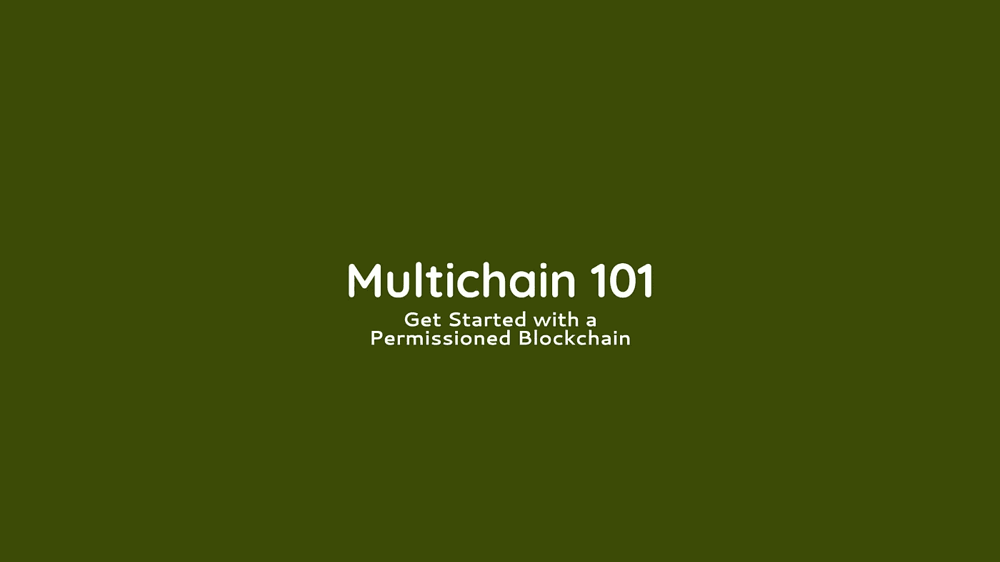

# 使用多链创建您的首个许可区块链解决方案

> 原文：<https://medium.com/coinmonks/create-your-first-permission-blockchain-with-multichain-fe2b154c275f?source=collection_archive---------2----------------------->

多链平台入门，



# 多链

Multichain 是一个开源的比特币分叉许可区块链解决方案。

# 方案

让我们设想一个由多个组织共享的应用程序。应用程序正在与底层数据库进行交互。

在传统的集中式架构中，该数据库由所有参与者信任的单一方托管和管理，即使他们彼此不信任。

修改数据库的事务仅由该中心方系统上的应用程序发起，通常是响应于从参与者接收的消息。数据库只是做它被告知的事情，因为应用程序被隐式地信任，只向它发送有意义的事务。

Multichain 提供了一种管理共享数据库的替代方法，无需可信中介[ [参考](https://www.multichain.com/blog/2018/12/smart-contract-showdown/) ]。

> [发现并回顾最佳区块链软件](https://coincodecap.com)

# 当使用多链作为解决方案时

核心优势是:

*   不像[以太坊](http://www.ethereum.org))或[比特币](https://bitcoin.org/en/)这样的公开区块链，交易和活动对选定的参与者保密。
*   管理员可以确保参与者可以连接到区块链，甚至可以在平台上读写。
*   有了这些好东西，虽然权力在这里是可选的，我们也可以包括钱包，资产和创造我们自己的货币。

# 文章目标

在本文中，我们将使用多链创建一个权限区块链解决方案。

*   创建两个节点
*   每个节点都有一个链的副本
*   我们在这些节点之间调整了一些权限
*   在第一个节点链中创建块数据，并确保该块数据在同级节点链中可用

# 先决条件

*   两个 ubuntu 实例(这里使用 AWS EC2)

# 我们开始吧

在我们开始之前，请在同一个网络下创建 2 个 ubuntu 实例。我们称第一个为`origin_node`节点，第二个为`sibling_1`节点。

`origin_node`是`Genesis`节点。它还扮演着`admin_node`的角色。

`sibling_1`将获得与链连接并写入的许可。

要创建实例，请考虑以下标准

*   使用 ubuntu 16.04 服务器
*   使用允许端口`443`、`22`和`8333`的安全组

`443`用于 HTTPS，`22`用于 SSH，`8333`用于自定义 TCP

# 准备原点 _ 节点

本节的目标是创建一个源节点并运行链。SSH 到你的`origin_node`。

```
ssh ubuntu@origin_node_public_ip -i key
```

成为超级用户

```
sudo su
```

下载多链

```
wget [https://www.multichain.com/download/multichain-2.0-alpha-5.tar.gz](https://www.multichain.com/download/multichain-2.0-alpha-5.tar.gz)
```

提取文件:

```
tar -xvzf multichain-2.0-alpha-5.tar.gz
```

将文件移动到二进制目录

```
cd multichain-2.0-alpha-5
mv multichaind multichain-cli multichain-util /usr/local/bin
```

返回到`home`目录

```
cd ~
```

创建一个起源节点

```
multichain-util create my-blockchain
```

将默认网络和 RPC 端口更新为`8333`和`8332`

```
nano /root/.multichain/my-blockchain/params.dat
```

可以用`default network port`。但是您必须确保在下一个命令中明确地放置端口。

> *现在运行节点，*

```
multichaind my-blockchain -daemon
```

> *你会得到这样的回应，*

```
Other nodes can connect to this node using:
multichaind my-blockchain@origin_node_ip:8333
```

现在配置`HTTPS`和`default network port`防火墙。

`HTTPS`用于与其他节点同步和交互，`default network port`用于与其他节点连接。

```
ufw allow OpenSSH
ufw allow in 443/tcp
ufw allow in 8333/tcp
ufw enable
ufw status
```

我们成功运行了一个多链节点。

# 准备一个同级节点:

就像前面的`origin_node`安装多链一样。

```
ssh ubuntu@origin_node_public_ip -i key
sudo su
wget https://www.multichain.com/download/multichain-2.0-alpha-5.tar.gz
tar -xvzf multichain-2.0-alpha-5.tar.gz
cd multichain-2.0-alpha-5
mv multichaind multichain-cli multichain-util /usr/local/bin
cd ~
```

从`origin_node`开始初始化链

```
multichaind my-blockchain@private_ip_of_origin_node:8333
```

现在，您应该获得一个钱包地址，以便进行进一步的交易。

太好了，一个兄弟节点被初始化了。

现在这个链已经初始化了。但是它没有任何权限连接或写入该链。

# 授予`origin_node`权限:

我们将授予`sibling_node`连接和写入该链的权限。

从`origin_node`中，授予连接和写入权限，

```
multichain-cli my-blockchain grant sibling_1_node_wallet_address connect,send,receive,mine,create
```

既然许可被授予，现在我们可以从`sibling_1`节点连接和写入数据到链。

# 从 sibling_Node 写入一些数据

去你的`sibling_1`和连接链，

```
multichaind my-blockchain -daemon
```

要写入一些`json`数据，进入`interactive`模式，

```
multichain-cli my-blockchain
```

制造一个`stream`来开采一些区块，

```
create stream my-blockchain-stream true
```

通过`stream`写入数据

```
publish my-blockchain-stream "json" '{"json":{"myKey":"myValue"}}'
```

确保`colon`、`cottation`或`brackets`之间没有`space`

是时候检查了，这个链在所有节点之间是同步的。

# 验证`origin_node`中的链数据

现在，链数据应该通过所有节点同步。要对此进行检查，转到`origin_node`并检查数据块是否存在于链中。在`origin_node`中，进入交互模式，

```
multichain-cli my-blockchain
```

订阅`stream`

```
subscribe my-blockchain-stream true
```

现在，您的数据应该会显示出来

```
liststreamitems my-blockchain-stream
```

你会得到类似这样的输出，

```
[
  {
    "publishers": ["1aokp3bti15AuRs51wPemtBuiqAdRDFaGYnRQw"],
    "keys": ["json"],
    "offchain": false,
    "available": true,
    "data": {
      "json": {
        "myKey": "myValue"
      }
    },
    "confirmations": 4,
    "blocktime": 1571709550,
    "txid": "transaction_id"
  }
]
```

# 下一个挑战:

*   创建具有读取权限的第二个兄弟节点，并读取该链
*   创建具有书面权限的第三个兄弟，并验证该链
*   [整合快递服务器](https://github.com/bmshamsnahid/Multichain-With-Node.js)

# 参考资料:

*   多链博客:[https://www . multi chain . com/blog/2018/12/smart-contract-摊牌/](https://www.multichain.com/blog/2018/12/smart-contract-showdown/)
*   视频课程:[https://www . udemy . com/Course/build-区块链-部署-私人-区块链/](https://www.udemy.com/course/build-blockchain-deploy-private-blockchain/)
*   官方入门:[https://www.multichain.com/getting-started/](https://www.multichain.com/getting-started/)
*   权限:[https://www . multi chain . com/developers/permissions-management/](https://www.multichain.com/developers/permissions-management/)
*   运行时参数:[https://www.multichain.com/developers/runtime-parameters/](https://www.multichain.com/developers/runtime-parameters/)