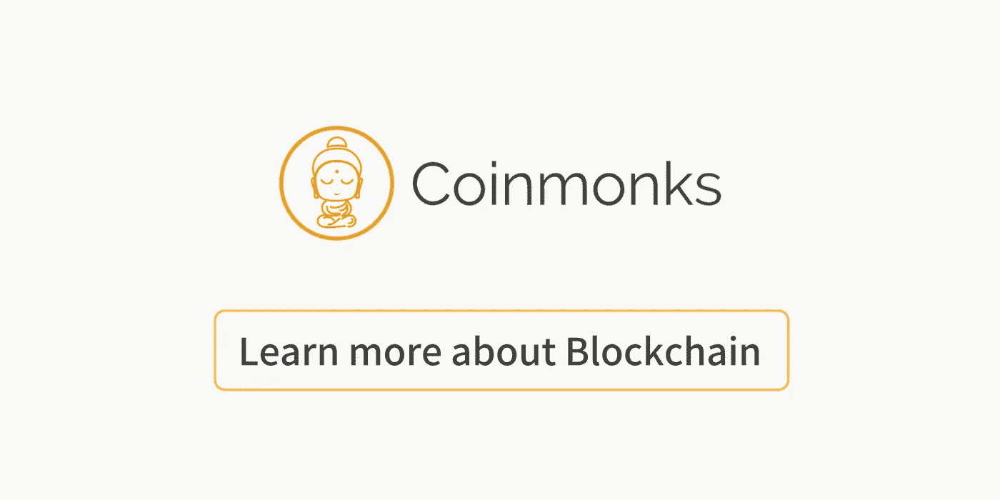

# 创造你自己的区块链

> 原文：<https://medium.com/coinmonks/create-your-own-blockchain-77d3164f414?source=collection_archive---------3----------------------->

## 编码你拥有区块链，并了解区块链如何工作

[source](https://www.mojix.com/blockchain-offers-dynamic-demand-chains/)

**Create Crypto Invoices**

[**Cryptofi —创建加密发票，跟踪您的加密支付**](https://cryptofi.co/)

[**使用 Coinmonks 作业门户**](https://coinmonks.com/) 查找加密作业

[***加入 Coinmonks 投稿人电报组。***](/coinmonks/coinnmonks-crypto-writers-telegram-group-f56b4621af0a)

[***捐投投僧***](/coinmonks/monks-need-your-help-7440418d67ec)

**Click to find blockchain Jobs**

[**代码一个简单的 P2P 区块链围棋！**](/coinmonks/code-a-simple-p2p-blockchain-in-go-46662601f417)

 [## 在 Go 中编写一个简单的 P2P 区块链！

### 你加入我们的电报聊天了吗？如果没有，现在就加入:-)如果你在阅读本教程时有任何问题…

medium.com](/coinmonks/code-a-simple-p2p-blockchain-in-go-46662601f417) 

[**在 Haskell 中创建区块链**](/coinmonks/create-blockchain-in-haskell-e65df30878bc)

 [## 在 Haskell 中创建区块链

### 在 Haskell 中滚动自己的区块链

medium.com](/coinmonks/create-blockchain-in-haskell-e65df30878bc) 

[**用 Python 构建简单的区块链数据结构**](/coinmonks/building-a-simple-blockchain-data-structure-with-python-e7ebd448647a)

 [## 用 Python 构建简单的区块链数据结构

### 在这里，我将建立一个简单的区块链数据结构，这是比特币的基础。这个数据结构…

medium.com](/coinmonks/building-a-simple-blockchain-data-structure-with-python-e7ebd448647a) 

[**第一部分:IBM 云上的以太坊区块链:——在 IBM 云上部署私有以太坊区块链…**](/coinmonks/part-1-ethereum-blockchain-on-ibm-cloud-deploying-private-ethereum-blockchain-on-ibm-cloud-9d241afd3887)

 [## 第 1 部分:IBM 云上的以太坊区块链:-在 IBM 云上部署私有以太坊区块链…

### 什么是 IBM 云？

medium.com](/coinmonks/part-1-ethereum-blockchain-on-ibm-cloud-deploying-private-ethereum-blockchain-on-ibm-cloud-9d241afd3887) 

> 更多故事和教程请关注 Coinmonks 出版物。学习和构建区块链应用程序。

**Click to learn more about blockchain**