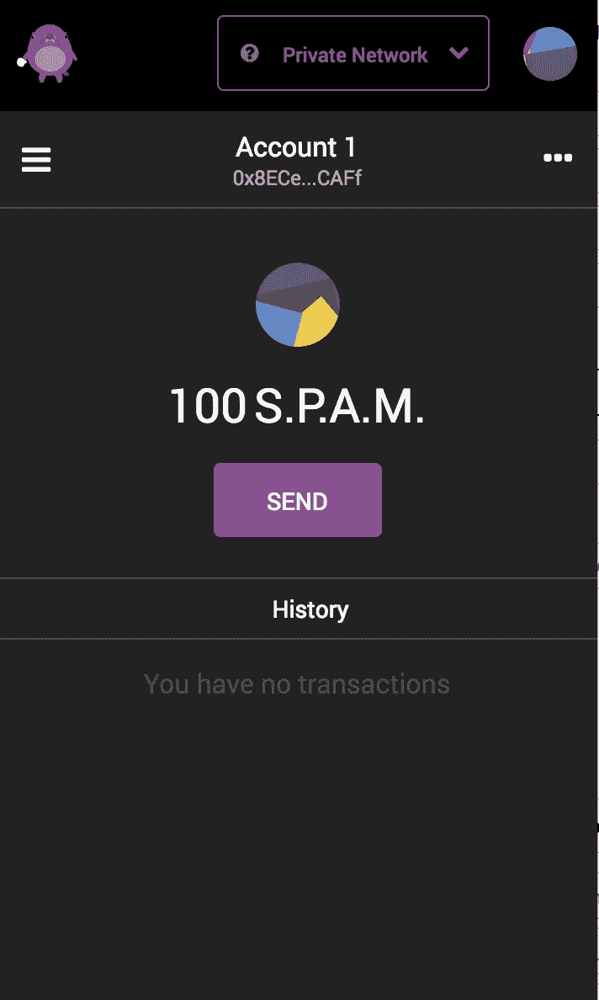
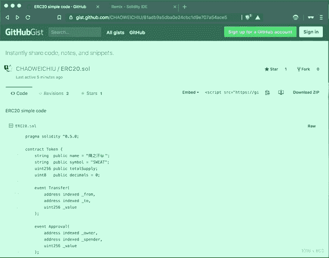
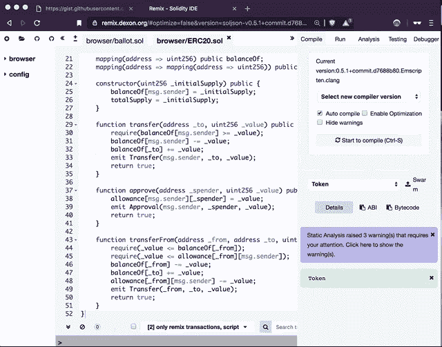
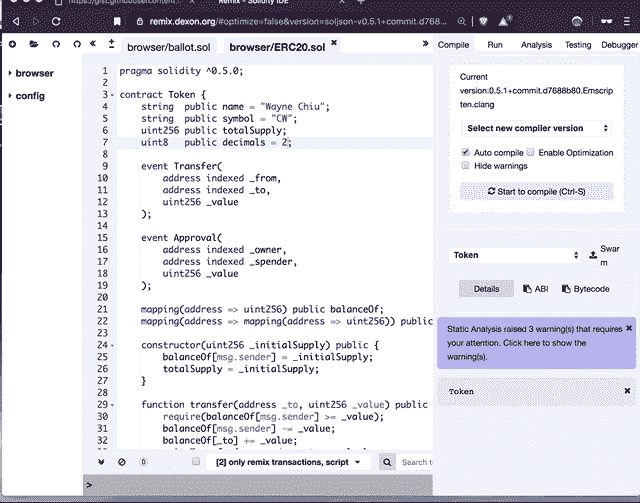
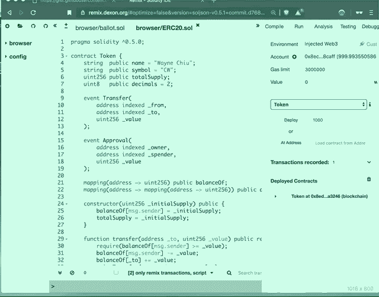

# 在 5 分钟内创建您自己的加密货币|程序员解释

> 原文：<https://medium.com/coinmonks/create-your-own-crypto-currency-in-5-minutes-programmer-explain-733dd54b2a09?source=collection_archive---------2----------------------->

## 了解如何在 DEXON 上创建自己的加密


[Image source](https://www.google.co.in/url?sa=i&source=images&cd=&cad=rja&uact=8&ved=2ahUKEwjE9-K5noPgAhUIbn0KHcl8Bc0Qjxx6BAgBEAI&url=https%3A%2F%2Fdexon.org%2F&psig=AOvVaw2K6NYFYOto9YPuoSWo98_o&ust=1548309965532235)

你想知道如何创造一种上面有你名字的加密货币吗？这里有一个关于学习创造你自己的数字货币的快速课程。

今天，我们将教你如何在 [DEXON](https://medium.com/u/1d41c18242ad?source=post_page-----733dd54b2a09--------------------------------) 网络上创建“加密货币”。这是一个[平台](https://www.youtube.com/watch?v=FWZDD9fL0GQ)，你可以使用智能合约来构建任何[dapp](/dexon/002-dapp-do-we-really-need-it-programmer-explain-ca4d45912074)。

从[到这里](https://www.youtube.com/watch?v=FWZDD9fL0GQ)的简短介绍之后，让我们一头扎进去！在教程的最后，你可以看到和下面完全一样的东西。简而言之，我创造了一个名为「S.P.A.M」的代币→「说真的，糟糕的广告方法」



```
Prerequisite
- [DekuSan Wallet + S](/dexon/how-to-create-an-account-obtain-your-private-key-on-dexon-74335b0d66c7)[ufficient amount](/dexon/how-to-create-an-account-obtain-your-private-key-on-dexon-74335b0d66c7) [DXN](/dexon/how-to-create-an-account-obtain-your-private-key-on-dexon-74335b0d66c7)
- ChromeCrypto Currency Spec
- Name: Seriously, Poor Advertising Method
- Symbol: S.P.A.M.
- Decimal Point: 2
- Token Amount: 10
```

```
**Step 1:**Copy this 「[Code](https://gist.github.com/CHAOWEICHIU/81adb9a5dba0e24cbc1d9e707a54ace5)」 and Paste it in the 「[Smart Contract Online Editor](https://remix.dexon.org/) 」
```



Copy 「[Code](https://gist.github.com/CHAOWEICHIU/81adb9a5dba0e24cbc1d9e707a54ace5)」 and Paste it in 「[Smart Contract Online Editor](https://remix.dexon.org/) 」

```
**Step 2:**Modify these three parameters:
Name / Symbol / Decimal
```



Modify three parameters

```
**Step 3**
Set the token amount to 1000, then deploy this contract on to DEXON network.*Note: 
1000 with decimal of 2 --> 10.00*
```



Set token amount to 1000, then deploy this contract to DEXON network

```
**Step 4:**Copy the contract address and show it on DekuSan wallet
```



Copy contract address and show it on DekuSan wallet

```
**Final Step**If you don't have people to send your newly created token, you can send it to my wallet "0x8ECedB018bDdf5bC05C756cA6ED67dbad208CAFf", and let me know your "**token** **contract address**" via 「[**gitter**](https://gitter.im/dexon-foundation/DApp)**」**and tag @CHAOWEICHIU.**token** **contract address:** the "**thing**" that you paste when you add the token.
```

让我们回顾一下！
简而言之，DRC-20 为所有要遵循的 [DEXON](https://medium.com/u/1d41c18242ad?source=post_page-----733dd54b2a09--------------------------------) 令牌定义了一个通用规则列表。DRC-20 **指定了六种功能。**

```
**6 functions of DRC-20**1\. totalSupply
2\. balanceOf
3\. transfer
4\. transferFrom
5\. approve
6\. allowance**Two Events**1\. Transfer
2\. ApprovalIf you want to know more information, check out the [DRC-20 Spec](https://github.com/ethereum/eips/issues/20).Also, if you would like to see all the available tokens on the DEXON network, you can check out [DEXSCAN](https://testnet.dexscan.org/tokens/drc20) which is an explorer for everything that happens on the DEXON Network.
```

```
Find DEXON anywhere
「[Telegram](https://goo.gl/Q577pM)/[Gitter](https://goo.gl/zTrF7J)/[Github](https://goo.gl/rLgCJ6)/[Reddit](https://goo.gl/LgFspc)」
```

**关于我**
我是一名全栈 javascript / DApps 开发人员，也是开源区块链项目 [DEXON](https://medium.com/u/1d41c18242ad?source=post_page-----733dd54b2a09--------------------------------) 和 [NEO](https://medium.com/u/95d056302ecb?source=post_page-----733dd54b2a09--------------------------------) 的贡献者之一


> [直接在您的收件箱中获得最佳软件交易](https://coincodecap.com/?utm_source=coinmonks)

[](https://coincodecap.com/?utm_source=coinmonks)