# 在以太坊区块链中创建自己的加密货币

> 原文：<https://medium.com/coinmonks/create-your-own-cryptocurrency-in-ethereum-blockchain-40865db8a29f?source=collection_archive---------0----------------------->


本文将说明在区块链以太坊创建自己的加密货币所需的步骤。我创建了自己的令牌，名为 **Kahawanu** ，可以在 Rinkby 测试网络中获得。卡哈瓦努是斯里兰卡的一种中世纪货币。【https://en.wikipedia.org/wiki/Kahavanu 号


[https://www.cbsl.gov.lk/en/notes-coins/notes-and-coins/history-of-currency-in-sri-lanka](https://www.cbsl.gov.lk/en/notes-coins/notes-and-coins/history-of-currency-in-sri-lanka)

查看我的币:[https://rinkeby . ethers can . io/address/0x8d0e 76420 ab 138 b8a 28438 EC 4c a 710 f 9459 df 15b](https://rinkeby.etherscan.io/address/0x8d0e76420ab138b8a28438ec4ca710f9459df15b)

如果你是区块链技术的新手，那么请参考我之前关于以太坊区块链和 Solidity 语言的文章。

[](/coinmonks/ethereum-blockchain-hello-world-smart-contract-with-java-9b6ae2961ad1) [## 以太坊区块链“Hello World”智能合约与 JAVA

### 本教程涵盖了在私有以太坊节点中开发第一个智能合约所需的一整套步骤…

medium.com](/coinmonks/ethereum-blockchain-hello-world-smart-contract-with-java-9b6ae2961ad1) 

## **什么是代币？**

以太坊生态系统中的代币可以代表任何可替换的可交易商品:硬币、忠诚度积分、黄金证书、借据、游戏中的物品等。由于所有令牌都以标准方式实现一些基本功能，这也意味着您的令牌将立即与以太坊钱包和任何其他使用相同标准的客户端或合同兼容。

[https://www.ethereum.org/token](https://www.ethereum.org/token)

**了解令牌的可靠性代码**

在以太坊中，可以将令牌创建为智能合约。合同的完整源代码可以在[https://www.ethereum.org/token](https://www.ethereum.org/token)位置找到。要创建一个新的令牌，我们只需要在这段代码中更改令牌的名称。令牌名称 Kahawanu 应该改为您自己的合约名称。

```
pragma solidity ^0.4.16;contract owned {
    address public owner;constructor() public {
        owner = msg.sender;
    }modifier onlyOwner {
        require(msg.sender == owner);
        _;
    }function transferOwnership(address newOwner) onlyOwner public {
        owner = newOwner;
    }
}interface tokenRecipient { function receiveApproval(address _from, uint256 _value, address _token, bytes _extraData) external; }contract TokenERC20 {
    // Public variables of the token
    string public name;
    string public symbol;
    uint8 public decimals = 18;
    // 18 decimals is the strongly suggested default, avoid changing it
    uint256 public totalSupply;// This creates an array with all balances
    mapping (address => uint256) public balanceOf;
    mapping (address => mapping (address => uint256)) public allowance;// This generates a public event on the blockchain that will notify clients
    event Transfer(address indexed from, address indexed to, uint256 value);

    // This generates a public event on the blockchain that will notify clients
    event Approval(address indexed _owner, address indexed _spender, uint256 _value);// This notifies clients about the amount burnt
    event Burn(address indexed from, uint256 value);/**
     * Constrctor function
     *
     * Initializes contract with initial supply tokens to the creator of the contract
     */
    constructor(
        uint256 initialSupply,
        string tokenName,
        string tokenSymbol
    ) public {
        totalSupply = initialSupply * 10 ** uint256(decimals);  // Update total supply with the decimal amount
        balanceOf[msg.sender] = totalSupply;                // Give the creator all initial tokens
        name = tokenName;                                   // Set the name for display purposes
        symbol = tokenSymbol;                               // Set the symbol for display purposes
    }/**
     * Internal transfer, only can be called by this contract
     */
    function _transfer(address _from, address _to, uint _value) internal {
        // Prevent transfer to 0x0 address. Use burn() instead
        require(_to != 0x0);
        // Check if the sender has enough
        require(balanceOf[_from] >= _value);
        // Check for overflows
        require(balanceOf[_to] + _value > balanceOf[_to]);
        // Save this for an assertion in the future
        uint previousBalances = balanceOf[_from] + balanceOf[_to];
        // Subtract from the sender
        balanceOf[_from] -= _value;
        // Add the same to the recipient
        balanceOf[_to] += _value;
        emit Transfer(_from, _to, _value);
        // Asserts are used to use static analysis to find bugs in your code. They should never fail
        assert(balanceOf[_from] + balanceOf[_to] == previousBalances);
    }/**
     * Transfer tokens
     *
     * Send `_value` tokens to `_to` from your account
     *
     * [@param](http://twitter.com/param) _to The address of the recipient
     * [@param](http://twitter.com/param) _value the amount to send
     */
    function transfer(address _to, uint256 _value) public returns (bool success) {
        _transfer(msg.sender, _to, _value);
        return true;
    }/**
     * Transfer tokens from other address
     *
     * Send `_value` tokens to `_to` in behalf of `_from`
     *
     * [@param](http://twitter.com/param) _from The address of the sender
     * [@param](http://twitter.com/param) _to The address of the recipient
     * [@param](http://twitter.com/param) _value the amount to send
     */
    function transferFrom(address _from, address _to, uint256 _value) public returns (bool success) {
        require(_value <= allowance[_from][msg.sender]);     // Check allowance
        allowance[_from][msg.sender] -= _value;
        _transfer(_from, _to, _value);
        return true;
    }/**
     * Set allowance for other address
     *
     * Allows `_spender` to spend no more than `_value` tokens in your behalf
     *
     * [@param](http://twitter.com/param) _spender The address authorized to spend
     * [@param](http://twitter.com/param) _value the max amount they can spend
     */
    function approve(address _spender, uint256 _value) public
        returns (bool success) {
        allowance[msg.sender][_spender] = _value;
        emit Approval(msg.sender, _spender, _value);
        return true;
    }/**
     * Set allowance for other address and notify
     *
     * Allows `_spender` to spend no more than `_value` tokens in your behalf, and then ping the contract about it
     *
     * [@param](http://twitter.com/param) _spender The address authorized to spend
     * [@param](http://twitter.com/param) _value the max amount they can spend
     * [@param](http://twitter.com/param) _extraData some extra information to send to the approved contract
     */
    function approveAndCall(address _spender, uint256 _value, bytes _extraData)
        public
        returns (bool success) {
        tokenRecipient spender = tokenRecipient(_spender);
        if (approve(_spender, _value)) {
            spender.receiveApproval(msg.sender, _value, this, _extraData);
            return true;
        }
    }/**
     * Destroy tokens
     *
     * Remove `_value` tokens from the system irreversibly
     *
     * [@param](http://twitter.com/param) _value the amount of money to burn
     */
    function burn(uint256 _value) public returns (bool success) {
        require(balanceOf[msg.sender] >= _value);   // Check if the sender has enough
        balanceOf[msg.sender] -= _value;            // Subtract from the sender
        totalSupply -= _value;                      // Updates totalSupply
        emit Burn(msg.sender, _value);
        return true;
    }/**
     * Destroy tokens from other account
     *
     * Remove `_value` tokens from the system irreversibly on behalf of `_from`.
     *
     * [@param](http://twitter.com/param) _from the address of the sender
     * [@param](http://twitter.com/param) _value the amount of money to burn
     */
    function burnFrom(address _from, uint256 _value) public returns (bool success) {
        require(balanceOf[_from] >= _value);                // Check if the targeted balance is enough
        require(_value <= allowance[_from][msg.sender]);    // Check allowance
        balanceOf[_from] -= _value;                         // Subtract from the targeted balance
        allowance[_from][msg.sender] -= _value;             // Subtract from the sender's allowance
        totalSupply -= _value;                              // Update totalSupply
        emit Burn(_from, _value);
        return true;
    }
}/******************************************/
/*       Change the name of the contract from Kahawanu to your own    token name
*/
/******************************************/contract **Kahawanu** is owned, TokenERC20 {uint256 public sellPrice;
    uint256 public buyPrice;mapping (address => bool) public frozenAccount;/* This generates a public event on the blockchain that will notify clients */
    event FrozenFunds(address target, bool frozen);/* Initializes contract with initial supply tokens to the creator of the contract */
    constructor(
        uint256 initialSupply,
        string tokenName,
        string tokenSymbol
    ) TokenERC20(initialSupply, tokenName, tokenSymbol) public {}/* Internal transfer, only can be called by this contract */
    function _transfer(address _from, address _to, uint _value) internal {
        require (_to != 0x0);                               // Prevent transfer to 0x0 address. Use burn() instead
        require (balanceOf[_from] >= _value);               // Check if the sender has enough
        require (balanceOf[_to] + _value >= balanceOf[_to]); // Check for overflows
        require(!frozenAccount[_from]);                     // Check if sender is frozen
        require(!frozenAccount[_to]);                       // Check if recipient is frozen
        balanceOf[_from] -= _value;                         // Subtract from the sender
        balanceOf[_to] += _value;                           // Add the same to the recipient
        emit Transfer(_from, _to, _value);
    }/// [@notice](http://twitter.com/notice) Create `mintedAmount` tokens and send it to `target`
    /// [@param](http://twitter.com/param) target Address to receive the tokens
    /// [@param](http://twitter.com/param) mintedAmount the amount of tokens it will receive
    function mintToken(address target, uint256 mintedAmount) onlyOwner public {
        balanceOf[target] += mintedAmount;
        totalSupply += mintedAmount;
        emit Transfer(0, this, mintedAmount);
        emit Transfer(this, target, mintedAmount);
    }/// [@notice](http://twitter.com/notice) `freeze? Prevent | Allow` `target` from sending & receiving tokens
    /// [@param](http://twitter.com/param) target Address to be frozen
    /// [@param](http://twitter.com/param) freeze either to freeze it or not
    function freezeAccount(address target, bool freeze) onlyOwner public {
        frozenAccount[target] = freeze;
        emit FrozenFunds(target, freeze);
    }/// [@notice](http://twitter.com/notice) Allow users to buy tokens for `newBuyPrice` eth and sell tokens for `newSellPrice` eth
    /// [@param](http://twitter.com/param) newSellPrice Price the users can sell to the contract
    /// [@param](http://twitter.com/param) newBuyPrice Price users can buy from the contract
    function setPrices(uint256 newSellPrice, uint256 newBuyPrice) onlyOwner public {
        sellPrice = newSellPrice;
        buyPrice = newBuyPrice;
    }/// [@notice](http://twitter.com/notice) Buy tokens from contract by sending ether
    function buy() payable public {
        uint amount = msg.value / buyPrice;               // calculates the amount
        _transfer(this, msg.sender, amount);              // makes the transfers
    }/// [@notice](http://twitter.com/notice) Sell `amount` tokens to contract
    /// [@param](http://twitter.com/param) amount amount of tokens to be sold
    function sell(uint256 amount) public {
        address myAddress = this;
        require(myAddress.balance >= amount * sellPrice);      // checks if the contract has enough ether to buy
        _transfer(msg.sender, this, amount);              // makes the transfers
        msg.sender.transfer(amount * sellPrice);          // sends ether to the seller. It's important to do this last to avoid recursion attacks
    }
}
```

**在 Remix 浏览器中测试令牌**

将上述智能合同代码复制并粘贴到 [remix](https://remix.ethereum.org) 网络浏览器中。

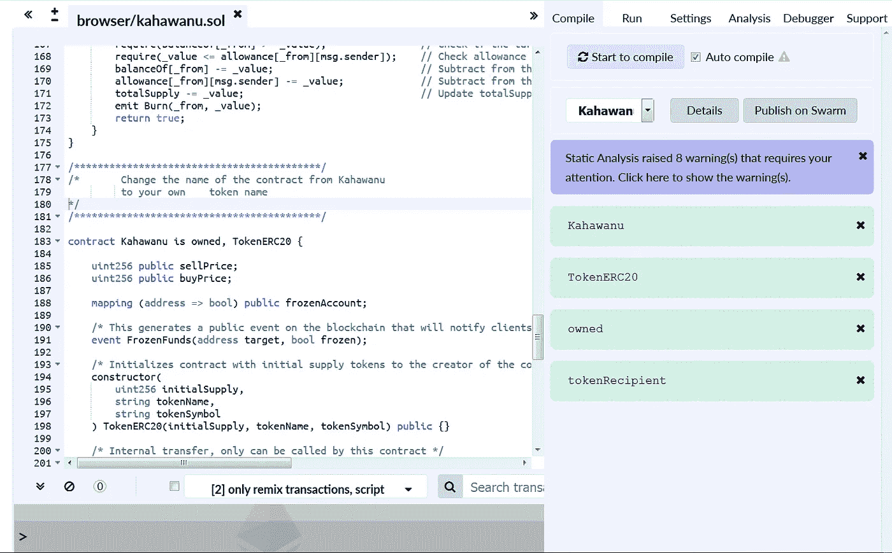

remix compiler

确保没有编译错误。现在，您可以使用 remix 中的 Run 菜单项部署合同。在按下“部署”按钮之前，您需要指定令牌的名称、要创建的令牌数量以及令牌的符号。Remix 有一个内置的以太坊节点在运行。

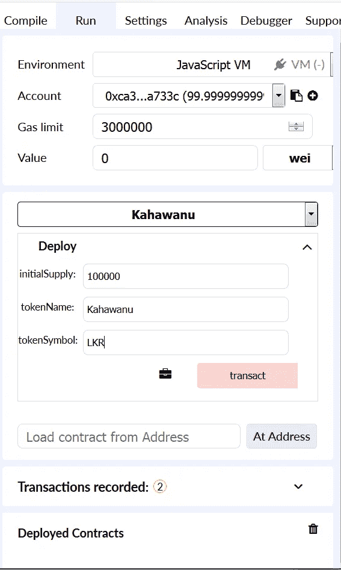

按下交易按钮。合同将被部署到本地以太坊节点。

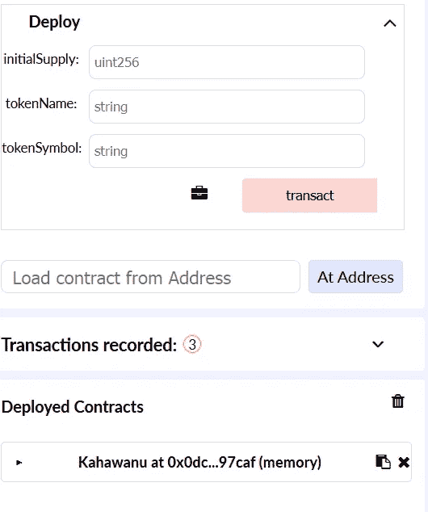

Deploy contract

您可以展开契约，然后与契约的功能进行交互。

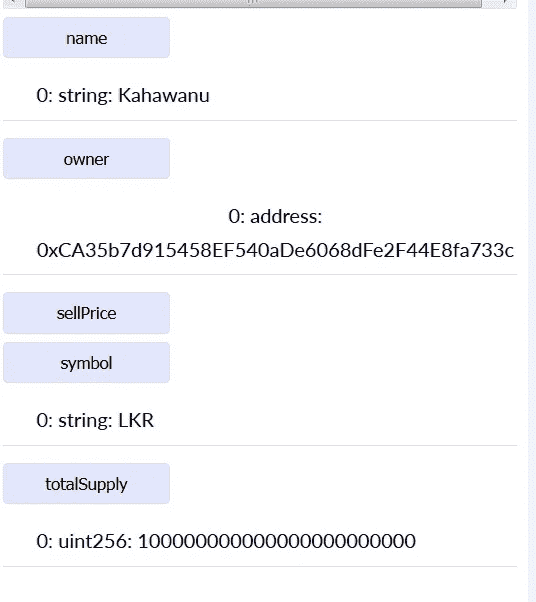

Invoke methods in the Contract

一旦令牌在本地 Remix 以太坊节点中得到测试，我们就可以在 [Rinkeby](https://rinkeby.etherscan.io/) 测试网络中进行测试。Rinkeby 是一个测试网络，用于在发布到主网络之前测试您的合同。在区块链，部署智能合同被视为一项交易。因此，我们需要为未成年人支付额外费用来部署我们的合同。我们可以从 Rinkeby 网络获得测试以太到我们的钱包。可以使用钱包提供商软件(如 MetaMask)创建钱包。

**使用元掩码创建钱包**

MetaMask 钱包管理软件是谷歌 chrome 的扩展。你需要下载并安装如下。

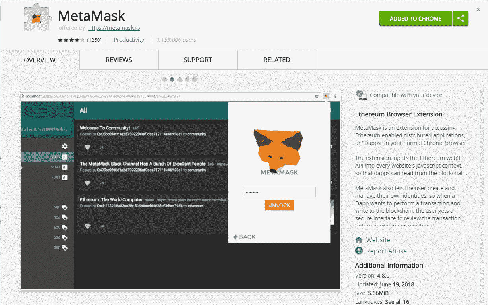

Install MetaMask google chrome extension

安装后，您可以通过指定密码来创建一个帐户(密钥对)。在下拉列表中选择 Rinkeby 测试网络。

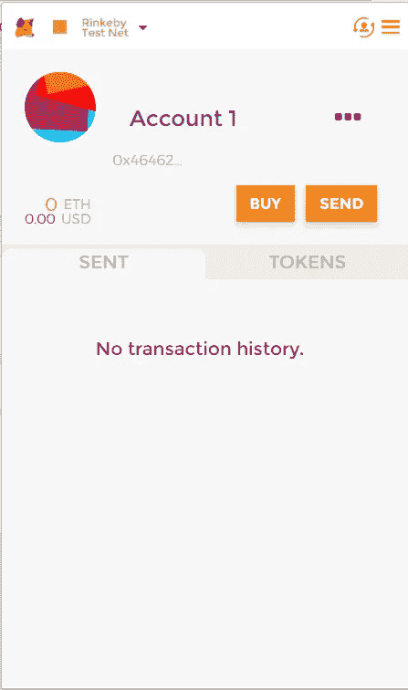

Wallet

**弄点测试乙醚**

我们可以使用下面的 web 应用程序向我们的钱包请求测试乙醚。作为第一步，需要在 Twitter、脸书或 Google plus 上发布如下公开帖子。

[https://ether eum . stack exchange . com/questions/34718/how-do-I-buy-tokens-on-the-rinkeby-test-environment](https://ethereum.stackexchange.com/questions/34718/how-do-i-buy-tokens-on-the-rinkeby-test-environment)

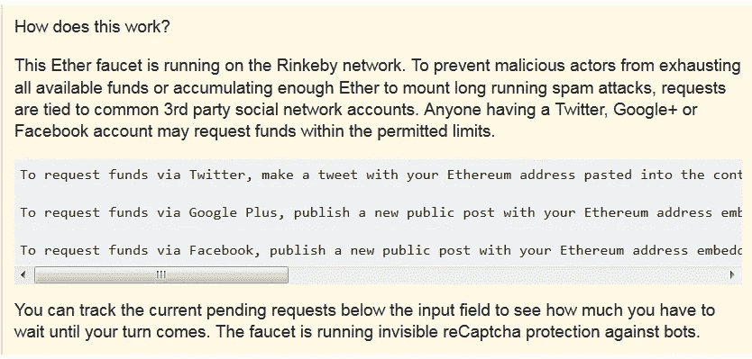

Publishing a public post to Request Ether

我用 google plus 来发布帖子。从 MetaMask 复制您的帐户地址。

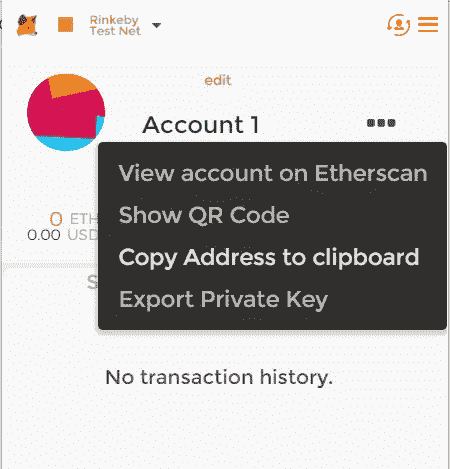

Copy account address

将以下文本复制并粘贴到您的 google plus 邮箱中。

```
Requesting faucet funds into 0x***YOU_ADDRESS***************** on the #Rinkeby #Ethereum test network.
```

公开分享帖子。

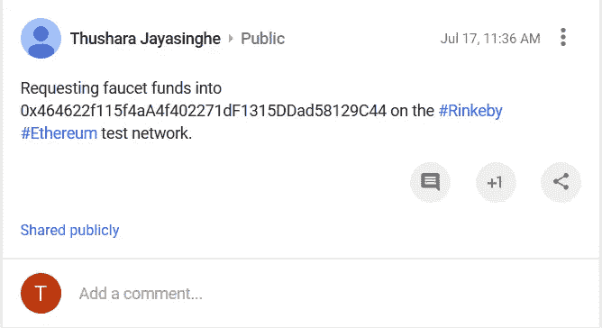

Google+

打开你的文章，复制网址。测试请求表单中需要此 URL。

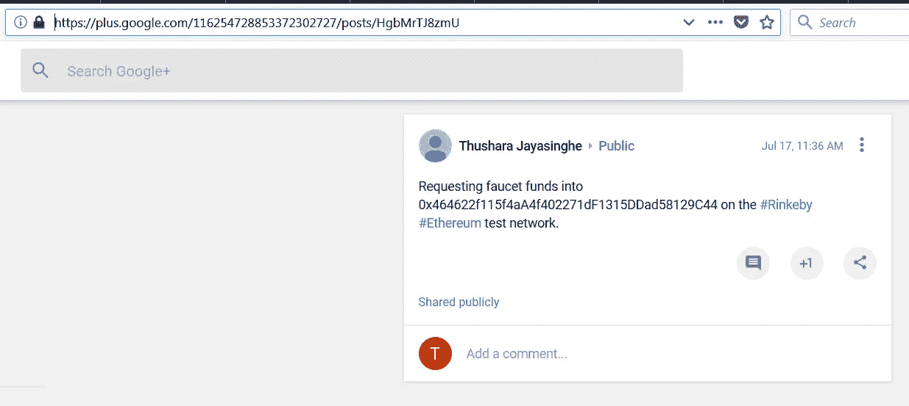

Copy URL of the Google+ post

参考资料:

[https://ether eum . stack exchange . com/questions/34718/how-do-I-buy-tokens-on-the-rinkeby-test-environment](https://ethereum.stackexchange.com/questions/34718/how-do-i-buy-tokens-on-the-rinkeby-test-environment)

导航到下面的网页。

[https://faucet.rinkeby.io/](https://faucet.rinkeby.io/)

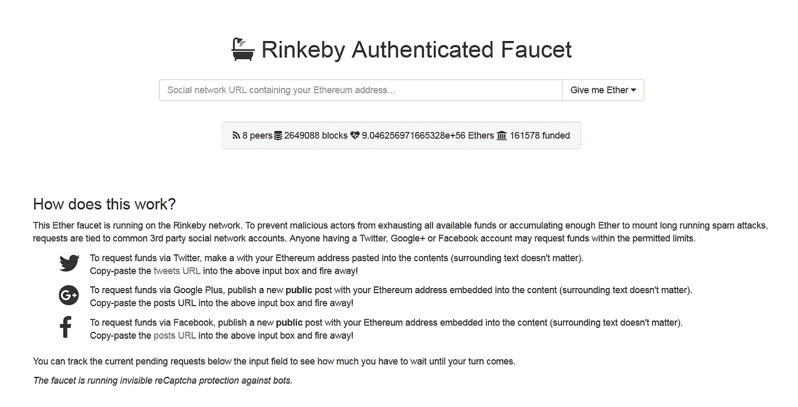

Request test Ether to your wallet

将您的 Google+ post URL 粘贴到上面的文本框中，然后按“给我乙醚”按钮。

你的账户将由测试乙醚资助。您可以在 MetaMask wallet 中查看您的帐户余额。

**在 Rinkeby 测试网络中部署令牌**

现在在 Remix 浏览器里把环境改成“注入的 Web3”。指定合同名称、初始供应和合同符号，然后按“交易”按钮。您将被定向到元掩码提交事务处理页。记得在 MetaMask 中选择 Rinkeby 测试网络。指定交易的乙醚量，然后按发送按钮。我们的合同将被部署。

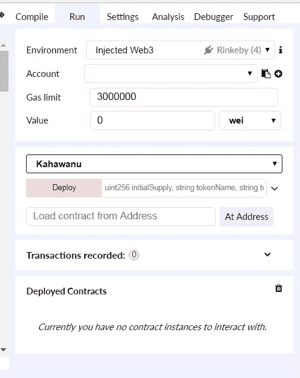

Deploy Token in Rinkeby

一旦部署，合同将有自己的地址。该地址可用于在钱包应用程序中跟踪我们的令牌。

**查看以太扫描中的令牌**

可以在[https://rinkeby.etherscan.io/](https://rinkeby.etherscan.io/)网络应用程序中查看您的交易。将您的帐户地址粘贴到搜索框中，然后按 GO 按钮。从您的帐户发起的所有交易将显示如下。

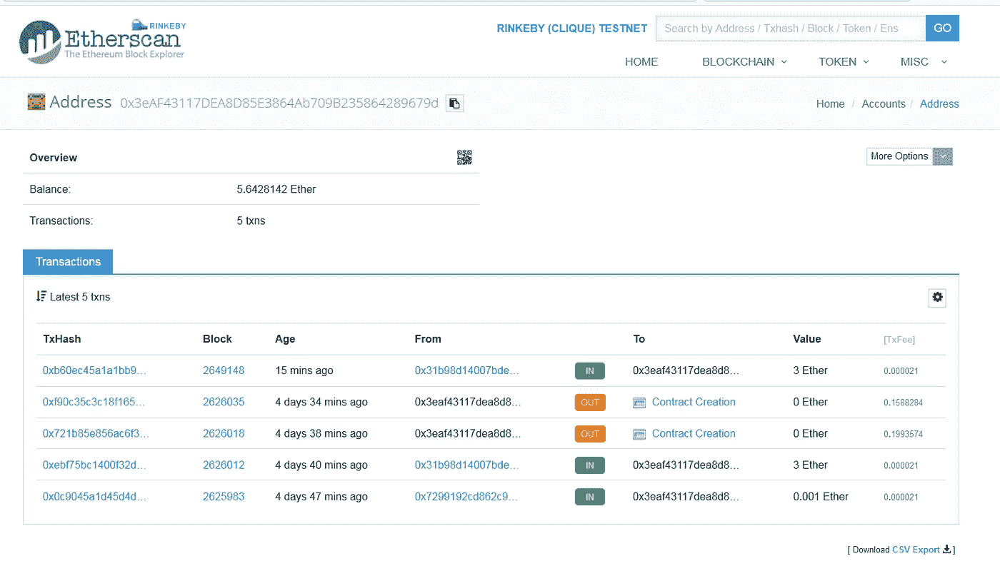

View transactions in [https://rinkeby.etherscan.io/](https://rinkeby.etherscan.io/)

**验证令牌**

我们的合同的源代码应该得到验证，以便在以太网扫描中列出。应将合同代码提交给 etherscan 进行验证。以太网扫描将编译代码，并与网络中部署的字节码进行比较。我们需要选择已经用于在 Remix 浏览器中编译代码的相同编译器版本。

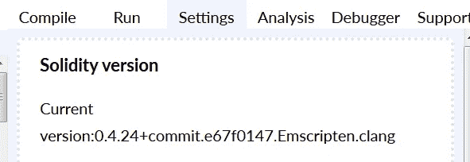

Remix compiler version

**给钱包添加代币**

您可以通过单击添加令牌按钮并指定合同地址，将新创建的令牌添加到 MetaMask wallet 应用程序中。

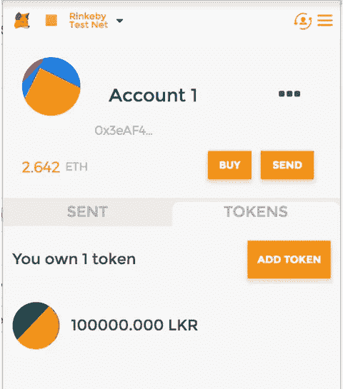

Track my Token

嘿嘿，我现在有钱了！！！

**在主网络中部署令牌**

部署合同与在 Rinkeby 测试网络中部署合同是一样的。唯一的区别是:

*   我们的钱包里需要真正的乙醚。部署合同的成本约为 2 到 3 美元。
*   应在元掩码中选择主网络
*   应该通过向 etherscan 发送电子邮件来进行验证

[https://ether eum . stack exchange . com/questions/31902/how-to-verify-token-after-ether scan-and-submit-icon](https://ethereum.stackexchange.com/questions/31902/how-to-verify-token-after-etherscan-and-submit-icon)

**结论**

创建自己的加密货币并不复杂。简单又好玩。为什么不自己试试？

如果你想要一些卡哈瓦努并变得富有，那么让我知道你的帐户公钥。

如果你喜欢这篇文章，请鼓掌。我会分享更多关于未来的文章，所以不要忘记关注，如果你认为你的任何朋友可以使用这些技巧，那么与他们分享这篇文章。感谢阅读。👏

> 加入 Coinmonks [电报频道](https://t.me/coincodecap)和 [Youtube 频道](https://www.youtube.com/c/coinmonks/videos)获取每日[加密新闻](http://coincodecap.com/)

## 另外，阅读

*   [密码电报信号](http://Top 4 Telegram Channels for Crypto Traders) | [密码交易机器人](/coinmonks/crypto-trading-bot-c2ffce8acb2a)
*   [复制交易](/coinmonks/top-10-crypto-copy-trading-platforms-for-beginners-d0c37c7d698c) | [加密税务软件](/coinmonks/crypto-tax-software-ed4b4810e338)
*   [电网交易](https://coincodecap.com/grid-trading) | [加密硬件钱包](/coinmonks/the-best-cryptocurrency-hardware-wallets-of-2020-e28b1c124069)
*   [最佳加密交易所](/coinmonks/crypto-exchange-dd2f9d6f3769) | [印度最佳加密交易所](/coinmonks/bitcoin-exchange-in-india-7f1fe79715c9)
*   [面向开发人员的最佳加密 API](/coinmonks/best-crypto-apis-for-developers-5efe3a597a9f)
*   最佳[密码借贷平台](/coinmonks/top-5-crypto-lending-platforms-in-2020-that-you-need-to-know-a1b675cec3fa)
*   杠杆代币的终极指南
*   [加密交易的最佳 VPN](https://coincodecap.com/best-vpns-for-crypto-trading)
*   [最佳加密分析或链上数据](https://coincodecap.com/blockchain-analytics) | [Bexplus 评论](https://coincodecap.com/bexplus-review)
*   [NFT 十大市场造币集锦](https://coincodecap.com/nft-marketplaces)
*   [AscendEx Staking](https://coincodecap.com/ascendex-staking)|[Bot Ocean Review](https://coincodecap.com/bot-ocean-review)|[最佳比特币钱包](https://coincodecap.com/bitcoin-wallets-india)
*   [Bitget 回顾](https://coincodecap.com/bitget-review)|[Gemini vs block fi](https://coincodecap.com/gemini-vs-blockfi)|[OKEx 期货交易](https://coincodecap.com/okex-futures-trading)