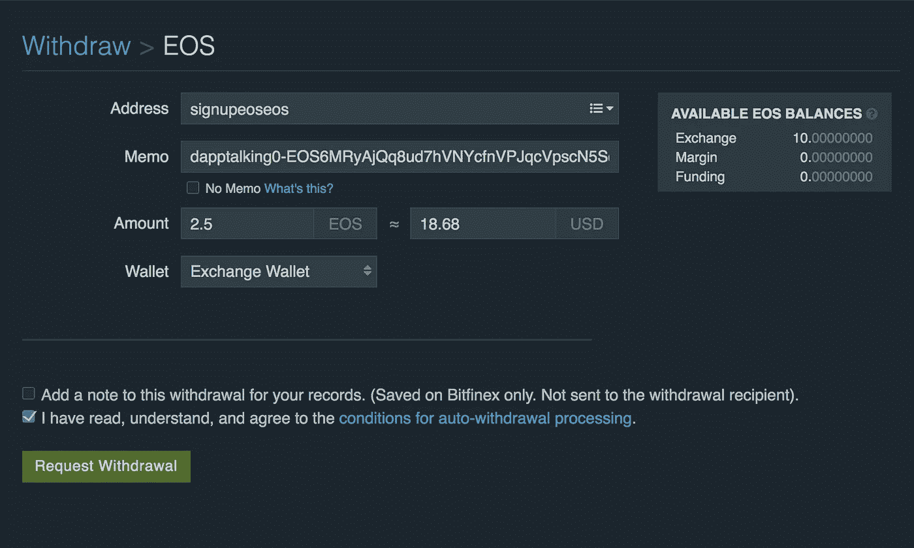
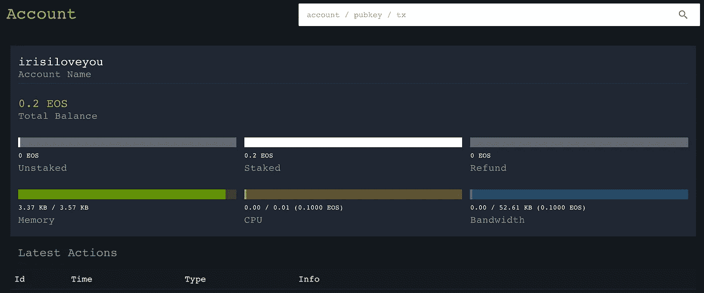
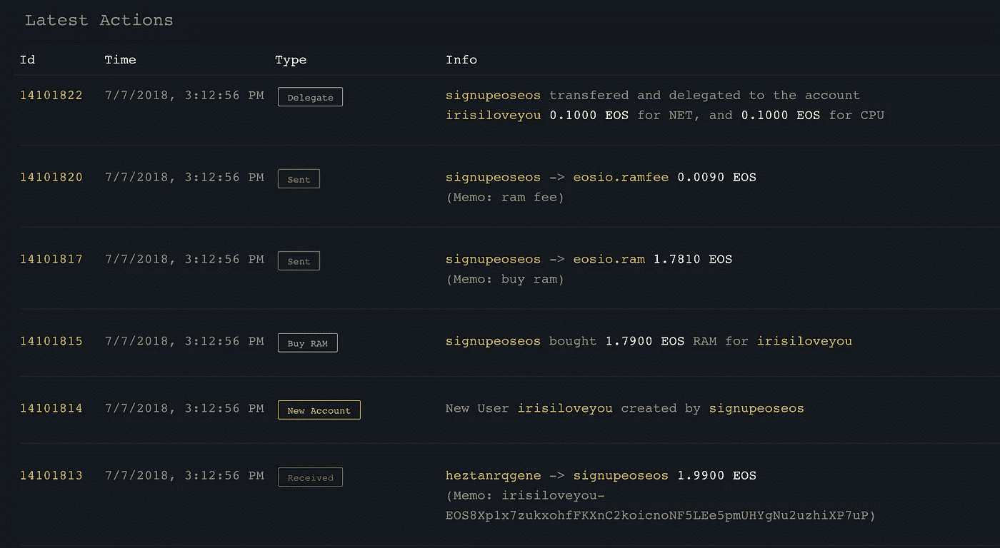

# 使用开源的无服务费 DApp“signupeoseos”轻松创建您自己的 EOS 帐户

> 原文：<https://medium.com/coinmonks/create-your-own-eos-account-easily-using-the-non-service-fee-dapp-signupeoseos-b15c5347f2fc?source=collection_archive---------0----------------------->

由于 EOS RAM 成本不断增加，大多数 EOS 钱包最近都关闭了免费的 EOS 帐户注册服务。一些不可靠的第三方代理声称可以帮助其他人注册 EOS 帐户，但却窃取私钥和资产。

我们创建了这个名为“signupeoseos”的[开源](https://github.com/Dappub/signupeoseos) DApp，以帮助您快速轻松地创建自己的 eos 帐户，而无需向您收取额外的服务费，并且这个 DApp 已经作为一个底层智能合同集成到许多流行的移动 EOS 钱包(TokenPocket，Meet.one)中。

> [发现并回顾最佳区块链软件](https://coincodecap.com)

# 如何注册

如下图所示:



Signup via a simple exchange (Bitfinex) withdraw

您只需将大约 2 份 EOS(具体金额可能会因 EOS RAM 价格而异)汇至我们的 DApp 地址: [**signupeoseos**](https://eosflare.io/account/signupeoseos) 。记得在“MEMO field”中填写您想要创建的 12 位 EOS 帐户名称，后面是您的公钥地址(用减号“-”分隔)

如果你不知道如何创建你的 EOS 密钥对，你可以试试 [EOS 密钥生成](https://nadejde.github.io/eos-token-sale)或者[分散](https://get-scatter.com)。您可以在任何 EOS 区块链浏览器(例如 [eosflare.io](https://eosflare.io/) )中进行搜索，以检查您想要的帐户名称是否存在。

您可以通过简单的转账或取款操作创建您的帐户，并在“eosflare.io”或“eospark.com”上查看创建的帐户信息。



*An created EOS account (irisiloveyou) info on “eosflare.io“*

DApp 将为您注册账户，不收取额外服务费。在您转给我们的 2 个 EOS 中，0.1 个 EOS 用于 CPU 资源，另一个 0.1 个 EOS 用于带宽资源，所有剩余的 1.8 个 EOS 将用于为您新创建的 EOS 帐户购买 EOS RAM。此外，如果你想购买更多的 EOS 内存用于投资目的，你可以转让 2 个以上的 EOS，所有额外的 EOS 将用于为您的帐户购买 EOS 内存。这样，你根本不用 EOS 钱包就可以投资 EOS RAM。



*Actions of Dapp “signupeoseos” on “eosflare.io”*

如您所见，一旦您完成转账/取款操作，所有的注册操作都由我们 DApp 的“签约人”在区块链自动完成。如果您有任何问题，您可以参考我们的开源 Github repo 或通过我们的电报或 Discord 与我们联系。

**git hub**:[https://github.com/dappub/signupeoseos](https://github.com/DAppTalking/signupeoseos)

# 常见问题:

**问:我可以通过简单的转账操作注册，也可以退出比特币以外的交易所吗？**

是的，基本上一个正常的状态方程转移也将工作。至于退出一些其他的交换，比如“hoo bi ”, MEMO 字段可能会有大写字符的限制，这是目前不支持的。

**问:“招牌”有服务费吗？**

不，“signupeoseos”是 DApp，您可以在 eos 网络上查看详情。

**问:如果我转移的 EOS 不足，会不会丢失 EOS？**

不，不成功的注册将导致整个转账交易失败，您也不会丢失任何 EOS。

**问:如果我传输的 EOS 超过需要怎么办？**

所有额外的 EOS 将用于为您新创建的帐户购买 EOS RAM。用户不会丢失任何状态方程。

**问:转账时，如果我在备忘录字段填写错了怎么办？**

如果备忘录注释格式不正确，将导致整个转账交易失败，您也不会丢失 EOS。

# 联系我们

如果您对注册过程或源代码有任何反馈或问题，请随时与我们联系。

```
**@** [**Official site**](https://dapp.pub)**@** [**Discord**](http://hi.dapp.pub/)**@** [**Telegram**](https://t.me/DappPub)**@** [**Reddit**](https://www.reddit.com/user/dapppub)**@** [**Medium**](https://medium.com/dapppub)**@** [**Github**](https://github.com/Dappub)
```


**DappPub: Unleashing the power of DApps**