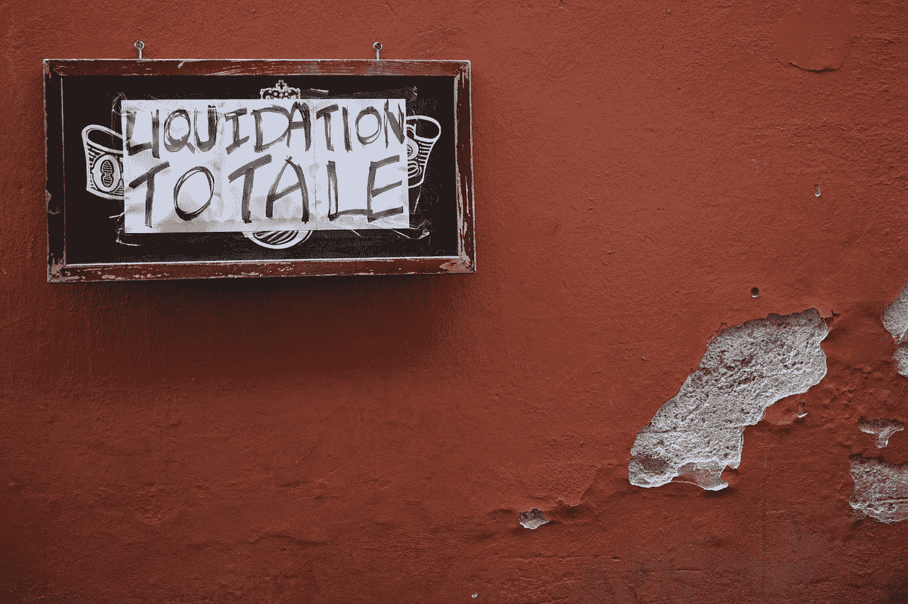

# 为 Aave DeFi 协议创建清算脚本

> 原文：<https://medium.com/coinmonks/creating-a-liquidation-script-for-aave-defi-protocol-ef584ad87e8f?source=collection_archive---------0----------------------->

## 为了测试它被清算了

Photo by [Tina Bosse](https://unsplash.com/@tinabosse8?utm_source=medium&utm_medium=referral) on [Unsplash](https://unsplash.com?utm_source=medium&utm_medium=referral)

*免责声明:本帖内容纯属信息性，不能视为投资建议。所有测试都是在测试环境中进行的，因此不代表金钱。创建的软件仅用于教育目的，可能包含错误，使用时风险自担。*