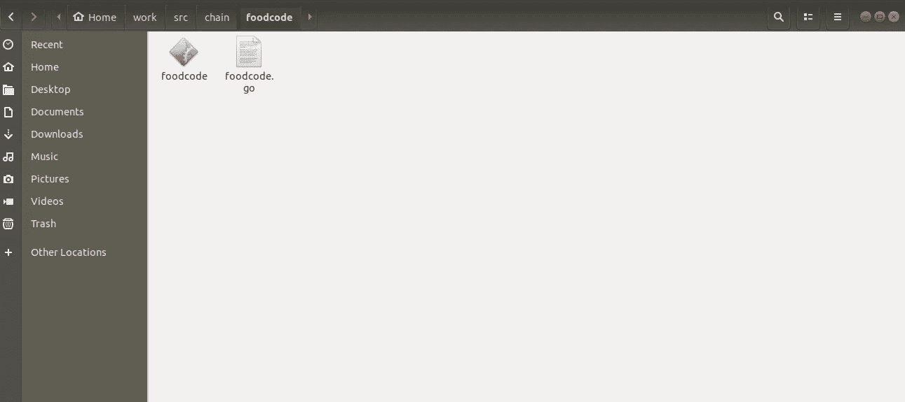

# 为 Hyper ledger 结构创建和部署自定义链代码

> 原文：<https://medium.com/coinmonks/creating-and-deploying-a-custom-chain-code-for-hyper-ledger-fabric-51e7ed2f466b?source=collection_archive---------0----------------------->

在本教程中，我们将学习创建一个自定义链代码(智能合同)。链码基于 hyper ledger 官方教程中的 fabcar 链码。我对它进行了逆向工程，使之成为原始的食品监管链代码。


首先，我们将看看链代码。我们将一部分一部分地做这件事。

```
import ("bytes""encoding/json""fmt""strconv""github.com/hyperledger/fabric/core/chaincode/shim"sc "github.com/hyperledger/fabric/protos/peer")
```

这部分包括 go 链代码的必要导入。

然后我们为链码做一个结构。

```
type SmartContract struct {}// Define the stock structure, with 4 properties.  Structure tags are used by encoding/json librarytype Stock struct {Type   string `json:"type"`Quantity  string `json:"quantity"`Importer string `json:"importer"`Retailer  string `json:"retailer"`}
```

我们创建了一个名为 stock 的结构，其中包含智能合约所需的必要数据集。

现在我们来看看实例化和调用部分。链代码需要被实例化以在对等体中工作。

```
func (s *SmartContract) Init(APIstub shim.ChaincodeStubInterface) sc.Response {return shim.Success(nil)}func (s *SmartContract) Invoke(APIstub shim.ChaincodeStubInterface) sc.Response {// Retrieve the requested Smart Contract function and argumentsfunction, args := APIstub.GetFunctionAndParameters()// Route to the appropriate handler function to interact with the ledger appropriatelyif function == "queryStock" {return s.queryStock(APIstub, args)} else if function == "initLedger" {return s.initLedger(APIstub)} else if function == "createStock" {return s.createStock(APIstub, args)} else if function == "queryAllStocks" {return s.queryAllStocks(APIstub)} else if function == "assignStock" {return s.assignStock(APIstub, args)}return shim.Error("Invalid Smart Contract function name.")}
```

在调用部分，我们调用链代码的各种函数来工作。

现在是链代码的剩余部分。

```
func (s *SmartContract) queryStock(APIstub shim.ChaincodeStubInterface, args []string) sc.Response {if len(args) != 1 {return shim.Error("Incorrect number of arguments. Expecting 1")}carAsBytes, _ := APIstub.GetState(args[0])return shim.Success(carAsBytes)}func (s *SmartContract) initLedger(APIstub shim.ChaincodeStubInterface) sc.Response {stocks := []Stock{Stock{Type: "CowMeat", Quantity: "205kg", Importer: "BengolMeat", Retailer: "BengolMeat"},Stock{Type: "GoatMeat", Quantity: "100kg", Importer: "RoyalMeat", Retailer: "MenaBajar"},Stock{Type: "ChickenMeat", Quantity: "25kg", Importer: "GovtMeat", Retailer: "Shopno"},Stock{Type: "KhasirMeat", Quantity: "655kg", Importer: "AiubMeat", Retailer: "AgoraMeat"},Stock{Type: "GoruMeat", Quantity: "2264kg", Importer: "BeyondlMeat", Retailer: "MeatMarket"},}i := 0for i < len(stocks) {fmt.Println("i is ", i)stockAsBytes, _ := json.Marshal(stocks[i])APIstub.PutState("STOCK"+strconv.Itoa(i), stockAsBytes)fmt.Println("Added", stocks[i])i = i + 1}return shim.Success(nil)}func (s *SmartContract) createStock(APIstub shim.ChaincodeStubInterface, args []string) sc.Response {if len(args) != 5 {return shim.Error("Incorrect number of arguments. Expecting 5")}var stock = Stock{Type: args[1], Quantity: args[2], Importer: args[3], Retailer: args[4]}stockAsBytes, _ := json.Marshal(stock)APIstub.PutState(args[0], stockAsBytes)return shim.Success(nil)}func (s *SmartContract) queryAllStocks(APIstub shim.ChaincodeStubInterface) sc.Response {startKey := "STOCK0"endKey := "STOCK999"resultsIterator, err := APIstub.GetStateByRange(startKey, endKey)if err != nil {return shim.Error(err.Error())}defer resultsIterator.Close()// buffer is a JSON array containing QueryResultsvar buffer bytes.Bufferbuffer.WriteString("[")bArrayMemberAlreadyWritten := falsefor resultsIterator.HasNext() {queryResponse, err := resultsIterator.Next()if err != nil {return shim.Error(err.Error())}// Add a comma before array members, suppress it for the first array memberif bArrayMemberAlreadyWritten == true {buffer.WriteString(",")}buffer.WriteString("{\"Key\":")buffer.WriteString("\"")buffer.WriteString(queryResponse.Key)buffer.WriteString("\"")buffer.WriteString(", \"Record\":")// Record is a JSON object, so we write as-isbuffer.WriteString(string(queryResponse.Value))buffer.WriteString("}")bArrayMemberAlreadyWritten = true}buffer.WriteString("]")fmt.Printf("- queryAllStocks:\n%s\n", buffer.String())return shim.Success(buffer.Bytes())}func (s *SmartContract) assignStock(APIstub shim.ChaincodeStubInterface, args []string) sc.Response {if len(args) != 2 {return shim.Error("Incorrect number of arguments. Expecting 2")}stockAsBytes, _ := APIstub.GetState(args[0])stock := Stock{}json.Unmarshal(stockAsBytes, &stock)stock.Retailer = args[1]stockAsBytes, _ = json.Marshal(stock)APIstub.PutState(args[0], stockAsBytes)return shim.Success(nil)}func main() {// Create a new Smart Contracterr := shim.Start(new(SmartContract))if err != nil {fmt.Printf("Error creating new Smart Contract: %s", err)}}
```

这部分代码处理链代码中的函数。第一个函数是 queryStock，它接受股票的一个参数键，并提供详细信息。下一个函数是 initLedger，它用一些数据填充分类帐以进行查询和其他操作。QueryAllStocks 名称已经足够定义了。assignStock 用于将库存分配给不同的零售商。主要功能仅用于单元测试。

现在是最后的代码:

现在我们必须先编译它。用于编译 go 链代码。我们必须将文件保存在 go 路径中。Go 路径设置可以通过此链接了解:

[](https://github.com/golang/go/wiki/SettingGOPATH) [## golang/go

### Go 编程语言。在 GitHub 上创建帐户，为 golang/go 开发做出贡献。

github.com](https://github.com/golang/go/wiki/SettingGOPATH) 

我们将使用命令构建代码。

```
go build 
```

我们现在将有一个编译好的 go 文件。



然后将编译后的 go 文件和 go 文件放在 compose-cli 文件中指定的路径中。


为了更好地理解，这里也给出了该文件。如果你想知道什么是 docker-compose-cli，它有什么必要，可以在这里找到。

[](/@golammohammadshovon/creating-custom-network-and-deploy-chain-code-with-hyperledger-fabric-f710177047d3) [## 使用 Hyperledger 结构创建自定义网络和部署链代码

### 首先，我们必须在系统中设置 hyperledger 结构的先决条件。我们使用最新版本的…

medium.com](/@golammohammadshovon/creating-custom-network-and-deploy-chain-code-with-hyperledger-fabric-f710177047d3) 

我在本教程中使用了另一个网络，但概念是相同的。

在这个网络中，我们有 3 个组织，每个组织有一个对等点。我们为链代码指定的体积部分不是绝对的。这是一个相对路径，相对于 gopath。

我们将按照这个过程在对等体中安装链代码。在启动网络并将对等体加入信道之后。更多相关数据可在此处找到:

[](/@golammohammadshovon/creating-custom-network-and-deploy-chain-code-with-hyperledger-fabric-f710177047d3) [## 使用 Hyperledger 结构创建自定义网络和部署链代码

### 首先，我们必须在系统中设置 hyperledger 结构的先决条件。我们使用最新版本的…

medium.com](/@golammohammadshovon/creating-custom-network-and-deploy-chain-code-with-hyperledger-fabric-f710177047d3) 

同样，网络是不同的，但概念是相同的。请记住，所有命令都必须在网络文件夹中发出。

我们将按照以下程序输入每一项:

这方面的一般指挥结构是:

对于客户组织对等 0，命令为:

```
docker exec -e "CORE_PEER_LOCALMSPID=CustomerMSP" -e "CORE_PEER_TLS_ROOTCERT_FILE=/opt/gopath/fabric-samples/food-network/crypto-config/peerOrganizations/customer.food-network.com/peers/peer0.customer.food-network.com/tls/ca.crt" -e "[CORE_PEER_MSPCONFIGPATH=/opt/gopath/fabric-samples/food-network/crypto-config/peerOrganizations/customer.food-network.com/users/Admin@customer.food-network.com](mailto:CORE_PEER_MSPCONFIGPATH=/opt/gopath/fabric-samples/food-network/crypto-config/peerOrganizations/customer.food-network.com/users/Admin@customer.food-network.com)/msp" -e "CORE_PEER_ADDRESS=peer0.customer.food-network.com:7051" -it cli bash
```


进入对等体后，我们将首先导入证书文件。

```
export ORDERER_CA=/opt/gopath/fabric-samples/food-network/crypto-config/ordererOrganizations/food-network.com/orderers/orderer.food-network.com/msp/tlscacerts/tlsca.food-network.com-cert.pem
```

这里的频道名称是:channelshovon

现在，我们将在客户组织的对等 0 中安装链。连锁码在连锁文件夹的食品码文件夹里面。

```
CORE_PEER_ADDRESS=peer0.customer.food-network.com:7051 peer chaincode install -n foodcode -p chain/foodcode -v 1.0
```

这方面的通用命令是:

```
CORE_PEER_ADDRESS=****peer address****peer chaincode install -n **chaincodename**-p chain/**location of the chaincode folder** -v **version for the chaincode**
```


现在我们可以使用这个命令检查已安装的链代码列表。

```
peer chaincode list --installed
```

输出:


我们现在可以看到链代码已安装。现在我们必须实例化它以供进一步使用。

命令:

```
peer chaincode instantiate -o orderer.food-network.com:7050 -C channelshovon -n foodcode -v 1.0 -l golang   -c  '{"Args":["init"]}' -P "OR('CustomerMSP.peer', 'ImporterMSP.peer','DistributorMSP.peer')" --tls true --cafile $ORDERER_CA
```

输出将是这样的:


现在我们可以在链代码中使用函数。首先，我们将初始化一个分类帐以备将来使用。然后我们将使用 queryAllStocks、createStock、queryStock、assignStock 并查看它们的用法和输出。

```
peer chaincode invoke -o orderer.food-network.com:7050 --tls --cafile $ORDERER_CA  -C channelshovon -n foodcode -c '{"Args":["initLedger"]}peer chaincode invoke -o orderer.food-network.com:7050 --tls --cafile $ORDERER_CA  -C channelshovon -n foodcode -c '{"Args":["queryAllStocks"]}'peer chaincode invoke -o orderer.food-network.com:7050 --tls --cafile $ORDERER_CA  -C channelshovon -n foodcode -c '{"Args":["createStock", "STOCK7","DuckMeat", "290ton", "BeMt", "Ao"]}'peer chaincode invoke -o orderer.food-network.com:7050 --tls --cafile $ORDERER_CA  -C channelshovon -n foodcode -c '{"Args":["queryStock","STOCK5"]}peer chaincode invoke -o orderer.food-network.com:7050 --tls --cafile $ORDERER_CA  -C channelshovon -n foodcode -c '{"Args":["assignStock","STOCK5","ACI"]}'
```


输出可以在图像中看到。


该链在连接的对等体之间创建共享的分类帐。

这是可以在超级分类帐结构网络中部署链码的方式。

> [在您的收件箱中直接获得最佳软件交易](https://coincodecap.com/?utm_source=coinmonks)

[](https://coincodecap.com/?utm_source=coinmonks)[](https://coincodecap.com)