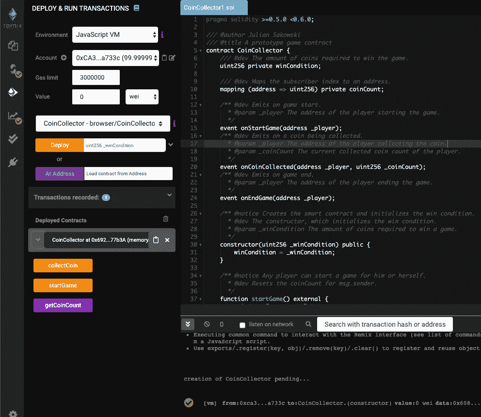

# 为 Loom 的基链创建和部署智能合同

> 原文：<https://medium.com/coinmonks/creating-and-deploying-smart-contracts-on-loom-network-5798dbceb63d?source=collection_archive---------3----------------------->

# 介绍

在这篇文章中，你将了解织机网络，它的区块链和它的好处。此外，您可以按照流程从头开始为迷你游戏创建智能合约，并将其部署到 [Loom 的基链](/loom-network/basechain-is-coming-99fdb643950a)。如果你觉得真的很棒，你可以在你自己的 Unity 游戏中使用这个智能契约。学习[如何在 Unity](/@danz_marcel/how-to-create-a-loom-game-in-unity-65058306a1ef) 中创建一个织机游戏。

# 织机网络


source: [https://loomx.io/](https://loomx.io/)

> **面向严肃 Dapp 开发者的生产就绪型多链互操作平台**
> 
> Loom Network 为开发人员提供了构建高性能面向用户的 dapps 所需的可扩展性和可用性。
> 
> 通过与比特币、以太坊、币安链和所有主要区块链的无缝集成，部署一次到 Loom 可以让您通过接触尽可能多的用户来保护您的 dapp。—[https://loomx.io/](https://loomx.io/)

Loom Network 为[以太坊](/@micheledaliessi/what-is-ethereum-f4c5e566ff77)提供了第二层解决方案，具有以下主要优势:

*   1-3 秒的确认时间
*   用户不用交煤气费
*   避免 mainnet 事务拥塞
*   完全兼容 MetaMask 和其他主要以太坊钱包

# 创建智能合同

如果你是一个用 Solidity 编写智能合同的初学者，我强烈推荐 [Remix IDE](https://remix.ethereum.org/) 来开发和使用你的智能合同。它可以很容易地测试一些功能。Remix 还为任何智能合约创建了合约 ABI 和字节码——这些你以后需要集成到你的游戏客户端中。

此外，你应该看看织机的坚固学校[隐僵尸](https://loomx.io/)。😉



Remix — Ethereum IDE

对于高级编码员或者专家，我推荐使用[松露](/@gus_tavo_guim/using-truffle-to-create-and-deploy-smart-contracts-95d65df626a2)。您还可以遵循[Pranshu Rastogi](/coinmonks/deploy-smart-contracts-with-0-eth-loom-c59cc54b749)的指南，使用 Truffle 为 Loom 创建和部署智能合约。

我们要创建的智能合约是一个小型的原型单人游戏，由游戏引擎 Unity 创建，玩家可以收集硬币。这些硬币实际上是创造和免费保存在织机区块链！

Finished Smart Contract

**步步为营**

让我们一步一步地创建这个原型游戏智能契约。

首先，让我们创建一个通用智能合同

```
**pragma solidity >=0.5.0 <0.6.0;****contract CoinCollector {****}**
```

注意，我们为编译器版本定义了范围。它必须介于版本 5.0 和 6.0 之间。建议这样做，因为较低版本可能包含安全问题，而较高版本可能会破坏契约代码。我们的合同叫做硬币收集者。

让我们包括一个赢的条件，玩家为了赢得游戏需要收集的硬币的数量。

```
pragma solidity >=0.5.0 <0.6.0;contract CoinCollector {
    **uint256 private winCondition;

    constructor(uint256 _winCondition) public {
        winCondition = _winCondition;
    }**
}
```

注意，我们创建了一个全局变量“winCondition”，它的类型是 uint256(正自然数)。此外，我们还包括了构造函数。构造函数是一个特殊的函数，一旦部署了智能协定，就会调用它。这里，我们在参数中定义我们的实际获胜条件。我们就定在 10 分钟吧。为了更好地概括，让参数总是以下划线开头，这样您就能够区分参数和全局变量。

让我们包括我们的功能。

```
pragma solidity >=0.5.0 <0.6.0;contract CoinCollector {
    uint256 private winCondition;
    **mapping (address => uint256) private coinCount;**

    constructor(uint256 _winCondition) public {
        winCondition = _winCondition;
    } **function startGame() external {
        coinCount[msg.sender] = 0;
    }** **function collectCoin() external {
        coinCount[msg.sender] += 1;
    }** **function getCoinCount() external view returns (uint256) {
        return coinCount[msg.sender];
    }**}
```

请注意，除了构造函数之外，我们现在还创建了三个函数。我们希望能够开始一个游戏，收集硬币，并总是收到关于已经收集了多少硬币的信息。我们为每个函数提供了可见性修饰符。可能的修饰符有公共的、私有的、内部的和外部的。

*   任何人都可以调用公共函数
*   Private 意味着只能从契约内部调用该函数
*   Internal 允许从父协定继承的协定使用该函数
*   外部函数是契约接口的一部分，这意味着可以从其他契约和通过事务调用它们

也就是说，保持你的功能私密或内部，除非需要外部互动。此外，我们的 getCoinCount 函数有“view”关键字，这是可选的，但指定我们不在此函数中更改任何存储变量。我们只“查看”一些数据，例如我们的硬币。:)

为了跟踪收集了多少硬币，我们添加了[映射](http://mapping (address => uint256) private coinCount;)硬币计数。当游戏开始时，玩家的值被重置，并且在玩游戏时，每收集一次硬币，该值将增加 1。我们的映射获取一个地址(当前玩家)并“指向”值，即收集的硬币数。因此，我们能够在 coinCount 中保存每个玩家的当前状态。

让我们添加最后的代码片段:事件。事件对我们的客户来说是最重要的。它使我们能够注意到正在发生的事情。例如，我们想知道玩家何时开始并赢得游戏，或者何时收集硬币。

```
pragma solidity >=0.5.0 <0.6.0;contract CoinCollector {
    uint256 private winCondition;
    mapping (address => uint256) private coinCount; **event onStartGame(address _player);
    event onCoinCollected(address _player, uint256 _coinCount);
    event onEndGame(address _player);**

    constructor(uint256 _winCondition) public {
        winCondition = _winCondition;
    } function startGame() external {
        coinCount[msg.sender] = 0;
        **emit onStartGame(msg.sender);**
    } function collectCoin() external {
        coinCount[msg.sender] += 1;
 **emit onCoinCollected(msg.sender, coinCount[msg.sender]);

        if (coinCount[msg.sender] == winCondition){
            emit onEndGame(msg.sender);
        }**   
    } function getCoinCount() external view returns (uint256) {
        return coinCount[msg.sender];
    }}
```

注意，我们在存储变量的顶部添加了可能的事件。每个事件定义了它需要哪些信息。在我们的 collectCoin 函数中，我们添加了一个 if 语句来检查收集硬币的玩家是否满足获胜条件。如果是这样，结束游戏事件被发出，并将被客户端注意到。每当我们在代码中引用“msg.sender”时，它指的是传入事务的地址，即玩家的地址。

做得好。基础合同完成。随意玩和添加额外的功能，例如，收集的所有硬币被保存，不同类型的硬币被收集，或集成机制，使其成为一个多人游戏。**要有创意！**

# 部署您的智能合同

首先，我们需要用以下命令安装 Loom SDK:

```
curl https://raw.githubusercontent.com/loomnetwork/loom-sdk-documentation/master/scripts/get_loom.sh | sh
```

接下来，使用以下命令创建部署智能合约所需的私钥:

```
./loom genkey -k priv_key -a pub_key
```

现在，我们正在为我们的合同创建一个二进制文件。

```
solc --bin --overwrite -o . CoinCollector.sol
```

并使用这个二进制文件将我们的智能合约部署到 Loom Testnet(完全免费！)我们指定私钥“-k”二进制文件“-b”链 URL“-u”和链 id“-chain”。

```
./loom deploy -k priv_key -b CoinCollector.bin -u [http://extdev-plasma-us1.dappchains.com:80](http://extdev-plasma-us1.dappchains.com:80) --chain “extdev-plasma-us1”
```

结果应该是这样的，顶部是合同地址，后面是字节码。

```
New contract deployed with address: extdev-plasma-us1:**0xfC4ce0E01e8fdd309af77564bF5bE8b7dE79E3e9**Runtime bytecode: [96 128 96 64 82 52 128 21 97 0 16 87 96 0 128 253 91 80 96 4 54 16 97 0 94 87 96 0 53 124 1 0 0 0 0 0 0 0 0 0 0 0 0 0 0 0 0 0 0 0 0 0 0 0 0 0 0 0 0 144 4 128 99 171 126 56 160 20 97 0 99 87 128 99 202 83 16 172 20 97 0 129 87 128 99 214 90 181 242 20 97 0 139 87 91 96 0 128 253 91 97 0 107 97 0 149 86 91 96 64 81 128 130 129 82 96 32 1 145 80 80 96 64 81 128 145 3 144 243 91 97 0 137 97 0 220 86 91 0 91 97 0 147 97 2 130 86 91 0 91 96 0 96 1 96 0 51 115 255 255 255 255 255 255 255 255 255 255 255 255 255 255 255 255 255 255 255 255 22 115 255 255 255 255 255 255 255 255 255 255 255 255 255 255 255 255 255 255 255 255 22 129 82 96 32 1 144 129 82 96 32 1 96 0 32 84 144 80 144 86 91 96 1 128 96 0 51 115 255 255 255 255 255 255 255 255 255 255 255 255 255 255 255 255 255 255 255 255 22 115 255 255 255 255 255 255 255 255 255 255 255 255 255 255 255 255 255 255 255 255 22 129 82 96 32 1 144 129 82 96 32 1 96 0 32 96 0 130 130 84 1 146 80 80 129 144 85 80 127 191 239 136 214 251 22 149 67 110 98 57 38 222 62 243 239 224 63 35 239 35 206 36 19 14 22 231 220 54 231 86 87 51 96 1 96 0 51 115 255 255 255 255 255 255 255 255 255 255 255 255 255 255 255 255 255 255 255 255 22 115 255 255 255 255 255 255 255 255 255 255 255 255 255 255 255 255 255 255 255 255 22 129 82 96 32 1 144 129 82 96 32 1 96 0 32 84 96 64 81 128 131 115 255 255 255 255 255 255 255 255 255 255 255 255 255 255 255 255 255 255 255 255 22 115 255 255 255 255 255 255 255 255 255 255 255 255 255 255 255 255 255 255 255 255 22 129 82 96 32 1 130 129 82 96 32 1 146 80 80 80 96 64 81 128 145 3 144 161 96 0 84 96 1 96 0 51 115 255 255 255 255 255 255 255 255 255 255 255 255 255 255 255 255 255 255 255 255 22 115 255 255 255 255 255 255 255 255 255 255 255 255 255 255 255 255 255 255 255 255 22 129 82 96 32 1 144 129 82 96 32 1 96 0 32 84 20 21 97 2 128 87 127 241 146 45 227 151 135 44 67 217 208 185 165 167 164 56 126 82 138 167 86 234 251 122 48 149 77 42 177 197 150 123 193 51 96 64 81 128 130 115 255 255 255 255 255 255 255 255 255 255 255 255 255 255 255 255 255 255 255 255 22 115 255 255 255 255 255 255 255 255 255 255 255 255 255 255 255 255 255 255 255 255 22 129 82 96 32 1 145 80 80 96 64 81 128 145 3 144 161 91 86 91 96 0 96 1 96 0 51 115 255 255 255 255 255 255 255 255 255 255 255 255 255 255 255 255 255 255 255 255 22 115 255 255 255 255 255 255 255 255 255 255 255 255 255 255 255 255 255 255 255 255 22 129 82 96 32 1 144 129 82 96 32 1 96 0 32 129 144 85 80 127 164 24 168 129 11 81 212 86 200 190 242 122 103 50 143 121 1 217 23 209 155 38 140 190 174 131 119 90 81 239 236 96 51 96 64 81 128 130 115 255 255 255 255 255 255 255 255 255 255 255 255 255 255 255 255 255 255 255 255 22 115 255 255 255 255 255 255 255 255 255 255 255 255 255 255 255 255 255 255 255 255 22 129 82 96 32 1 145 80 80 96 64 81 128 145 3 144 161 86 254 161 101 98 122 122 114 48 88 32 37 59 125 14 80 36 176 248 220 94 188 101 217 194 206 222 90 41 16 251 207 104 252 40 65 194 155 70 208 254 117 97 0 41]
Transaction receipt: e9810a90a1cecebce9c5d2b19f152ea52029d574f9ae1cd08cce30d4b3af65f4
```

请注意，部署的协定地址是“0x fc 4 ce 0 e 01 E8 FDD 309 af 77564 BF 5 be 8 b 7 de 79 E3 e 9”。你现在可以在[织机模块浏览器](http://extdev-blockexplorer.dappchains.com/)中找到它。需要合同地址将其添加到您的游戏客户端。

**干得好！**还有些能量？去在 Unity 中创建迷你游戏，它会马上使用你的智能合约！了解如何在 Unity 中创建一个织机游戏。

# 我们是谁？

我们在 Calystral 的愿景是释放游戏玩家的潜力。我们专注于开发游戏，让投入的时间和精力得到真正的回报。增强玩家体验，让玩家获得更多成就。在这个过程中，我们努力克服区块链技术的技术限制，并利用其优势将游戏提升到一个新的水平。我们很乐意与社区和其他开发者分享这些解决方案。迈向更美好的游戏未来！

加入我们的旅程:

[卡利斯托](https://calystral.io/) [不和](https://discord.gg/nJ4vwtR) [推特](https://twitter.com/calystral) [脸书](https://facebook.com/calystral) [中](/@calystral) [电报](https://t.me/calystral)

# 阅读更多

[](https://loomx.io/) [## 织机网络

### 减缓主流采用区块链技术的最大问题之一是事情太复杂…

loomx.io](https://loomx.io/) [](https://medium.com/loom-network) [## 织机网络

### 🛸面向严肃的 dapp 开发人员的生产就绪、多链互操作平台

medium.com](https://medium.com/loom-network) [](https://calystral.com/) [## 加入旅程| Calystral

### 我们利用区块链技术创造了第一个可收藏的纸牌游戏。当前的游戏…

calystral.com](https://calystral.com/) [](https://medium.com/calystral) [## Calystral

### 区块链游戏、游戏设计、交易和收藏卡牌游戏的有趣话题。加入旅程。

medium.com](https://medium.com/calystral) 

> [直接在您的收件箱中获得最佳软件交易](https://coincodecap.com/?utm_source=coinmonks)

[](https://coincodecap.com/?utm_source=coinmonks)