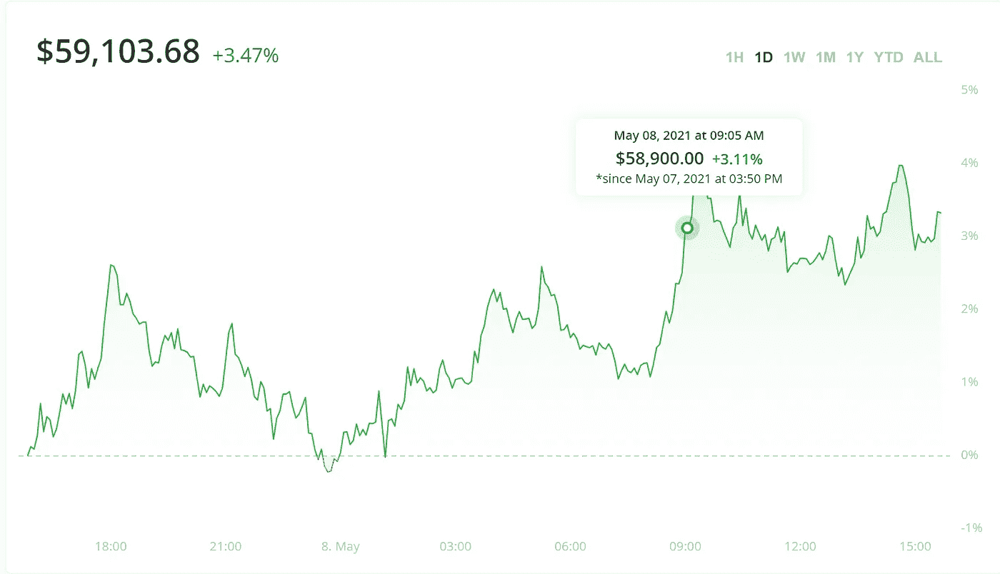
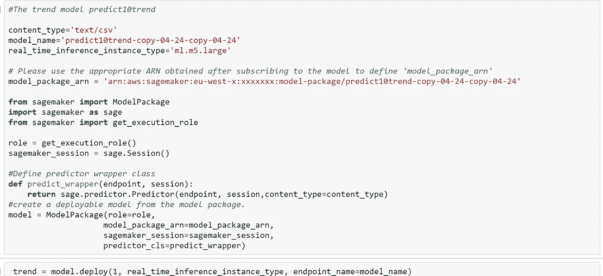
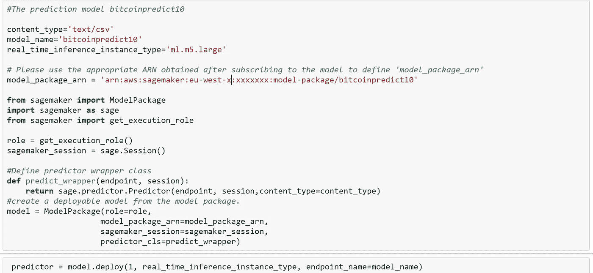
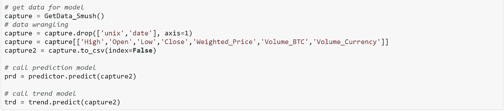
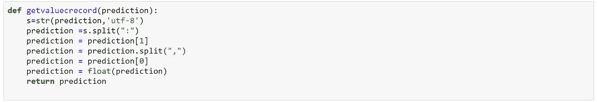
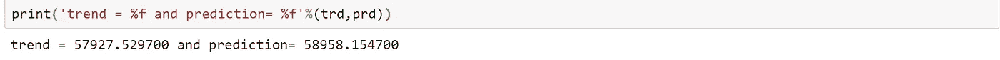
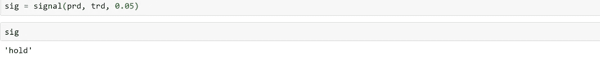
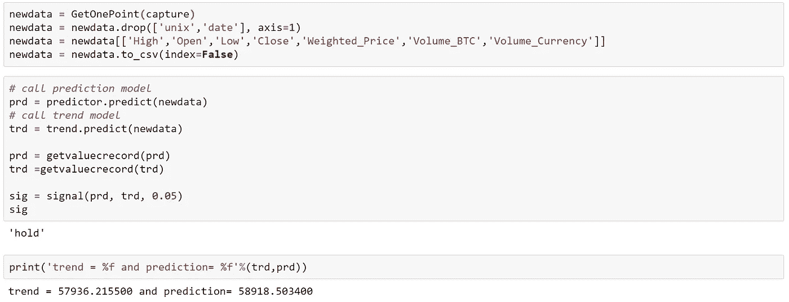

# 创建加密信号

> 原文：<https://medium.com/coinmonks/creating-crypto-signals-6e6eb3ef1cec?source=collection_archive---------5----------------------->

在本文中，我想扩展第一篇文章“获取日内加密数据”中讨论的工作，该文章讨论了使用不同的数据源获取最新的 OHLC 比特币数据。在文章中，我提到了使用数据运行生产模型或加密交易策略；在本文中，我将展示如何使用 AWS 市场模型创建买入、持有或卖出交易信号。

## 让我们做一些有趣的事情

AWS Marketplace 模型 [bitcoinpredict10](https://aws.amazon.com/marketplace/pp/prodview-4upbyugt7qm62?ref_=srh_res_product_title) 用于预测，而 [BitcoinTrend10](https://aws.amazon.com/marketplace/pp/prodview-5zu4feijueobm) 用于提供 2 周价格趋势，我们将使用它作为 10 分钟价格预测的交叉点，以查看预测价格是否高于/低于趋势模型价格，我们将使用它作为买入/卖出比特币的机会。

现在让我们部署模型；您将需要一个 AWS 帐户来完成此操作。第一个代码块将部署趋势模型:

在您订阅模型后，您的 AWS 帐户中将提供变量 model_package_arn。以下代码块将部署价格预测模型:

现在我们有了模型，我们需要做一些数据角力，以确保上一篇文章中产生的数据可以用在模型中，然后我们将使用部署的模型来预测未来的 10 分钟价格和未来的 10 分钟趋势。

现在让我们创建一个函数来处理这两个模型传回的值。

我们将创建一个简单的函数，将趋势乘以一个执行百分比，并检查预测价格是高于还是低于我们，以便我们可以采取卖出/买入头寸或保持当前头寸。

让我们把它们放在一起，看看预测了什么，信号会预测什么。

让我们使用 GetOnePoint 函数进行第二次运行，并查看预测的结果以及信号在下面的代码块中所表达的内容:

在这个 [GIT 资源库](https://github.com/llama-analytics/awsmarketplace/blob/main/Example%20create%20a%20Crypto%20Signal.ipynb)中可以找到一个包含完整代码的笔记本。

## 结论

这是使用上述模型创建技术交易指标的一种方法，该指标可用于交易策略或通过交易机器人实现自动化。我希望你能在创建自己的技术指标时获得一些乐趣！

哦，在我结束这篇文章之前，开头的交易图代表了模型运行预测的日期和大致时间，与 Bitstamp exchange 相差几分钟。

**同样，阅读**

*   2021 年密码交易员的前三大[电报渠道](/coinmonks/top-3-telegram-channels-for-crypto-traders-in-2021-8385f4411ff4)