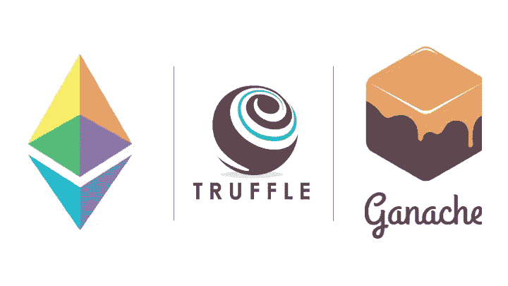
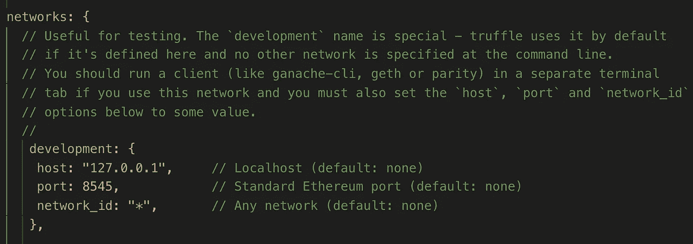

# 使用 Truffle 框架& Ganache-CLI 创建和部署智能合约—第 2 部分

> 原文：<https://medium.com/coinmonks/creating-deploying-a-smart-contract-using-truffle-framework-ganache-cli-part-2-f2dcf400fbde?source=collection_archive---------1----------------------->

在[第 1 部分](/@itsromiljain/get-started-with-building-ethereum-dapps-and-smart-contracts-d86b9f7bd1c)中，我们使用 web3js 和 ganache-cli 创建并部署了一个智能合约。在本节中，我们将使用 Truffle 框架和 Ganache-CLI 部署相同的契约。Truffle framework 使许多事情变得简单，并隐藏了样板代码。所以让我们开始—



Ethereum’ Smart Contract using Truffle Framework & Ganache-CLI

## 使用 Truffle 框架和 Ganache-CLI 进行部署

首先，我们需要安装松露。让我们在全球范围内安装松露。

```
$ npm install -g truffle
```

在同一个终端窗口中，创建一个新的项目/文件夹“ethereumdapp”并运行下面的命令。

```
$ truffle unbox webpackor$ truffle init
```

如果使用第一个命令，你会在命令行中看到下面的内容

```
$ Downloading...Unpacking...Setting up...Unbox successful. Sweet!Commands:Compile:              truffle compileMigrate:              truffle migrateTest contracts:       truffle testRun linter:           npm run lintRun dev server:       npm run devBuild for production: npm run build
```

这将建立完整的项目。您可以看到在 contracts 文件夹下又创建了几个合同。另外，在迁移文件夹下创建了 *1_initial_migration.js* 和 *2_deploy_contracts.js* 。除此之外，还有 *truffle-config.js* 创建。我们应该取消 network 下的 development 部分的注释，以连接到 Ganache，如下所示。



设置完成后，将之前创建的[公证文档. sol](https://github.com/itsromiljain/EthereumDappMedium/blob/master/contracts/NotarizeDocument.sol) 文件复制到“合同”文件夹中。我们可以删除' convert lib . sol '&' meta coin . sol '，因为这些对我们没有用。

接下来，打开文件夹“migrations ”,在名为“2_deploy_contracts.js”的文件中，只需添加下面的代码行，删除其余的代码行并保存。

迁移只是帮助我们将合同部署到区块链的脚本。

让我们编译所有的契约，并迁移部署它们。

```
$ truffle compile$ truffle migrate --network development
or
$ truffle migrate
```

部署合同后，您可以看到在 ganache 控制台中创建了数据块。记录合同地址以与之交互。在这种情况下，它是 0 xc 0 a 80 b 11 DAE 06421 Fe 2 ad 2f 5a 1554 c 871 f 72383d

```
Compiling your contracts...
===========================
> Everything is up to date, there is nothing to compile.Starting migrations...
======================
> Network name:    'development'
> Network id:      1557978469538
> Block gas limit: 0x6691b71_initial_migration.js
======================Deploying 'Migrations'
   ----------------------
   > transaction hash:    0x9e9d9d02b09913c18b5973c20ebd25386b647bc7e837a2d2a1486fd125ebd3e7
   > Blocks: 0            Seconds: 0
   > contract address:    0x7B64768252203353c47DE3a35F157E7d1Be1C182
   > block number:        1
   > block timestamp:     1557979380
   > account:             0xce599E446B1a8FEA3905df54224ebCACCbb03D41
   > balance:             99.99430312
   > gas used:            284844
   > gas price:           20 gwei
   > value sent:          0 ETH
   > total cost:          0.00569688 ETH> Saving migration to chain.
   > Saving artifacts
   -------------------------------------
   > Total cost:          0.00569688 ETH2_deploy_contracts.js
=====================Deploying 'NotarizedDocument'
   -----------------------------
   > transaction hash:    0x720404200b6882e65552d5e108b31b93f0427484ebbd056fd33565a1fe10a5f9
   > Blocks: 0            Seconds: 0
   > contract address:    0x2cD3d3090b4C62840B7B46E5237Fe8E951De78b2
   > block number:        3
   > block timestamp:     1557979380
   > account:             0xce599E446B1a8FEA3905df54224ebCACCbb03D41
   > balance:             99.98727016
   > gas used:            309614
   > gas price:           20 gwei
   > value sent:          0 ETH
   > total cost:          0.00619228 ETH> Saving migration to chain.
   > Saving artifacts
   -------------------------------------
   > Total cost:          0.00619228 ETHSummary
=======
> Total deployments:   2
> Final cost:          0.01188916 ETH
```

一般情况下，truffle 会将合同部署到 ganache 提供的第一个帐户。要与合同互动，让我们去 truffle 控制台，一个接一个地键入下面的命令，并在另一个窗口中检查 ganache 控制台。

```
$ truffle consoletruffle(development)> NotarizedDocument.deployed()truffle(development)> let notarizedDocInstance = await NotarizedDocument.deployed()Or truffle(development)> NotarizedDocument.deployed().then(instance => {notarizedDocInstance = instance})
```

当您获得实例时，让我们调用公证文档契约的第一个方法，并传递一些字符串值。

```
truffle(development)> notarizedDocInstance.notarize("Hello Romil!!")
```

当您在 truffle 控制台中运行这个程序时，您可以看到在 ganache 控制台和下面的 truffle 控制台中创建了另一个块。

```
{ tx:  '0x6da9b7c2509118233f564c86786d4c7e9206523d9bcecc3e80ec22b9edcef58e',
  receipt:
   { transactionHash:      '0x6da9b7c2509118233f564c86786d4c7e9206523d9bcecc3e80ec22b9edcef58e',
     transactionIndex: 0,
     blockHash:      '0xcc169d76a0098aa7b859ae1d6d6ed67920a6d15d0281c26ae0507446b6b16bee',
     blockNumber: 5,
     from: '0xce599e446b1a8fea3905df54224ebcaccbb03d41',
     to: '0x2cd3d3090b4c62840b7b46e5237fe8e951de78b2',
     gasUsed: 45005,
     cumulativeGasUsed: 45005,
     contractAddress: null,
     logs: [],
     status: true,
     logsBloom:'',
     v: '0x1c',
     r:'',
     s:'',
     rawLogs: [] },
  logs: [] }
```

若要检查此文档是否已创建，请调用协定的 checkDocument 方法。

```
truffle(development)> instance.checkDocument("Hello Romil!!")
```

这将使控制台中的*返回 true* 。

现在是你玩松露框架的时候了。毫无疑问，Truffle 通过隐藏大量的执行过程使事情变得简单，我们可以使用 web3js 看到这一点。完整的代码可以在[这里](https://github.com/itsromiljain/ethereumdapps/tree/master/notarized)找到。

因此，让我们创建更多的契约，并在通过主网络部署之前，通过 ganache 部署它们。是时候建造了

*请分享您的想法、反馈、评论和澄清。这将有助于我随机应变。*

*如果你喜欢这篇文章，你可以帮我把它推荐到❤下面*

*关注我*[*Linkedin*](https://www.linkedin.com/in/romiljain)*和* [*Twitter*](https://twitter.com/itsromiljain)

> [直接在您的收件箱中获得最佳软件交易](https://coincodecap.com/?utm_source=coinmonks)

[](https://coincodecap.com/?utm_source=coinmonks)