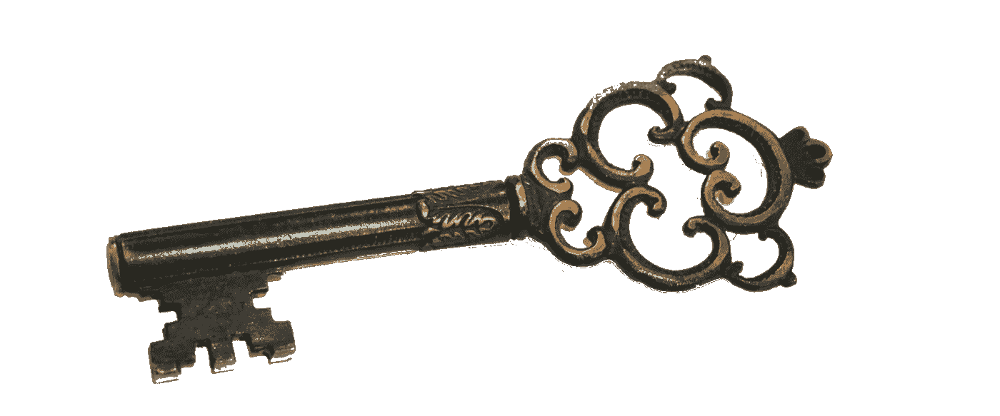

# 使用 ethdo 创建以太坊 2 撤销密钥

> 原文：<https://medium.com/coinmonks/creating-ethereum-2-withdrawal-keys-using-ethdo-6e41b14ddd7b?source=collection_archive---------1----------------------->


# 介绍

本文档指导您使用 ethdo wallet 创建、测试、备份和恢复以太坊验证器节点的取款密钥。最后一节描述了基金会的 Launchpad wallet 和 ethdo 之间的转账过程。以太坊 2 的生态系统仍然非常新，因此只有很少的工具可以使用。

在本教程结束时，你将对使用以太坊 2 钱包和公钥有更大的信心。

**注意:**每个新命令行都以$开头，并且每一行都需要单独运行并返回。$是命令提示符，不应复制。



# 安装 ethdo

ethdo 应用程序处理以太坊 2 钱包和账户的创建。这是一个命令行应用程序，因此您需要熟练使用终端。wallet 可以安装在 Windows、OS X 和 Linux 上，但本文中的示例是基于 Linux 安装的。该命令可以在所有平台上运行，但是您需要适当地更改路径细节。

你可以通过从 GitHub 获得[适当的归档文件来找到 ethdo 的最新版本。在执行以下操作之前，您应该识别带标签的版本(例如 1.7.2 ),然后复制适用于您的平台的链接(对于 OS X 使用 AMD64 ):](https://github.com/wealdtech/ethdo/releases)

```
$ wget https://github.com/wealdtech/ethdo/releases/download/v1.7.2/ethdo-1.7.2-linux-amd64.tar.gz
$ tar xvf ethdo-1.7.2-linux-amd64.tar.gz
$ ./ethdo version
```

如果您没有合适的安装归档文件，那么您可以从源代码生成二进制文件:

```
$ sudo apt install -y gcc g++ make
$ sudo snap install go --classic
$ GO111MODULE=on go get github.com/wealdtech/ethdo
```

# 从头开始创建以太坊 2 钱包

本节将为您提供从头开始创建一个以太坊 2 钱包所需的所有信息。在这个上下文中，我们将*钱包*定义为以太坊 2 密钥的集合，分组在一个名字下，将*账户*定义为一个以太坊 2 密钥。

## 设置密码和钱包名称

随机生成复杂的密码短语是一种很好的安全做法。使用密码生成器，例如 pwgen，创建一个 24+大小写混合的字母数字密码短语(pwgen -B 24 -c 1)。将此密码保存在安全的地方，如密码管理器。安装、运行并将结果存储在环境变量密码中。

```
$ sudo apt install pwgen
$ PASSPHRASE=$(pwgen -B 24 -c 1)
```

下一步是为钱包名称创建一个环境变量:

```
$ WALLET=myTestWallet
```

## 创建加密的钱包

下一步是创建一个加密的钱包，用助记短语备份，记得把助记短语放在安全的地方:

```
$ ./ethdo wallet create --wallet="${WALLET}" --type=hd --wallet-passphrase=$PASSPHRASE
```

请注意，wallet 周围有引号。这是为了确保名称中带有空格的钱包得到正确处理。

钱包创建过程将显示 24 个随机单词的集合，称为种子助记符。如果你丢失了数字拷贝，这些可以用来重建你的钱包。你必须把它们写下来，安全地存放起来，比如防火保险箱。你将很快需要这些单词来测试你的钱包是否能被恢复。它们都是小写字母。

列出这台机器上的钱包，应该会看到新创建的钱包:

```
$ ./ethdo wallet list
```

以太坊 2 使用钱包内的账户，所以你需要在 MyTestWallet 中创建一个名为 1 的账户，如果你愿意，这可以有一个不同于主钱包的密码。

```
$ ./ethdo account create --passphrase=$PASSPHRASE --wallet-passphrase=$PASSPHRASE --account “${WALLET}/1”
```

您可以通过询问其公钥和取款凭证来测试帐户是否已正确创建。取款凭证的地址是公钥的散列，并且是提供给以太坊 1 存款合同的参数之一。

```
$ ./ethdo account info --account “${WALLET}/1” --verbose
```

请注意，此步骤不需要密码，因为此信息本质上是公开的。

# 使用该帐户签名并验证一些数据

下一步可以跳过，但是对于测试新创建的密钥的签名非常有用。包括以太坊 2 在内的所有区块链都使用数字签名来保护交易。这些步骤将演示如何做到这一点:

要使用您的私钥对一些随机数据进行数字签名:

```
$ ./ethdo signature sign --passphrase=$PASSPHRASE --account “${WALLET}/1” --data=0x000102030405060708090a0b0c0d0e0f101112131415161718191a1b1c1d1e1f --domain=0xf000000000000000000000000000000000000000000000000000000000000000
```

对某些数据进行数字签名是一项安全的活动，因此需要您的密码。输出是一长串表示数字签名的随机字符。

现在您需要验证签名是由您的私钥创建的。上一步的输出放入下面的“签名”中:

```
$ ./ethdo signature verify --passphrase=$PASSPHRASE --account “${WALLET}/1” --data=0x000102030405060708090a0b0c0d0e0f101112131415161718191a1b1c1d1e1f --domain=0xf000000000000000000000000000000000000000000000000000000000000000 --verbose --signature=”signature”
```

如果输出被“验证”,则签名是正确的。

# 备份和恢复您的钱包(种子词和文件)

除了种子助记符之外，您还可以创建钱包文件的加密备份以便安全保存:

```
$ ./ethdo wallet export --passphrase=$PASSPHRASE --wallet=”${WALLET}” > “${WALLET}”-backup.dat
```

您应该在当前目录中看到备份文件。您可以验证它是原件的良好副本，如下所示:

```
./ethdo wallet import --verify --passphrase=$PASSPHRASE --data=”${WALLET}-backup.dat”
```

假设已经进行了很好的解密，备份将不会被导入，输出将只显示内容的摘要。

现在是时候练习恢复钱包以防灾难了。您应该始终进行一次恢复练习，以完全确保您已经记下了所有正确的信息来重新创建相同的密钥。您将在 1-2 年内不使用此提取密钥，因此在您将密钥发送到以太坊 1 存款合同之前，种子信息清晰易读至关重要。

以下行将显示帐户公钥，然后删除钱包，最后列出钱包:

```
$ ./ethdo account info --account “${WALLET}/1”
$ ./ethdo wallet delete --wallet=”${WALLET}”
$ ./ethdo wallet list
```

输出中应该没有 myTestWallet 的条目。请注意，删除钱包时不需要使用密码。这使得备份变得更加重要。

首先尝试从您之前复制的 seed 助记符(“seedwords”)恢复:

```
$ ./ethdo wallet create --wallet=”${WALLET}” --wallet-passphrase=$PASSPHRASE --type=hd --mnemonic=”seedwords”
$ ./ethdo account info --account=”${WALLET}/1" --verbose
```

没用！这是因为从种子助记符恢复本身不会恢复帐户。但是，手动添加帐户会将其恢复:

```
$ ./ethdo account create --passphrase=$PASSPHRASE --wallet-passphrase=$PASSPHRASE --account=”${WALLET}/1"
$ ./ethdo account info --account=”${WALLET}/1" --verbose
```

现在已经恢复了相同的公钥，但是请注意，与钱包相关联的 UUID 是不同的，因为它只是一个本地标识符，并不在外部使用。

更方便的恢复方法显然是使用备份文件，因此我们删除 wallet 并从该文件恢复:

```
$ ./ethdo account info --account=”${WALLET}/1" --verbose 
$ ./ethdo wallet delete --wallet=”${WALLET}”
$ ./ethdo wallet list
$ ./ethdo wallet import --passphrase=$PASSPHRASE --data=”${WALLET}-backup.dat”
```

现在，您应该像以前一样检查钱包列表:

```
$ ./ethdo wallet list
```

并检查帐户是否也已恢复:

```
$ ./ethdo account info --account=”${WALLET}/1" --verbose
```

您应该会看到和以前一样的公钥。祝贺您成功恢复钱包。

# 为了安全起见，请清除您的密码和钱包条目

在关闭会话之前，清除历史记录中的任何机密信息是一种很好的安全做法。如果您想使用已安装的钱包，请记得记下密码。如果您不记得密码，也没关系，因为您可以使用新的密码从种子重新创建钱包。要在删除环境变量之前创建密码文件，请运行以下命令:

```
$ echo $PASSPHRASE > password.txt
```

要清除密码和钱包条目，请使用以下命令:

```
$ unset PASSPHRASE
$ unset WALLET
```

# 最后的步骤

如果这是你第一次通过这个过程，你现在应该准备好做一个真正的以太坊 2 钱包。现在是时候真正做到以上几点了。您应该删除 myTestWallet，然后对您自己的记录使用合适的命名约定重复上述步骤。

# 使用种子短语创建取款密码

使用 ethdo 创建 Ethereum 2 取款密钥的另一种更快的方法是提供您在另一个钱包中使用过的种子短语，该钱包可能是 Trezor 或 Ledger 硬件钱包。这将用作计算撤销密钥的基础，相同的种子短语将生成相同的撤销密钥，因此您可以确保它得到安全备份。

输入以下命令获取第一个取款密钥:

```
$ ./ethdo account derive --mnemonic=”<seed words>” --path=m/12381/3600/0/0
```

“派生”选项对于从种子中快速创建提取密钥非常有用，提取密钥是在内存中生成的，钱包不会保存到磁盘。

ethdo 默认使用由 [EIP-2334](https://eips.ethereum.org/EIPS/eip-2334) 定义的取款密钥衍生路径，但是您可以显式添加参数，而不是使用钱包/账户名称。对于给定的索引 *i* ，键将位于以下路径:

*   取款钥匙:m/12381/3600/ *i* /0
*   验证器密钥:m/12381/3600/ *i* /0/0

如果你打算使用许多提款钥匙，那么探索一下前面关于创建以太坊 2 钱包和账户的部分可能是值得的。

# 在 ethdo 中重新创建 Launchpad 帐户和钱包

如果您使用 Launchpad wallet 创建了提款帐户，您可以在 ethdo 中重新创建帐户。更详细的说明可以在[这里](https://github.com/wealdtech/ethdo/blob/master/docs/howto.md)找到。

```
$ WALLET=Launchpad
$ ./ethdo wallet create --wallet="${WALLET}" --type=hd --wallet-passphrase=$PASSPHRASE --mnemonic="<seed phrase>"
```

创建第一个提款账户，然后使用路径 m/12381/3600/ *i* /0 (ethdo 默认)。

```
$ ./ethdo account create --account="${WALLET}/Withdrawal 1" --wallet-passphrase=$PASSPHRASE --passphrase=secret --path=m/12381/3600/1/0
```

要创建第一个验证器帐户，请使用路径 m/12381/3600/1/0。请注意，如果您使用的是 staking 服务，如证明者，您只需要撤销密钥，因为我们会提供验证密钥。

```
$ ./ethdo account create --account="${WALLET}/Validator 1" --wallet-passphrase=$PASSPHRASE --passphrase=secret --path=m/12381/3600/1/0/0
```

# 在 Launchpad 中重新创建 ethdo 帐户

为了完整起见，可以通过运行以下命令将 ethdo 中的种子短语导入到 Launchpad 中:

```
./deposit existing-mnemonic
```

# 有用的参考资料

[以太坊 2 打桩见证人](http://attestant.io)

ethdo 是由 [WealdTech](https://github.com/wealdtech/ethdo/releases) 制造的以太坊 2 钱包

 [## 探索锁定键

### Jim McDonald 2019 年 12 月 19 日为以太坊 2 创建赌注保证金时，使用了两个密钥来生成…

www . authentiant . io](https://www.attestant.io/posts/exploring-staking-keys/) 

# 接触

如果您想了解更多关于证明人的信息，您可以通过电子邮件[info @证明人. io](mailto:info@attestant.io) 或电报[https://t.me/attestant](https://t.me/attestant)与我们联系

## 另外，阅读

*   最好的[加密交易机器人](/coinmonks/crypto-trading-bot-c2ffce8acb2a)
*   [Deribit 审查](/coinmonks/deribit-review-options-fees-apis-and-testnet-2ca16c4bbdb2) |选项、费用、API 和 Testnet
*   [FTX 密码交易所评论](/coinmonks/ftx-crypto-exchange-review-53664ac1198f)
*   [Bybit 交换审查](/coinmonks/bybit-exchange-review-dbd570019b71)
*   最好的比特币[硬件钱包](/coinmonks/the-best-cryptocurrency-hardware-wallets-of-2020-e28b1c124069?source=friends_link&sk=324dd9ff8556ab578d71e7ad7658ad7c)
*   [密码本交易平台](/coinmonks/top-10-crypto-copy-trading-platforms-for-beginners-d0c37c7d698c)
*   最好的[加密税务软件](/coinmonks/best-crypto-tax-tool-for-my-money-72d4b430816b)
*   [最佳加密交易平台](/coinmonks/the-best-crypto-trading-platforms-in-2020-the-definitive-guide-updated-c72f8b874555)
*   最佳[加密借贷平台](/coinmonks/top-5-crypto-lending-platforms-in-2020-that-you-need-to-know-a1b675cec3fa)
*   [莱杰纳米 S vs 特雷佐 one vs 特雷佐 T vs 莱杰纳米 X](https://blog.coincodecap.com/ledger-nano-s-vs-trezor-one-ledger-nano-x-trezor-t)
*   [block fi vs Celsius](/coinmonks/blockfi-vs-celsius-vs-hodlnaut-8a1cc8c26630)vs Hodlnaut
*   Bitsgap 评论——一个轻松赚钱的加密交易机器人
*   [Quadency Review](/coinmonks/quadency-review-a-crypto-trading-automation-platform-3068eaa374e1) -为专业人士打造的加密交易机器人
*   [PrimeXBT 评论](/coinmonks/primexbt-review-88e0815be858) |杠杆交易、费用和交易
*   HaasOnline 评论享受九折优惠
*   [埃利帕尔泰坦评论](/coinmonks/ellipal-titan-review-85e9071dd029)
*   [SecuX Stone 评论](https://blog.coincodecap.com/secux-stone-hardware-wallet-review)
*   [BlockFi 评论](/coinmonks/blockfi-review-53096053c097) |赚取高达 8.6%的加密利息
*   [开发人员的最佳加密 API](/coinmonks/best-crypto-apis-for-developers-5efe3a597a9f)
*   [最佳区块链分析工具](https://bitquery.io/blog/best-blockchain-analysis-tools-and-software)
*   [加密套利](/coinmonks/crypto-arbitrage-guide-how-to-make-money-as-a-beginner-62bfe5c868f6)指南:新手如何赚钱
*   顶级[比特币节点](https://blog.coincodecap.com/bitcoin-node-solutions)提供商
*   最佳[加密制图工具](/coinmonks/what-are-the-best-charting-platforms-for-cryptocurrency-trading-85aade584d80)
*   了解比特币的[最佳书籍有哪些？](/coinmonks/what-are-the-best-books-to-learn-bitcoin-409aeb9aff4b)

> [直接在您的收件箱中获得最佳软件交易](/coinmonks/newsletters/coinmonks)

[](https://medium.com/coinmonks/newsletters/coinmonks)