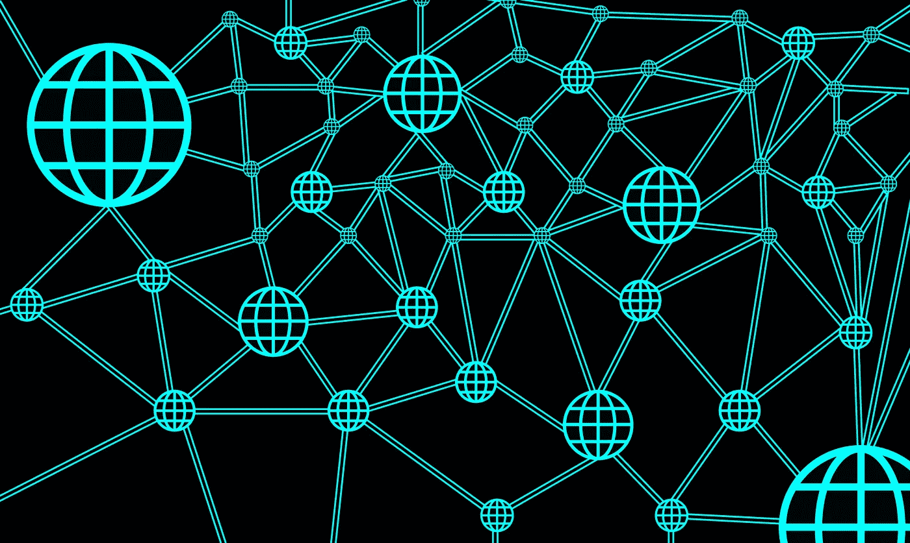
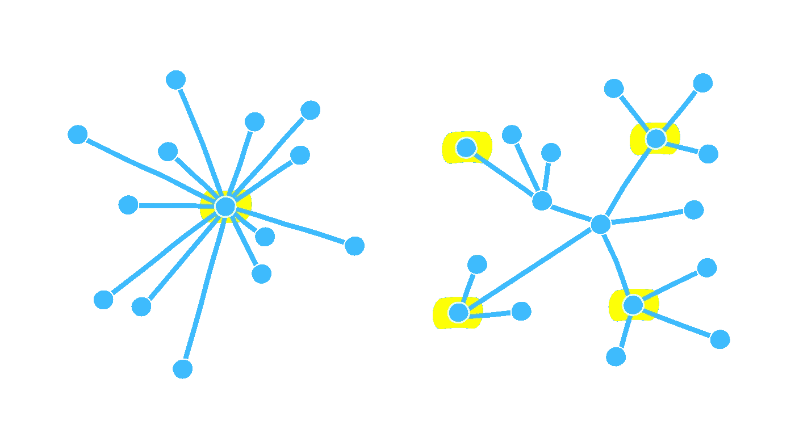

# 创造我自己的 ERC 20 代币

> 原文：<https://medium.com/coinmonks/creating-my-own-erc-20-token-c8b1748d3124?source=collection_archive---------0----------------------->

## 用以太坊创造我自己的加密货币

一次又一次，分权证明了它比集权优越。

区块链技术让社会彻底变革。从我们目前在集中式系统上的可靠性转向区块链的分散式系统。

但是，为什么这一点如此重要呢？

1.  在集中式系统中，数据集中在一个中央机构，该机构可以审查数据并拥有完全的控制权。在分散系统中，**权力是分散的**，因此**没有审查**
2.  中介是不需要的，每个人都完全控制他们的信息，并且能够自己对他们的数据做出决定
3.  集中式系统有一个*单点故障*，可以使整个网络瘫痪，这在使用分散式系统时是不可能的(使整个网络瘫痪几乎是不可能的)

比特币。乙醚。涟漪。莱特币。

我相信在过去的几年里，你们都至少听说过其中一个名字。每一种都是目前最流行的加密货币。

但是，我们如何超越简单地试图分散货币？

介绍 ERC-20，在以太网上创建令牌的通用标准。

等等，让我们回想一下:

# 以太坊到底是什么？

*以太坊*是一个由节点组成的去中心化网络，有两个主要功能:在它们的区块链上记录交易，并允许开发者使用在以太坊虚拟机上执行的智能合约创建去中心化应用(DApps)。

这些 DApps 建立在现有的以太坊区块链的基础上，依靠其底层技术。作为回报，开发者要为他们网络中的计算能力付费，这是以以太——唯一的跨平台货币——支付的。

根据不同的目的，DApps 可以用来创建 ERC-20 代币来代表任何种类的资产，包括公司股票、货币、所有权证明、房契等。

**但是，智能合约到底有什么作用呢？**

智能合约用于创建 ERC-20 代币，促进代币交易和记录账户中的代币余额。

智能契约是应用程序的所有业务逻辑所在的地方，也是必须实际编写应用程序的分散部分的地方。

契约的工作是在执行业务逻辑的同时在区块链上读写数据。这些契约是用 Solidity 的语言写的，类似于 JavaScript。

智能合同代表一个契约或协议。

创建令牌后，这就是 ERC 20 派上用场的地方。

ERC-20 是一种通用语言，允许以太坊网络上的令牌相互交换。

它是一种位于区块链的资产，具有保值和收发的能力。这可以通过使用以太坊地址、交易和 gas 来完成，以便支付交易费用。

# **ERC-20 标准**

以太坊社区创建了 ERC-20 标准，包括 3 条可选规则和 6 条强制性规则。

## **可选规则:**

*   **令牌名称**
*   **符号** : 交换符号
*   **十进制—最多 18 位**(以太的最低可能除法是十进制的 18 位)

## **强制规则:**

*   **totalSupply** :创建的 ERC-20 代币的总数
*   **转移**:允许将一定数量的代币从供应商转移到用户账户
*   **转移自**:允许用户将代币转移到另一个账户的功能
*   **balanceOf** :返回给定地址的账户中令牌数量的函数
*   **批准**:对照令牌供应总量检查交易(确保没有丢失或多余)
*   **津贴**:检查用户账户余额，如果资金不足将取消交易

但是，为什么 ERC-20 有益呢？

ERC-20(以太坊意见征询，提案 20)有助于简化创建令牌的流程，同时保持整个社区的一致性。

有了通用标准，新代币一旦被创造出来，就可以被放到交易所或自动转移到钱包里。

这一标准使得创建新代币的过程变得极其容易和高效，这也是以太坊成为 2017 年 ICO 最受欢迎的平台之一的原因之一。

# **复制我自己的令牌**

这个 DApp 是 DApp 大学标志的复制品。

它对前端 UI 和后端使用 HTML、CSS 和 JS，而不是连接到后端服务器，应用程序连接到本地以太坊区块链。

观看此视频，了解有关合同设计、演示及其功能的更多信息。

利用区块链，我们有能力去中心化社会。

# 我们连线吧！

> *如果你喜欢阅读这篇文章或学习新的东西，我很乐意在* [*LinkedIn*](https://www.linkedin.com/in/manroop-kalsi/) *上联系。如果你想了解我的新文章或项目，你可以订阅我的每月简讯* [*这里*](https://landing.mailerlite.com/webforms/landing/l4f5k1) *！*