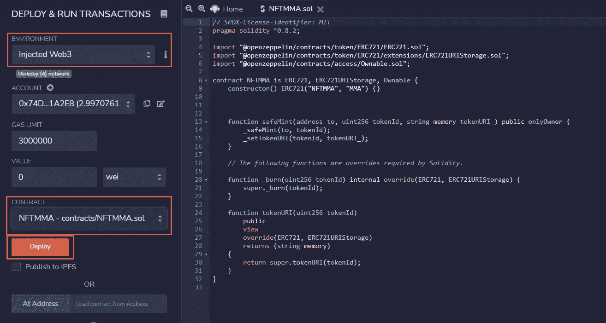
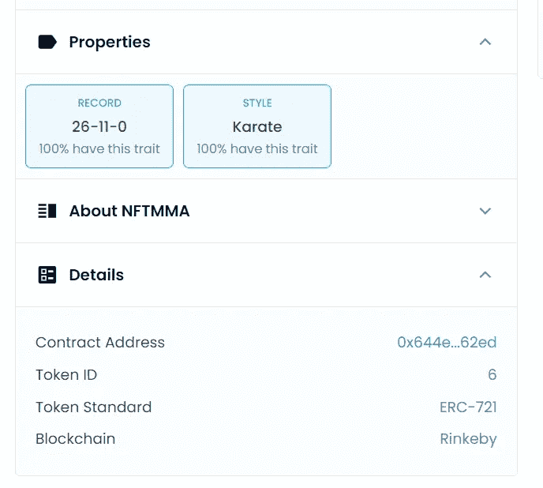

# 为假人创造 NFT

> 原文：<https://medium.com/coinmonks/creating-nfts-for-dummies-65ec0b7d0e79?source=collection_archive---------4----------------------->

我目前正在开发一个加密游戏，第一步是创建角色，或者玩家可以创建角色的方法。嗯，具有一系列特征的独特物体，这就是 NFT 的定义！所以，让我们看看如何创建一个 NFT，相信我，如果我能做到这一点，你也可以！


## 我需要或需要事先知道什么？

*   你需要一个钱包。有许多选项，但我使用元掩码。
*   对可靠性的一些理解是有帮助的。你可以在这里找到一堆教程
*   你需要一些 eth。

幸运的是，只要我们在以太坊的一个测试网络上玩，你就可以在一个水龙头上获得免费的以太网。对于 NFT 氏症，我推荐使用 Rinkeby 测试网，例如，NFT 最大的市场 OpenSea，在 rinkeby 上也有它的测试站点。这将在以后派上用场。

你可以在这里免费获得 Rinkeby [的 eth，但是要注意，你需要在 twitter 等社交媒体上发布你的钱包地址，并在水龙头中输入帖子链接。](https://faucet.rinkeby.io/)

## 我们的工作示例

作为一个例子，我将制作一个 MMA 格斗家的 NFT。战斗机将具有:

*   一个名字(咄！)
*   描述:一个自由文本字段。
*   图像
*   记录:当前专业记录
*   战斗风格

在一个真实的游戏中，角色的列表当然会更长。想想身高，体重，年龄，站立和地面能力的统计数据，…

## 链上 vs 链下

作为第一步，我们需要确定哪些数据存储在链上(所以在以太坊上)和链外(所以不在以太坊上)。你如何存储你的离线数据的选择也会影响你如何去做。

在以太坊区块链上存储数据非常昂贵，因此您需要尽可能地限制这一点，尤其是对于更大的数据，如图像和视频。

你可以把你的外链数据存储在服务器上(比如谷歌或者 AWS ),当你制作 NFT 的时候，你可以通过一个链接来引用这些数据。

优势:

*   您可以廉价地更改您的数据。比如说你的游戏角色升级了，改变角色的属性很容易

缺点:

*   你需要维护服务器。而当服务器主机决定停止服务器时，你就麻烦了。
*   可以更改数据！这意味着你的用户不确定你没有改变他们的 NFT。这实际上是这样发生的:一位艺术家将存储在服务器上的图像转换成另一幅图像，这样他就可以再次出售第一幅图像。

解决方案:星际文件系统或 IPFS。IPFS 允许你便宜地存储离线数据，同时确保你不能改变数据。IPFS 的一个例子是皮纳塔。缺点是你不能改变任何数据。这基本上是一个第二十二条军规。

很多 NFT 人使用 IPFS，这也是我们将要使用的。

## 智能合同

我们要无耻地站在巨人的肩膀上，用开放齐柏林飞船的合同向导。这里可以找到[。](https://docs.openzeppelin.com/contracts/4.x/wizard)

我们使用以下配置:


ERC721 是 NFT 合约的以太坊标准。如果你想让你的 NFT 集成到 Opensea 上，这是非常重要的。

URIStorage 意味着我们可以将我们的 IPFS 链接到我们的 NFT。

## 造币厂的功能还没切断

mint 函数，在这里是 safeMint，还不是我们想要的。它没有设置 tokenURI。tokenURI 是我们与 IPFS 的链接。

让我们把它改成:

```
function safeMint(address to, uint256 tokenId, string memory tokenURI_) public onlyOwner {
        _safeMint(to, tokenId);
  _setTokenURI(tokenId, tokenURI_);
    }
```

_setTokenURI 是我们从 ERC721URIstorage contract 继承的一个函数。这就是为什么我们在 OpenZeppelin 的合同上构建我们的合同，这样我们就不必自己编写这些公共函数。

## 部署！

现在我们将使用 remix 来编译我们的契约。


然后我们部署编译好的契约。



使用注入的 Web3 意味着将使用元掩码。

## IPFS

那么，我们在 IPFS 到底储存了什么呢？

首先，我们上传一张 MMA 拳手的图片。


The Dragon


上传图像会将 URI 添加到上传的图像中。

现在我们添加 JSON:

```
{
  "attributes": [
    {
      "trait_type": "Style",
      "value": "Karate"
    },
    {
      "trait_type": "Record",
      "value": "26-11-0"
    }
  ],
  "description": "Lyoto Machida",
  "image": "[https://gateway.pinata.cloud/ipfs/QmT3dnMwLkVLxTj9n9DKdh5an26LXo8rZU6aXGJ26CzJ1w](https://gateway.pinata.cloud/ipfs/QmT3dnMwLkVLxTj9n9DKdh5an26LXo8rZU6aXGJ26CzJ1w)",
  "name": "Lyoto Machida"
}
```

所以在 JSON 中我们有:

*   名字
*   描述
*   链接到上传图像的 URI 的图像
*   我们的额外属性风格和记录。

我们现在也将 JSON 上传到 Pinata:


## 现在铸造 NFT！

现在我们已经准备好铸造我们的 MMA 角色！我将使用 remix UI 来简化事情:


在这里你添加接收者地址(比如你的元掩码钱包)，令牌的 ID(比如 1)和 JSON 文件的 IPFS URI(见上)。然后按安全薄荷。

## 成功了吗？

一个简单的方法来检查它是否工作，就是去开放海洋试验场[这里](https://testnets.opensea.io/)。

使用元掩码登录，通常您会立即看到您的 NFT:


包括我们在铸造时设置的属性:



## 结束了

我希望你喜欢这篇文章，并成功地创造了你自己的 NFT！

> 加入 Coinmonks [电报频道](https://t.me/coincodecap)和 [Youtube 频道](https://www.youtube.com/c/coinmonks/videos)了解加密交易和投资

## 也阅读

[](https://blog.coincodecap.com/crypto-exchange) [## 最佳加密交易所| 2021 年十大加密货币交易所

### ICON _ PLACEHOLDEREstimated 预计阅读时间:28 分钟加密货币交易所的加密交易需要知识…

blog.coincodecap.com](https://blog.coincodecap.com/crypto-exchange) [](https://blog.coincodecap.com/crypto-lending) [## 2021 年 10 大最佳加密贷款平台| CoinCodeCap

### 当谈到加密货币贷款时，大量因素等同于良好的收入状况。此外，借款的一部分…

blog.coincodecap.com](https://blog.coincodecap.com/crypto-lending) [](/coinmonks/crypto-trading-bot-c2ffce8acb2a) [## 2021 年最佳免费加密交易机器人

### 2021 年币安、比特币基地、库币和其他密码交易所的最佳密码交易机器人。四进制，位间隙…

medium.com](/coinmonks/crypto-trading-bot-c2ffce8acb2a) [](/coinmonks/best-crypto-signals-telegram-5785cdbc4b2b) [## 最佳 4 个加密交易信号电报通道

### 这是乏味的找到正确的加密交易信号提供商。因此，在本文中，我们将讨论最好的…

medium.com](/coinmonks/best-crypto-signals-telegram-5785cdbc4b2b) [](https://blog.coincodecap.com/blockfi-review) [## BlockFi 评论 2021:利弊和利率| CoinCodeCap

### 今天，我们提出了一个全面的 BlockFi 评论，这是一个成立于 2017 年的加密贷款平台，拥有其…

blog.coincodecap.com](https://blog.coincodecap.com/blockfi-review) [](/coinmonks/buy-bitcoin-in-india-feb50ddfef94) [## 如何在印度购买比特币？2021 年购买比特币的 7 款最佳应用[手机版]

### 如何使用移动应用程序购买比特币印度

medium.com](/coinmonks/buy-bitcoin-in-india-feb50ddfef94) [](/coinmonks/best-crypto-tax-tool-for-my-money-72d4b430816b) [## 加密税务软件——五大最佳比特币税务计算器[2021]

### 不管你是刚接触加密还是已经在这个领域呆了一段时间，你都需要交税。

medium.com](/coinmonks/best-crypto-tax-tool-for-my-money-72d4b430816b) [](https://blog.coincodecap.com/best-hardware-wallet-bitcoin) [## 存储比特币的最佳加密硬件钱包[2021] | CoinCodeCap

### 保管您的数字资产很容易，但找到正确的存储方式却是一项繁琐的任务。在线钱包有一个风险…

blog.coincodecap.com](https://blog.coincodecap.com/best-hardware-wallet-bitcoin)