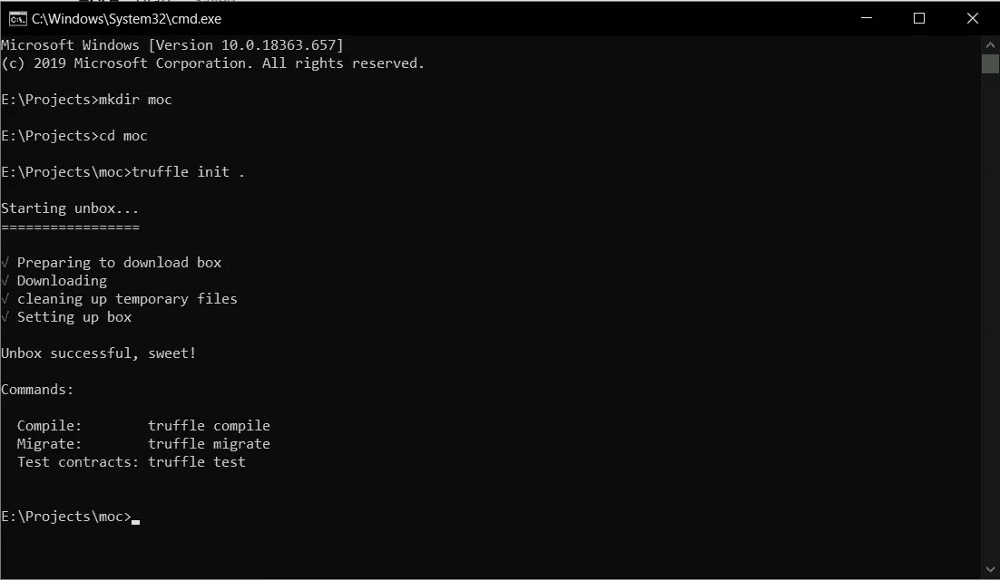
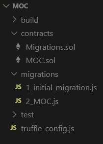
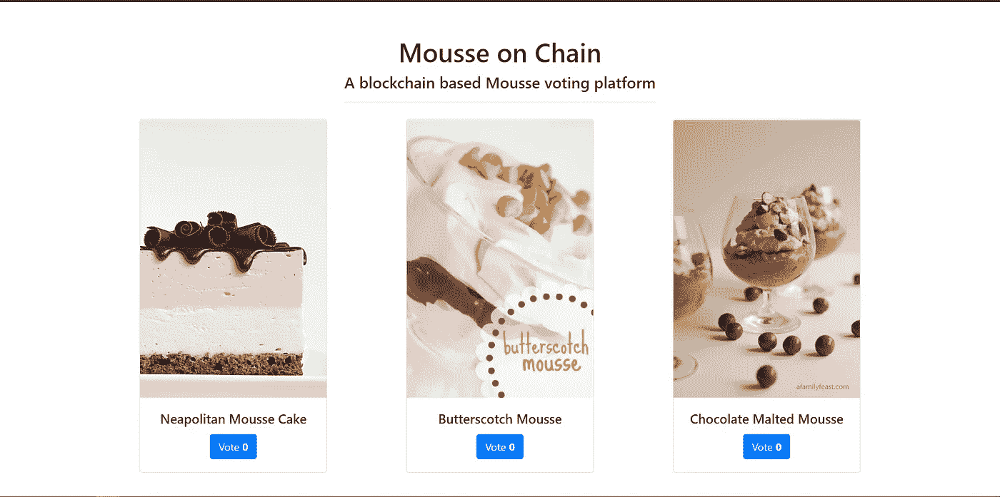
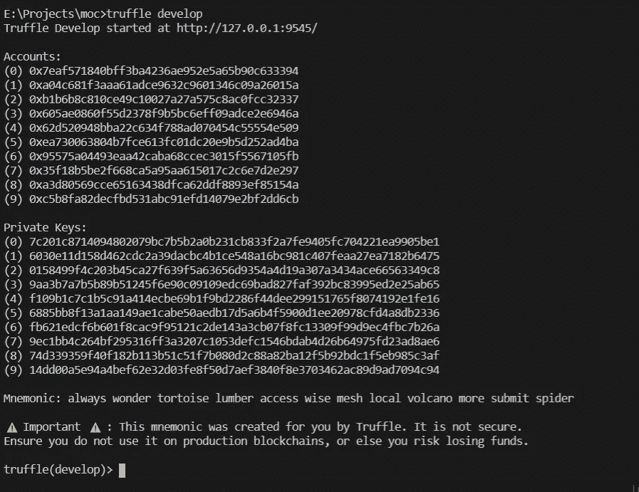
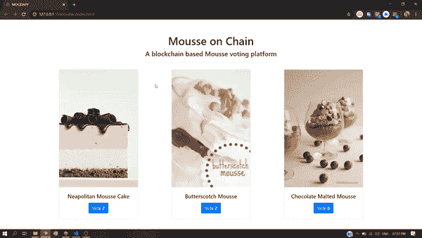

# 创建你的第一个 DAPP:初学者指南

> 原文：<https://medium.com/coinmonks/creating-your-first-dapp-beginners-guide-a320d0e4897d?source=collection_archive---------1----------------------->


Photo by [Clifford Photography](https://unsplash.com/@cliffordgatewood?utm_source=medium&utm_medium=referral) on [Unsplash](https://unsplash.com?utm_source=medium&utm_medium=referral)

分散式应用现在正蓬勃发展🔥，而且每个人都希望 s 成为 [***区块链***](https://blog.coincodecap.com/tag/blockchain/) ***开发者*** 。新手可能会被区块链的有趣概念弄得不知所措，此外还有 [***智能合约***](https://blog.coincodecap.com/tag/smart-contact/) 。

> 智能契约是分散式应用程序背后的逻辑。智能合约帮助你以透明、无冲突的方式交换金钱、财产、股票或任何有价值的东西，同时避免了中间人的服务。

在本帖中，我们将制作一个简单的 DAPP，并将其部署在本地网络上。我们将创建一个前端，它将与我们在区块链上的智能合约进行交互。

> 演示:[https://moc-dapp.surge.sh/](https://moc-dapp.surge.sh/)


Photo by [Louis Hansel @shotsoflouis](https://unsplash.com/@louishansel?utm_source=medium&utm_medium=referral) on [Unsplash](https://unsplash.com?utm_source=medium&utm_medium=referral)

> 我们正在创建的应用程序是慕斯链🍫。我们将为用户投票选出他们最喜欢的慕斯配方。

STEP 1

首先，你需要在你的机器上安装 Node.js。节点:[https://nodejs.org/en/download/](https://nodejs.org/en/download/)

安装节点后，打开终端或 cmd 并键入以下内容。

```
npm -g i truffle
```

这将把 [***松露框架***](https://www.trufflesuite.com/) 作为一个节点包全局安装到你的 pc 上。松露通过提供各种移植、测试和调试工具来帮助我们开发 DAPPS。

```
mkdir moc
cd moc
truffle init .
```

这将创建一个名为 MOC *【链条上的慕斯】*的目录，初始化 DAPP 项目的基本模板



第二步

现在我们将创建我们的*智能契约*，我不会深入研究代码，因为那已经超出了本文的范围

1.  在合同文件夹中创建 MOC.sol
2.  在迁移文件夹中创建 2_MOC.js



File Structure

> 第一个是我们将添加用*编写的智能合约代码的地方*
> 
> *第二个是我们后面会讲到的迁移文件。*

*[](https://suyashsonawane.me/) [## 作品集| Suyash Sonawane

### 嗨，我是苏亚士·索纳瓦尼👋这是我的网络作品集

suyashsonawane.me](https://suyashsonawane.me/) 

## MOC.sol 代码

```
*pragma* solidity ^0.5.1;
contract MOC {
uint256[3] items;
constructor() public
{
*// setting up the items with their values
   for* (uint256 i = 0; i < 3; i++)
       items[i] = 0;
}
function vote(uint256 x) public *returns* (uint256) 
{
   *if* (x < 3 && x >= 0) {
      items[x]++;
      *return* 1;
    }
    *return* 0;
  }
function getItem(uint256 x) public view *returns* (uint256) 
{
     *return* items[x];
}
}
```

## 2_MOC.js 的代码

```
const MOC = artifacts.require(“MOC”);module.exports = function (deployer) {deployer.deploy(MOC);};
```

我们将设计前端在 HTML，CSS，JS。
下面是*和 ***main.css*** 的代码，放在 public 文件夹中*

***

**第三步**

**现在，我们将编译我们的智能合同，并将其迁移到我们的本地松露区块链**

```
**truffle develop**
```

**这将打开松露开发控制台，并为您提供免费的 10 个帐户。**

****

```
**migrate --reset**
```

**如果您的智能合约是正确的，那么这将编译和部署我们的智能合约到本地区块链。输出将是👇**

```
**truffle(develop)> migrate — resetCompiling your contracts…
===========================
> Compiling .\contracts\MOC.sol
> Compiling .\contracts\Migrations.sol
> Artifacts written to E:\Projects\moc\build\contracts
> Compiled successfully using:
 — solc: 0.5.16+commit.9c3226ce.Emscripten.clangStarting migrations…
======================
> Network name: ‘develop’
> Network id: 5777
> Block gas limit: 0x6691b71_initial_migration.js
======================Replacing ‘Migrations’
 — — — — — — — — — — — 
 > transaction hash: 0x297e6fadd1c93785059b892ebce78ac683e35359b3888518c29757990b9d889f
 > Blocks: 0 Seconds: 0
 > contract address: 0x1b02A5B71D53fcc41603E0af415F4B6dB4c7Df4C
 > block number: 1
 > block timestamp: 1582465106
 > account: 0x7EaF571840Bff3bA4236aE952E5A65b90c633394
 > balance: 99.9967165
 > gas used: 164175
 > gas price: 20 gwei
 > value sent: 0 ETH
 > total cost: 0.0032835 ETH> Saving migration to chain.
 > Saving artifacts
 — — — — — — — — — — — — — — — — — — -
 > Total cost: 0.0032835 ETH2_MOC.js
========Replacing ‘MOC’
 — — — — — — — -
 > transaction hash: 0xc28ffba6e567d812f314b0e1cdeac92b620308519ae3a4bc8bf944cf80bba371
 > Blocks: 0 Seconds: 0
 > contract address: 0x37683d1e01Fb3390f50C6Ac590e06be6dC695733
 > block number: 3
 > block timestamp: 1582465106
 > account: 0x7EaF571840Bff3bA4236aE952E5A65b90c633394
 > balance: 99.9932666
 > gas used: 130154
 > gas price: 20 gwei
 > value sent: 0 ETH
 > total cost: 0.00260308 ETH> Saving migration to chain.
 > Saving artifacts
 — — — — — — — — — — — — — — — — — — -
 > Total cost: 0.00260308 ETHSummary
=======
> Total deployments: 2
> Final cost: 0.00588658 ETHtruffle(develop)>**
```

> *****保持此终端打开，因为我们将需要开发服务器运行🏃‍♂️*****

**现在我们将使用[***web 3 . js***](https://web3js.readthedocs.io/en/v1.2.6/)连接前端和服务器**

```
**let contractABI = [{
 “inputs”: [],
 “payable”: false,
 “stateMutability”: “nonpayable”,
 “type”: “constructor”
 },
 {
 “constant”: false,
 “inputs”: [{
 “internalType”: “uint256”,
 “name”: “x”,
 “type”: “uint256”
 }],
 “name”: “vote”,
 “outputs”: [{
 “internalType”: “uint256”,
 “name”: “”,
 “type”: “uint256”
 }],
 “payable”: false,
 “stateMutability”: “nonpayable”,
 “type”: “function”
 },
 {
 “constant”: true,
 “inputs”: [{
 “internalType”: “uint256”,
 “name”: “x”,
 “type”: “uint256”
 }],
 “name”: “getItem”,
 “outputs”: [{
 “internalType”: “uint256”,
 “name”: “”,
 “type”: “uint256”
 }],
 “payable”: false,
 “stateMutability”: “view”,
 “type”: “function”
 }
]
document.getElementById(‘landing’).style.display = ‘none’
let contractAddress = “0x0e34Ee66a401A533B0dBDFc896d530b3C780F9Bc”;
let web3 = new Web3(‘[http://127.0.0.1:9545/’](http://127.0.0.1:9545/'));
let moc = new web3.eth.Contract(contractABI, contractAddress);document.addEventListener(‘DOMContentLoaded’, () => {
 refresh()
 if (web3) {
 document.getElementById(‘landing’).style.display = ‘flex’
 document.getElementById(‘cover’).style.display = ‘none’
 }
})const refresh = () => {
 for (let i = 0; i < 3; i++)
 moc.methods.getItem(i).call()
 .then(result => {
 document.getElementById(`v${i}`).innerHTML = result;
 })
}function vote(e) {
 console.log(e.id[4])
 moc.methods.vote(e.id[4]).send({
 from: `0xa04c681f3aaa61adce9632c9601346c09a26015a`
 }).then(result => {
 console.log(result)
 refresh()
 })
}**
```

**在……里👆代码
1。在构建文件夹
2 中，用 MOC.json 中的 ABI 字段替换`contractABI`。用 migrate 命令输出中的 contractAddress 替换`contractAddress`。
3。将投票功能中的`from`替换为松露提供的任何账户地址，如`0xa04c681f3aaa61adce9632c9601346c09a26015a`**

```
**let web3 = new Web3(‘http://127.0.0.1:9545/');let moc = new web3.eth.Contract(contractABI, contractAddress);**
```

**`new Web3()`初始化用于与区块链网络通信的 Web3 API，这里我们使用本地网络 so `http://127.0.0.1:9545/`。
`web3.eth.Contract()`为调用函数创建一个契约变量。**

```
**moc.methods.getItem(i).call().then(result => {document.getElementById(`v${i}`).innerHTML = result;})**
```

**这里，moc 是契约变量，我们通过方法和一个`call()`函数调用契约函数，这些是异步函数，所以我们需要`.then()`。**

**现在你的第一个 Dapp 已经在本地网络上准备好了
打开`index.html`在运行 truffle 控制台的同时，你可以通过投票按钮与智能合约进行交互。**

****

> **整个项目可以从 GitHub 克隆:[https://github.com/SuyashSonawane/MOC-DAPP](https://github.com/SuyashSonawane/MOC-DAPP)**

**跟我来:**

**作品集:[https://suyashsonawane.me/](https://suyashsonawane.me/)
推特:[苏亚什·索纳万(@ SuyashSonawane)/推特](https://twitter.com/SuyashYSonawane)LinkedIn:[苏亚什·索纳万| LinkedIn](https://www.linkedin.com/in/suyash-sonawane-44661417b/)
Github: [苏亚什·索纳万(Suyash Sonawane)](https://github.com/SuyashSonawane)**

> **[直接在您的收件箱中获得最佳软件交易](https://coincodecap.com/?utm_source=coinmonks)**

**[](https://coincodecap.com/?utm_source=coinmonks)**

# **这是所有的乡亲**