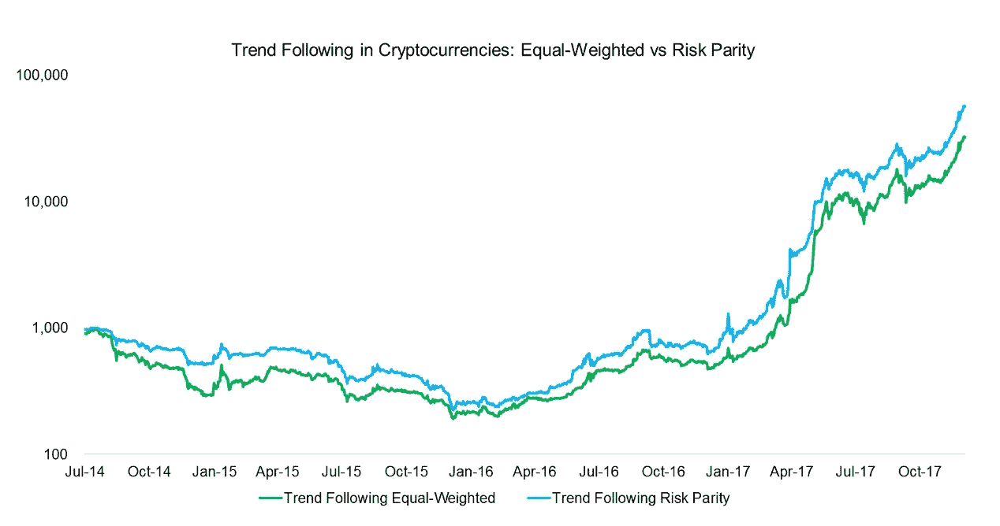
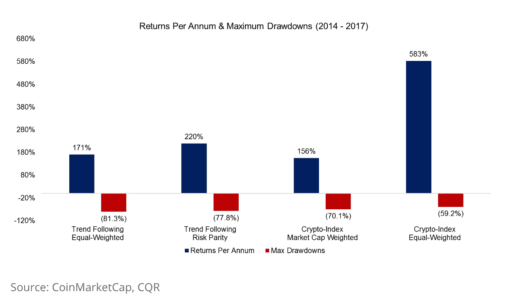
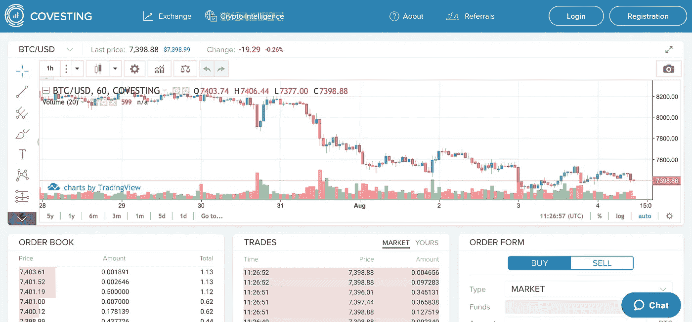
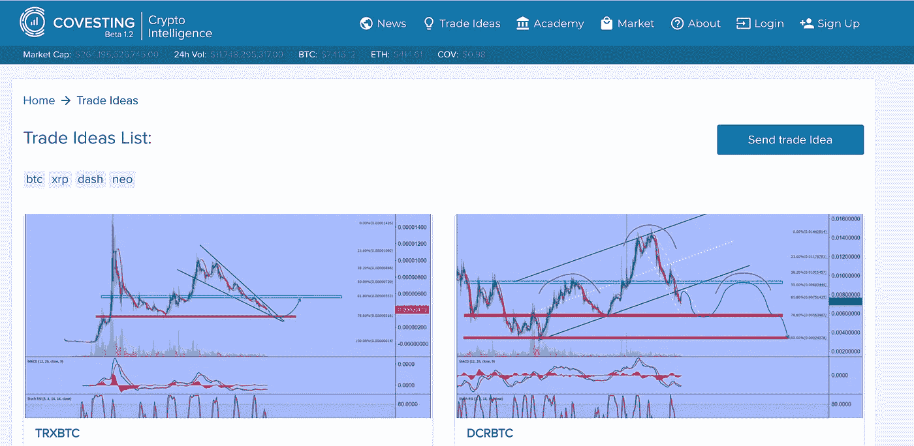

# Crypto 2.0:新的 Crypto VC +对冲基金混合模式

> 原文：<https://medium.com/coinmonks/crypto-2-0-the-new-crypto-vc-hedge-fund-hybrid-model-67c4a590cc93?source=collection_archive---------4----------------------->

前几天，我在这里看到了 Coventure & Cty Block 团队与 Crypto Bobby 的精彩对话:

我们看到的一个类似趋势是，加密风险基金也是量化基金。让事情变得更复杂的是，我们也是一家矿业公司，是一家真正的全栈加密投资基金。随着我们的矿业公司开始变得更有利可图，它将直接反馈到我们的 VC & quant 对冲基金。cypto 基金的典型角色是硅谷的产品经理、开发人员、企业家或过去专注于技术的风投。我们看到越来越少的私募股权买方和卖方真正运行基金的深度策略，但也像他们在山谷和小巷一样关注团队、技术和市场规模。我们还看到，基金正在建立自己的内部数据，这些数据是专有的，可以用来进行交易，以建立新的策略。最棒的是，我们都是这种状态的初学者…而现实是，我们中的任何一个人都无法预测未来几个月甚至明年会发生什么。事物有可能通过阶跃函数完全转化，但也有可能不转化。对许多人来说，自己研究一些东西，然后添加他们自己的评论来为生态系统做出贡献，这是一种最佳实践。

正如 Willy Woo 在他的文章中指出的，现代投资组合理论告诉我们，再平衡可以用来管理下行风险。虽然数学在某些时候可能有意义，但这些再平衡和活跃交易的投资组合使用的混合投资组合不一定与公开市场的工作方式相同，因为它们基于行业的相关性或反向关系。举例来说，一个典型投资组合的投资组合结构可能会偏重于稳定的科技股公司，但会持有少量高风险的国际证券以进行平衡。问题是，加密技术还不够成熟，无法让这些类型的部门和行业复制它。

一个有趣的技巧是代币供应。威利·吴引用*的话:“直到今天，她的存在和财富仍然是一个传奇，只在业内少数特权人士之间流传。如果她真的喜欢这个项目，她会拿 1/100 的代币，或者如果这个项目更具投机性，她会拿 1/1000 的代币。当然，你可以根据自己的情况来调整。*

*在新兴技术领域工作的风险投资家正是这样做的，他们在首轮融资中(希望如此)从公司中抽取一定比例的股份，他们从不出售股份，直到他们的流动性事件，IPO 或收购。他们理解赢家和输家之间的幂律动力学。”*

Julian Zegelman 在这里分享了纽约加密对冲基金峰会的大量笔记，这是一次非常私人的活动。以下是一些要点:

1.  2017 年末和 2018 年迄今投资于 ico 的总美元数统计显示了一个健康的市场-但它是扭曲的！更大的项目——想想 Telegram、EOS、Basecoin 和类似规模的项目——需要所有可用的资本。最近，它看起来更像是一种“赢家通吃”的方法。留给早期小型 ico 的资本很少。
2.  ICO 公司的数量停滞不前——市场上的交易减少，但平均而言，它们的质量比一年前更高。
3.  鉴于目前的监管状况，ico 开始越来越像传统的股权融资交易——更加强调法律和金融结构。
4.  许多加密基金认为 sto(安全令牌产品)是未来的趋势，并预计 2019 年此类 sto 的数量将会激增。
5.  机构资本涌入数字资产仍然受到基础设施缺乏的严重限制——对托管解决方案、保险、可扩展交易技术和银行合作伙伴的高需求。对于许多关注数字资产领域的大型机构投资者来说，这不是“为什么”的问题，而是“如何”的问题。给他们工具，他们就会加入。
6.  随着越来越多的参与者进入加密交易领域，套利和对冲机会的数量减少——在流行的代币销售中获得分配变得更加困难，信息不对称和套利的可能性降低。越来越多的玩家进入——整体回报越来越低=数字资产市场更加稳定和成熟。

现在谈谈量化基金策略，使用传统回溯测试的挑战在于，加密技术只是在最近几年才出现。因此，没有基金会坐在那里告诉你，你可以很容易地使用回溯测试的历史数据！根据 [Crypto Quant Research](https://cryptoquantresearch.com/research-trend-following-in-cryptocurrencies)

“谈到投资，投资者实际上只有两种选择:投机均值回归或动量。后者有效地推测趋势的延续，可能是向上或向下移动。趋势跟踪在 20 世纪 80 年代成为投资界的一种确定的风格，当时期货交易变得更加容易，商品交易顾问(CTA)开发了系统的交易程序来利用商品的趋势。随着时间的推移，债券、股票和货币等其他资产类别也增加了。鉴于比特币期货本周开始交易，投资公司很可能会将他们的系统趋势跟踪策略应用于加密货币。在这篇简短的研究报告中，我们将分析加密货币领域的趋势跟踪策略。”

“下图显示了两个趋势跟踪系统的表现，一个基于等权重分配，另一个基于风险平价模型。我们可以观察到，这两种情况几乎相同，从 2014 年到 2016 年表现为负，此后呈急剧上升趋势。”

“长期趋势模型的多空信号分布。下图显示，最初该系统是 100%长的，表明所有加密货币在该时间点显示出 12 个月的正表现。2014 年和 2015 年，大多数加密货币价值下跌，趋势跟踪系统越来越多地进入空头头寸。一旦加密货币在 2016 年开始复苏，该系统再次改变方向，自 2017 年年中以来已经 100%做多。

谈到风险指标，Crypto Quant Research 指出,“趋势跟踪系统旨在捕捉长期趋势，无论是积极的还是消极的，并通过分散市场来最小化风险。在加密货币领域，多样化很困难，因为只有 14 种加密货币的市值超过 10 亿美元，这可能解释了趋势跟踪系统的更高提款率。”

Crypto Quant Research 还指出，“趋势跟踪模型的风险回报率高于市值加权加密货币指数的风险回报率，但不高于等权指数的风险回报率。值得注意的是，目前的风险回报率高得不可持续。相比之下，自 1926 年以来，标准普尔 500 的风险回报比为 0.4。”

“Covesting 也是一个有趣的工具，有助于为加密货币交易者和投资者提供一站式解决方案。由于 COVESTING 的基础设施是由投资行业的专业人士建立的，因此及时的市场数据的重要性并没有被忽视。我们相信，我们的全部责任不仅是提供尖端的交易技术和个性化的客户服务，而且是教育世界和我们的社区关于加密货币投资。这就是我们设计加密情报门户的原因。

Crypto Intelligence Portal 是一个强大的教育资源和知识库，由交易者为交易者构建，提供最新的市场新闻、由领先的加密专家创建的独特内容，旨在教育社区、交易想法以及讨论最新市场发展的能力。在这里，你可以找到解释加密货币投资要点的加密交易 101，以及帮助新投资者的视频教程。对于有经验的交易者，将包括来自行业专业人士的高级交易教程、策略和技术分析。"

我们寻求与我们的社区分享知识和最佳实践。

在任何情况下，本网站上的任何材料都不应被视为出售或购买任何单个公司或投资基金的权益、代币或硬币的要约。任何此类要约或邀约将仅通过与特定基金或个人相关的保密私募发行备忘录单独进行，除其他要求外，这些基金或个人符合美国联邦或其他国际证券法规定的特定资格，并且通常在金融事务方面经验丰富，因此他们能够评估预期投资的价值和风险

如果你觉得这是有帮助的，请为我们鼓掌，分享给你的朋友，并随时在 genbvc.com 给我们发短信。查看我们的电报频道[这里>](https://t.me/genesisblockholdings) ，关注我们的博客[这里>](/@genblockfund)