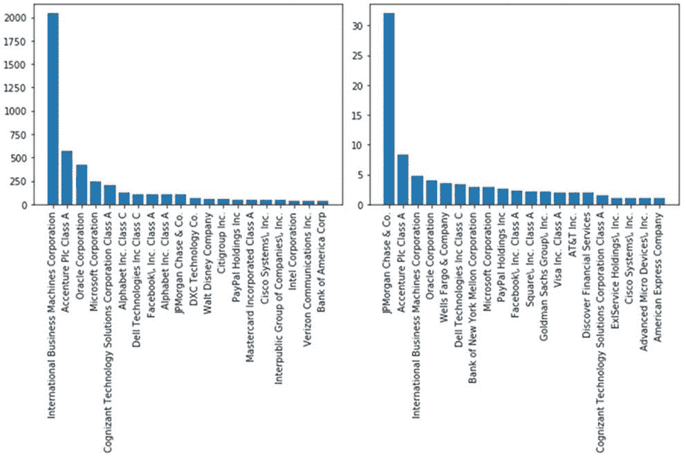
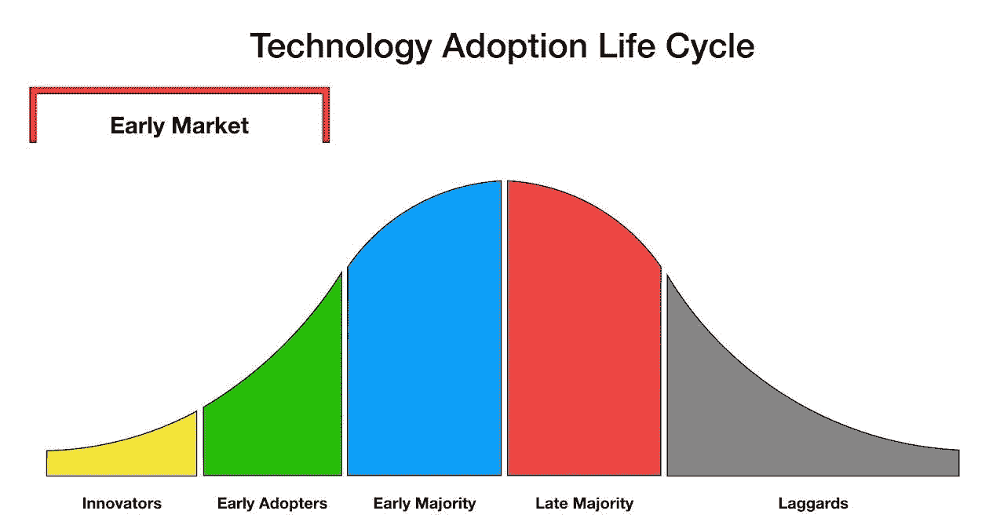
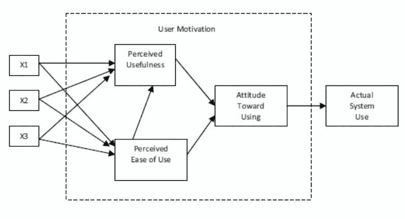
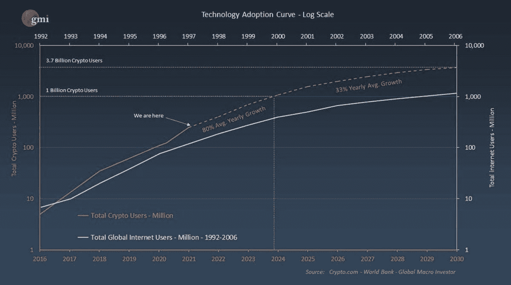
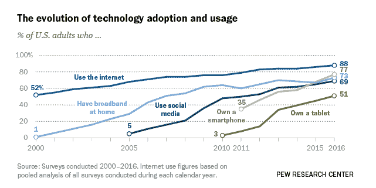
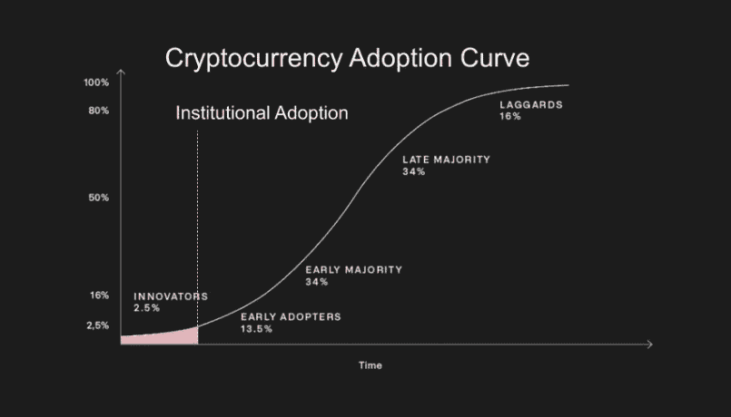

# 区块链采用

> 原文：<https://medium.com/coinmonks/crypto-adoption-not-impossible-inevitable-7b354ae0e7e?source=collection_archive---------3----------------------->

unsplash

## 摘要

数字资产领域庞大到不容忽视，市值高达 2.6 万亿美元。基于加密的数字资产可能代表一种全新的资产类别，催生新一代企业在银行、供应链、游戏和社交媒体等领域交易、提供和使用数字资产。但是，话虽如此，就加密货币的采用而言，我们目前处于什么位置呢？现在太迟了吗？

## 今日加密

根据美国银行对加密货币的分析，截至 6 月 21 日，全球约有 2.21 亿人交易过加密货币或使用过区块链的应用程序。

Y 一代、千禧一代和 Z 世代正在推动数字资产的发展和使用。这一代人伴随着互联网成长，他们期待无缝的、数字化的原生在线互动。

在美国，估计有 14%(2120 万)的成年人拥有数字资产，另有 13%(1930 万)的成年人计划在 2021 年购买数字资产。值得注意的是，这些潜在买家的平均年龄是 44 岁，53%的潜在买家是女性。考虑到仅在 2015 年，当皮尤研究中心询问人们是否听说过比特币时，不到 50%的人说他们听说过加密货币，这是惊人的增长。

公司正在积极研究这项新技术及其用途，而不是冒险忽视数字资产和应用。根据美洲银行的一项研究，以下是截至 2021 年 4 月区块链相关员工总数(LHS)与区块链相关职位每月平均数量的对比:

Source: Bank of America

## 大规模采用的理论与现实

当一项新技术取代旧技术时，采用通常开始缓慢，然后加速。对于网络技术来说尤其如此，因为网络的效果与系统连接用户数量的平方成正比。

从历史上看，我们已经看到电话、电脑、收音机、智能手机，当然还有互联网发生了这种情况。这些通信网络的采用变得越来越快。在加密货币的情况下，这可能会发生得更快。由于互联网固有的去中心化软件的技术发展，一种基于分布式分类账和区块链的新媒体正在迅速出现。在这种新的软件架构上开发的应用程序似乎比以前的技术扩展得更快。

考虑埃弗雷特·罗杰斯的技术采用曲线概念，正如他在下面的书《创新的扩散》中所概述的:

Source: Prof C — YouTube

总的来说，个人以不同的速度接受新技术。它们的相对采纳率可以用正态分布来表示，根本区别在于人们对新思想的心理接受度。

这使我们能够将心理倾向分为几类，即:

1) ***创新者***(2.5%)——有意愿和资源尝试新想法的风险承担者，即使他们可能会失败。

2) ***早期采用者*** (13.5 %)对自己使用的技术很挑剔。他们被视为对新信息非常了解，通过接受新信息，他们往往会减少他人对新技术的不确定性。

3) ***早期大多数***(34%)——他们在接受一个新概念之前会慢慢来。只要新技术适合他们的生活，他们就会接受。

4) ***后期多数*** (34%) —为应对同辈压力、发展规范或经济需要而采用。在他们接受一个概念之前，围绕它的大部分疑问必须被解决。

5) ***落伍者***(16%)——墨守成规，根据之前的经验做出判断。他们要么不喜欢，要么无力承担新想法的风险。

然而，上述因素不足以确保广泛接受；任何技术都必须简单易用。太复杂而无法学习的技术将很难被广泛接受。

让我们以 Fred David 在 1986 年发表的技术接受模型(TAM)为例:

Source: researchgate.net — TAM Davis 1986

感知有用性(PU)和感知易用性(PEU)在上面的基本 TAM 模型中进行了检验。感知有用性定义为潜在用户使用特定系统将改善其行为的主观可能性，而感知易用性定义为潜在用户期望目标系统易于使用的程度。

这个模型多年来一直被不同的研究者用来解释采用技术系统。

## 案例研究:区块链上的 DeFi

***感知有用:***

分散金融——DeFi 让全球任何联网的人都能获得任何全球货币，赚取存款收益或立即获得贷款。

***感知易用:***

除了 DeFi 之外，还有一些用户友好的应用程序，掩盖了所有幕后的技术复杂性。以 SwissBorg 为例，该公司利用分散融资，并使其非常方便用户。只需通过标准银行转账将资金发送到 SwissBorg 平台，登录应用程序，点击一个按钮，瞧，你的现金储蓄或加密货币(如果你喜欢)的年回报率高达 15%，按日支付。

## 在技术采用曲线上应用加密

考虑到以上所有因素，我们可以假设早期阶段的加密和互联网之间的比较是一个公平的类比。在技术采用曲线上，我们可以绘制现在的加密与过去的互联网的对比图:

Source: globalmacroinvestor.com

对产品采用建模的一种方法是理解人们的行为受到他们的同龄人的影响，以及他们认为某个特定行为有多普遍。随着越来越多的个人接受这项新技术，它将以指数速度增长。这听起来是不可能的，直到它发生。

我们还可以将采用曲线与以下其他主要技术进行比较:

Source: Pew Research Center

对于加密货币和区块链，我们目前正处于“早期采用者”阶段。

Source: Twitter — Cole Garner

根据前面所述，采用通常开始缓慢，然后迅速增长。当每个人都联系在一起时，采纳曲线变得平滑，形成一个“S”形。因为我们仍处于早期采用阶段，我们可以自信地预测，未来十年，独立用户将增加 15 倍以上。

和所有事情一样，时间会证明一切。

*免责声明:本文包含的信息仅用于教育目的，并不构成 Wheatstones 的任何形式的建议或推荐，用户在做出(或避免做出)任何投资决定时也不打算依赖这些信息。*

> 加入 Coinmonks [电报频道](https://t.me/coincodecap)和 [Youtube 频道](https://www.youtube.com/c/coinmonks/videos)了解加密交易和投资

## 也阅读

 [## 杠杆代币[多头代币]终极指南

### 杠杆化令牌是具有杠杆化风险敞口的 ERC20 令牌，不考虑保证金、要求、管理…

medium.com](/coinmonks/leveraged-token-3f5257808b22)  [## 最佳加密交易所| 2021 年十大加密货币交易所

### 加密货币交易所的加密交易需要了解市场，这可以帮助你获得利润。之前…

blog.coincodecap.com](https://blog.coincodecap.com/crypto-exchange)  [## 2021 年最佳加密借贷平台| 6 大比特币借贷平台

### 获得比特币和其他加密货币的最佳贷款利率

medium.com](/coinmonks/top-5-crypto-lending-platforms-in-2020-that-you-need-to-know-a1b675cec3fa)  [## 2021 年最佳免费加密交易机器人

### 2021 年币安、比特币基地、库币和其他密码交易所的最佳密码交易机器人。四进制，位间隙…

medium.com](/coinmonks/crypto-trading-bot-c2ffce8acb2a)  [## 最佳 4 个加密交易信号电报通道

### 这是乏味的找到正确的加密交易信号提供商。因此，在本文中，我们将讨论最好的…

medium.com](/coinmonks/best-crypto-signals-telegram-5785cdbc4b2b)  [## 获取信号、交易机器人和套利

### 在本文中，我们将回顾 Bitsgap，这是一个满足您所有交易需求的一站式加密交易平台。它…

blog.coincodecap.com](https://blog.coincodecap.com/bitsgap-review)