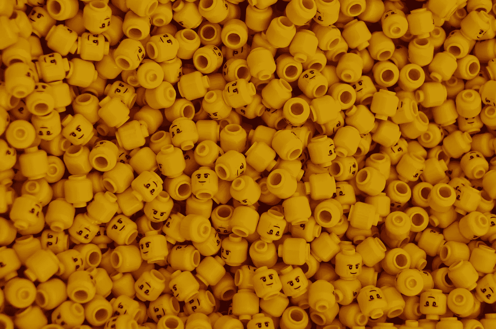

# 加密和 Web 3.0 是产品和工作的未来

> 原文：<https://medium.com/coinmonks/crypto-and-web-3-0-are-the-future-of-product-and-work-3d19e3733181?source=collection_archive---------2----------------------->

## 这是对加密产品和社区联盟的非技术性介绍，而不是对新技术或其资产评估的解释。

A Lego community, it’ll make more sense later. (Photo by [James Orr](https://unsplash.com/@orrbarone?utm_source=unsplash&utm_medium=referral&utm_content=creditCopyText) on [Unsplash](https://unsplash.com/s/photos/legos?utm_source=unsplash&utm_medium=referral&utm_content=creditCopyText))

我知道文章标题是一个非常有力的开场白，但是在过去的几年里，我亲眼目睹并亲身经历了…