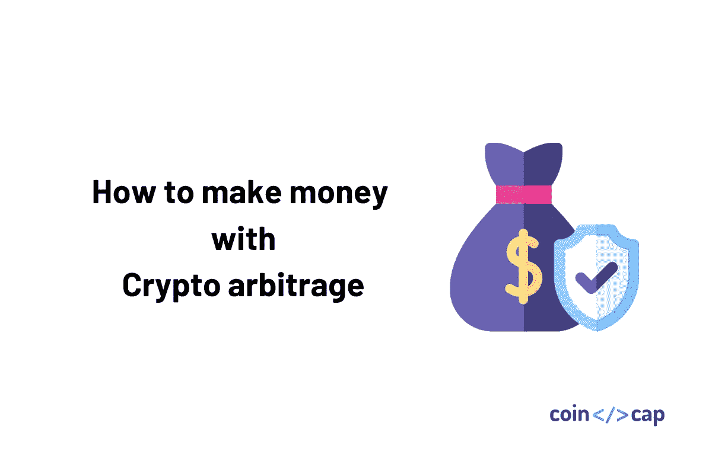

# 加密套利指南——新手如何赚钱

> 原文：<https://medium.com/coinmonks/crypto-arbitrage-guide-how-to-make-money-as-a-beginner-62bfe5c868f6?source=collection_archive---------0----------------------->

## 低价买入加密货币，高价卖出

# 什么是加密套利？

加密货币套利是一种利用价格差异获利的交易类型。这些价格差异通常被称为“套利价差”，可以用来以较低的价格购买加密货币，然后以较高的价格出售。

例如，如果 BTC ( [比特币](https://blog.coincodecap.com/a-candid-explanation-of-bitcoin/))在比特币基地专业版上卖 8050 美元，在币安卖 8200 美元。你可以低价买入一定量的 BTC，然后高价卖出。

有不同类型的套利以不同的方式利用价格差异。然而，它们都包括找到这些价差并迅速采取行动。

2020 年，加密套利的种类从 0.2%到 4%不等。有时超过 20%会出现，但它们是罕见的。

如果你能在一天内对套利价差采取足够多的行动，那么你的时间是值得的。当价格在一天内波动不大时，套利是一个很好的工具，其他的加密日交易策略，如摇摆交易，也不完全可行。

# 不同类型的加密套利

套利的一个常见误解是，你必须在一个交易所购买密码，转移到另一个交易所，然后出售。

虽然这是一种方法，但它不是你的唯一选择，还有其他套利交易的方法，不依赖于等待潜在的缓慢和昂贵的转移。

# 空间套利——交易所之间的转移

这包括在一个交易所购买密码，将其转移到另一个交易所以更高的价格交易，然后出售。

这不是一种现实的盈利方式，因为差价可能只存在几秒钟。

因此，当你把密码转移到另一个交易所时，价格很可能又变了。

除了交易费之外，还会产生转让费。

## 赞成的意见

*   易于执行

## 骗局

*   转账又慢又贵
*   到转移完成时，差价可能已经不存在了

# 空间套利——无需在交易所之间转移

这种空间套利方法消除了在交易所之间传输密码的步骤。

因此，你可以立即行动，而不必等待一个缓慢的转移或支付转让费。

这种差异使它成为一个更好的选择加密日交易相比，转让的方法。

为此，您在两个交易所持有余额，并同时在两个交易所提交买入和卖出订单。

例如，假设你在比特币基地专业版上买入，在币安上卖出，你看到了 BTC 对美元的价差。

你可以将美元转移到比特币基地专业市场，将 BTC 转移到币安，然后等待价差。当价格差异出现时，比如说在币安上涨了 1.2%，你可以在比特币基地用你的美元买入 BTC，同时在币安用美元卖出 BTC。

进一步分析这个例子，如果你在比特币基地专业版上以 8050 美元的价格购买了 0.1 BTC，你将花费 805 美元。

如果你同时在币安以 8200 美元的价格卖出 0.1 BTC，你会以 820 美元的价格卖出。

于是一瞬间，你买了 0.1 个 BTC，卖了 0.1 个 BTC，不亏不赚 BTC。但你花了 805 美元买入，以 820 美元卖出，收益 15 美元(交易费用前)。

你可以一直等待这样的价差出现，并在它们出现时采取行动。订单簿不断变化，因此价格总是波动，价差可能会相当规律地出现。

## 赞成的意见

*   你可以立即实现利润
*   没有转移时间或费用

## 骗局

*   很难同时快速提交两笔交易
*   一个订单可能会满足，而另一个订单并不意味着你不会得到你想要的价格，你不能保证你会足够快，以满足两个订单

> **也可阅读** : [最佳加密交易机器人](/coinmonks/whats-the-best-crypto-trading-bot-in-2020-top-8-bitcoin-trading-bot-c16adeb13317)

# 三角套汇

这种方法与众不同，因为它可以完全在一个交易所完成。三角套利不是利用交易所之间的价格差异，而是利用交易对之间的差异。

例如，你可以用 ETH 换 BTC，用 BTC 换 XRP，用 XRP 换回 ETH。如果差价有利，你最终会获利。

## 赞成的意见

*   它可以在一个交易所完成
*   你可以立即实现利润
*   没有转移时间或费用

## 骗局

*   你提交的订单越多，其他人代替你完成订单的机会就越多，这意味着你得不到你想要的价格

# 如何发现加密套利机会

例如，我们将研究如何寻找空间套利机会。这包括寻找两个交易所之间的差价，差价足够大，即使扣除交易费用，你也能获利。

你可能想从检查哪些硬币的流动性或价格波动性相当高开始。然而，这将取决于你每天如何找到最好的方法。

寻找差价时，有四个重要因素需要考虑:

## 1.费用

差价必须足够大，这样你才能在扣除交易费用后获利。如果你买入时支付 0.2%，卖出时支付 0.25%，如果差价只有 0.1%，你就不会盈利。因此，您可能只想搜索高于某个阈值(比如 1%)的价差。

## 2.要价和出价

您希望在每次交易中看到订单簿的顶部。当你买入时，你将在那个交易所填写**要求**订单。因此，您需要查看买入订单的汇率和金额。卖出时，你将在那个交易所填写**买价**订单。因此，您需要查看竞价订单的价格和金额。

## 3.避免打滑

当你没有得到你期望的价格时，就会出现滑点。如果最新的报价是以 8050 美元的价格买入 0.1 BTC，但你买入了 0.15 BTC，那么你将以 8050 美元的价格得到 0.1。而另一个 0.5 BTC 的利率更低，因为您将填写订单簿中的下一个订单。为了避免滑点，你的订单不能大于你将要执行的最小的买卖订单。

## 4.潜在利润

如果存在 30%的价差，但你要填写的卖单只是价值 1 美元的资产，你的最大利润不会超过 0.30 美元。

因此，假设我们希望价格差异> = 1%，并且订单大小允许至少 10 美元的利润。

你可以打开多个交易所网站，尝试手动计算价格差异和检查订单大小。或者你可以使用某种软件工具来帮助这个过程。

实际上，由于套利差价可能只存在一秒钟或更短的时间，你可能需要使用一个工具来帮助这个过程。

有几个选项，但我们今天将使用的一个例子是 [Coygo Terminal](https://www.coygo.app?utm_source=coincodecap) ，它为许多加密交易所提供了实时套利扫描程序，并允许您根据利差百分比和可能的利润进行过滤。

> ***亦读—*** [***Coygo 复习:加密套利与交易***](https://blog.coincodecap.com/coygo-review-crypto-trading-and-arbitrage)

# 如何提交套利交易并利用差价

如上所述，在我们的例子中，我们做的是空间套利，而不是在交易所之间转移。

比方说，你一直在观察套利扫描仪，当你在北海巨妖买入，在 Bittrex 卖出时，你已经看到 USDT 联邦理工学院市场上出现了几次有利可图的利差。

你已经有了一些 ETH 和 USDT，所以希望这种趋势继续下去，你可以把你的 USDT 送到北海巨妖，把你的 ETH 送到 Bittrex。

# 提交套利交易的步骤

1.  把你的 USDT 搬到北海巨妖
2.  将您的 ETH 迁移到 Bittrex
3.  等待有利可图的价差出现
4.  找到最小的订单量，以避免滑点。在这个例子中，如果你填写的买价订单是 0.1 BTC，卖价订单是 0.05 BTC，那么你可以订购的最大数量是 0.05 BTC。
5.  现在你必须在每个交易所同时下单，一个买一个卖。对于这两个订单，您将使用您确定的金额，在本例中为 0.05 BTC。您可以开立两个限价单，并通过使用您正在执行的订单的买卖价格来指定您想要的确切价格，或者您可以只开立市价单。
6.  如果你能在两个订单都被取消或被其他人下单之前足够快地下单，你就实现了直接的利润。
7.  回到第 3 步，重新开始。

套利价差可能只存在一秒钟或更短的时间，因此很难快速填写这些订单。

速度是套利游戏的关键，你正在比其他试图做同样事情的交易者和机器人跑得更快。

要想足够快，你最好的选择是使用一个工具，它可以帮助你在价差出现时迅速采取行动。

如前所述，Coygo Terminal 也可以通过其一键式交易界面在这方面提供帮助，该界面有助于自动预配置您的订单大小和价格，并通过一次点击将订单提交给多个交易所。

# 祝你好运！

套利可能是日交易加密的一个很好的方法，但是它有自己的优点和缺点。

无需等待和观看图表就能立即获利的能力对一些人来说当然很有吸引力，但与其他交易员和机器人竞争第一个完成订单的前景可能会让新手感到害怕。祝你好运！

> 加入 Coinmonks [电报频道](https://t.me/coincodecap)和 [Youtube 频道](https://www.youtube.com/c/coinmonks/videos)获取每日[加密新闻](http://coincodecap.com/)

## 另外，阅读

*   [复制交易](/coinmonks/top-10-crypto-copy-trading-platforms-for-beginners-d0c37c7d698c) | [加密税务软件](/coinmonks/crypto-tax-software-ed4b4810e338)
*   [网格交易](https://coincodecap.com/grid-trading) | [加密硬件钱包](/coinmonks/the-best-cryptocurrency-hardware-wallets-of-2020-e28b1c124069)
*   [密码电报信号](http://Top 4 Telegram Channels for Crypto Traders) | [密码交易机器人](/coinmonks/crypto-trading-bot-c2ffce8acb2a)
*   [Pionex 双投](https://coincodecap.com/pionex-dual-investment) | [AdvCash 审核](https://coincodecap.com/advcash-review) | [秉持审核](https://coincodecap.com/uphold-review)
*   [面向开发者的 8 个最佳加密货币 APIs】](https://coincodecap.com/best-cryptocurrency-apis)
*   [支持卡审核](https://coincodecap.com/uphold-card-review) | [信任钱包 vs 元掩码](https://coincodecap.com/trust-wallet-vs-metamask)
*   [赢取注册奖金——10 大最佳加密平台](https://coincodecap.com/earn-sign-up-bonus)
*   [最佳加密交易所](/coinmonks/crypto-exchange-dd2f9d6f3769) | [印度最佳加密交易所](/coinmonks/bitcoin-exchange-in-india-7f1fe79715c9)
*   [开发人员的最佳加密 API](/coinmonks/best-crypto-apis-for-developers-5efe3a597a9f)
*   最佳[密码借贷平台](/coinmonks/top-5-crypto-lending-platforms-in-2020-that-you-need-to-know-a1b675cec3fa)
*   杠杆代币的终极指南