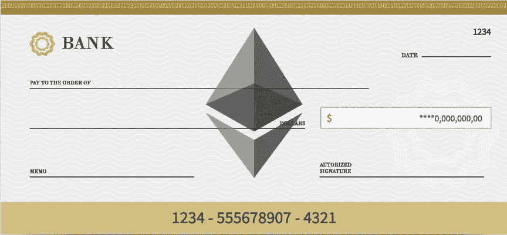
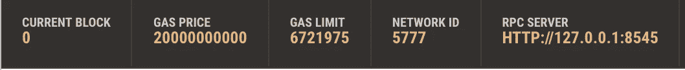
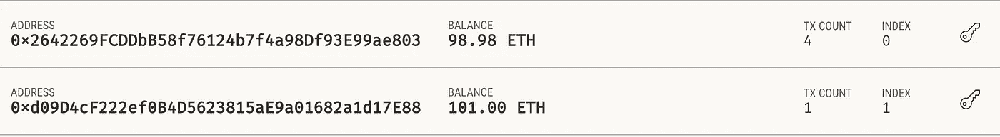

# 加密支票！以太坊中的消息签名介绍

> 原文：<https://medium.com/coinmonks/crypto-cheque-introduction-to-message-signing-in-ethereum-1d14c8c42e21?source=collection_archive---------0----------------------->



假设我想授权我的朋友在未来的某个时间从我的银行账户中提取预定金额的钱。我们通过使用支票来完成这项工作。我只需写下金额、收款人、日期，然后在交给我的朋友之前签名，朋友再把钱存入银行以换取资金。在实践中，支票被认为是一种欠条，作为一种更通用的支付形式，而不是直接交钱。支票也预先刻有全息金箔和热敏墨水等元素，作为安全措施。每张支票都是独一无二的，就像钞票一样:它们无法复制。

支票很重要，原因有很多，但它与以太坊中的签名消息有什么关系呢？尽管消息签名是一种多功能的工具，但让我们把它想象成等同于签发支票的加密货币。用支票做类比，明显的相似和不同之处就显现出来了。我们通过软件输入收款人/金额/标牌的详细信息，而不是写在纸上。最显著的区别是标记的方法，这涉及到使用以太坊私人钱包密钥而不是钢笔签名。还值得注意的是，这一过程将中介从一个可以在幕后拖延、扣留或冻结资金的私人实体(银行)转变为一个智能合同，该合同以书面代码的形式基于一组预先确定的规则释放资金。

> 这是金钱的未来，我们今天就要建造它。

这是一个入门到中级教程。先决条件是对坚实、松露和 NodeJS 的基本理解。在本教程中，强烈建议在键入代码时跟随，而不是复制+粘贴。这个过程有助于减缓思维，让它能够吸收正在发生的事情。如果你实际上是一个[完全初学者](/coinmonks/introduction-to-solidity-programming-and-smart-contracts-for-complete-beginners-eb46472058cf)，一定要看看我以前的面向完全初学者的教程。继续前进…

# **设置环境**

1.  确保安装了 NodeJS。将以下内容复制并粘贴到您的终端中:

```
brew install node
```

2.创建一个新的项目目录并输入它。

```
mkdir message_signing
cd message_signing
```

3.确保您安装了 [Visual Studio 代码](https://code.visualstudio.com/download)或您喜欢的文本编辑器。在编辑器中打开项目。

```
code .
```

4.在你的机器上全局安装 Truffle 并初始化一个新项目。

```
npm install -g truffle
truffle init
```

5.创建一个`index.js`文件。这将保存用于签署消息的 javascript 代码。进入合同目录并创建`cheque.sol`。这将是智能合同，它验证签名的消息并向收款人释放资金。

```
touch index.js
cd Contracts
touch Cheque.sol
cd ..
```

6.创建 package.json 文件并安装 web3。

```
npm init -y 
npm install web3 
```

7.安装并打开 [Ganache](https://www.trufflesuite.com/docs/ganache/quickstart) 。这是一个模仿真实以太网行为的私人区块链。它将作为我们部署合同的平台。

您的文件夹结构应该如下所示:

```
/message_signing
    /contracts
        Migrations.sol
        Cheque.sol /migrations
        1_initial_migrations.js /test index.js
    package.json
    truffle-config.js
```

在我们开始之前，整个计划总结如下:

1.  付款人通过使用他们的以太坊私钥签署消息来预先授权支付。
2.  付款人部署智能合同，向收款人发送所需的乙醚量。
3.  付款人通过期望的媒介(例如电子邮件)将签名的消息发送给收款人。
4.  收款人通过向智能合同提交签名的消息来要求付款，智能合同验证真实性并释放资金。

# 书写支票合同

*   警告:这一部分相当复杂，所以请密切注意。每个代码块将被彻底解释，以确保正确的理解。
*   对于那些感兴趣的人，这里是这个项目的 github 链接。

头撞向`Cheque.sol`，写着:

这里发生了一些事情。

**第 1 行**声明了 Solidity 版本，这是每个智能合约的标准。要找出你的编译器使用的是哪一个版本的 Solidity，

```
truffle version
```

在终端应该输出:

```
Truffle v5.0.0 (core: 5.0.0)
Solidity v0.5.0 (solc-js)
Node v11.13.0
```

在本例中，我们使用的是 v0.5.0。

**第 3 行**创建存储随机数有效性的映射。随机数用于防止重放攻击，在重放攻击中，接收者可以多次重新提交相同的签名并提取资金。付款人将把这个随机数嵌入要签名的消息中。

**第 4 行**声明了一个公共变量`owner` *。*用于跟踪部署合同的付款人的地址。它的唯一目的是根据消息恢复函数的结果进行验证，该函数将返回签名者的公钥。如果钥匙与`owner`匹配，资金将被释放。

**第 5–7 行**损害了构造函数。它被标记为`payable`，因此我们可以在部署它时将以太网发送到合同。这是我们为将来提款预授权的金额。部署后，它将`owner`设置为部署者的以太坊地址。

现在，我们将编写第一个函数:

**第 11 行**实例化`splitSignature`。它接受一个参数`sig`，该参数代表签署消息的所有者/付款人产生的签名。这是一个效用函数，只能在合同中执行，如`internal`所示。此外，它不会修改合同的状态，因此不会花费任何额外的天然气，如`pure`所示。简单来说，没有变量被修改，这只是一个简单的计算。

以太坊使用[椭圆曲线数字签名算法](/coinmonks/ecdsa-the-art-of-cryptographic-signatures-d0bb254c8b96)来方便数字签名。每个 ECDSA 签名由三个参数 r、s 和 v 组成。该函数的目的是将签名分解为这三个部分，并返回它们以在恢复函数中使用，从而确定原始签名地址——稍后将详细介绍。

**第 12 行**确保签名长度为 65 字节。如果不是，则不是有效的签名。

**第 14-16 行**声明`r`、`s`和`v`。`r`和`s`是固定长度 32 字节数组的形式。`v`采取基本整数的形式。

第 18–25 行是主要功能出现的地方。这里，我们使用内联汇编将签名分解成 3 个部分。如代码注释所示，`r`由签名的前 32 个字节组成，`s`由后 32 个字节组成，`v`由最后一个字节(后 32 个字节的第一个)组成，总共 65 个字节。

**第 27 行**返回 3 个组件。

概括地说，`splitSignature`将一个签名作为输入，将它分解成它的组成部分，并将它们作为输出值返回。下一个帮助器函数将使用它来返回原始签名者的钱包地址:

**第 30 行**创建`recoverSigner`，接受 2 个参数。

1.  `message`是由所有者/支付者创建的原始散列消息，我们将很快演示。
2.  `sig` 是****所有人/付款人签署消息时创建的签名。****

****就像`splitSignature`一样，这是一个不修改契约状态的内部效用函数。这个函数的目的是发现签署消息的个人的钱包地址，并将其返回用于另一个函数。****

******第 31–33 行**声明变量`r`、`s`和`v`，就像`splitSignature`一样。****

******第 35 行**将`r`、`s`和`v`赋值给`splitSignature` **的返回值。******

******第 37 行**用结果`r`、`s`和`v`值以及`message`参数调用`ecrecover`。`ecrecover`是一种全球可用的可靠性方法，用于确定散列消息的签名地址，给定散列消息本身和分成 3 个部分的签名。****

****概括地说，`recoverSigner`接收原始的散列消息和签名，将签名送入`splitSignature`，捕获返回值并将其与散列消息一起送入`ecrecover`，以获得原始签名地址。****

******第 40 行**是我们智能合约的最后一个效用函数`prefixed`。我们一直在谈论“散列信息”，但这到底是什么意思呢？当拥有者/支付者创建消息时，它必须通过以太坊常用的散列算法`keccak256`(以前称为 SHA3)，然后才能被签名。这个函数接受这个散列作为输入参数，并将其转换成一个“带前缀的”散列，然后输入到`recoverSigner`。****

> ****以太坊中的所有交易都使用[递归长度前缀](https://github.com/ethers-io/ethers.js/blob/master/utils/rlp.js) (RLP)编码。不需要深入了解 RLP 的细节，开头的`\x19`是一个事务开始时故意设置的无效字节。这可以防止应用程序欺骗您对看似消息，但实际上是伪装的事务进行签名。`Ethereum Signed Message:\n`使消息的内容可读。****

*   ****感谢 [RicMoo](https://blog.ricmoo.com/@ricmoo) 发表的关于数字签名的[文章](https://blog.ricmoo.com/verifying-messages-in-solidity-50a94f82b2ca)！****

****关于支票合同的最后一部分:****

******第 44 行**为`claimPayment`，将作为`public`表示的合同的切入点。这意味着该函数可以(在我们的例子中将会)从契约(我们的 javascript 代码)之外被调用。它接受 3 个参数:****

1.  ****`amount`是业主/付款人约定的交易金额。****
2.  ****`nonce`是由拥有者/支付者提供的随机数，他/她将该随机数嵌入到消息中。****
3.  ****`sig`是签名消息产生的签名。****

****第 45 号线将乙醚提供的`amount`转化为魏。以太坊智能合约总是以卫为单位读取以太量。1 乙醚= 1e18 卫。更多关于面额的信息请点击。****

******第 46–47 行**确保提供的`nonce`尚未被使用。如果提供的`nonce`有效，它会将其标记为在下次调用该函数时使用。****

******第 49 行**负责重新创建所有人/付款人发出的信息。该消息包括:****

1.  ****`msg.sender` —接收者(呼叫者)的以太坊地址****
2.  ****`amountWei` —业主/付款人提交的商定金额****
3.  ****`nonce` —在功能参数中提供****
4.  ****`this` —合同地址。这对于防止重放攻击是必要的，在重放攻击中，创建一个新的契约实例(清除旧的随机数),使收款人能够再次调用`claimPayment`。在新创建的合同中，所有者将拒绝引用旧地址的所有签名。****

****上述 4 个参数被封装在`abi.encodePacked`中，它将信息转换为“紧密封装”形式的字节。查看[这篇](/@libertylocked/what-are-abi-encoding-functions-in-solidity-0-4-24-c1a90b5ddce8)文章，了解有关 abi 功能的更多信息。****

****然后使用`keccak256`(以前称为 SHA3)函数对这些数据进行哈希处理。哈希以`prefixed` 为前缀，存储为`message`。此时，消息已准备好用于签名者恢复。****

****第 51 行是整个合同的关键。它以`message`和`signature`为参数调用`recoverSigner` ，并将返回值(一个地址)与契约的`owner`进行比较。如果这两个地址匹配，我们可以确定付款人已经批准调用这个函数并提取资金。****

******第 53 行**简单地将`amountWei`转移到函数调用方/收款方的地址。****

# ****创建和签名邮件****

****现在，我们已经完成了我们专业编写的智能合同，让我们创建我们可以验证的签名消息。****

****打开`index.js`并键入以下内容:****

****第 1–2 行导入Web3 并使用我们的私有 Ganache 区块链创建一个实例。这允许我们使用 Ganache 上的帐户来签署消息和调用函数。Web3 还包含实用函数，其中一个我们将用来签署我们的消息。在第 2 行，`localhost:8545`是指 Ganache 正在使用的地址和端口，可以在 RPC SERVER 下查看。(本地主机= 127.0.0.1)****

********

******第 5 行**使用 NodeJs `fs`(文件系统)模块检索由 Truffle 在迁移时创建的 JSON 契约表示。我们将很快详细介绍这一点。****

****第 6 行解析 JSON，这样我们的程序就可以读取它了。****

******第 7 行**从 JSON 中提取合同地址并存储为`contractAddress`。****

******第 9 行**声明支付签名功能`signPayment`。它接受`recipient`(收款人)地址和约定的`amount`。它被标记为`async`，所以我们可以利用 Javascript 的 async/await 模式来异步检索数据。****

******第 10 行**使用 web3 检索与给定区块链(Ganache)关联的所有账户，并将它们存储在一个列表中，如`accounts`****

******第 11 行**将列表中的第一个账户分配给`payer`。****

******第 12 行**检索给定地址(`payer`)的交易计数。我们将把它作为随机数嵌入到我们的消息中。****

******第 13 行**使用 web3 的`soliditySha3()`散列函数来创建我们消息的散列。我们的消息包含`recipient`(收款人)、`amount`、`txCount` (nonce)和合同地址(`contractAddress`)。这个特殊的散列函数在可靠性方面模仿了`keccak256()`函数的行为。****

******线 15 & 18** 为试/抓块。代码将尝试执行`try`块的内容，如果失败，返回到`catch`块。这种语法对于 async/await 模式很有用，因为与承诺相比，它没有固有的错误捕获功能。****

******第 16 行**使用来自一个 Ganache 帐户的私钥对我们创建的消息哈希进行签名。用来自 Ganache 中第一个帐户的实际私钥替换`<GANACHE_PRIVATE_KEY>`。通过单击帐户框右侧的钥匙图标来检索它。****

******* *重要:**在代码中粘贴私钥后，确保在前面加上`0x`，否则程序不会将其识别为有效密钥。示例:`0x6efc5ffc3ec7609736a2299a4a80e8f4377039b947c310ffa6f9ddf7a1fd5398`****

****值得注意的是，`web3.eth.accounts.sign`在签名前会自动给消息加上前缀`*\x19Ethereum Signed Message:\n*` 。如果我们使用另一种签名方法，比如`web3.eth.sign`，我们必须手动添加前缀。查看[文档](https://web3js.readthedocs.io/en/1.0/web3-eth.html)了解这些方法之间差异的更多信息。****

****`web3.eth.accounts.sign`的输出值是一个包含签名的对象，我们稍后将对其进行研究。****

******第 17 行**将`amount`、`txCount`、&、`sigObject`输出到控制台，以便我们在与合同交互时使用它们。****

******第 23 行**用 Ganache 列表上的第二个地址(收款人)和发送金额调用`signPayment`。只需从 ganache 复制+粘贴地址。第二个参数是金额(`10e18`)。记住，【魏】= 1 以太，同我们在契约中所写的一样。****

****在终端中，运行:****

```
**node index.js**
```

****输出应该如下所示:****

```
**100000000000000 4 {
    message:
    [170,
        80,
        21,
        140,
        32,
        200,
        163,
        173,
        111,
        250,
        155,
        168,
        13,
        9,
        72,
        192,
        32,
        64,
        156,
        14,
        40,
        109,
        210,
        180,
        50,
        126,
        191,
        205,
        93,
        137,
        29,
        30],
        messageHash: '0xb6d4e6021a8eece755ee78881bb64a8ad35777f868ec6ceed13fbfb91f7ae9c6,
        v: '0x1c',
        r: '0xe94a8699fec3b955192921925a7a2d5aeeeca15af05e010f0633fef296a054a9,
        s: '0x6a2fef0e41c9f150564f4e7c4f476dcdcc75605580f0c8ac39885a806d07b924,
        signature: '0xe94a8699fec3b955192921925a7a2d5aeeeca15af05e010f0633fef296a054a96a2fef0e41c9f150564f4e7c4f476dcdcc75605580f0c8ac39885a806d07b9241c'
}**
```

****前两个数字是`amount`和`nonce`(事务计数)，它们对于验证消息签名者很重要。****

****签名对象不仅包括我们将使用的底部的`signature`，还包括一些其他有趣的数据。还记得在我们的智能契约中，我们是如何将签名分成`v`、`r`和`s`部分的吗？这些是上面输出的相同组件。我们还可以看到不同格式的`message`和`messageHash`。****

# ****要求付款****

****现在，我们已经创建了支票合同，并作为付款人签署了一条消息以批准提款，让我们部署合同并与之交互，以作为收款人要求付款。****

****首先，打开位于项目根目录的`truffle-config.js`。删除文件内容，并用以下内容替换:****

****这种配置是必要的，以便 Truffle 知道当我们部署智能合约时使用哪个区块链网络。在这里，我们建立了一个名为`development`的网络，虽然名字很简单。`host`和`port`直接来自 Ganache。由于这是我们唯一合作的网络，当我们部署智能合约并与之交互时，Truffle 将默认使用它。****

****接下来，在`migrations`目录下创建一个名为`2_cheque.js`的新文件。****

```
**cd migrations
touch cheque.js
cd ..**
```

****打开它并键入:****

******1 号线**使用 Truffle Artifactor 导入智能合约。这将原始实体转换为 Truffle 可以读取的 JSON 表示。****

******第 3–5 行**使用 Truffle Deployer 将契约实例部署到 Ganache，它在幕后处理一切。`{value: 1e18 }`表示作为参数传递给部署的元数据。在这种情况下，它是我们以卫的形式发送到合同中的乙醚量。****

****回想一下我们是如何在契约中将构造函数标记为`payable`的。这允许在调用构造函数时，在部署时将以太发送到协定。****

```
**constructor() public payable {
  owner = *msg*.sender;
}**
```

****现在我们已经设置了配置和部署设置，是时候玩我们的新玩具了。在控制台中，键入以下内容:****

```
**truffle migrate** 
```

****这个命令告诉 Truffle 完成两件事:****

1.  ****将原始实体编译成 JSON 可读的契约表示。使用`truffle compile`作为别名。****
2.  ****根据我们提供的配置，将 JSON 抽象部署到网络上。目前，Truffle 将默认使用列表中的第一个地址在我们的`development` (Ganache)网络上部署这个契约，使用 1e18 Ether。使用`truffle deploy`作为别名。****

****运行该命令后，打开 Ganache。注意列表中的第一个帐户余额是如何下降的。差额是部署成本+我们发送给合同的金额。****

****您还会注意到在项目根目录下创建的包含 JSON 文件的新目录`build`。****

```
**truffle console**
```

****打开默认网络的松露控制台(`development`)。这是一个 javascript 运行时环境，包含 Truffle 使用的模块。****

```
**let app;
Cheque.deployed().then((instance) => {
  app = instance
})**
```

****这里，我们将`app`分配给我们已部署的`Cheque`实例。****

```
**let accounts;
web3.eth.getAccounts().then((result) => {
  accounts = result
})**
```

****这将使用 web3 作为数组从 Ganache 检索帐户，并将它们分配给`accounts`。尝试在控制台中运行`accounts`，您将看到输出列表:****

```
**[ '0x2642269FCDDbB58f76124b7f4a98Df93E99ae803',
  '0xd09D4cF222ef0B4D5623815aE9a01682a1d17E88',
  '0x66e0249709b4dD1A30Ab3E18cBcb6F944a95d48b',
  '0xe15bcb2964339dF76341cAF10977F84CBd036ef1',
  '0xa485b07b9C149757acA6c0B29F051fAAe84364f0',
  '0x5bC383FB28F52a4aE42c5b4caD682163c0FE0654',
  '0x8a8da609576A3Bd1ab6018285Ef1F020467F9ECB',
  '0xebe47e36F5343e733917bd652d156B0005d2eb50',
  '0x6A3C002BC49A1fE1a895a152CeF3c29831E8d46b',
  '0xae9086C3A251D55bd5491E1Af1898608a788F263' ]**
```

****最后，我们将作为合法收款人要求付款:****

```
**app.claimPayment(1, NONCE, SIGNATURE, {from: accounts[1]})**
```

****因为我们将部署的契约实例存储在 app 中，所以我们可以用它来调用它的函数。这里，我们称`claimPayment`为收款人。`1`参数是指乙醚中的量。这里用 Ether 表示，因为智能合约负责将其转换回 Wei。将`NONCE`替换为`txCount`输出，将`SIGNATURE`替换为`sig`输出，均来自运行`index.js`。`{from: accounts[1]}`告诉程序使用`accounts`列表中的第二个地址作为函数的调用者(收款人！).您应该会看到如下输出:****

```
**{ tx:
   '0xb5e6703667cdb222fecdbb23c9be1515f2553e00a092b0968393a51d0be15a9e,
  receipt:
   { transactionHash:
      '0xb5e6703667cdb222fecdbb23c9be1515f2553e00a092b0968393a51d0be15a9e,
     transactionIndex: 0,
     blockHash:
   '0xf888af1ad05caefd17a8b3c1f4d1e1449b58b65f4ad1453b519bacba22fc68ee,
     blockNumber: 5,
     gasUsed: 60691,
     cumulativeGasUsed: 60691,
     contractAddress: null,
     logs: [],
     status: true,
     logsBloom:
      '0x00000000000000000000000000000000000000000000000000000000000000000000000000000000000000000000000000000000000000000000000000000000000000000000000000000000000000000000000000000000000000000000000000000000000000000000000000000000000000000000000000000000000000000000000000000000000000000000000000000000000000000000000000000000000000000000000000000000000000000000000000000000000000000000000000000000000000000000000000000000000000000000000000000000000000000000000000000000000000000000000000000000000000000000000000000000',
     rawLogs: [] },
  logs: [] }**
```

****现在，如果我们看一下 Ganache，第一个帐户被扣除 1.02 ETH(部署成本+发送的 ETH)，第二个帐户被记入 1 ETH，用于要求付款。****

********

****恭喜你！如果你坚持到现在，你已经学会了如何在以太坊上创建一张智能支票！****

****在现实世界中，付款人会发送****

****🎉🎉敬请关注更多教育文章。关于如何编写以太坊区块链的完整视频课程也即将推出！🎉🎉****

> ****[在您的收件箱中直接获得最佳软件交易](https://coincodecap.com/?utm_source=coinmonks)****

****[](https://coincodecap.com/?utm_source=coinmonks)****